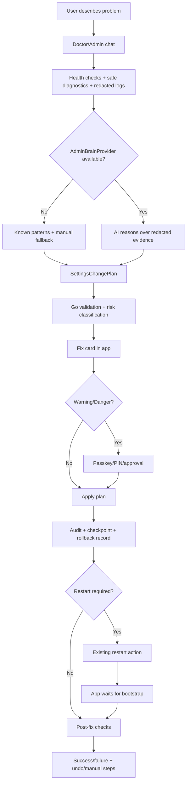

# Design

## Overview

Build a single safe repair pipeline around the existing Doctor, runner-chat, logs, and settings system:

1. The user describes the problem in a Doctor/Admin chat.
2. Basic Doctor runs deterministic checks, health/readiness probes, client-side service-down checks, and redacted log searches.
3. Optional Admin Brain uses a local runner or configured API provider inside the same chat, with only Doctor/Admin tools.
4. Any mutation becomes a `SettingsChangePlan` and an accepted tool card checkpoint.
5. OR3 validates and classifies the plan in Go code.
6. The app renders a plain-language fix card.
7. OR3 applies the plan only after required explicit consent and passkey/PIN verification.
8. OR3 writes audit/checkpoint/rollback records, restarts when approved, verifies with post-checks, and turns accepted cards into undo cards when safe.

This fits the current architecture because the important primitives already exist:

- `internal/doctor` already produces structured findings and safe automatic fixes.
- `cmd/or3-intern/service_configure.go` already exposes settings fields and config apply.
- `cmd/or3-intern/service_app.go` already exposes bootstrap/action descriptors and a step-up protected restart action.
- `cmd/or3-intern/service_auth.go` already marks config writes, skill writes, restart, terminal, files, and passkeys as sensitive/step-up routes.
- `internal/db/security.go` already has tamper-evident audit events, and SQLite is the right place for durable Doctor/Admin checkpoints and bounded diagnostic event logs.
- `cmd/or3-intern/service_skills.go` already exposes skill inventory, required env/config fields, and skill settings updates.
- `or3-app` already has settings health, simple/advanced settings, risk review, passkey retry, service restart, runner discovery, approvals, and skill settings composables.

The design should not create a separate “Codex/Gemini/Claude/opencode setup” product. The only product concept is whether an `AdminBrainProvider` is available.

## Affected areas

### `or3-intern`

- `internal/doctor`
  - Extend findings from CLI-oriented report data to app-ready diagnostic cards, known issue IDs, safe diagnostic checks, redaction metadata, and fix proposal hooks.
  - Keep `Evaluate` as the deterministic core.

- `internal/configmeta` (new)
  - Backend-owned config metadata registry for field labels, descriptions, paths, defaults, risk, restart requirements, dependencies, validation, rollback behavior, and user-intent examples.
  - Initially wraps/adapts existing `configureField` definitions rather than duplicating every field by hand.

- `internal/adminflow` (new)
  - Owns `AdminBrainProvider`, `SettingsChangePlan`, risk classification, validation, apply, checkpoints, rollback, post-check orchestration, and redaction contracts.
  - Calls config setters through adapters so existing `applyFieldValue`/`applyServiceConfigureSetValue` behavior is not forked.

- `internal/adminchat` (new or thin adapter over existing runner-chat stores)
  - Owns Doctor/Admin conversation metadata, user problem statements, assistant messages, diagnostic tool-call records, accepted tool cards, and checkpoint links.
  - Reuses existing runner-chat persistence where practical; add only the minimal metadata needed to mark a session as Doctor/Admin and associate accepted cards with rollback records.

- `internal/skilldiag` (new)
  - Loads and validates `SkillDiagnosticManifest` definitions.
  - Runs declarative checks through safe/bounded runners.
  - Produces Doctor findings and plan proposals for skill-specific failures.

- `internal/db`
  - Additive tables for settings change plans, checkpoints/rollback records, and bounded structured diagnostic logs when existing stores cannot represent them cleanly.
  - Reuse `audit_events` for applied fix audit entries; add helper methods for plan/rollback storage.

- `internal/diagnosticlog` (new)
  - Provides structured, redaction-aware, bounded diagnostic event capture for Doctor/Admin.
  - Supports correlation IDs across user message, diagnostic tool call, plan, approval, restart, post-check, and rollback.
  - Writes durable summaries to SQLite and streams live updates to the app where useful.

- `cmd/or3-intern/service_doctor.go` (new)
  - Service endpoints for Doctor reports, safe diagnostics, plan creation/validation/apply/rollback, and post-checks.
  - Registered in `service_routes.go` under `/internal/v1/doctor` or `/internal/v1/admin`.

- `cmd/or3-intern/service_configure.go`
  - Extend configure field responses with metadata where practical.
  - Add plan-preview path or delegate covered writes to `adminflow` while preserving `/configure/apply` compatibility.

- `cmd/or3-intern/service_skills.go`
  - Include diagnostic manifest status and skill diagnostic summaries in skill inventory responses.
  - Add read-only diagnostic subroute if needed, e.g. `/internal/v1/skills/:name/diagnostics`.

- `cmd/or3-intern/service_app.go`
  - Add Doctor/Admin action descriptors to bootstrap so the app can show whether Basic Doctor, AI repair, restart, approval, and undo are available.

- `cmd/or3-intern/service_auth.go` and `service_auth_rollout_test.go`
  - Classify new Doctor/Admin routes: read-only Doctor as low-risk; plan apply, rollback that mutates config, restart, and approved diagnostic commands as sensitive/step-up.

- `cmd/or3-intern/service_logs.go`
  - Beef up existing logs so Doctor/Admin can query redacted, bounded, structured logs by source, level, time range, correlation ID, and known failure pattern without exposing raw secrets.

- `cmd/or3-intern/service_runner_chat.go`, `service_runner_chat_selection_test.go`
  - Reuse runner discovery/runner-chat for Admin Brain where available, but never give runner-chat direct mutation authority.

- `cmd/or3-intern/configure_tui.go` and `configure.go`
  - Eventually consume config metadata registry for CLI/TUI labels and risk hints.
  - Keep existing command compatibility.

- `docs/`
  - Update settings/Doctor/admin repair docs after implementation slices land.

### `or3-app`

- `app/composables/settings/useSettingsHealth.ts`
  - Replace or augment current client-side health findings with backend Doctor findings, while keeping client-side service-down diagnostics when the intern service is unreachable.

- New `app/composables/useDoctorAdminChat.ts`
  - Manages Doctor/Admin conversations, problem description input, streamed tool cards, accepted card state, approval prompts, post-check status, and undo actions.

- `app/composables/settings/useSimpleSettings.ts`, `useSettingsDiff.ts`, `app/settings/riskRules.ts`, `app/settings/labels.ts`
  - Move covered risk/label logic to backend metadata and plan preview.
  - Keep local fallback while backend metadata is incomplete.

- `app/composables/useConfigure.ts`
  - Add `previewPlan`, `applyPlan`, and `rollbackPlan` calls while keeping `applyChanges` for compatibility.

- `app/composables/useAuthSession.ts`
  - Reuse `retryWithAuth`/step-up challenge handling for warning/danger plan apply.

- `app/composables/useServiceRestart.ts`
  - Reuse existing restart action and UI recovery handling for restart-required plans.

- `app/composables/useChatRunners.ts`
  - Feed `AdminBrainProvider` status without exposing runner brand positioning.

- `app/components/settings/*`
  - Refactor `SettingSaveReview.vue` into a plan-aware preview card or share UI primitives with new fix cards.

- New app components:
  - `DoctorResultCard.vue`
  - `RecommendedFixCard.vue`
  - `SettingsChangePreviewCard.vue`
  - `RiskApprovalCard.vue`
  - `RestartRequiredCard.vue`
  - `PostFixCheckCard.vue`
  - `UndoFixCard.vue`
  - `ManualFallbackCard.vue`

- App pages:
  - Keep `/settings/health` as the initial Doctor screen.
  - Link `/computer/attention` to Doctor findings and recommended fixes.
  - Add advanced sections’ “Ask Admin Assistant to change this” affordance after backend plan APIs exist.

## Control flow / architecture

### State machine

```text
idle
  -> user_describes_problem
  -> collecting_diagnostics
  -> explaining_findings
  -> no_fix_available | fix_available
fix_available
  -> creating_plan
  -> validating_plan
  -> approval_not_required | approval_required | blocked
approval_required
  -> passkey_step_up | pin_step_up | admin_approval | security_setup_required
  -> approved | rejected
approved / approval_not_required
  -> applying
  -> restart_pending? -> restarting -> reconnecting
  -> post_checking
  -> succeeded | failed
succeeded
  -> accepted_card_becomes_undo_available | done
failed
  -> retry | rollback_available | manual_fallback
any_state
  -> user_follow_up -> collecting_diagnostics
```

### End-to-end flow



### API shape

Prefer new routes under one subtree so auth policy is easy to reason about:

```text
GET  /internal/v1/doctor/status
POST /internal/v1/doctor/sessions
GET  /internal/v1/doctor/sessions/:id
GET  /internal/v1/doctor/sessions/:id/events
POST /internal/v1/doctor/sessions/:id/messages
POST /internal/v1/doctor/run
GET  /internal/v1/doctor/admin-brain
GET  /internal/v1/doctor/config-metadata
POST /internal/v1/doctor/plans
GET  /internal/v1/doctor/plans/:id
POST /internal/v1/doctor/plans/:id/validate
POST /internal/v1/doctor/plans/:id/apply
POST /internal/v1/doctor/plans/:id/rollback
POST /internal/v1/doctor/plans/:id/post-checks
POST /internal/v1/doctor/skills/:skill/diagnostics
GET  /internal/v1/doctor/logs
```

Route sensitivity:

- `GET /doctor/status`, `POST /doctor/run` with safe checks only, `GET /doctor/admin-brain`, and `GET /doctor/config-metadata`: low-risk, role operator or current read-equivalent service policy.
- Doctor/Admin session creation, reads, event streaming, and messages are low-risk while they only run safe Doctor tools; escalation happens per tool card/plan.
- `POST /doctor/plans`: low-risk if it only creates/validates in-memory or persisted pending plans; no mutation.
- `POST /doctor/plans/:id/validate`: low-risk if read-only.
- `POST /doctor/plans/:id/apply`: sensitive, session-only, step-up-only, with additional risk policy inside handler.
- `POST /doctor/plans/:id/rollback`: sensitive when rollback mutates config or restarts service.
- `POST /doctor/skills/:skill/diagnostics`: low-risk for manifest-declared safe diagnostics; sensitive for approved diagnostic commands.

### Admin Brain usage

`AdminBrainProvider` should be selected by code, not by user-facing runner marketing:

```go
type AdminBrainKind string

const (
    AdminBrainRunner         AdminBrainKind = "runner"
    AdminBrainAPIKeyProvider AdminBrainKind = "apiKeyProvider"
    AdminBrainUnavailable    AdminBrainKind = "unavailable"
)

type AdminBrainProvider struct {
    Kind        AdminBrainKind `json:"kind"`
    Available   bool           `json:"available"`
    DisplayName string         `json:"display_name,omitempty"` // "Admin Brain", not "Claude is best"
    RunnerID    string         `json:"runner_id,omitempty"`     // advanced only
    ProviderKey string         `json:"provider_key,omitempty"` // advanced only
    Reason      string         `json:"reason,omitempty"`
}
```

Selection order for local personal mode:

1. Prefer a working local runner with chat/replay support and ready auth.
2. Else use configured API provider/key that can run admin-assistant prompts.
3. Else unavailable.

Regardless of provider, Admin Brain runs as a normal multi-turn chat backed by existing runner-chat/session infrastructure, but with a Doctor/Admin system prompt and a restricted tool set. It receives only redacted structured evidence and can return tool calls/proposals. It cannot directly write config, restart, read secrets, or run broad shell.

The best implementation choice is to reuse runner-chat for conversation persistence, streaming, abort, and provider/runner execution, then layer a Doctor/Admin tool policy on top. Do not build a second chat runtime.

## Data and persistence

### Config metadata registry

New package: `internal/configmeta`.

```go
type RiskLevel string

const (
    RiskSafe    RiskLevel = "safe"
    RiskNotice  RiskLevel = "notice"
    RiskWarning RiskLevel = "warning"
    RiskDanger  RiskLevel = "danger"
)

type ConfigFieldMetadata struct {
    Section          string            `json:"section"`
    Key              string            `json:"key"`
    Path             string            `json:"path"`
    Label            string            `json:"label"`
    Description      string            `json:"description"`
    DefaultValue     any               `json:"default_value,omitempty"`
    AllowedValues    []string          `json:"allowed_values,omitempty"`
    CurrentValue     any               `json:"current_value,omitempty"`
    Secret           bool              `json:"secret,omitempty"`
    Risk             RiskLevel         `json:"risk_level"`
    RestartRequired  bool              `json:"restart_required"`
    RequiresApproval bool              `json:"requires_approval"`
    RequiresStepUp   bool              `json:"requires_step_up_auth"`
    Dependencies     []ConfigRelation  `json:"dependencies,omitempty"`
    Conflicts        []ConfigRelation  `json:"conflicts,omitempty"`
    Validation       []ValidationRule  `json:"validation_rules,omitempty"`
    Rollback         RollbackBehavior  `json:"rollback_behavior"`
    UserIntents      []string          `json:"user_intents,omitempty"`
    Docs             string            `json:"docs,omitempty"`
    AdvancedOnly     bool              `json:"advanced_only,omitempty"`
}
```

Implementation notes:

- Use a typed Go registry as the authoritative metadata source for slice one. This is the safest and most testable option: no runtime parsing ambiguity, no drift from comments/docs, and easy table-driven coverage.
- Reuse current `configureField` output only for labels/descriptions/choices where it already exists; risk, restart, dependency, rollback, and validation metadata must be explicitly authored in Go.
- Start by adding metadata for generic installable skill settings, tool/skill/provider/restart fields, service-down recovery, and the settings touched by first-slice repairs.
- Do not migrate every setting in one pass.
- For secret fields, return presence/empty status, never raw value.
- Replace app-only risk rules field-by-field as metadata coverage grows.

### SettingsChangePlan

New package: `internal/adminflow`.

```go
type SettingsChangePlan struct {
    ID                    string                 `json:"id"`
    Title                 string                 `json:"title"`
    Summary               string                 `json:"summary"`
    CreatedBy             string                 `json:"created_by"`
    CreatedAtUnixMs       int64                  `json:"created_at"`
    RiskLevel             configmeta.RiskLevel   `json:"risk_level"`
    RestartRequired       bool                   `json:"restart_required"`
    RequiresApproval      bool                   `json:"requires_approval"`
    RequiresStepUpAuth    bool                   `json:"requires_step_up_auth"`
    AffectedAreas         []string               `json:"affected_areas"`
    Changes               []SettingsPlanChange   `json:"changes"`
    ValidationResults     []PlanValidationResult `json:"validation_results"`
    EstimatedImpact       string                 `json:"estimated_impact"`
    RollbackPlan          RollbackPlan           `json:"rollback_plan"`
    PostApplyChecks       []PostApplyCheck       `json:"post_apply_checks"`
    UserFacingExplanation string                 `json:"user_facing_explanation"`
    ExactConfigDiff       []ConfigDiffLine       `json:"exact_config_diff,omitempty"`
    Advanced              map[string]any         `json:"advanced,omitempty"`
}

type SettingsPlanChange struct {
    ConfigPath       string               `json:"config_path"`
    Section          string               `json:"section"`
    Field            string               `json:"field"`
    Operation        string               `json:"operation"`
    OldValue         RedactedValue        `json:"old_value"`
    NewValue         RedactedValue        `json:"new_value"`
    Impact           string               `json:"impact"`
    RiskReason       string               `json:"risk_reason"`
    ValidationStatus string               `json:"validation_status"`
    MetadataRisk     configmeta.RiskLevel `json:"metadata_risk"`
}
```

Rules:

- Plans can be AI-proposed, deterministic Doctor-proposed, or settings-UI-created.
- Plans are inert until applied through the Go apply pipeline.
- Plan IDs use random opaque IDs, e.g. `scp_...`.
- Plans should expire after a short window if not applied to avoid stale config diffs.

### Audit record

Reuse `audit_events` and append event types:

```text
doctor.plan.created
doctor.plan.validated
doctor.plan.approval_required
doctor.plan.applied
doctor.plan.apply_failed
doctor.plan.rollback_applied
doctor.plan.rollback_failed
doctor.post_check.completed
doctor.admin_brain.used
```

Payload must include:

- plan ID
- requester identity
- creator kind (`basic_doctor`, `admin_brain`, `settings_ui`)
- admin brain kind (`runner`, `apiKeyProvider`, `unavailable`) if used
- approver identity and auth method
- redacted old/new values
- risk level
- restart status
- post-check result
- rollback availability

### Checkpoints and rollback records

Doctor/Admin chat turns should save accepted tool cards as checkpoints. A checkpoint connects a conversation, a tool card, the plan/check output, audit events, and rollback data.

```sql
CREATE TABLE IF NOT EXISTS doctor_checkpoints (
  id TEXT PRIMARY KEY,
  session_id TEXT NOT NULL,
  card_id TEXT NOT NULL,
  plan_id TEXT NOT NULL DEFAULT '',
  rollback_id TEXT NOT NULL DEFAULT '',
  status TEXT NOT NULL,
  summary TEXT NOT NULL DEFAULT '',
  payload_json TEXT NOT NULL DEFAULT '{}',
  created_at INTEGER NOT NULL,
  updated_at INTEGER NOT NULL
);

CREATE INDEX IF NOT EXISTS doctor_checkpoints_session
  ON doctor_checkpoints(session_id, created_at);
```

Rollback records remain explicit and are linked from checkpoints:

Additive SQLite table:

```sql
CREATE TABLE IF NOT EXISTS settings_change_rollbacks (
  id TEXT PRIMARY KEY,
  plan_id TEXT NOT NULL,
  status TEXT NOT NULL,
  risk_level TEXT NOT NULL,
  config_path TEXT NOT NULL,
  rollback_json TEXT NOT NULL,
  manual_steps TEXT NOT NULL DEFAULT '',
  restart_required INTEGER NOT NULL DEFAULT 0,
  safe_to_apply INTEGER NOT NULL DEFAULT 0,
  created_at INTEGER NOT NULL,
  applied_at INTEGER NOT NULL DEFAULT 0
);

CREATE INDEX IF NOT EXISTS settings_change_rollbacks_plan
  ON settings_change_rollbacks(plan_id);
```

Optional pending plan persistence:

```sql
CREATE TABLE IF NOT EXISTS settings_change_plans (
  id TEXT PRIMARY KEY,
  status TEXT NOT NULL,
  risk_level TEXT NOT NULL,
  created_by TEXT NOT NULL,
  payload_json TEXT NOT NULL,
  created_at INTEGER NOT NULL,
  updated_at INTEGER NOT NULL,
  expires_at INTEGER NOT NULL DEFAULT 0
);
```

Pending plans and accepted card checkpoints should be persisted because Doctor/Admin is a chat and restarts are part of the workflow. This lets the app recover after refresh/restart and turn accepted cards into undo cards reliably.

### Diagnostic logs

The existing live log stream should be strengthened with a bounded durable diagnostic event store. Use SQLite for structured summaries, not raw unbounded logs.

```sql
CREATE TABLE IF NOT EXISTS diagnostic_log_events (
  id INTEGER PRIMARY KEY AUTOINCREMENT,
  correlation_id TEXT NOT NULL DEFAULT '',
  source TEXT NOT NULL,
  level TEXT NOT NULL,
  message TEXT NOT NULL,
  redacted INTEGER NOT NULL DEFAULT 1,
  payload_json TEXT NOT NULL DEFAULT '{}',
  created_at INTEGER NOT NULL
);

CREATE INDEX IF NOT EXISTS diagnostic_log_events_lookup
  ON diagnostic_log_events(source, level, created_at);

CREATE INDEX IF NOT EXISTS diagnostic_log_events_correlation
  ON diagnostic_log_events(correlation_id, created_at);
```

Retention should be bounded by configurable count/age/size defaults. Raw logs can still stream live for advanced observability, but Doctor/Admin should query redacted summaries.

### SkillDiagnosticManifest

New schema, loaded from `SKILL.md` frontmatter if existing parser supports it or from `diagnostics.json` adjacent to the skill.

```go
type SkillDiagnosticManifest struct {
    Version              int                    `json:"version"`
    Skill                string                 `json:"skill"`
    RequiredBinaries     []BinaryRequirement    `json:"required_binaries,omitempty"`
    RequiredEnv          []EnvRequirement       `json:"required_env,omitempty"`
    RequiredFiles        []FileRequirement      `json:"required_files,omitempty"`
    AuthChecks           []DiagnosticCheck      `json:"auth_checks,omitempty"`
    TestCommands         []DiagnosticCommand    `json:"test_commands,omitempty"`
    KnownFailurePatterns []KnownFailurePattern  `json:"known_failure_patterns,omitempty"`
    RedactionRules       []RedactionRule        `json:"redaction_rules,omitempty"`
    Fixes                []SkillDiagnosticFix   `json:"fixes,omitempty"`
    PostFixChecks        []DiagnosticCheck      `json:"post_fix_checks,omitempty"`
}

type DiagnosticCommand struct {
    ID             string   `json:"id"`
    Program        string   `json:"program"`
    Args           []string `json:"args"`
    TimeoutSeconds int      `json:"timeout_seconds"`
    MaxOutputBytes int      `json:"max_output_bytes"`
    RiskLevel      string   `json:"risk_level"`
}
```

Generic first-pass skill checks:

- Required binary exists and is executable.
- Auth/status command or equivalent bounded check reports selected auth source.
- Credential/config source is OR3-managed, externally managed, missing, or conflicting.
- Credential file path exists, is readable, and JSON parses.
- Required identity/account/user field is set and syntactically valid when the skill needs one.
- Capability smoke checks can run independently when the skill has multiple connected services.
- Redacted logs show selected account/source/status without secrets.
- Env/config override chain shows if shell profile, app config, service manager, or stale state wins.

## Interfaces and types

### Risk policy

```go
type RiskDecision struct {
    Level              configmeta.RiskLevel `json:"level"`
    Reasons            []string             `json:"reasons"`
    RequiresApproval   bool                 `json:"requires_approval"`
    RequiresStepUpAuth bool                 `json:"requires_step_up_auth"`
    RequiredRole        string               `json:"required_role,omitempty"`
    Blocked             bool                 `json:"blocked"`
    BlockReason         string               `json:"block_reason,omitempty"`
}

func ClassifyPlan(ctx context.Context, cfg config.Config, metadata configmeta.Registry, plan SettingsChangePlan) RiskDecision
```

Risk examples:

- Safe: read-only diagnostics, refresh bootstrap, validate config, show pairing/approval status, redacted logs, re-run skill discovery.
- Notice: reversible low-risk preferences such as model preference, memory/context budgets within safe bounds, non-dangerous skill settings, minor config corrections that do not grant data/tool access.
- Warning: tool permission changes, skill auth changes, integration env/config changes, service restart, file access scope changes, runner selection changes, changes affecting automation/tool behavior.
- Danger: disable approvals, grant shell/terminal access, broaden filesystem/network/service access, expose local service, change security posture, remove restrictions, enable unattended powerful automation.

Approval UX rules:

- Step-up proves identity; the fix card proves consent. A recent step-up may satisfy identity, but the user must still press the action-specific approval button.
- Warning cards may offer “Yes, and don’t ask again for 5 minutes.” The remembered approval is scoped to actor, device/session, risk level, action family, and affected config/tool scope.
- Danger cards never use remembered approval. They require passkey or PIN and explicit confirmation every time.
- If no passkey/PIN is set up, warning/danger cards show a security setup requirement instead of a typed phrase fallback.

### Apply pipeline

```go
type PlanApplier struct {
    DB          *db.DB
    ConfigPath  string
    Config      config.Config
    Metadata    configmeta.Registry
    AuditKey    []byte
    Restart     RestartRequester
    PostChecks  PostCheckRunner
}

func (a *PlanApplier) Validate(ctx context.Context, plan SettingsChangePlan) (SettingsChangePlan, RiskDecision, error)
func (a *PlanApplier) Apply(ctx context.Context, planID string, approval ApprovalContext) (ApplyResult, error)
func (a *PlanApplier) Rollback(ctx context.Context, rollbackID string, approval ApprovalContext) (RollbackResult, error)
```

Apply steps:

1. Load current config and current metadata.
2. Rebase plan old values against current config; reject stale/conflicting plan unless deterministic rebase is safe.
3. Apply changes to an in-memory copy using existing configure setters.
4. Run `config.Validate` and Doctor validation mode on the staged config.
5. Compute final risk and approval requirements.
6. Enforce step-up/approval/role requirements.
7. Save config via existing config save path.
8. Create rollback record.
9. Create or update the accepted tool-card checkpoint.
10. Append audit event.
11. Live-reload compatible settings via `applyLiveConfig`.
12. If restart required and approved, call the existing restart action path.
13. Persist post-check-pending state so the app can recover after service restart.
14. Run post-checks after reconnect/readiness when possible.

### Redaction and AI evidence

```go
type EvidenceEnvelope struct {
    Kind        string         `json:"kind"`
    Source      string         `json:"source"`
    Trusted     bool           `json:"trusted"` // false for logs, config comments, tool output
    Redacted    bool           `json:"redacted"`
    Summary     string         `json:"summary"`
    Data        map[string]any `json:"data,omitempty"`
    OmittedKeys []string       `json:"omitted_keys,omitempty"`
}
```

Rules:

- Remote API providers receive summaries and structured safe fields, not raw logs/config/env by default.
- Local runners still use OR3 tools and scoped files rather than direct privileged filesystem access from Admin Assistant.
- Logs and command output are always marked untrusted. Prompts must instruct the runner to treat them as evidence, not instructions.

## Failure modes and safeguards

### Service restart fails

- Use existing `/internal/v1/actions/restart-service` capability and approval logic.
- If restart action cannot start, keep config change audit and show “restart failed to start” with retry/manual command.
- If service disappears and does not return, app shows reconnecting state, then manual recovery instructions using restart log path.
- Do not run terminal fallback silently for plan apply unless user approved restart and shell access is already allowed.

### Service is unreachable before Doctor starts

- The app runs client-side Doctor checks from cached host/pairing/session state and the target service URL.
- If HTTP bootstrap/readiness cannot respond, classify the failure: DNS/base URL problem, TCP refused, timeout, auth/session challenge, or unexpected response.
- Offer safe actions: refresh, retry bootstrap, show last known status, show restart instructions/action if available from cached Electron/host state, or open manual recovery.
- Once service returns, merge client-side findings with service-side Doctor findings in the same conversation.

### Config apply fails

- Validate before write; return field-level validation errors.
- If write fails, no rollback record should be marked applicable because config did not change.
- If write succeeds but live reload fails, audit partial status and recommend restart.

### AI backend unavailable

- Basic Doctor remains available.
- Hide Admin Brain wording except a setup call-to-action.
- Deterministic known-pattern fixes can still produce plans.

### Runner installed but auth broken

- `AdminBrainProvider` reports unavailable with reason `runner_auth_required`.
- Offer runner auth/setup in advanced details.
- Continue Basic Doctor.

### Conversation refresh or service restart

- Persist Doctor/Admin session messages, tool-call summaries, accepted card checkpoints, and rollback IDs.
- After refresh/restart, reload the session and render accepted cards as completed or undoable based on checkpoint state.
- Do not rely on in-memory plan state for any applied change.

### Skill diagnostics fail

- Treat diagnostic failure as a finding, not as whole Doctor failure.
- Capture exit code and redacted output within max bytes.
- If command risk is warning/danger, do not run without approval.

### Logs contain secrets or prompt injection

- Redact before storage/display/AI.
- Cap log bytes and skip binary/oversized records.
- Mark logs as untrusted evidence.
- Include tests with fake tokens, OAuth secrets, service account JSON, and malicious “ignore instructions” log lines.

### User rejects approval

- Mark plan rejected/cancelled.
- No mutation.
- Offer manual instructions or lower-risk checks.

### User loses connection during restart

- App suppresses expected network errors during restart using existing restart composable pattern.
- Poll bootstrap/readiness until success or timeout.
- Show restart log path and manual recovery if timeout expires.

### Rollback fails

- Append rollback failure audit event.
- Show exact manual rollback steps when safe to disclose.
- Do not attempt repeated automatic rollback loops.

### Prompt injection conflicts with current runtime profile

- Plans must validate against current runtime profile and metadata dependencies/conflicts.
- If current profile changed since plan creation, require revalidation.
- AI cannot override conflicts.

## Testing strategy

### Go tests

- `internal/configmeta`: metadata coverage for first-slice fields, secret redaction, restart/risk flags, dependency/conflict validation.
- `internal/adminflow`: plan validation, stale-plan rejection, risk classification, approval requirement matrix, rollback record generation, redaction, post-check orchestration.
- `internal/skilldiag`: manifest parsing, bounded command runner, known pattern matching, redaction, generic skill fixture cases.
- `internal/diagnosticlog`: event insertion, retention pruning, redaction, correlation lookup, and log-query bounds.
- `internal/adminchat`: session persistence, tool-card checkpoint persistence, reload after restart, and undo state derivation.
- `internal/doctor`: deterministic Doctor findings for Admin Brain availability, installable skill diagnostics, config validation, and plan proposals.
- `internal/db`: migration and CRUD tests for rollback/plan tables.
- `cmd/or3-intern`: route auth policy tests, service endpoint contract tests, restart-required plan behavior, audit event append behavior.

### App tests

- Vitest for Doctor/Admin composables, fix-card rendering, metadata-backed settings labels/risk, approval-required state, restart reconnect state, and undo card.
- Existing app caveat: use `bunx vitest run ...`, not direct `bun test`.

### Fixture tests

- Stale credential/config-source fixture for an installable skill.
- Missing credential/config file fixture.
- Invalid JSON/config fixture.
- Partial capability failure fixture for a multi-capability skill.
- Env override conflict fixture.
- Redacted log fixture with fake secrets and prompt injection.

### Manual QA

- No AI backend: Basic Doctor message and checks.
- Local runner available: Admin Brain available but generic copy.
- Warning installable-skill fix: passkey/PIN approval, plan apply, restart, post-check, undo.
- Danger setting: blocked without passkey/PIN/admin setup.

## First vertical slice

### Implement first

1. Backend config metadata for generic installable skill settings, provider availability, runner status, tools exec policy, restart capability, and skill env/config fields.
2. Basic Doctor service endpoint that aggregates health, readiness, app bootstrap, approvals, config validation, runner/provider availability, skill inventory, redacted logs, client-side service-down findings, and generic installable skill diagnostics.
3. `AdminBrainProvider` status endpoint using existing runner/provider discovery.
4. Multi-turn Doctor/Admin chat backed by existing runner-chat/session storage and restricted Doctor/Admin tools.
5. `SettingsChangePlan` model and validation for config-only changes using existing configure setters.
6. Risk policy for safe/notice/warning/danger with remembered warning approvals and passkey/PIN-only escalation.
7. Apply pipeline for safe/notice changes and warning changes with existing passkey/PIN step-up.
8. Audit, diagnostic logs, checkpoints, and rollback records for applied plans.
9. Existing restart action integration for restart-required plans.
10. Generic `SkillDiagnosticManifest` and deterministic known-pattern checks for one installable skill fixture.
11. App chat/cards on `/settings/health` for user problem input, Doctor result, recommended fix, preview, approval, restart, post-check, undo, and manual fallback.

### Defer

- Enterprise RBAC and hosted/team admin policies.
- Full metadata coverage for every config field.
- Generic code/config patching outside scoped config/skill setup files.
- Unattended automation changes.
- Broad shell/file/network repairs.
- Broad general-purpose admin chat outside Doctor/Admin troubleshooting and repair.
- Remote provider raw-log analysis.

## UX copy examples

### Basic Doctor, no AI backend

“Basic Doctor is available. AI repair is not configured yet. I can still check connection, pairing, approvals, service health, config validation, runner setup, provider keys, and known skill issues.”

Buttons:

- Set up AI backend
- Run basic Doctor
- Show manual fix instructions

### Installable skill broken

“I found the likely issue. This skill is using an old credential source, but OR3 is configured to use the managed credential file for this skill.”

Recommended fix:

- Update the skill credential source
- Keep the current account/identity setting
- Clear the stale external credential reference from OR3-managed config
- Restart OR3 Intern
- Run the skill’s post-fix check after restart

Risk level: Warning

Buttons:

- Fix with passkey/PIN
- Show exact changes
- Request admin approval
- Cancel

### Approval required

“This fix changes how OR3 accesses an installed skill, so I need approval before applying it. You can review the exact changes first.”

Buttons:

- Approve with passkey/PIN
- Approve and remember for 5 minutes
- Show exact changes
- Cancel

### Danger-level setting

“This would give OR3 broad terminal access. That can change files, run commands, or expose data. OR3 will not apply this until admin security is set up.”

Buttons:

- Set up passkey/PIN
- Show why this is blocked
- Cancel

### Restart required

“This fix needs OR3 Intern to restart. The app may look disconnected for about a minute, then I’ll run the post-fix check.”

Buttons:

- Apply and restart
- Apply without restart
- Cancel

### Fix succeeded

“The skill is using the managed credential now, OR3 Intern restarted, and the post-fix check passed.”

Buttons:

- Done
- Run checks again
- Undo

### Fix failed

“The config change was saved, but OR3 Intern did not come back after restart. I kept a rollback record and found the restart log here: `.run/service-restart-...log`.”

Buttons:

- Try restart again
- Undo change
- Show manual recovery

### Undo available

“Undo is available. This will restore the previous skill credential source and restart OR3 Intern.”

Buttons:

- Undo with passkey/PIN
- Show exact rollback
- Cancel

## Strong opinions

- Do not build a new Doctor product. Extend `internal/doctor` and the existing settings health page.
- Do not make runner choice a user-facing decision. “Admin Brain available” is enough.
- Do not let runner-chat or external AI become the security boundary. The runner proposes; OR3 validates and applies.
- Do not migrate all settings metadata in one giant phase. Start with the fields needed for generic installable skill repairs, logs, approvals, and repair cards.
- Do not build enterprise RBAC now. Use existing paired/auth session roles and step-up; keep the policy shape compatible with future roles.
- Do not expose exact config keys, paths, logs, or diffs by default. Make Advanced explicit.
- Do not run arbitrary diagnostic shell scripts from skills. Skill diagnostics must be declarative and allowlisted.
- Do not auto-fix by broadening access. Safe/notice auto-fixes should tighten or repair, not grant new power.
- Persist Doctor/Admin chat, pending plans, accepted tool-card checkpoints, and rollback IDs from the start. The feature is a conversation, not a one-shot modal.
- Use a typed Go metadata registry first. It is the best DX/safety choice for this codebase; generated docs or JSON can come later.
- Canonical skill fixes should target OR3-managed skill config/env first. If the broken state lives in shell profiles, external CLIs, or service-manager files, Doctor should explain it and produce a manual or separately approved scoped-file repair.