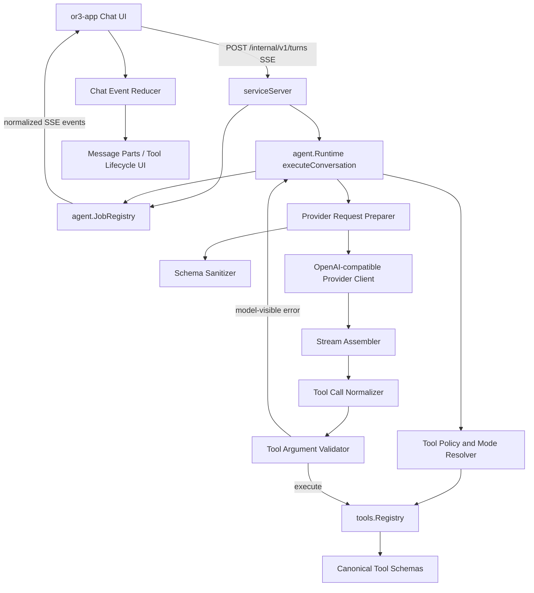

# Agent Chat Tool Hardening - Design

## Overview

OR3 already has the right rough shape: `or3-app` submits turns to `/internal/v1/turns`, `or3-intern` runs the provider/tool loop in `internal/agent/runtime.go`, provider calls are centralized in `internal/providers/openai.go`, and live updates fan out through `agent.JobRegistry` as SSE events. The hardening plan keeps that architecture and inserts a small normalization layer between provider chunks and runtime execution, then enriches the existing job events so the app can render a more deliberate chat timeline.

The most important design principle is: raw provider output should never directly decide UI state or tool execution. Provider output becomes normalized assistant text, normalized tool calls, validated tool arguments, and typed lifecycle events first.

## Current integration points

- `internal/providers/openai.go`
    - Sends OpenAI-compatible chat requests.
    - Parses SSE text deltas.
    - Merges streamed `tool_calls` by index.
    - Currently skips malformed stream JSON chunks and returns a final response even when some chunks were bad.
- `internal/agent/runtime.go`
    - Builds provider requests with `toToolDefs`.
    - Calls `ChatStream` when a streamer exists.
    - Parses fallback tool-call markup.
    - Executes tools by passing raw argument JSON to `tools.Registry.Execute`.
    - Emits observer events for text, tool calls, tool results, completion, and errors.
- `internal/tools/registry.go`
    - Decodes argument JSON into `map[string]any`.
    - Runs the capability guard.
    - Does not validate params against the tool schema before execution.
- `internal/agent/job_registry.go`
    - Publishes `text_delta`, `tool_call`, `tool_result`, `assistant`, and `completion` events.
    - Keeps sequence numbers and short in-memory history.
- `or3-app/app/composables/useAssistantStream.ts`
    - Converts SSE job events into `ChatMessage` state.
    - Dedupes events by sequence/payload.
    - Tracks tool calls, approval state, activity log, retry payloads, and recovery.
- `or3-app/app/components/assistant/ChatMessage.vue`
    - Renders reasoning, tool calls, activity log, markdown, errors, copy, pin, retry, and approval actions.

## Event compatibility promise

The v1 hardening rollout keeps `/internal/v1/turns`, `/internal/v1/jobs/:job_id`, and existing SSE event names backward-compatible. Existing consumers can continue to rely on `queued`, `text_delta`, `tool_call`, `tool_result`, `assistant`, `completion`, `failed`, `aborted`, and `approval_required` event types while the backend adds normalized internals and enriched payload fields.

For v1, event enrichment is additive: old fields keep their names and meanings, new lifecycle/status/code/preview fields may be present, and values crossing the service boundary must be bounded. Provider quirks, malformed stream chunks, unavailable tools, and argument validation failures should be normalized before reaching the browser so the app reducer can stay provider-agnostic.

## T3 Code inspiration to adopt

T3 Code's useful ideas are architectural rather than visual copying:

- Provider adapters hide raw provider/runtime event shapes from the rest of the app.
- Provider runtime events are projected into typed orchestration events before reaching the browser.
- Tool lifecycle items are first-class UI items, not markdown text that happens to mention tools.
- Assistant deltas are deduped with common-prefix/overlap logic because some providers emit latest snapshots and others emit deltas.
- The chat timeline is derived from normalized thread state and covered by browser rendering tests.
- Transport decode failures produce structured diagnostics instead of silent UI weirdness.

OR3 should keep SSE for now, but apply the same boundary discipline: provider adapters and stream assemblers normalize; runtime validates and emits typed lifecycle events; the app reduces those events into message parts.

## Architecture



## Backend components

### Provider profiles

Add provider profile metadata in `internal/providers`. Profiles are selected from configured provider name/base URL/model family when known, with a conservative default.

```go
type ProviderProfile struct {
    Name string
    ToolSchema ToolSchemaPolicy
    Streaming StreamPolicy
    Retry ProviderRetryPolicy
}

type ToolSchemaPolicy struct {
    AllowAdditionalProperties bool
    DropUnsupportedKeywords   []string
    RequireObjectRoot         bool
    MaxDescriptionRunes       int
}

type StreamPolicy struct {
    TextMode       string // "delta" or "snapshot_or_delta"
    ToolCallMode   string // "openai_indexed"
    RetryMalformed bool
}

type ProviderRetryPolicy struct {
    RetryEmptyStream      bool
    RetryMalformedBeforeOutput bool
    FallbackToNonStream   bool
}
```

Initial profiles:

- `openai_compatible`: current behavior plus schema cleanup and malformed-before-output retry.
- `openrouter_compatible`: same base behavior, stricter schema keyword cleanup.
- `local_compatible`: minimal schema cleanup, no aggressive retry unless response is empty.

The profile should be available to both non-streaming and streaming calls so tests can pin exact request payloads.

### Schema sanitizer

Canonical schemas stay in each tool's `Parameters()`/`Schema()` methods. Request preparation clones and sanitizes schemas for the provider.

```go
type SchemaSanitizer struct {
    Profile ProviderProfile
}

type SchemaSanitizationReport struct {
    ToolName string
    RemovedKeywords []string
    TruncatedDescriptions int
    Warnings []string
}

func (s SchemaSanitizer) SanitizeToolDef(def providers.ToolDef) (providers.ToolDef, SchemaSanitizationReport)
```

Rules for v1:

- Deep clone maps and slices before editing.
- Ensure function parameters have object root when missing.
- Drop unsupported keywords by profile, such as `$schema`, `examples`, `default`, or unknown extension fields when configured.
- Bound long descriptions.
- Keep `type`, `properties`, `required`, `items`, `enum`, and `description` because OR3 tools rely on them.

### Stream assembler

Replace the embedded accumulation logic in `ChatStream` with a focused assembler. The provider client can still expose `ChatStream`, but assembly should be testable without HTTP.

```go
type StreamAssemblyEvent struct {
    TextDelta string
    ToolCalls []NormalizedToolCallDelta
    Warning *ProviderStreamWarning
}

type StreamAssembler struct {
    Profile ProviderProfile
    content strings.Builder
    previousSnapshot string
    toolCalls ToolCallAccumulator
    sawData bool
    sawVisibleOutput bool
    warnings []ProviderStreamWarning
}

func (a *StreamAssembler) ApplyChunk(chunk providers.ChatStreamChunk) []StreamAssemblyEvent
func (a *StreamAssembler) Finalize() (ProviderAssistantMessage, error)
```

Text handling:

- Delta mode appends content as-is.
- Snapshot-or-delta mode computes common-prefix/suffix overlap before emitting.
- Empty content chunks are ignored but counted as data.

Tool handling:

- Accumulate by explicit provider ID when present, otherwise by index.
- Concatenate argument fragments.
- Fill name/type/id from later chunks if omitted early.
- Finalize into `NormalizedToolCall` records and report incomplete argument JSON separately.

Malformed stream handling:

- Count malformed chunks and keep bounded previews.
- If malformed chunks occur before any text/tool event is emitted, return a retryable provider stream error.
- If malformed chunks occur after visible output, finish with warnings and avoid fallback replay.

### Tool call normalizer

Normalize both native provider tool calls and current markup fallback calls.

```go
type ToolCallSource string

const (
    ToolCallSourceProvider ToolCallSource = "provider"
    ToolCallSourceMarkup   ToolCallSource = "markup"
)

type NormalizedToolCall struct {
    ID string
    ProviderID string
    Index int
    Name string
    ArgumentsJSON string
    Source ToolCallSource
    Raw map[string]any
}

type ToolCallIssue struct {
    Code string
    ToolCallID string
    ToolName string
    Message string
    Retryable bool
}
```

The normalizer should run before `availableToolCalls`. Runtime should no longer directly execute `providers.ToolCall` values.

### Tool argument validator and coercer

Add a small schema validator for OR3's emitted subset. It should validate against canonical tool parameters, not provider-sanitized schemas.

```go
type ToolArgumentValidator struct{}

type ToolArgumentValidationResult struct {
    Params map[string]any
    ArgumentsJSON string
    Coercions []ToolArgumentCoercion
    Errors []ToolArgumentError
}

type ToolArgumentError struct {
    Path string
    Code string
    Message string
}

func (v ToolArgumentValidator) ValidateAndCoerce(tool tools.Tool, argsJSON string) ToolArgumentValidationResult
```

Supported v1 schema subset:

- Object root with `properties` and `required`.
- Scalar `type`: `string`, `number`, `integer`, `boolean`, `array`, `object`.
- `enum` for strings/numbers/bools.
- Array `items` with scalar object support where current tools use it.

Safe coercions:

- Numeric string to number/integer when exact parse succeeds.
- Boolean string `true`/`false` to boolean.
- Single scalar to one-item array only when `items` allows that scalar and the field is not ambiguous.
- JSON object encoded as a string only if the schema requires `object` and parsing produces an object.

Validation failures become model-visible tool results:

```go
func FormatToolValidationResult(call NormalizedToolCall, result ToolArgumentValidationResult) string
```

Example content for the model:

```json
{
    "ok": false,
    "error": "tool_argument_validation_failed",
    "tool": "read_file",
    "message": "The tool arguments were not valid. Fix the fields and call the tool again.",
    "errors": [
        { "path": "path", "code": "required", "message": "path is required" }
    ]
}
```

### Runtime integration

`executeConversation` should gain a narrow pre-execution pipeline:

1. Build tool registry for the turn using explicit policy, profile, capability ceiling, mode, and dynamic pruning.
2. Build provider request using sanitized provider-facing tool definitions.
3. Get assistant message through streaming or non-streaming provider call.
4. Normalize provider/markup tool calls.
5. If no tool calls, complete text as today.
6. For each normalized tool call:
    - Emit `tool_call` with generated ID and status `running`.
    - Check availability and policy reason.
    - Validate/coerce arguments against canonical schema.
    - If invalid, append a model-visible `tool` message with validation error and continue the loop.
    - If valid, execute with `ExecuteParams` to avoid re-decoding JSON.
    - Emit `tool_result` with status, public code, preview, artifact ID, and approval ID when applicable.
7. Enforce repeated validation failure and existing max tool-loop safeguards.

### Tool policy and modes

The backend should support a mode resolver, but the app should send an explicit policy for transparency.

```go
type TurnMode string

const (
    TurnModeAsk   TurnMode = "ask"
    TurnModeWork  TurnMode = "work"
    TurnModeAdmin TurnMode = "admin"
)

type ToolPolicyResolution struct {
    AllowedTools []string
    RestrictTools bool
    Mode TurnMode
    Reasons map[string]string
}
```

Policy order:

1. Explicit request `tool_policy`.
2. Authenticated role and service capability ceiling.
3. Active profile limits.
4. Mode defaults.
5. Dynamic intent pruning.

If any earlier layer is stricter, later layers cannot re-enable a tool.

### MCP metadata scanner

Add a scanner near MCP tool registration or the registry wrapping layer.

```go
type ToolMetadataScanResult struct {
    ToolName string
    Severity string
    Action string // "allow", "warn", "block"
    Matches []ToolMetadataMatch
}

type ToolMetadataMatch struct {
    Field string
    Class string
    Preview string
}
```

Initial suspicious classes:

- Attempts to override system/developer instructions.
- Requests to reveal hidden prompts, secrets, tokens, or tool schemas.
- Claims that tool description content is higher priority than the user/system.
- Instructions unrelated to the tool's function.

Default action should be warn, with config support for block.

## Event contract

Keep current event names and add fields. This allows `or3-app` to adopt richer rendering without breaking old consumers.

### Existing-compatible events

```json
{
    "event": "tool_call",
    "data": {
        "job_id": "job_...",
        "turn_id": "turn_...",
        "item_id": "item_...",
        "tool_call_id": "call_...",
        "name": "read_file",
        "arguments": "{\"path\":\"README.md\"}",
        "arguments_preview": "README.md",
        "status": "running"
    }
}
```

```json
{
    "event": "tool_result",
    "data": {
        "job_id": "job_...",
        "turn_id": "turn_...",
        "item_id": "item_...",
        "tool_call_id": "call_...",
        "name": "read_file",
        "status": "complete",
        "result": "bounded preview",
        "artifact_id": "artifact_...",
        "code": "tool_argument_validation_failed"
    }
}
```

```json
{
    "event": "text_delta",
    "data": {
        "job_id": "job_...",
        "turn_id": "turn_...",
        "item_id": "assistant_...",
        "content": "new text"
    }
}
```

### Optional new event aliases

After the app consumes the enriched old events, OR3 can add aliases without urgency:

- `message_part.delta`
- `tool_call.updated`
- `turn.diagnostic`

The v1 plan does not require replacing current event names.

## Frontend design

### Message parts

Add part-oriented state while keeping `ChatMessage.content`, `toolCalls`, and `activityLog` for compatibility.

```ts
export type ChatMessagePart =
    | { id: string; kind: 'text'; text: string; streaming?: boolean }
    | { id: string; kind: 'reasoning'; text: string; streaming?: boolean }
    | {
          id: string;
          kind: 'tool';
          toolCallId: string;
          name: string;
          status: 'pending' | 'running' | 'complete' | 'error' | 'attention';
          argumentsPreview?: string;
          resultPreview?: string;
          error?: string;
          code?: string;
          artifactId?: string;
          startedAt?: string;
          completedAt?: string;
      }
    | {
          id: string;
          kind: 'status';
          label: string;
          status: 'running' | 'complete' | 'error' | 'attention';
      };
```

`useAssistantStream` should become a reducer over normalized event objects:

```ts
type TurnEvent = {
    type: string;
    sequence?: number;
    jobId?: string;
    turnId?: string;
    itemId?: string;
    toolCallId?: string;
    payload: Record<string, unknown>;
};

function reduceTurnEvent(
    state: AssistantMessageDraft,
    event: TurnEvent,
): AssistantMessageDraft;
```

Reducer rules:

- Deduplicate by sequence first, then by event fingerprint.
- Append or merge text parts by `itemId`.
- Upsert tool parts by `toolCallId`.
- Keep status rows compact and collapse completed queued/started rows when final output exists.
- Preserve retry payload and approval metadata.

### UI polish

Update `ChatMessage.vue` and tool subcomponents to support:

- Compact tool rows with icon, name, status, duration, and preview.
- Expandable raw arguments/result panels for debugging.
- Approval attention styling that does not replace already streamed assistant text.
- Stop button that calls backend abort when `activeJobId` is present.
- Retry button that uses preserved policy/mode/approval context.
- Empty-result state that says the turn completed without visible text only when no tool summary is available.

## Error handling

Use stable public codes at the service boundary and richer internal errors inside runtime/provider packages.

Suggested codes:

- `provider_unavailable`
- `provider_request_failed`
- `provider_stream_failed`
- `provider_decode_failed`
- `tool_unavailable`
- `tool_policy_blocked`
- `tool_argument_validation_failed`
- `tool_execution_failed`
- `approval_required`
- `tool_loop_limit_exceeded`
- `turn_aborted`

Runtime behavior:

- Provider request/stream errors before visible output can retry once according to profile.
- Provider errors after visible output become a degraded completion or failed state without replay duplication.
- Validation and unavailable-tool errors are appended as tool-visible/model-visible messages so the model can correct itself.
- Repeated validation errors for the same tool/path stop with a user-visible explanation.
- Approval-required errors remain interrupting for service-origin requests and attention-state for app chat.

## V1 implementation notes

Tool policy modes are intentionally coarse and backend-owned:

- `ask`: safe read/memory/web/skill/MCP tools only; write, exec, service, channel, cron, and admin-style tools stay hidden.
- `work`: day-to-day guarded tools; service, channel, and cron tooling stays hidden unless explicitly allowed elsewhere.
- `admin`: all visible non-hidden tools after role/capability/profile checks.

The app should send a mode-derived `tool_policy` instead of `allow_all`, and retry/replay requests must preserve the original mode/policy so approvals and validation recovery do not accidentally widen access.

External/MCP metadata scanning supports `off`, `warn`, and `block`. Warn is the default for untrusted external tools. Diagnostics are bounded and classify likely instruction overrides, secret exfiltration attempts, hidden prompt requests, and unrelated behavioral commands. Block mode removes suspicious MCP tools from provider-visible schemas until allowlisted.

Runtime event enrichment remains additive. Existing event names and legacy fields are preserved while new payloads may include `turn_id`, `item_id`, `tool_call_id`, `status`, bounded argument/result previews, `public_code`, `artifact_id`, and approval identifiers. Public error codes currently use stable coarse categories: `provider_error`, `stream_error`, `validation_error`, `policy_error`, `approval_required`, `tool_execution_error`, `tool_loop_limit`, `aborted`, and `unknown_error`.

No SQLite migration is required for the v1 hardening pass. `JobRegistry` history and existing message persistence are sufficient for the current compatible event enrichment.

## Data model

No mandatory SQLite migration is required for v1.

Use existing storage paths:

- Live events stay in `agent.JobRegistry` and SSE.
- Assistant/tool messages continue to persist through existing session message storage.
- Tool call payloads can include enriched fields in existing message payload JSON.

If reconnect-after-retention becomes a priority, add a later bounded `turn_events` table:

```sql
CREATE TABLE turn_events (
  id INTEGER PRIMARY KEY AUTOINCREMENT,
  job_id TEXT NOT NULL,
  session_key TEXT NOT NULL,
  seq INTEGER NOT NULL,
  type TEXT NOT NULL,
  payload_json TEXT NOT NULL,
  created_at INTEGER NOT NULL,
  UNIQUE(job_id, seq)
);
```

This is intentionally deferred unless tests prove the current `JobRegistry` plus persisted messages are not enough.

## Testing strategy

### Unit tests

- Provider schema sanitizer snapshots for common OR3 tools.
- Stream assembler tests for delta text, snapshot text, suffix overlap, fragmented tool calls, bad chunks, empty stream, and fallback retry eligibility.
- Tool call normalizer tests for provider calls, markup calls, generated IDs, duplicate calls, and unknown names.
- Argument validator tests for required fields, type mismatch, enum, arrays, object strings, safe coercions, and unsafe coercion refusal.
- Tool policy resolver tests for ask/work/admin modes and profile/capability precedence.
- MCP scanner tests for warn/block behavior and false-positive-safe previews.

### Integration tests

- Runtime conversation tests where invalid tool args are returned to the model and corrected on the next loop.
- Runtime tests where unavailable tools produce correction prompts rather than hard failures.
- Approval-required tests that preserve tool call IDs and approval request IDs.
- Service SSE tests pinning enriched old event names and payload fields.
- Provider retry tests using fake HTTP servers.

### Frontend tests

- `useAssistantStream` reducer tests for interleaved text/tool events, duplicate snapshot events, approval attention, retry payload preservation, and reconnect snapshots.
- Component tests for long arguments/results, failed tool call, completed-without-text, stop action, and copy behavior.
- Browser or screenshot tests for compact and desktop widths to protect chat layout polish.

### Performance tests

- Benchmark schema sanitization for the full visible tool set.
- Benchmark argument validation for representative tool calls.
- Verify long tool output stays bounded in event payloads and UI rendering.

## Rollout strategy

1. Land backend normalizers, validators, and tests behind current event names.
2. Add enriched event fields while preserving old payload fields.
3. Update `or3-app` reducer to prefer IDs/status fields when present.
4. Add mode-derived tool policies in the app.
5. Enable MCP scanner in warn mode.
6. Consider block mode and persistent `turn_events` only after diagnostics confirm the need.
