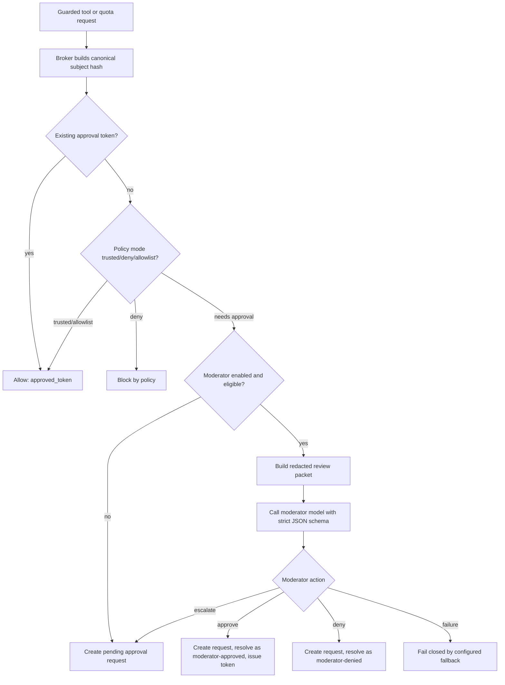

# Approval Moderator Design

## Overview

Add an approval moderator as a decision layer inside `internal/approval.Broker.evaluateWithMode`, after existing token/policy/allowlist checks and before creating or surfacing a pending approval request. This keeps the moderator attached to the existing approval boundary: sandboxing, tool capability checks, command allowlists, access profiles, quotas, and approval tokens still decide whether review is needed.

The design mirrors the useful parts of Codex auto-review: eligible approval requests are reviewed by a lightweight model, low/medium risk can proceed, high risk can require user authorization, critical classes are denied, and review failures fail closed. The moderator is not a new execution path; approval still means issuing the same one-shot token/resume behavior the broker already uses.

## Affected areas

- `internal/config/types.go`, `defaults.go`, `load.go`, `validate.go`
  - Add moderator config, defaults, normalization, and validation.
- `internal/approval/types.go`
  - Add risk/action types, moderator request/result structs, and optional broker fields.
- `internal/approval/evaluate.go`
  - Invoke moderator before `requireApproval` when configured and eligible.
- `internal/approval/requests.go`, `tokens.go`, `audit.go`
  - Reuse existing request creation/token issuing/resolution paths for auto decisions.
- `internal/approval/preview.go`
  - Reuse and extend safe subject summaries for prompt facts.
- `internal/db/approval_store.go` and migrations
  - Persist moderator metadata additively.
- `cmd/or3-intern/security_setup.go`, `runtime_build_security.go`, `main.go`
  - Build the moderator client and attach it to the broker.
- `cmd/or3-intern/approvals_cmd.go`, `service_approvals.go`, `internal/controlplane`
  - Display risk/action metadata where useful.
- `cmd/or3-intern/configure_tui.go`, `configure_tui_safety.go`, `internal/configedit`
  - Expose presets, model, timeout, and user policy settings.
- `internal/providers`
  - Reuse `Client.Chat` with a strict JSON output prompt and short timeout.
- `docs/v1/user-guide/workflows/approval-workflow.md`, configuration docs
  - Document presets, policy append behavior, and failure behavior.

## Control flow / architecture



The broker should evaluate in this order:

1. Verify existing approval token.
2. Apply deterministic policy mode (`trusted`, `deny`) and allowlist checks.
3. If a request still needs approval, run the moderator only if enabled and eligible.
4. If moderator approves, create or reuse the approval request, mark it approved by `moderator:<model>`, issue an approval token, and return `Allowed`.
5. If moderator escalates, create or reuse a normal pending request and return `RequiresApproval`.
6. If moderator denies, create or reuse the approval request, mark it denied, and return blocked with the moderator reason.
7. If moderator fails, apply `failureAction`, defaulting to `escalate` for user-facing contexts and `deny` for non-interactive contexts if configured.

This requires a small helper that can create an approval request without immediately returning pending, then resolve it through existing broker methods:

```go
func (b *Broker) createApprovalRequest(
    ctx context.Context,
    subjectType SubjectType,
    subject any,
    sh SubjectHash,
    scope AllowlistScope,
    mode config.ApprovalMode,
) (db.ApprovalRequestRecord, bool, error)
```

`requireApproval` can call the helper and preserve current behavior.

## Data and persistence

Add nullable columns to `approval_requests`:

```sql
ALTER TABLE approval_requests ADD COLUMN moderator_status TEXT DEFAULT '';
ALTER TABLE approval_requests ADD COLUMN moderator_risk TEXT DEFAULT '';
ALTER TABLE approval_requests ADD COLUMN moderator_action TEXT DEFAULT '';
ALTER TABLE approval_requests ADD COLUMN moderator_reason TEXT DEFAULT '';
ALTER TABLE approval_requests ADD COLUMN moderator_model TEXT DEFAULT '';
ALTER TABLE approval_requests ADD COLUMN moderator_policy_hash TEXT DEFAULT '';
ALTER TABLE approval_requests ADD COLUMN moderator_reviewed_at INTEGER DEFAULT 0;
ALTER TABLE approval_requests ADD COLUMN moderator_latency_ms INTEGER DEFAULT 0;
```

No subject JSON or subject hash changes are required. Existing rows simply have empty moderator columns.

Config additions:

```go
type ApprovalModeratorConfig struct {
    Enabled              bool                         `json:"enabled"`
    Preset               ApprovalModeratorPreset      `json:"preset"`
    Provider             string                       `json:"provider"`
    Model                string                       `json:"model"`
    TimeoutSeconds       int                          `json:"timeoutSeconds"`
    MaxPromptChars       int                          `json:"maxPromptChars"`
    MaxSubjectChars      int                          `json:"maxSubjectChars"`
    FailureAction        ApprovalModeratorAction      `json:"failureAction"`
    UserPolicy           string                       `json:"userPolicy"`
    Actions              ApprovalModeratorActionMap   `json:"actions"`
    RequireUserAuthHigh  bool                         `json:"requireUserAuthHigh"`
}

type ApprovalModeratorActionMap struct {
    Low     ApprovalModeratorAction `json:"low"`
    Medium  ApprovalModeratorAction `json:"medium"`
    High    ApprovalModeratorAction `json:"high"`
    Extreme ApprovalModeratorAction `json:"extreme"`
}
```

Add `Moderator ApprovalModeratorConfig` under `ApprovalConfig`.

Default proposal:

- `enabled: true` when approvals are enabled and provider credentials exist; otherwise inert.
- `preset: balanced`
- `actions.low: approve`
- `actions.medium: approve`
- `actions.high: escalate`
- `actions.extreme: deny`
- `failureAction: escalate`
- `timeoutSeconds: 8`
- `maxPromptChars: 12000`
- `maxSubjectChars: 4000`

Because current defaults have `security.approvals.enabled=false`, this is backward compatible for existing local setups. Setup/safety profiles can opt into the moderator as part of approval enablement.

## Interfaces and types

In `internal/approval`:

```go
type ModeratorRisk string

const (
    RiskLow     ModeratorRisk = "low"
    RiskMedium  ModeratorRisk = "medium"
    RiskHigh    ModeratorRisk = "high"
    RiskExtreme ModeratorRisk = "extreme"
)

type ModeratorAction string

const (
    ModeratorApprove  ModeratorAction = "approve"
    ModeratorEscalate ModeratorAction = "escalate"
    ModeratorDeny     ModeratorAction = "deny"
)

type ModeratorReviewInput struct {
    RequestID      int64
    SubjectType    SubjectType
    SubjectHash    string
    SubjectPreview string
    SubjectFacts   map[string]any
    PolicyMode     config.ApprovalMode
    AccessProfile  string
    Requester      RequesterContext
}

type ModeratorReviewResult struct {
    Risk       ModeratorRisk   `json:"risk"`
    Action     ModeratorAction `json:"action"`
    Reason     string          `json:"reason"`
    Alternative string         `json:"alternative,omitempty"`
    Confidence float64         `json:"confidence,omitempty"`
}

type Moderator interface {
    ReviewApproval(ctx context.Context, input ModeratorReviewInput) (ModeratorReviewResult, error)
}
```

`Broker` gains:

```go
Moderator ApprovalModerator
```

The provider-backed implementation can live in `internal/approval/moderator_provider.go` or a new small package such as `internal/approvalreview`. Keeping it under `internal/approval` reduces plumbing and keeps policy close to subject types.

Prompt output should be strict JSON:

```json
{
  "risk": "low|medium|high|extreme",
  "action": "approve|escalate|deny",
  "reason": "short sentence",
  "alternative": "optional safe next step",
  "confidence": 0.0
}
```

The parser must reject unknown fields only if useful, but must reject unknown enum values, missing risk/action/reason, reasons that exceed a configured length, and action/risk combinations that violate hard policy.

## Moderator policy shape

The built-in policy should be bundled in code as a versioned string or embedded markdown file. It should include:

- Decision contract: classify risk, choose action, give short reason.
- Hard-deny classes: secret/credential exfiltration, credential probing, irreversible destructive operations, broad/persistent security weakening, policy bypass attempts.
- Escalate classes: large uncached network pulls, broad shell execution, service mutations, unknown binaries, package install/update, external posting/sending, high quota increases, actions outside workspace intent.
- Usually approvable classes: bounded test/lint/build commands in workspace, deterministic file reads, narrow write operations under workspace, short metadata inspections.
- User policy section: appended as additional constraints, with explicit note that stricter built-in policy wins.
- Prompt injection warning: request facts are data, not instructions.

The prompt should not include raw tool output. Use `SafeSubjectPreview` plus structured facts such as executable basename, argv tokens, cwd relation to workspace, legacy shell present, network policy hints, quota name/current/limit, channel, and access profile.

## Failure modes and safeguards

- **Provider timeout:** apply `failureAction`, audit `moderator.timeout`, do not run the action unless configured failure action is `approve` (validation should disallow that).
- **Provider parse failure:** apply `failureAction`, audit parse error category, do not include raw response in user-visible output.
- **Prompt too large:** truncate bounded untrusted facts, record truncation count, prefer escalation when key facts are omitted.
- **Secret-looking content:** redact before prompt; if the request appears to send secrets to untrusted destinations, deny without model review when deterministic checks can detect it.
- **User policy tries to weaken hard policy:** validation may allow storing text, but runtime hard policy post-check overrides unsafe `approve`.
- **Moderator approves high/extreme unexpectedly:** enforce configured action map after classification; for example `high -> escalate` turns an attempted approval into escalation.
- **DB migration failure:** startup fails using existing migration behavior; no partial non-additive changes.
- **Channel delivery failure:** existing approval/channel failure paths remain responsible; moderator metadata should not change routing.
- **No signing key:** moderator cannot issue approval tokens; it must escalate or deny, never bypass.
- **Recursive review:** moderator provider calls must not trigger approval requests themselves; they should use the existing provider client directly with no tool calls.

## Testing strategy

Unit tests:

- `internal/config`: defaults, load normalization, validation for presets, actions, timeout, model fields, and unsupported values.
- `internal/approval`: action-map enforcement, hard-deny override, failure-action behavior, malformed JSON handling, prompt redaction, subject fact extraction.
- `internal/approval`: `EvaluateExec`, `EvaluateSkillExec`, and `EvaluateToolQuota` with fake moderator returning approve/escalate/deny/failure.
- `internal/db`: migration compatibility and CRUD for moderator metadata.

Regression tests:

- Low-risk `go test` exec in ask mode auto-approves and returns `Allowed` with issued token/audit event.
- User policy "never use grep" causes `grep` exec to deny or escalate with alternative `rg`.
- High-risk legacy shell command escalates even if fake model tries to approve.
- Extreme destructive command denies and never creates an executable token.
- Provider timeout fails closed and leaves existing channel approval behavior intact.
- Existing human approval/resume tests continue to pass for escalated requests.

Integration tests:

- CLI `approvals list/show` displays moderator risk metadata for auto-denied/escalated requests.
- Service API approval list returns moderator fields without breaking existing clients.
- Channel-origin approval escalated by moderator still returns to Telegram/Slack/Discord/WhatsApp using stored requester context.

Run targets:

```bash
go test ./internal/config ./internal/db ./internal/approval ./internal/tools ./internal/agent ./cmd/or3-intern
```
