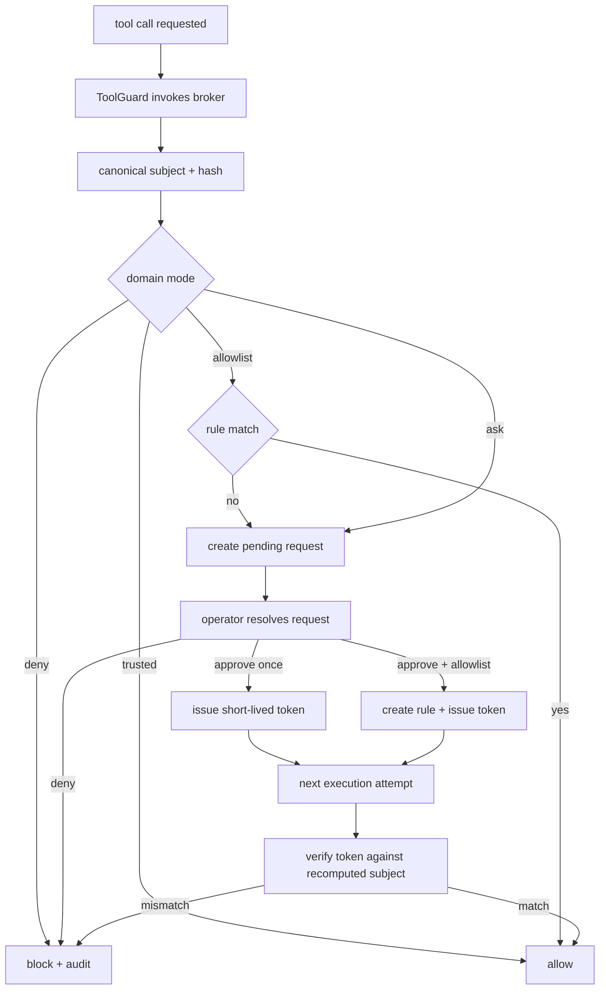

# Overview

This design adds approvals and pairing to OR3 by extending the current runtime instead of layering on a second service or policy engine.

The main architectural choices are:

- keep all state in the existing SQLite database;
- reuse the existing audit logger and key-loading patterns from `internal/security`;
- add one cohesive internal package for pairing and approvals because the domain is large enough to avoid scattering logic across `cmd`, `db`, and `tools`;
- enforce approvals in the host-local tool execution path using the existing `tools.ToolGuard` and runtime tool registry;
- reuse the existing optional service listener for HTTP APIs and remote operator/device auth.

This fits the current codebase because OR3 already has:

- centralized tool execution through `internal/tools.Registry`,
- existing access-profile context propagated to tools,
- an append-only audit chain,
- a lightweight authenticated service mode, and
- SQLite migration patterns that favor additive tables and deterministic local behavior.

# Affected areas

- `internal/config/config.go`
  - Add approval and pairing configuration with small per-domain modes and a stable host ID.
- `internal/config/config_test.go`
  - Validate defaults, enum checking, and backward-compatible config loading.
- `internal/db/db.go`
  - Add additive schema migrations for pairing, approvals, allowlists, and approval-token records.
- `internal/db/*`
  - Add focused CRUD helpers rather than embedding approval SQL in command handlers.
- `internal/security/store.go`
  - Reuse existing key loading patterns for approval signing keys and hashed token helpers where practical.
- `internal/approval/*` (new package)
  - Own canonical subjects, subject hashing, pairing-code generation, device-token issuance, allowlist matching, request lifecycle, approval-token issuance, and verification.
- `internal/tools/context.go`
  - Carry approval context such as requester identity, active host ID, and one-shot approval token when a human has already resolved a request.
- `internal/tools/registry.go`
  - Keep using `ToolGuard`; install an approval-aware guard in runtime construction.
- `internal/tools/exec.go`
  - Build canonical exec subjects and block before subprocess launch when approval is required or invalid.
- `internal/tools/skill_exec.go`
  - Build canonical skill-exec subjects and block before subprocess launch when approval is required or invalid.
- `cmd/or3-intern/main.go`
  - Wire broker creation, CLI commands, and service routes.
- `cmd/or3-intern/approvals_cmd.go` (new)
  - Add CLI approval management commands.
- `cmd/or3-intern/devices_cmd.go` (new)
  - Add CLI pairing/device management commands.
- `cmd/or3-intern/service.go`
  - Add HTTP routes for approvals and pairing under the existing service listener.
- `cmd/or3-intern/service_auth.go`
  - Extend auth to accept paired-device tokens in addition to the current shared-secret bearer.
- `cmd/or3-intern/doctor.go` and `cmd/or3-intern/startup_validation.go`
  - Warn or refuse unsafe combinations such as non-loopback service exposure without pairing and approval configuration.
- `docs/configuration-reference.md`, `docs/cli-reference.md`, `docs/api-reference.md`, `docs/security-and-hardening.md`
  - Document config, CLI flows, API endpoints, and operational posture.

# Control flow / architecture

## Pairing flow

1. A remote client calls the service API to create a pairing request with role, display name, and optional origin metadata.
2. The server creates a short-lived six-digit pairing code, stores only its hash plus request metadata in SQLite, and emits `pairing_requested` to the audit log.
3. A trusted local operator resolves the pairing request from CLI or authenticated HTTP.
4. On approval, the broker creates a paired-device row and issues an opaque random device token.
5. The token is returned once, while only a hash or revocable reference is stored server-side.
6. Future device-authenticated HTTP calls look up the hashed token, verify device status and role, and stamp actor metadata into audit events.

## Approval flow for exec and skill execution

1. The agent/tool path prepares to invoke `exec` or `run_skill_script`.
2. The runtime `ToolGuard` calls the broker with tool name, capability, profile context, session, requester metadata, and tool params.
3. The broker normalizes params into a canonical subject struct and computes a stable subject hash.
4. The broker checks domain mode:
   - `deny`: reject immediately;
   - `trusted`: allow and optionally emit an audit event;
   - `allowlist`: allow if a rule matches, otherwise create a pending request and reject with `approval required`;
   - `ask`: always create or reuse a pending request and reject with `approval required`.
5. A human resolves the request by CLI or HTTP:
   - approve once -> broker issues short-lived approval token;
   - approve and allow matching -> create allowlist rule and issue approval token;
   - deny -> mark request denied.
6. The next execution attempt presents the approval token to the broker via tool context.
7. The broker recomputes the canonical subject, verifies token signature, token lifetime, host ID, and subject hash, then allows execution.
8. Execution start/completion/failure is audited by the same broker or a thin runtime callback using the already validated subject hash.



## Why host-local enforcement fits OR3

OR3 already centralizes tool execution through `internal/tools.Registry.ExecuteParams`, which invokes a `ToolGuard` before a tool executes. That is the right chokepoint for in-process host-local enforcement.

For future `or3-sandbox` support, the new `internal/approval` package should expose canonical subject hashing and token verification helpers that another binary can reuse. That keeps the first implementation local while preserving the OpenClaw-style “verify where risk lives” property.

# Data and persistence

## SQLite changes

Additive tables only:

```sql
CREATE TABLE IF NOT EXISTS paired_devices(
  id INTEGER PRIMARY KEY AUTOINCREMENT,
  device_id TEXT NOT NULL UNIQUE,
  role TEXT NOT NULL,
  display_name TEXT NOT NULL,
  token_hash BLOB NOT NULL,
  status TEXT NOT NULL,
  created_at INTEGER NOT NULL,
  last_seen_at INTEGER NOT NULL,
  revoked_at INTEGER NOT NULL DEFAULT 0,
  metadata_json TEXT NOT NULL DEFAULT '{}'
);

CREATE TABLE IF NOT EXISTS pairing_requests(
  id INTEGER PRIMARY KEY AUTOINCREMENT,
  device_id TEXT NOT NULL,
  role TEXT NOT NULL,
  display_name TEXT NOT NULL DEFAULT '',
  origin TEXT NOT NULL DEFAULT '',
  pairing_code_hash BLOB NOT NULL,
  requested_at INTEGER NOT NULL,
  expires_at INTEGER NOT NULL,
  status TEXT NOT NULL,
  approver_id TEXT NOT NULL DEFAULT '',
  approved_at INTEGER NOT NULL DEFAULT 0,
  denied_at INTEGER NOT NULL DEFAULT 0,
  metadata_json TEXT NOT NULL DEFAULT '{}'
);

CREATE TABLE IF NOT EXISTS approval_requests(
  id INTEGER PRIMARY KEY AUTOINCREMENT,
  type TEXT NOT NULL,
  subject_hash TEXT NOT NULL,
  subject_json TEXT NOT NULL,
  requester_agent_id TEXT NOT NULL DEFAULT '',
  requester_session_id TEXT NOT NULL DEFAULT '',
  execution_host_id TEXT NOT NULL,
  status TEXT NOT NULL,
  policy_mode TEXT NOT NULL,
  requested_at INTEGER NOT NULL,
  expires_at INTEGER NOT NULL,
  resolved_at INTEGER NOT NULL DEFAULT 0,
  resolver_actor_id TEXT NOT NULL DEFAULT '',
  resolution_kind TEXT NOT NULL DEFAULT '',
  resolution_note TEXT NOT NULL DEFAULT ''
);

CREATE TABLE IF NOT EXISTS approval_allowlists(
  id INTEGER PRIMARY KEY AUTOINCREMENT,
  scope_json TEXT NOT NULL,
  matcher_json TEXT NOT NULL,
  created_by TEXT NOT NULL,
  created_at INTEGER NOT NULL,
  expires_at INTEGER NOT NULL DEFAULT 0,
  disabled_at INTEGER NOT NULL DEFAULT 0
);

CREATE TABLE IF NOT EXISTS approval_tokens(
  id INTEGER PRIMARY KEY AUTOINCREMENT,
  approval_request_id INTEGER NOT NULL,
  subject_hash TEXT NOT NULL,
  issued_at INTEGER NOT NULL,
  expires_at INTEGER NOT NULL,
  issuer TEXT NOT NULL,
  revoked_at INTEGER NOT NULL DEFAULT 0,
  FOREIGN KEY(approval_request_id) REFERENCES approval_requests(id) ON DELETE CASCADE
);
```

Recommended indexes:

- `pairing_requests(status, expires_at)`
- `paired_devices(status, role)`
- `approval_requests(status, type, requested_at)`
- `approval_requests(subject_hash, execution_host_id)`
- `approval_tokens(approval_request_id, expires_at)`

No backfill is required because all tables are new and existing auth/session tables remain unchanged.

## Config changes

Add a small `Security.Approvals` section rather than new top-level config.

Suggested shape:

```go
type ApprovalMode string

const (
    ApprovalModeDeny     ApprovalMode = "deny"
    ApprovalModeAsk      ApprovalMode = "ask"
    ApprovalModeAllowlist ApprovalMode = "allowlist"
    ApprovalModeTrusted  ApprovalMode = "trusted"
)

type ApprovalDomainConfig struct {
    Mode string `json:"mode"`
}

type ApprovalConfig struct {
    Enabled                bool                 `json:"enabled"`
    HostID                 string               `json:"hostId"`
    KeyFile                string               `json:"keyFile"`
    PairingCodeTTLSeconds  int                  `json:"pairingCodeTtlSeconds"`
    PendingTTLSeconds      int                  `json:"pendingTtlSeconds"`
    ApprovalTokenTTLSeconds int                 `json:"approvalTokenTtlSeconds"`
    LocalAutoPairLoopback  bool                 `json:"localAutoPairLoopback"`
    Pairing                ApprovalDomainConfig `json:"pairing"`
    Exec                   ApprovalDomainConfig `json:"exec"`
    SkillExecution         ApprovalDomainConfig `json:"skillExecution"`
    SecretAccess           ApprovalDomainConfig `json:"secretAccess"`
    MessageSend            ApprovalDomainConfig `json:"messageSend"`
}
```

Design notes:

- `HostID` defaults to `local` to stay simple and deterministic.
- `KeyFile` follows the same operational pattern as audit and secret-store keys.
- Domain configs intentionally only carry `mode`; TTLs stay global to avoid policy sprawl.
- Existing installs can leave approvals disabled until explicitly configured.

## Tokens and cryptography

Use two token styles, each matching the repo’s constraints:

1. **Pairing/device tokens:** opaque random bearer values stored hashed in SQLite.
   - Reason: they need revocation and rotation, and the service always has DB access.
2. **Approval tokens:** HMAC-signed short-lived blobs that include token ID, request ID, subject hash, host ID, issued-at, and expiry.
   - Reason: future execution hosts or sandboxes should be able to verify them offline with a local key.

Suggested approval-token claims:

```go
type ApprovalTokenClaims struct {
    TokenID       int64  `json:"tid"`
    RequestID     int64  `json:"rid"`
    SubjectHash   string `json:"sub"`
    ExecutionHost string `json:"host"`
    IssuedAt      int64  `json:"iat"`
    ExpiresAt     int64  `json:"exp"`
}
```

# Interfaces and types

## Internal broker package

Create a new `internal/approval` package because the domain crosses config, DB, CLI, service auth, and tools. Keeping it separate avoids bloating `internal/security` with unrelated behavior.

Suggested core types:

```go
type Broker struct {
    DB       *db.DB
    Audit    *security.AuditLogger
    HostID   string
    SignKey  []byte
    Now      func() time.Time
}

type SubjectType string

const (
    SubjectExec          SubjectType = "exec"
    SubjectSkillExec     SubjectType = "skill_execution"
    SubjectSecretAccess  SubjectType = "secret_access"
    SubjectMessageSend   SubjectType = "message_send"
    SubjectFileTransfer  SubjectType = "file_transfer"
)

type Decision struct {
    Allowed          bool
    RequiresApproval bool
    RequestID        int64
    SubjectHash      string
    Reason           string
}
```

Suggested methods:

```go
func (b *Broker) EvaluateExec(ctx context.Context, req ExecEvaluation) (Decision, error)
func (b *Broker) EvaluateSkillExec(ctx context.Context, req SkillEvaluation) (Decision, error)
func (b *Broker) ApproveRequest(ctx context.Context, requestID int64, actor string, alwaysAllow bool, note string) (IssuedApproval, error)
func (b *Broker) DenyRequest(ctx context.Context, requestID int64, actor string, note string) error
func (b *Broker) VerifyApprovalToken(ctx context.Context, token string, subjectHash string, hostID string) error
func (b *Broker) CreatePairingRequest(ctx context.Context, req PairingRequestInput) (PairingRequest, string, error)
func (b *Broker) ApprovePairingRequest(ctx context.Context, id int64, actor string) (PairedDevice, string, error)
func (b *Broker) AuthenticateDeviceToken(ctx context.Context, rawToken string, allowedRoles ...string) (PairedDevice, error)
```

## Canonical subjects

Use concrete Go structs per domain, marshal to canonical JSON with stable field ordering, then hash with SHA-256.

Example exec subject:

```go
type ExecSubject struct {
    Type            string   `json:"type"`
    ExecutionHostID string   `json:"execution_host_id"`
    SandboxID       string   `json:"sandbox_id,omitempty"`
    ExecutablePath  string   `json:"executable_path"`
    Argv            []string `json:"argv"`
    WorkingDir      string   `json:"working_dir"`
    EnvBindingHash  string   `json:"env_binding_hash"`
    ScriptHash      string   `json:"script_hash,omitempty"`
    RequestingAgent string   `json:"requesting_agent_id,omitempty"`
    SessionID       string   `json:"session_id"`
    ToolName        string   `json:"tool_name"`
    AccessProfile   string   `json:"access_profile,omitempty"`
    ExpiresAt       int64    `json:"expires_at"`
}
```

Implementation note: the env binding should hash only allowlisted env names and values or a stable redacted binding format. Raw secrets should never be written to subject JSON or audit payloads.

## Tool integration

Keep the runtime wiring small:

- install an approval-aware `ToolGuard` in runtime construction;
- use existing context helpers for session and active profile;
- add approval-specific context helpers only when needed, such as an already-issued one-shot approval token.

Possible context additions:

```go
func ContextWithApprovalToken(ctx context.Context, token string) context.Context
func ApprovalTokenFromContext(ctx context.Context) string
func ContextWithRequesterIdentity(ctx context.Context, actor string, role string) context.Context
```

The guard should only special-case sensitive tools:

- `exec`
- `run_skill_script`

Everything else should remain untouched in the first pass.

## CLI shape

Add two direct command groups under `cmd/or3-intern`:

- `or3 approvals ...`
- `or3 devices ...`

Minimum CLI commands:

- `or3 approvals list`
- `or3 approvals show <id>`
- `or3 approvals approve <id> [--allowlist] [--note ...]`
- `or3 approvals deny <id> [--note ...]`
- `or3 approvals allowlist add ...`
- `or3 approvals allowlist remove <id>`
- `or3 devices list`
- `or3 devices approve <pairing-request-id>`
- `or3 devices deny <pairing-request-id>`
- `or3 devices revoke <device-id>`
- `or3 devices rotate <device-id>`

These commands should operate directly against SQLite through the broker; they do not require the HTTP service to be enabled.

## HTTP API shape

Extend the existing service server under `/internal/v1` rather than creating a second listener.

Suggested endpoints:

- `POST /internal/v1/pairing/requests`
- `POST /internal/v1/pairing/exchange`
- `GET /internal/v1/pairing/requests`
- `POST /internal/v1/pairing/requests/{id}/approve`
- `POST /internal/v1/pairing/requests/{id}/deny`
- `GET /internal/v1/devices`
- `POST /internal/v1/devices/{id}/revoke`
- `POST /internal/v1/devices/{id}/rotate`
- `GET /internal/v1/approvals`
- `GET /internal/v1/approvals/{id}`
- `POST /internal/v1/approvals/{id}/approve`
- `POST /internal/v1/approvals/{id}/deny`
- `POST /internal/v1/approvals/{id}/cancel`
- `POST /internal/v1/approvals/expire`

Backward-compatibility rule:

- existing `/internal/v1/turns`, `/subagents`, and `/jobs/*` keep their current shared-secret auth path;
- new approval and pairing routes can accept either shared-secret admin auth or paired operator-device auth, depending on route.

# Failure modes and safeguards

- Invalid approval config
  - Startup validation rejects unknown modes, missing key files when approvals are enabled in `ask` or `allowlist`, and empty host IDs after normalization.
- Missing signing key
  - For `ask` and `allowlist` domains, broker construction fails closed; for `trusted`, the broker may start but still audit that approvals are effectively bypassed by mode.
- Expired or replayed approval token
  - Verification rejects expired tokens, revoked token rows, host mismatches, and subject mismatches.
- Pairing code brute force
  - Pairing codes are short-lived, stored hashed, and should be rate-limited per request and per remote address in the HTTP handler.
- Device-token theft
  - Tokens are shown once, stored hashed, and rotation immediately replaces prior material; device status is checked on every authenticated request.
- Approval spam
  - Broker should reuse an existing pending request for an identical active subject instead of opening duplicates.
- Execution after partial approval failure
  - Tool enforcement runs before subprocess start and before skill command resolution is executed against external interpreters where practical.
- CLI/service divergence
  - Both CLI and HTTP call the same broker methods so state transitions and audit behavior stay consistent.
- Audit logger unavailable
  - Respect existing `AuditLogger.Strict` semantics; hosted/sensitive profiles should fail startup when audit is required.

# Testing strategy

## Unit tests

- `internal/approval/*_test.go`
  - subject hashing determinism,
  - allowlist matching,
  - pairing code generation and hashing,
  - device token authentication,
  - approval-token signing and verification,
  - expiration and replay rejection,
  - duplicate request reuse.
- `internal/config/*_test.go`
  - approval config defaults, enum validation, and backward-compatible loading.
- `internal/db/*_test.go`
  - migration creates new tables and indexes,
  - CRUD helpers preserve expected status transitions,
  - SQLite persistence survives reopen.

## Integration tests

- `internal/tools/exec_test.go`
  - blocked when approval required,
  - blocked on subject mismatch,
  - allowed with valid token,
  - allowlist short-circuits prompt creation.
- `internal/tools/skill_exec_test.go`
  - same coverage for skill execution.
- `cmd/or3-intern/service_test.go`
  - pairing request create/exchange,
  - device-authenticated approval listing,
  - revoke/rotate behavior,
  - backward compatibility for current service bearer auth.
- `cmd/or3-intern/*_cmd_test.go`
  - CLI listing and resolution flows.

## Regression and compatibility tests

- keep current service auth tests passing for existing shared-secret flow;
- add startup-validation and doctor regressions for unsafe approval configs;
- add audit-chain tests showing approval and pairing events append correctly and remain verifiable.

## Deliberately not required in the first pass

- browser UI tests,
- chat-approval tests,
- remote node or sandbox integration tests,
- secret-access or outbound-message enforcement tests.
