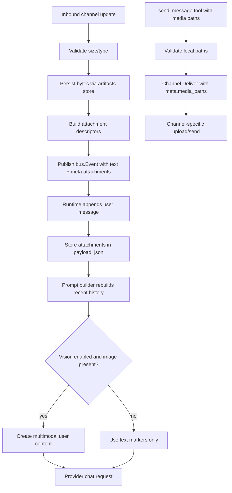

# Overview

`or3-intern` already has most of the primitives needed for media support:

- channel handlers can attach metadata to `bus.Event.Meta`
- message history already stores arbitrary `payload_json`
- artifacts already persist bounded blobs on disk with SQLite metadata
- provider chat messages already allow `content` to be either a string or a structured value
- `send_message` already routes through channel-specific delivery methods with a `meta` map

The proposed design extends those existing seams instead of creating a separate media subsystem. The v1 design uses the existing artifact store for media bytes, stores attachment descriptors inside `messages.payload_json`, reconstructs multimodal image content only when explicitly enabled, and extends `send_message` to pass validated media file paths through `meta`.

## Affected areas

- `internal/config/config.go`
  - add bounded media-related config with safe defaults
- `internal/artifacts/store.go`
  - add helper APIs for saving and resolving attachment artifacts
- `internal/bus/bus.go`
  - no structural change required, but event metadata will now carry typed attachment descriptors
- `internal/channels/telegram/telegram.go`
  - inbound media download and outbound media upload
- `internal/channels/discord/discord.go`
  - inbound attachment download and outbound multipart upload
- `internal/channels/slack/slack.go`
  - explicit v1 unsupported-media behavior for outbound sends
- `internal/channels/whatsapp/whatsapp.go`
  - explicit v1 unsupported-media behavior unless bridge protocol is extended
- `internal/tools/message.go`
  - `send_message` parameters and validation for `media`
- `internal/agent/runtime.go`
  - persist attachment metadata with user messages
- `internal/agent/prompt.go`
  - rebuild multimodal user messages from message payloads
- `internal/providers/openai.go`
  - no endpoint change required, but request content must support structured multimodal arrays cleanly

## Control flow / architecture



### Inbound flow

1. A channel handler detects supported attachments on an inbound message.
2. Each accepted attachment is validated against `MaxMediaBytes` and a small MIME/type allowlist.
3. The binary is saved through the artifact store.
4. The handler appends a textual marker to the message body, for example:
   - `[image: screenshot.png]`
   - `[audio: voice-note.ogg]`
   - `[file: invoice.pdf]`
5. The handler publishes `bus.Event` with:
   - `Message`: original text plus markers
   - `Meta["attachments"]`: typed descriptors for the saved media
6. `Runtime.turn` persists those attachment descriptors in the message payload for the user turn.

### Prompt-building flow

1. `Builder.Build` reads recent history as it already does today.
2. For user messages, it inspects `PayloadJSON` for stored attachments.
3. If the message has image attachments and vision is enabled, the builder converts those files to OpenAI-compatible `content` parts:
   - `{"type":"text","text":"..."}`
   - `{"type":"image_url","image_url":{"url":"data:image/...;base64,..."}}`
4. If conversion is disabled, invalid, or over the request budget, the builder falls back to plain text markers.

### Outbound flow

1. `send_message` accepts `media: []string`.
2. The tool validates each path against:
   - artifact storage directory
   - workspace restrictions / allowed root
3. Validated paths are passed via `meta["media_paths"]`.
4. Supported channels upload those files with the outbound message.
5. Unsupported channels return a clear error.

## Data and persistence

### Config changes

Add the smallest set of new config needed to keep the feature bounded and opt-in where provider compatibility is uncertain:

```go
type ProviderConfig struct {
    // existing fields...
    EnableVision bool `json:"enableVision"`
}

type Config struct {
    // existing fields...
    MaxMediaBytes int `json:"maxMediaBytes"`
}
```

Recommended defaults:

- `MaxMediaBytes = 20 * 1024 * 1024`
- `Provider.EnableVision = false`

Rationale:

- a global size limit is simpler than per-channel duplication for v1
- vision should be explicit because not every OpenAI-compatible backend accepts multimodal chat content

### Persistence strategy

Use the existing `artifacts` table for media bytes and artifact paths.

Store per-message attachment linkage in `messages.payload_json`, for example:

```json
{
  "channel": "telegram",
  "from": "1234",
  "meta": {
    "attachments": [
      {
        "artifact_id": "abcd1234",
        "filename": "photo.jpg",
        "mime": "image/jpeg",
        "kind": "image",
        "size_bytes": 182731
      }
    ]
  }
}
```

This avoids a new SQLite table in v1 while still preserving enough information to:

- display attachment markers in history
- rebuild image content for provider requests
- validate later outbound reuse if artifact-based sending is added

### Artifact helpers

Add light helpers rather than a new media store:

```go
type Attachment struct {
    ArtifactID string `json:"artifact_id"`
    Filename   string `json:"filename"`
    Mime       string `json:"mime"`
    Kind       string `json:"kind"`
    SizeBytes  int64  `json:"size_bytes"`
}
```

Suggested helpers:

- `artifacts.Store.SaveNamed(ctx, sessionKey, filename, mime string, data []byte) (Attachment, error)`
- `artifacts.Store.Path(ctx, artifactID string) (string, string, error)` returning path and MIME

The filename can remain in payload JSON instead of forcing an `artifacts` schema migration.

## Interfaces and types

### Shared attachment descriptor

Use a small shared descriptor that can live in `internal/artifacts` or a tiny `internal/media` package:

```go
type Attachment struct {
    ArtifactID string `json:"artifact_id"`
    Filename   string `json:"filename"`
    Mime       string `json:"mime"`
    Kind       string `json:"kind"`
    SizeBytes  int64  `json:"size_bytes"`
}
```

### `send_message` parameters

Extend the tool schema:

```go
{
  "type": "object",
  "properties": {
    "channel": {"type": "string"},
    "to": {"type": "string"},
    "text": {"type": "string"},
    "media": {
      "type": "array",
      "items": {"type": "string"},
      "description": "Optional local file paths to send as attachments"
    }
  },
  "required": ["text"]
}
```

### Provider content builder

Add a helper near prompt-building code:

```go
func buildUserContent(text string, attachments []Attachment, enableVision bool) any
```

Behavior:

- no usable images: return `string`
- usable images: return OpenAI-compatible `[]map[string]any`

This mirrors the nanobot pattern without requiring a new provider abstraction.

## Failure modes and safeguards

- Oversize inbound attachment:
  - skip binary save
  - keep a textual marker such as `[attachment: foo.pdf - too large]`
- Download failure:
  - keep turn, add failure marker, no panic
- Unsupported MIME:
  - preserve text, do not attempt upload to provider
- Provider vision disabled:
  - keep attachment markers only
- Provider rejects multimodal:
  - return bounded error and optionally retry once with text-only content if the implementation chooses a fallback path
- Unsafe outbound path:
  - reject before channel dispatch
- Unsupported outbound channel:
  - return explicit tool error
- Missing artifact on prompt rebuild:
  - degrade to text marker, do not abort the entire turn

## Channel scope for v1

### In scope

- Telegram inbound media download
- Telegram outbound photo/document/audio sending
- Discord inbound attachment download
- Discord outbound multipart file uploads
- CLI text markers for visibility

### Explicitly deferred

- Slack binary upload
  - Slack’s upload flow is more complex than current `chat.postMessage` usage and should not be half-implemented
- WhatsApp bridge media
  - current repo only contains the Go client side; bridge protocol extensions are external
- OCR, image captioning beyond provider vision, and audio transcription
- Remote URL outbound attachments

## Testing strategy

### Unit tests

- attachment descriptor marshaling/unmarshaling in message payloads
- media path validation for `send_message`
- prompt content builder:
  - text only
  - image + text
  - vision disabled fallback
  - missing artifact fallback

### Integration-style tests

- Telegram inbound media:
  - photo
  - document
  - oversize/failure marker
- Telegram outbound media:
  - send photo/document with caption or companion text
- Discord inbound attachment download
- Discord outbound multipart upload
- runtime persistence:
  - `Runtime.turn` stores attachment metadata in user message payload
  - `Builder.Build` reconstructs recent multimodal image messages

### Regression coverage

- text-only channel behavior remains unchanged
- existing `send_message` text-only behavior remains unchanged
- config loading still works for old config files without media keys
- artifact spillover for large tool outputs remains unaffected
