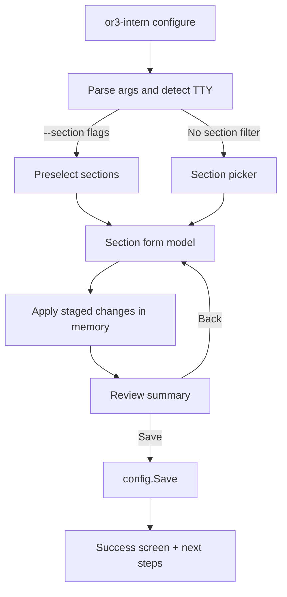

# Design

## Overview

The CLI modernization should replace ad hoc prompt loops with a Bubble Tea-based interactive shell for human-operated commands while preserving the current non-interactive command contracts. The design fits the current Go CLI architecture by keeping command dispatch in `cmd/or3-intern`, reusing existing config/security/business logic, and introducing a small TUI layer that wraps current command operations rather than replacing them.

The key architectural choice is **dual-mode CLI execution**:
- **Interactive mode:** Bubble Tea TUI for `configure`, `init`, and selected human-operated admin flows.
- **Non-interactive mode:** existing flags/stdout behavior for scripts, docs, automation, tests, and service integrations.

This keeps the repo aligned with its CLI-first, low-complexity model while still delivering a modern UX.

## Affected areas

- [cmd/or3-intern/main.go](cmd/or3-intern/main.go)
  - Split early utility dispatch from runtime bootstrap.
  - Route interactive commands into TUI entrypoints only when attached to a TTY.

- [cmd/or3-intern/configure.go](cmd/or3-intern/configure.go)
  - Replace prompt-driven configure flow with Bubble Tea orchestration.
  - Move config mutation logic into shared section apply helpers so TUI and tests use the same path.

- [cmd/or3-intern/init.go](cmd/or3-intern/init.go)
  - Keep `init` as a first-run alias into the TUI setup flow with a restricted section set.

- New CLI TUI package/files under `cmd/or3-intern` or a small focused package such as `internal/cliui`
  - Bubble Tea model/update/view implementation.
  - Bubbles components for lists, toggles, text input, help, table/summary, spinner.
  - Lip Gloss styling/theme definitions.

- [cmd/or3-intern/help.go](cmd/or3-intern/help.go)
  - Update copy to explain interactive TUI behavior and preserve discoverable non-interactive usage.

- [cmd/or3-intern/approvals_cmd.go](cmd/or3-intern/approvals_cmd.go)
- [cmd/or3-intern/devices_cmd.go](cmd/or3-intern/devices_cmd.go)
- [cmd/or3-intern/pairing_cmd.go](cmd/or3-intern/pairing_cmd.go)
- [cmd/or3-intern/secrets_cmd.go](cmd/or3-intern/secrets_cmd.go)
- [cmd/or3-intern/skills_cmd.go](cmd/or3-intern/skills_cmd.go)
  - Tighten parsing and optionally expose interactive entry screens for human workflows.

- [cmd/or3-intern/service.go](cmd/or3-intern/service.go)
- [cmd/or3-intern/service_auth.go](cmd/or3-intern/service_auth.go)
- [cmd/or3-intern/service_request.go](cmd/or3-intern/service_request.go)
  - Fix service-side hardening issues identified in review.

- [internal/approval/broker.go](internal/approval/broker.go)
  - Broker-side allowlist validation and trusted-pairing hardening.

- [internal/security](internal/security) or secret mutation helpers
  - Make strict-audit secret mutation atomic or prevalidated.

- [go.mod](go.mod)
  - Add Bubble Tea ecosystem dependencies.

## Control flow / architecture

### CLI mode split

1. `main.go` parses root args.
2. Utility commands (`help`, `version`, `config-path`) return before config load.
3. Config-only inspection commands (`doctor`, `capabilities`) load config but avoid runtime bootstrap.
4. Interactive commands (`configure`, `init`, future interactive approval/pairing screens) detect TTY and launch Bubble Tea.
5. Scripted/non-interactive invocations continue through existing flag/arg handlers.
6. Runtime-heavy commands (`chat`, `serve`, `service`, `agent`) keep the current bootstrap path.

### TUI architecture

Use a root Bubble Tea model with sub-models for each screen:

- **Shell model**
  - global key handling
  - screen transitions
  - window resize handling
  - save/apply state
  - toast/error banner state

- **Section picker model**
  - interactive list of sections
  - badges for configured/incomplete/error state
  - current status summary sidebar

- **Section form models**
  - provider form
  - storage form
  - workspace form
  - web form
  - channels form (with per-channel nested screens)
  - service form
  - admin/approval/pairing screens in later phases

- **Review/apply model**
  - diff-like summary of pending config changes
  - explicit actions: save, go back, discard

### Bubble Tea ecosystem usage

- **Bubble Tea:** program lifecycle, messages, update loop, resize handling, optional alt-screen for richer setup screens.
- **Bubbles:**
  - `list` for section/channel navigation
  - `textinput` for strings and paths
  - `help` + `key` for discoverable shortcuts
  - `spinner` for save/apply activity
  - `viewport` or `table` for summaries and approval/device lists
- **Lip Gloss:**
  - consistent cards/panels/borders
  - adaptive colors based on dark/light background
  - badges for enabled/disabled/pending/error states

### Recommended interaction model

- Arrow keys / `j`,`k` navigate.
- Enter selects.
- Space toggles boolean values.
- Tab / Shift+Tab switch fields.
- `s` saves or opens review/apply.
- `esc` goes back.
- `q` quits with confirmation if there are unsaved changes.

### Proposed config TUI flow



### Data mutation strategy

Avoid embedding write logic directly in Bubble Tea `Update` handlers. Instead:

- Define per-section draft structs or view models.
- Convert draft state into `config.Config` changes using shared pure functions.
- Save only from explicit apply transitions.
- Reuse the same apply helpers in tests and any fallback text-mode paths.

This keeps TUI state management separate from config semantics.

## Data and persistence

### SQLite table/index/migration changes

- **No SQLite schema changes are required for the Bubble Tea migration itself.**
- Separate bug fixes may require behavior changes in approval/service paths, but the current reviewed issues can be fixed without schema changes:
  - trusted pairing mode change is logic-only
  - allowlist matcher validation is logic-only
  - strict request parsing/body caps are logic-only

### Config/env changes

- Prefer **no new config fields** for the first migration.
- Optionally add a small UI preference later only if clearly needed, e.g. `cli.ui.color` or `cli.ui.altScreen`, but default behavior should be auto-detected from TTY capabilities.
- Existing env overrides remain authoritative and should still be applied before the TUI builds defaults.

### Session or memory-scope implications

- No changes to session keys, memory retrieval, or SQLite session history are needed for setup/admin TUI flows.
- Interactive approval/device/pairing views that read from SQLite should paginate and query bounded result sets only.

## Interfaces and types

### Suggested Go-facing interfaces

```go
type InteractiveCommand interface {
    Run(ctx context.Context, io TerminalIO) error
}

type TerminalIO struct {
    Stdin  io.Reader
    Stdout io.Writer
    Stderr io.Writer
    IsTTY  bool
}

type ConfigureDraft struct {
    Config        config.Config
    DirtySections map[string]bool
    Errors        map[string]string
}
```

### Suggested Bubble Tea model shape

```go
type tuiModel struct {
    mode         string
    width        int
    height       int
    sectionList  list.Model
    activeScreen screenID
    configure    configureModel
    help         help.Model
    spinner      spinner.Model
    styles       styles
    err          error
    saving       bool
}
```

### Shared section appliers

```go
func applyProviderDraft(cfg *config.Config, draft providerDraft) error
func applyStorageDraft(cfg *config.Config, draft storageDraft) error
func applyWorkspaceDraft(cfg *config.Config, draft workspaceDraft) error
func applyWebDraft(cfg *config.Config, draft webDraft) error
func applyChannelsDraft(cfg *config.Config, draft channelsDraft) error
func applyServiceDraft(cfg *config.Config, draft serviceDraft) error
```

### Secret-aware field helpers

```go
type secretFieldState struct {
    KeepExisting bool
    Replace      bool
    Clear        bool
    NewValue     string
    IsConfigured bool
}
```

This is preferable to stuffing current secret values into default inputs.

## Failure modes and safeguards

- **Invalid config on startup**
  - Keep current lenient-repair behavior for `configure`, but surface it as a styled warning banner and isolate invalid fields.

- **TTY unavailable**
  - If interactive command is invoked without a TTY, fall back to current text/flag behavior or return a clear error suggesting `--section`/flags.

- **Secret disclosure**
  - Never render stored secret values.
  - Secret fields expose only `configured/not configured` plus replace/clear actions.

- **Partial writes**
  - Save only on explicit apply.
  - For secret mutations through admin screens, route through atomic mutation helpers so strict audit cannot report failure after state changed.

- **Service/API failures**
  - Approval/device/pairing interactive screens should surface errors inline and remain recoverable without dropping the whole program.

- **Oversized outputs**
  - Approval/device/history listings should be paginated or viewport-bounded instead of dumping large tables to stdout.

- **Session isolation mistakes**
  - Do not let interactive UI code directly mutate session/runtime state beyond the command’s current config or broker operation.

- **Unsafe utility command bootstrap**
  - Keep runtime-only services out of utility/inspection paths.

## Testing strategy

### Unit tests

- Add pure tests for section draft → config application functions.
- Add tests for TTY detection and command mode routing.
- Add tests for utility command early dispatch (`version`, `capabilities`).
- Add tests ensuring secrets are not rendered in TUI output builders.
- Add tests for exact-arity parsing helpers on admin commands.
- Add tests for allowlist validation and trusted pairing logic.
- Add tests for strict service JSON decode and body limit behavior.

### Integration-style CLI tests

- Run Bubble Tea models in test mode with scripted keypress sequences.
- Verify `configure` can:
  - move through sections
  - toggle booleans
  - save config
  - preserve hidden secrets
  - cancel with unsaved-change confirmation

### Service/security regression tests

- Verify unauthenticated trusted pairing stays pending.
- Verify trailing JSON is rejected for service turn/subagent requests.
- Verify oversized pairing/service request bodies fail fast.

### Visual and snapshot coverage

- Add focused string snapshot tests for major screens where stable styling matters.
- Keep them narrow to avoid brittle ANSI churn.

### Build verification

- Ensure `go build ./...` stays green after adding Bubble Tea ecosystem dependencies.
- Keep focused command tests fast; do not require full channel runtime startup for TUI tests.
