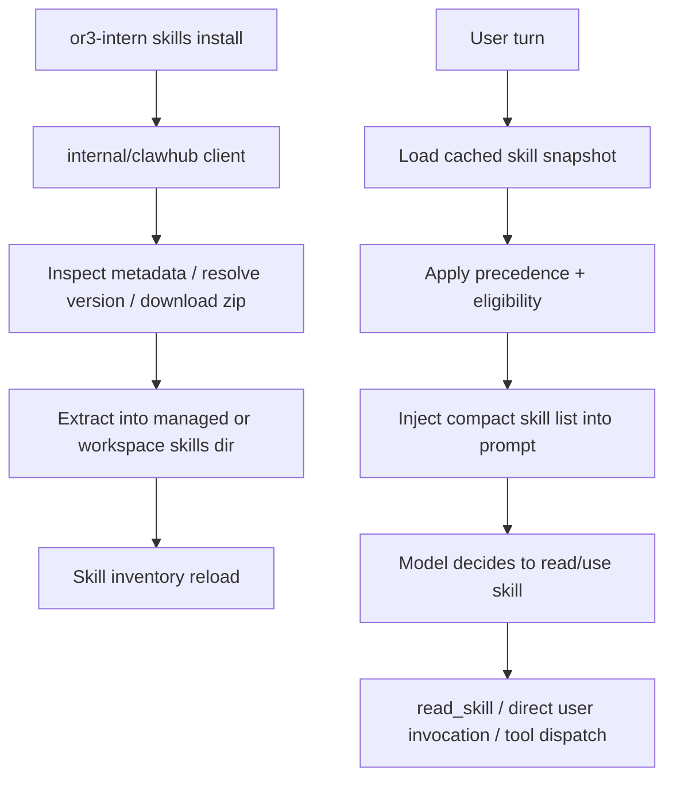

# Overview

The fastest path to reuse the OpenClaw ecosystem is not broad gateway parity. It is a focused compatibility layer for the OpenClaw/ClawHub skill model:

- load the same skill bundle layout
- parse the same frontmatter and metadata aliases
- apply the same eligibility rules
- expose skills to the model the same lightweight way
- install/update skills directly from the ClawHub registry

This fits `or3-intern` because the repo already has:
- a local skill directory model
- a prompt builder that can inject a compact inventory
- bounded file and exec tools
- a CLI-first runtime where explicit commands are acceptable

It avoids the parts of OpenClaw that are heavier or platform-specific:
- Nix plugin installation
- remote macOS nodes
- UI-driven installers
- host-wide sandbox orchestration

# Affected areas

- `internal/config/config.go`
  - Add OpenClaw-style skill config: managed directory, load options, per-skill entries, and ClawHub registry settings.
- `internal/skills/skills.go`
  - Replace the current filename-only scan with real `SKILL.md` frontmatter parsing, precedence handling, and eligibility evaluation.
- `internal/tools/skill.go`
  - Keep `read_skill`, but make it resolve the selected inventory entry and expose the real skill location.
- `internal/tools`
  - Add direct skill execution and user-command dispatch helpers where needed.
- `internal/agent/prompt.go`
  - Format skills as compact `(name, description, location)` entries instead of names only.
- `cmd/or3-intern/main.go`
  - Wire managed/workspace/bundled skill roots, inject per-run env, and add `skills` subcommands.
- `internal/channels` and/or `internal/agent/runtime.go`
  - Add minimal explicit user skill invocation for messages like `/<skill> ...`.
- `internal/clawhub`
  - New small Go package for registry inspection, download, and install logic.

# Control flow / architecture



Runtime behavior:

1. Skills live in three roots:
   - bundled: repo-shipped skills
   - managed: user-installed shared skills
   - workspace: repo-local skills
2. On load, `or3-intern` finds skill directories that contain `SKILL.md`, parses frontmatter, and normalizes metadata.
3. The loader computes:
   - source root and precedence
   - summary fields
   - eligibility status
   - missing requirements or unsupported features
4. The prompt builder injects only the compact eligible list with skill locations, matching OpenClaw’s prompt shape.
5. When the model needs a skill, it reads the skill body on demand.
6. When a user explicitly invokes a skill command, the runtime resolves that skill and either:
   - dispatches directly to a tool if `command-dispatch: tool`
   - or starts a model turn seeded with the requested skill
7. ClawHub installs happen through a lightweight Go registry client that downloads skill zips directly into the configured skill root.

# Data and persistence

## Skill roots and precedence

Mirror OpenClaw’s layout semantically, adapted to this repo:

- bundled: repo-controlled directory, likely `builtin_skills/` or a new dedicated `bundled_skills/`
- managed: `~/.or3-intern/skills`
- workspace: `<workspace>/skills`

Precedence:
- workspace
- managed
- bundled

This is a change from the current `<workspace>/workspace_skills` path and should be normalized for compatibility.

## Config changes

Additive config only. Suggested shape:

```go
type SkillsConfig struct {
    ManagedDir string `json:"managedDir"`
    Load       SkillsLoadConfig `json:"load"`
    Entries    map[string]SkillEntryConfig `json:"entries"`
    ClawHub    ClawHubConfig `json:"clawhub"`
}

type SkillsLoadConfig struct {
    ExtraDirs        []string `json:"extraDirs"`
    Watch            bool     `json:"watch"`
    WatchDebounceMS  int      `json:"watchDebounceMs"`
}

type SkillEntryConfig struct {
    Enabled bool              `json:"enabled"`
    APIKey  string            `json:"apiKey"`
    Env     map[string]string `json:"env"`
    Config  map[string]any    `json:"config"`
}

type ClawHubConfig struct {
    SiteURL     string `json:"siteUrl"`
    RegistryURL string `json:"registryUrl"`
    InstallDir  string `json:"installDir"`
}
```

Defaults:
- `managedDir`: `~/.or3-intern/skills`
- `load.watch`: `false` by default for Pi-friendliness
- `siteUrl`: `https://clawhub.ai`
- `registryUrl`: `https://clawhub.ai`
- `installDir`: `skills`

## Metadata normalization

The loader should normalize these metadata namespaces to one internal struct:

- `metadata.openclaw`
- `metadata.clawdbot`
- `metadata.clawdis`

This is necessary because official OpenClaw docs describe `metadata.openclaw`, while the official ClawHub spec treats `metadata.clawdbot` as preferred and `metadata.clawdis` as the compatibility alias.

## Optional persistence

SQLite is not required for first-pass compatibility. A filesystem-based lockfile is enough:

- `skills.lock.json` in the managed/workspace install root, or
- per-skill `.clawhub/origin.json` and `.clawhub/lock.json` mirroring the ClawHub CLI layout

That keeps install/update logic lightweight and restart-safe without introducing more DB state.

# Interfaces and types

Suggested internal types:

```go
type SkillMeta struct {
    Name                  string
    Description           string
    Homepage              string
    Location              string
    Source                string // bundled | managed | workspace
    UserInvocable         bool
    DisableModelInvocation bool
    CommandDispatch       string
    CommandTool           string
    CommandArgMode        string
    Metadata              SkillRuntimeMeta
    Eligible              bool
    Missing               []string
    Unsupported           []string
}

type SkillRuntimeMeta struct {
    SkillKey   string
    PrimaryEnv string
    OS         []string
    Requires   SkillRequirements
    Install    []SkillInstallerSpec
}

type SkillRequirements struct {
    Bins    []string
    AnyBins []string
    Env     []string
    Config  []string
}
```

```go
type Client struct {
    SiteURL     string
    RegistryURL string
    HTTP        *http.Client
}

func (c *Client) Inspect(ctx context.Context, slug, version string) (SkillVersionInfo, error)
func (c *Client) Download(ctx context.Context, slug, version string) (io.ReadCloser, error)
func (c *Client) Install(ctx context.Context, slug, version, destDir string) error
```

CLI surface:

```text
or3-intern skills list
or3-intern skills list --eligible
or3-intern skills info <name>
or3-intern skills check
or3-intern skills search <query>
or3-intern skills install <slug>
or3-intern skills update [name|--all]
or3-intern skills remove <name>
```

This intentionally mirrors the official OpenClaw and ClawHub operational shape closely enough that users can reason about it without learning a new model.

# Failure modes and safeguards

- **Malformed skill bundle**
  - Skip the skill, report a parse error, continue loading the rest.
- **Metadata namespace mismatch**
  - Accept `openclaw`, `clawdbot`, and `clawdis`; reject unknown custom namespaces as inert metadata.
- **Unsupported OpenClaw-only behavior**
  - Mark the skill ineligible with explicit reasons such as `requires unsupported tool: nodes.run`, `frontmatter custom tools not supported`, `plugin-only binary dependency`, or `unsupported command-dispatch target`.
- **Unsafe installer hints**
  - Do not auto-run `brew`, `npm`, `go install`, `uv`, or arbitrary downloads from skill metadata by default.
  - Surface installer hints as read-only suggestions only.
- **Secret leakage**
  - Inject per-skill env only into the live run context and restore afterward.
  - Never serialize secret values into prompt snapshots or logs.
- **Update overwrite risk**
  - If local files differ from the installed fingerprint, refuse overwrite by default and require an explicit force action.
- **Pi resource pressure**
  - Watchers are off by default.
  - Inventory reload is debounce-bound and metadata-only.
  - Full `SKILL.md` bodies are read lazily.

# Testing strategy

- **Loader and precedence**
  - Extend `internal/skills/skills_test.go` for frontmatter parsing, precedence resolution, alias normalization, and eligibility reporting.
- **Prompt integration**
  - Extend `internal/agent` tests so the skill prompt section includes `name`, `description`, and `location` only for eligible skills.
- **Per-run env behavior**
  - Add runtime/tool tests ensuring per-skill env injection is scoped and restored.
- **Registry client**
  - Add HTTP tests for inspect/download/install against the documented ClawHub API behavior.
- **CLI commands**
  - Add command tests for `skills list`, `skills info`, `skills check`, and install/update safety behavior.
- **User invocation**
  - Add regression tests for direct skill command dispatch and fallback model invocation.
