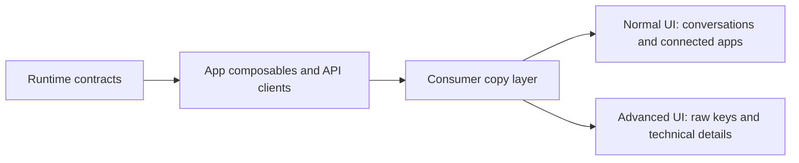

# Consumer Product Language Design

## Overview

This cleanup adds a presentation layer over existing OR3 runtime concepts. The implementation keeps `session_key`, `channel`, `scope`, service routes, config sections, and job payloads intact, but normal UI and user-facing docs use friendlier language.

## Architecture

## Terminology Map

| Runtime term | Normal UI term | Advanced UI |
| --- | --- | --- |
| session | conversation | session may appear when debugging runtime state |
| session_key | hidden conversation identity | raw session key |
| channel | connected app | channel/config section |
| channel ID | destination ID | channel ID |
| scope | memory identity / shared memory | scope key |
| route / routing | delivery / destination | route trace |
| MCP server | add-on / external tool | MCP server |

Agents and subagents are intentionally unchanged.

## Component Strategy

- **Settings:** Update Simple Settings labels and summaries to say Connected Apps and conversations. Keep raw config keys inside advanced details.
- **Scheduled tasks:** Keep payload fields unchanged, but make the default flow talk about conversations, task memory, connected apps, and destinations. Raw conversation/session keys stay in the Advanced section.
- **Conversation history:** Search, loading, empty, rename, and fork copy should say conversations and should not display parent session keys.
- **Memory:** The developer scope section remains available, but its normal label should frame it as advanced memory identity debugging.
- **Connected app settings:** Channel-specific settings pages should present as connected app setup while still loading `section=channels` internally.
- **Docs:** Update README and getting-started/user-guide pages intended for new users. Leave API, architecture, and app-integration references precise.

## Error Handling

No new runtime error handling is required. Existing errors remain unchanged. If an API returns a raw key in data, the UI should display a friendly fallback unless the surface is explicitly Advanced or Developer-labeled.

## Testing Strategy

- Run the OR3 App typecheck.
- Search visible app copy for forbidden normal-surface terms.
- Search user-facing docs for lingering channel/session language.
- Manually inspect Settings, Scheduled Tasks, Conversation History, Memory, and Connected App settings.
