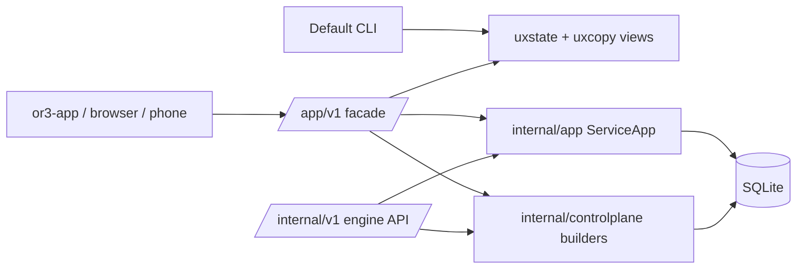

# Consumer UX Facade Design

## Overview

The safest design is an additive consumer facade on top of the existing service and CLI layers. `/internal/v1` remains the engine/API surface. New `/app/v1` routes translate internal records into screen-ready objects with stable consumer handles, display labels, and action descriptors. Default CLI commands use the same `uxstate`/`uxcopy` view builders so the terminal experience matches the app mental model.

This fits the current architecture because `cmd/or3-intern` already owns the service route table, HTTP handlers, CLI commands, and user-facing copy. `internal/app`, `internal/controlplane`, `internal/uxstate`, and `internal/uxcopy` already provide most business operations and view-shaping utilities. The change should extend those layers instead of replacing the agent runtime, approval broker, or SQLite-backed stores.

`/app/v1` should be transport-hybrid, not WebSocket-only. HTTP remains the durable contract for bootstrap, state reads, and user actions; a realtime stream is a progressive enhancement for invalidations, progress, live assistant output, approval inbox updates, device changes, and terminal/activity status. This keeps the app snappy without making cold start, refresh, tests, or non-browser clients depend on a long-lived socket.

## Affected areas

- `cmd/or3-intern/service_routes.go`
  - Register `/app/v1/*` routes alongside `/internal/v1/*` routes without changing internal route specs.
- `cmd/or3-intern/service_app_facade.go` (new)
  - Dispatch consumer facade routes and share auth/role behavior with existing service middleware.
- `cmd/or3-intern/service_request.go`
  - Keep existing internal turn decoder unchanged; add a separate app turn/conversation request decoder with smaller payloads.
- `cmd/or3-intern/service_chat_sessions.go`
  - Keep internal chat-session handlers unchanged; reuse DB methods from facade handlers for conversation list/create/read/fork.
- `cmd/or3-intern/service_approvals.go`
  - Keep internal approval API unchanged; add card/action builders and facade action resolution.
- `cmd/or3-intern/approvals_cmd.go`
  - Make no-arg `approvals` open the inbox and hide raw IDs/tokens unless `--advanced` is provided.
- `cmd/or3-intern/devices_cmd.go`
  - Make no-arg `devices` list/manage visible devices and keep ID commands as advanced/scriptable paths.
- `cmd/or3-intern/connect_device_cmd.go`
  - Stop printing pairing request ID in the default flow; show it only via advanced details.
- `cmd/or3-intern/pairing_cmd.go`
  - Prefer code-based approval and make request-ID/channel-identity paths advanced in help/copy.
- `cmd/or3-intern/configure.go`, `cmd/or3-intern/configure_tui.go`
  - Split default settings categories from advanced sections while preserving `--section` compatibility.
- `cmd/or3-intern/service_mcp.go`
  - Add preset/integration response shapes and keep raw MCP config for custom/advanced mode.
- `cmd/or3-intern/service_files.go`
  - Add display-first facade responses that wrap existing root/path operations without weakening path checks.
- `cmd/or3-intern/service_terminal.go`
  - Add contextual terminal facade endpoints; keep internal session/ticket endpoints for the app terminal transport.
- `internal/db`
  - Add optional handle mapping tables if persistent consumer handles are used.
- `internal/controlplane`
  - Add consumer response builders if shared by service tests or app clients.
- `internal/uxstate`, `internal/uxcopy`, `internal/uxformat`
  - Extend approval/device/settings view builders and shared action labels.
- `cmd/or3-intern/*_test.go`, `internal/uxstate/*_test.go`, `internal/uxcopy/*_test.go`
  - Add facade contract, no-raw-ID guard, CLI default-flow, and regression tests.

## Control flow / architecture



The facade should not reimplement core operations. It should:

1. Authenticate and authorize through the existing service middleware and role checks.
2. Decode small consumer request bodies.
3. Resolve opaque consumer handles into internal IDs when needed.
4. Call existing service/app/db operations.
5. Return display-first objects with normal actions plus advanced details only when explicitly requested.

### `/app/v1` route shape

Initial route set:

```text
GET  /app/v1/bootstrap
GET  /app/v1/events or WS /app/v1/ws
GET  /app/v1/conversations
POST /app/v1/conversations
GET  /app/v1/conversations/:conversationId
GET  /app/v1/conversations/:conversationId/messages
POST /app/v1/conversations/:conversationId/messages
POST /app/v1/conversations/:conversationId/fork
GET  /app/v1/tasks
GET  /app/v1/approvals/inbox
POST /app/v1/approvals/actions
GET  /app/v1/devices
POST /app/v1/devices/actions
GET  /app/v1/files
GET  /app/v1/files/list
POST /app/v1/files/actions
GET  /app/v1/settings/basic
GET  /app/v1/integrations
POST /app/v1/integrations/actions
GET  /app/v1/activity
```

Not all routes need full behavior in the first patch. The implementation can land in small vertical slices, beginning with bootstrap, conversations, approvals, and devices.

### Realtime transport strategy

Use realtime as an update lane, not the only API surface.

- Prefer Server-Sent Events first if the initial need is one-way updates from `or3-intern` to `or3-app`: conversation deltas, job/task status, approval inbox invalidations, device status changes, and activity feed entries.
- Use WebSocket where bidirectional low-latency interaction is truly needed, especially terminal I/O or future collaborative controls.
- Keep HTTP action endpoints authoritative. For example, `POST /app/v1/approvals/actions` resolves an approval; the realtime lane emits `approval.updated` or `approval.removed` so open screens refresh immediately.
- Include a lightweight event envelope with type, timestamp, sequence, and screen-oriented payload. Avoid raw internal IDs in normal event payloads.
- Keep bounded per-connection buffers and support reconnect via `Last-Event-ID` for SSE or a `since` query/hello payload for WebSocket.
- On reconnect failure or missed sequence, clients should refetch affected HTTP endpoints rather than relying on replaying an unbounded event log.

Example event envelope:

```go
type appRealtimeEvent struct {
  ID        string         `json:"id"`
  Type      string         `json:"type"`
  CreatedAt string         `json:"created_at"`
  Payload   map[string]any `json:"payload"`
}
```

Candidate event types:

```text
conversation.created
conversation.updated
conversation.message_delta
conversation.message_completed
task.updated
approval.created
approval.updated
approval.removed
device.updated
file.changed
terminal.updated
activity.created
```

### Screen-ready object pattern

Facade objects should be shaped for UI rendering:

```go
type appAction struct {
    Label     string         `json:"label"`
    Action    string         `json:"action"`
    Style     string         `json:"style,omitempty"`
    Disabled  bool           `json:"disabled,omitempty"`
    Reason    string         `json:"reason,omitempty"`
    Payload   map[string]any `json:"payload,omitempty"`
}

type appAdvanced map[string]any
```

Rules:

- Normal fields use display names, handles, summaries, risk labels, and status labels.
- `advanced` may contain `session_key`, `request_id`, `device_id`, `root_id`, `terminal_session_id`, or tokens only when the caller requests advanced mode or an internal route is used.
- Actions use stable names (`approve_once`, `remember_for_project`, `deny`, `disconnect`, `rename`, `change_access`) and opaque handles, not raw database IDs.

### Consumer handle strategy

Use persistent opaque handles for values the app needs to store or send back, while preserving internal keys in existing tables.

Recommended helper package/file:

```go
type AppHandleKind string

const (
    AppHandleConversation AppHandleKind = "conversation"
    AppHandleApproval     AppHandleKind = "approval"
    AppHandleDevice       AppHandleKind = "device"
    AppHandleFileRoot     AppHandleKind = "file_root"
    AppHandleTerminal     AppHandleKind = "terminal"
)

func newAppHandle(kind AppHandleKind) (string, error) // e.g. conv_ + randomHex(12)
```

For conversations, a durable SQLite mapping is preferred because conversations are long-lived and `or3-app` may store IDs locally:

```sql
CREATE TABLE IF NOT EXISTS app_conversation_handles (
  handle TEXT PRIMARY KEY,
  session_key TEXT NOT NULL UNIQUE,
  created_at INTEGER NOT NULL,
  updated_at INTEGER NOT NULL
);

CREATE INDEX IF NOT EXISTS idx_app_conversation_handles_session
  ON app_conversation_handles(session_key);
```

For short-lived approvals and terminal/file action contexts, either a bounded in-memory handle map with TTL or a shared generic SQLite table may be used. Prefer SQLite only when the handle must survive service restart; otherwise keep state in the existing process-local manager and expire it aggressively.

## Data and persistence

### SQLite changes

Additive only:

- `app_conversation_handles` maps app-visible `conversation_id` to internal `session_key`.
- Optional `app_action_handles` may map short-lived approval/device/file action handles if stateless action payloads are not sufficient.

No existing tables should be renamed or rewritten. `chat_session_meta`, messages, approval requests, pairing/device tables, terminal session manager state, and file roots remain the source of truth.

### Config/env changes

No required config changes for the facade. If a feature flag is desired during rollout, add a default-on service setting only if existing config loading can preserve backward compatibility. Prefer unconditional route availability protected by existing service auth.

### Session and memory implications

- `session_key` remains the canonical internal chat/history key.
- `conversation_id` is an app handle; it must never be used as the memory/session key inside `internal/agent`, `internal/db`, or channel bridges.
- Scope/memory concepts remain internal. If exposed later, use labels such as Personal, This Project, This Device, and This Team, then map internally to existing scope keys.

## Interfaces and types

### Conversation facade requests

```go
type appConversationCreateRequest struct {
    Title string `json:"title"`
    Mode  string `json:"mode"` // normal|code|research|local_cli
}

type appConversationMessageRequest struct {
    Message string `json:"message"`
    Mode    string `json:"mode,omitempty"`
}

type appConversationForkRequest struct {
    MessageID int64  `json:"message_id"`
    Title     string `json:"title,omitempty"`
    Mode      string `json:"mode,omitempty"`
}
```

Mode resolution should map known modes to existing runner/profile/tool-policy behavior in one backend-owned function. Unknown modes should fail validation rather than accepting raw tool policy.

### Approval card response

```go
type appApprovalCard struct {
    ID      string      `json:"id"`
    Title   string      `json:"title"`
    Why     string      `json:"why"`
    Action  string      `json:"action"`
    Risk    string      `json:"risk"`
    Actions []appAction `json:"actions"`
    Advanced appAdvanced `json:"advanced,omitempty"`
}
```

`ID` is an opaque card handle. In normal mode it must not be the numeric approval request ID.

### Device card response

```go
type appDeviceCard struct {
    ID       string      `json:"id"`
    Name     string      `json:"name"`
    Access   string      `json:"access"`
    Status   string      `json:"status"`
    LastUsed string      `json:"last_used,omitempty"`
    Actions  []appAction `json:"actions"`
    Advanced appAdvanced `json:"advanced,omitempty"`
}
```

### Settings and integrations

Settings basic response should be a list of cards, not raw config sections. Integration presets should be small descriptors:

```go
type appIntegrationPreset struct {
    Key         string      `json:"key"`
    Title       string      `json:"title"`
    Description string      `json:"description"`
    AccessModes []string    `json:"access_modes,omitempty"`
    Actions     []appAction `json:"actions"`
    Advanced    bool        `json:"advanced,omitempty"`
}
```

## Failure modes and safeguards

- **Invalid facade handle:** Return `404` with a consumer-safe message such as `conversation not found`; do not echo the raw handle in logs visible to users.
- **Missing DB:** Match existing service behavior with `503` and a short user-safe error.
- **Mode validation failure:** Return `400` with supported mode labels; do not accept free-form tool policy in app routes.
- **Approval race:** If an approval was already resolved or expired, return an updated card status and safe next action instead of exposing request IDs.
- **Pairing/device race:** If a device was revoked or renamed while listed, refresh by name/status and return a safe “device not found” message.
- **Migration failure:** Fail service startup/readiness consistently with existing DB migration behavior; do not silently create partial mappings.
- **File misuse:** Reuse `resolveServiceFilePath` and existing path escape checks for all facade file actions.
- **Terminal misuse:** Reuse terminal availability, role checks, TTL cleanup, row/col clamps, and websocket ticket redaction.
- **Secret leakage:** Keep token/ticket/secret fields out of normal facade objects and default CLI output. If an internal operation must return a token, consume it server-side or place it behind explicit advanced output.
- **or3-app compatibility:** Do not switch app defaults until `/app/v1` has contract tests. Keep `/internal/v1/app/bootstrap` as-is while adding `/app/v1/bootstrap`.
- **Realtime unavailable:** Treat socket/SSE failures as degraded UX, not app failure. The app should continue through HTTP fetches and actions.

## Testing strategy

Use Go’s `testing` package and existing service test helpers.

- **Route contract tests**
  - Add tests that `/app/v1/bootstrap` is registered and `/internal/v1/app/bootstrap` still returns the old shape.
  - Add representative “internal route unchanged” tests for chat sessions and approvals.
- **Realtime tests**
  - Add tests that realtime endpoints require the same auth/role behavior as HTTP facade endpoints.
  - Add tests that emitted normal events omit raw session keys, approval IDs, device IDs, root IDs, websocket tickets, and tokens.
  - Add reconnect/degraded-mode tests at the client contract level when `or3-app` starts using the stream.
- **Conversation facade tests**
  - SQLite-backed test for `POST /app/v1/conversations` creating a `chat_session_meta` row and `app_conversation_handles` mapping.
  - Test list/read/message responses omit `session_key`, `runner_id`, `parent_session_key`, and `runner_chat_session_id` in normal mode.
  - Test fork request generates a new internal session key and copies messages using existing `ForkChatSession` behavior.
- **Approval facade and CLI tests**
  - Test no-arg `approvals` lists pending cards.
  - Test default approval output does not contain token, allowlist ID, plan ID, subject JSON, or numeric command hints except numbered menu choices.
  - Test facade action `remember_for_project` calls existing approval allowlist creation from the reviewed request.
- **Device/pairing CLI tests**
  - Test no-arg `devices` shows connected devices.
  - Test `connect-device` default output omits request ID.
  - Keep existing ID-command tests to prove script compatibility.
- **Settings/integrations tests**
  - Test default settings view hides advanced section terms while `--advanced` retains raw sections.
  - Test integration presets are returned without raw MCP fields unless custom/advanced is requested.
- **Files/terminal facade tests**
  - Test file facade roots/listings hide `root_id` and still reject path escapes.
  - Test terminal create facade returns a contextual card and does not expose websocket tickets in normal response.
- **No-raw-ID guard**
  - Add a targeted scanner test for default user-facing strings in `cmd/or3-intern` and `internal/uxcopy`/`internal/uxstate`.
  - Keep explicit allow patterns for `/internal/v1`, tests, docs, logs, and `--advanced` strings.
