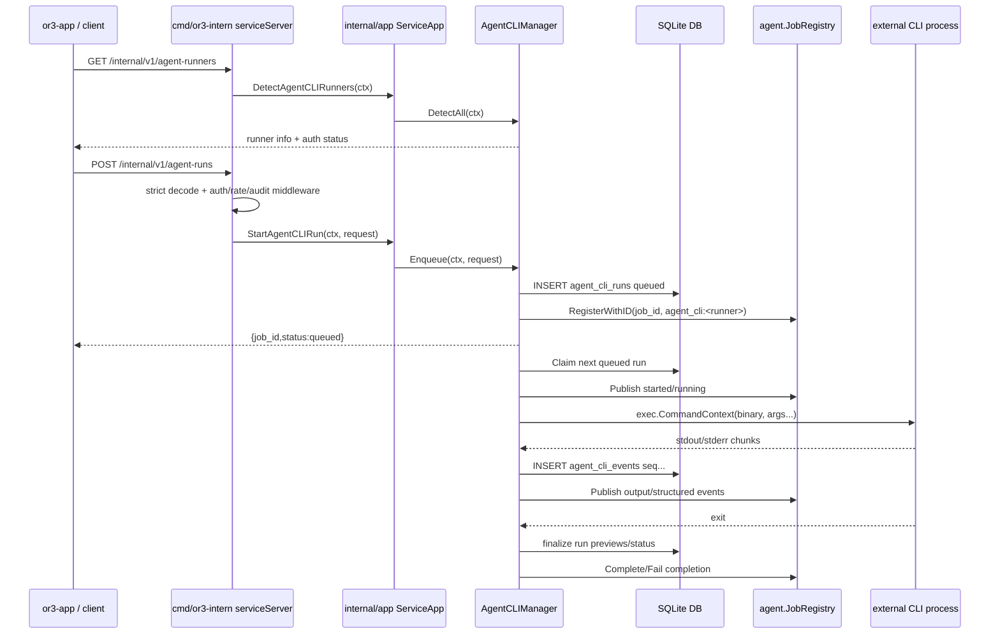

# External Agent CLI Delegation — Design

## Overview

Add a small, service-owned external CLI runner subsystem to `or3-intern`. It should mirror the existing subagent shape where useful: queued work is persisted in SQLite, live state is mirrored into `agent.JobRegistry`, and `/internal/v1/jobs/:job_id/stream` remains the primary live event path. Unlike internal subagents, the runner executes external binaries through typed adapters and a dedicated process manager.

This fits the current architecture because:

- `cmd/or3-intern/service.go` already owns internal HTTP routes, service auth, request limits, SSE, mutation rate limits, and audit logging.
- `internal/agent.JobRegistry` already provides live job snapshots, cancellation hooks, event history, and SSE fan-out.
- `internal/db` already uses additive SQLite migrations and store methods for queued subagent work.
- `internal/config` already carries hardening, sandbox, queue, timeout, and child env allowlist patterns.
- `internal/tools/sandbox.go` already demonstrates argv-preserving sandbox wrapping for command execution.

## Affected areas

- `internal/agent/agentcli/` or `internal/agentcli/`
  - New package for runner specs, adapter implementations, detection, command building, parsing, process management, and manager lifecycle. Prefer `internal/agentcli` if imports from `cmd/or3-intern` and `internal/app` should stay clean.
- `internal/db/db.go`
  - Add `agent_cli_runs` and `agent_cli_events` tables plus indexes through additive migrations.
- `internal/db/store.go`
  - Add typed records and store methods for enqueue/claim/finalize/list events/read snapshots, following the `SubagentJob` method style.
- `internal/config/config.go`
  - Add `AgentCLIConfig`, defaults, normalization, env overrides, and validation.
- `internal/app/service_app.go`
  - Add thin methods such as `DetectAgentCLIRunners`, `StartAgentCLIRun`, `GetAgentCLIRun`, and cancellation delegation while keeping HTTP details in `cmd/or3-intern`.
- `internal/controlplane/controlplane.go`
  - Add response builders for runner info and persisted CLI run snapshots, similar to `BuildSubagentJobResponse`.
- `cmd/or3-intern/service_request.go`
  - Add strict request decoding for `agent-runs` with typed fields and no raw args.
- `cmd/or3-intern/service.go`
  - Register `/internal/v1/agent-runners`, `/internal/v1/agent-runs`, and optional `/internal/v1/agent-runs/:id/events`; route job reads/abort fallback through persisted CLI runs.
- Tests under `internal/agentcli`, `internal/db`, and `cmd/or3-intern`
  - Add fake-binary unit/integration tests, service contract fixtures, and migration coverage.

## Control flow / architecture



### Runner manager

Create an `AgentCLIManager` with the same boring worker-pool shape as `agent.SubagentManager`:

```go
type Manager struct {
    DB            *db.DB
    Jobs          *agent.JobRegistry
    Config        config.AgentCLIConfig
    RuntimeConfig config.Config
    Registry      *RunnerRegistry
    Process       *ProcessManager

    MaxConcurrent int
    MaxQueued     int
    TaskTimeout   time.Duration

    // Start/Stop/Enqueue/Abort mirror SubagentManager semantics.
}
```

Responsibilities:

- Resume queued runs on service start.
- Mark previously running jobs as `aborted` or `interrupted` on restart.
- Enforce max queue and worker concurrency.
- Register live jobs in `JobRegistry` with kind `agent_cli:<runner_id>`.
- Attach cancellation to `JobRegistry.AttachCancel`.
- Persist every output/structured/completion event to SQLite.

### Runner registry and adapters

```go
type RunnerID string

const (
    RunnerOpenCode RunnerID = "opencode"
    RunnerCodex    RunnerID = "codex"
    RunnerClaude   RunnerID = "claude"
    RunnerGemini   RunnerID = "gemini"
)

type RunnerMode string

const (
    RunnerModeReview      RunnerMode = "review"
    RunnerModeSafeEdit    RunnerMode = "safe_edit"
    RunnerModeSandboxAuto RunnerMode = "sandbox_auto"
)

type RunIsolation string

const (
    IsolationHostReadOnly       RunIsolation = "host_readonly"
    IsolationHostWorkspaceWrite RunIsolation = "host_workspace_write"
    IsolationSandboxWrite       RunIsolation = "sandbox_workspace_write"
    IsolationSandboxDangerous   RunIsolation = "sandbox_dangerous"
)

type RunnerAdapter interface {
    ID() RunnerID
    DisplayName() string
    Spec() RunnerSpec
    Detect(ctx context.Context, opts DetectOptions) RunnerInfo
    BuildCommand(req AgentRunRequest, workspace Workspace) (CommandSpec, error)
    ParseOutput(stream string, line []byte) []AgentRunEvent
    ParseFinal(stdoutPreview []byte, stderrPreview []byte, exitCode int) FinalResult
}
```

`RunnerSpec` centralizes binary names, detection commands, auth commands, and capabilities. Detection must use the spec instead of the command builder so binary readiness remains separate from task readiness.

```go
type RunnerSpec struct {
    ID          RunnerID
    DisplayName string
    Binary      string
    VersionArgs []string
    AuthCheck   *SmallCommandSpec
    Supports    RunnerSupports
}

type RunnerSupports struct {
    StructuredOutput     bool `json:"structuredOutput"`
    StreamingJSON        bool `json:"streamingJson"`
    ModelFlag            bool `json:"modelFlag"`
    PermissionsMode      bool `json:"permissionsMode"`
    SafeSandboxFlag      bool `json:"safeSandboxFlag"`
    DangerousBypassFlag  bool `json:"dangerousBypassFlag"`
    StdinPrompt          bool `json:"stdinPrompt"`
}
```

### Detection states

Use Go types with snake_case JSON tags at the API boundary:

```go
type RunnerStatus string

const (
    RunnerStatusAvailable          RunnerStatus = "available"
    RunnerStatusMissing            RunnerStatus = "missing"
    RunnerStatusNotExecutable      RunnerStatus = "not_executable"
    RunnerStatusAuthMissing        RunnerStatus = "auth_missing"
    RunnerStatusAuthUnknown        RunnerStatus = "auth_unknown"
    RunnerStatusUnsupportedVersion RunnerStatus = "unsupported_version"
    RunnerStatusDisabledByConfig   RunnerStatus = "disabled_by_config"
    RunnerStatusError              RunnerStatus = "error"
)

type AuthStatus string

const (
    AuthReady   AuthStatus = "ready"
    AuthMissing AuthStatus = "missing"
    AuthUnknown AuthStatus = "unknown"
)
```

Detection algorithm:

1. Check config disable list.
2. `exec.LookPath(spec.Binary)`.
3. Run `spec.VersionArgs` with a 2 second timeout.
4. Run `spec.AuthCheck` with a 3 second timeout when present.
5. Return installed status and auth status separately.

Version/help commands:

- OpenCode: `opencode --version`
- Codex: `codex --help`
- Claude: `claude --version`
- Gemini: `gemini --version`, falling back to `gemini --help` if needed

Auth commands:

- OpenCode: `opencode auth list`
- Codex: `codex login status`
- Claude: `claude auth status`
- Gemini: none; auth is unknown when binary/help works

### Command specs

```go
type CommandSpec struct {
    Binary        string
    Args          []string
    Env           []string
    Cwd           string
    PromptOnStdin bool
    Stdin         []byte
    OutputMode    OutputMode
    ArgvPreview   []string
}

type OutputMode string

const (
    OutputPlain OutputMode = "plain"
    OutputJSONL OutputMode = "jsonl"
    OutputJSON  OutputMode = "json"
)
```

Adapters must build only argv slices. They must never return a shell command string.

#### OpenCode adapter

Default/safe argv:

```go
args := []string{"run", "--format", "json"}
if req.Model != "" {
    args = append(args, "--model", req.Model)
}
if req.Mode == RunnerModeSandboxAuto {
    args = append(args, "--dangerously-skip-permissions")
}
args = append(args, req.Task)
```

Mode mapping:

- `review`: same argv, but future per-run OpenCode config should deny edit/bash.
- `safe_edit`: same argv, relying on configured OpenCode permissions.
- `sandbox_auto`: add `--dangerously-skip-permissions`, only with `IsolationSandboxDangerous`.

#### Codex adapter

```go
args := []string{"exec", "--json", "--color", "never", "--cd", workspace.Path}

switch req.Mode {
case RunnerModeReview:
    args = append(args, "--sandbox", "read-only", "--ask-for-approval", "never")
case RunnerModeSafeEdit, "":
    args = append(args, "--sandbox", "workspace-write", "--ask-for-approval", "never")
case RunnerModeSandboxAuto:
    args = append(args, "--dangerously-bypass-approvals-and-sandbox")
default:
    return CommandSpec{}, fmt.Errorf("unsupported codex mode %q", req.Mode)
}

if req.Model != "" {
    args = append(args, "--model", req.Model)
}
if !workspace.HasGitDir {
    args = append(args, "--skip-git-repo-check")
}
args = append(args, req.Task)
```

Never emit `--full-auto`.

#### Claude adapter

```go
args := []string{
    "--bare",
    "-p", req.Task,
    "--output-format", "stream-json",
    "--verbose",
    "--include-partial-messages",
}

switch req.Mode {
case RunnerModeReview:
    args = append(args, "--permission-mode", "plan")
case RunnerModeSafeEdit, "":
    args = append(args, "--permission-mode", "acceptEdits")
case RunnerModeSandboxAuto:
    args = append(args, "--permission-mode", "bypassPermissions")
default:
    return CommandSpec{}, fmt.Errorf("unsupported claude mode %q", req.Mode)
}

if req.Model != "" {
    args = append(args, "--model", req.Model)
}
if req.MaxTurns > 0 {
    args = append(args, "--max-turns", strconv.Itoa(req.MaxTurns))
}
```

If product chooses stricter host default, map `safe_edit` to `dontAsk` and expose `acceptEdits` as a separate option later. The initial plan favors useful background edits while avoiding bypass mode.

#### Gemini adapter

```go
args := []string{"--prompt", req.Task, "--output-format", "json"}

switch req.Mode {
case RunnerModeReview:
    args = append(args, "--approval-mode", "default")
case RunnerModeSafeEdit, "":
    args = append(args, "--approval-mode", "auto_edit")
case RunnerModeSandboxAuto:
    args = append(args, "--approval-mode", "yolo")
default:
    return CommandSpec{}, fmt.Errorf("unsupported gemini mode %q", req.Mode)
}

if req.Model != "" {
    args = append(args, "--model", req.Model)
}
```

Never emit both `--yolo` and `--approval-mode yolo`.

### Mode and isolation validation

Validate before adapters run:

```go
func ValidateRunPolicy(req AgentRunRequest, cfg config.AgentCLIConfig) error {
    switch req.Mode {
    case RunnerModeReview:
        return requireIsolation(req.Isolation, IsolationHostReadOnly, IsolationSandboxWrite)
    case RunnerModeSafeEdit, "":
        return requireIsolation(req.Isolation, IsolationHostWorkspaceWrite, IsolationSandboxWrite)
    case RunnerModeSandboxAuto:
        if req.Isolation != IsolationSandboxDangerous {
            return errors.New("full autonomy requires sandbox_dangerous isolation")
        }
        if !cfg.AllowSandboxAuto {
            return errors.New("sandbox auto mode is disabled")
        }
        return nil
    default:
        return fmt.Errorf("unsupported mode %q", req.Mode)
    }
}
```

For v1, sandbox materialization can be conservative: if the repo does not yet have a true copied-workspace sandbox runtime, reject `sandbox_auto` and document that host safe modes are the only enabled modes. This keeps the API shape right without pretending host yolo is safe.

### Process manager

Create a `ProcessManager` that launches one command and streams outputs. It should be independent from terminal PTY sessions.

Responsibilities:

- Use `exec.CommandContext(ctx, spec.Binary, spec.Args...)`.
- Set `cmd.Dir` to validated cwd.
- Set `cmd.Env` to sanitized env.
- On Unix, set `SysProcAttr.Setpgid = true` and cancel by process group.
- Stream stdout and stderr concurrently.
- Split output chunks to 16 KiB before persistence/publication.
- Maintain stdout/stderr preview ring buffers of 64 KiB each.
- Parse structured output best-effort by line while always emitting raw output.
- Finalize status based on exit/cancel/deadline.

Unix cancellation flow:

1. `cancel()` the command context.
2. Send `SIGTERM` to negative process group id.
3. Wait 2 seconds.
4. Send `SIGKILL` to process group if still running.

Platform split:

- `process_unix.go` implements process group shutdown.
- `process_windows.go` uses direct process kill for v1 and documents Job Objects as future work.

### Event format

Persist and publish normalized events. `JobRegistry` already assigns `sequence`, but durable CLI events need their own `seq` so reconnect after registry expiry is possible.

```go
type AgentRunEvent struct {
    Type      string          `json:"type"`
    TS        string          `json:"ts"`
    Seq       int64           `json:"seq,omitempty"`
    JobID     string          `json:"job_id,omitempty"`
    RunnerID  string          `json:"runner_id,omitempty"`
    Stream    string          `json:"stream,omitempty"`
    Chunk     string          `json:"chunk,omitempty"`
    Payload   json.RawMessage `json:"payload,omitempty"`
    ExitCode  *int            `json:"exit_code,omitempty"`
    Status    string          `json:"status,omitempty"`
    Message   string          `json:"message,omitempty"`
    DurationMS int64          `json:"duration_ms,omitempty"`
}
```

Event types:

- `started`: includes `job_id`, `runner_id`, `argv_preview`, and `cwd`.
- `output`: includes `seq`, `stream`, and `chunk`.
- `structured`: includes `seq`, `runner_id`, and `payload`.
- `output_truncated`: includes dropped byte counts or cap reason.
- `completion`: includes `exit_code`, final status, previews, and duration.
- `error`: includes stable code and public message.

`JobRegistry.Publish` can continue using event names and `map[string]any`; the adapter manager should publish the same payload it persists where practical.

## Data and persistence

### SQLite schema

Add tables in `internal/db/db.go` migrations:

```sql
CREATE TABLE IF NOT EXISTS agent_cli_runs (
  id TEXT PRIMARY KEY,
  job_id TEXT NOT NULL UNIQUE,
  parent_session_key TEXT NOT NULL,
  runner_id TEXT NOT NULL,
  task TEXT NOT NULL,
  cwd TEXT NOT NULL DEFAULT '',
  model TEXT NOT NULL DEFAULT '',
  mode TEXT NOT NULL,
  isolation TEXT NOT NULL DEFAULT '',
  status TEXT NOT NULL,
  pid INTEGER NOT NULL DEFAULT 0,
  requested_at INTEGER NOT NULL,
  started_at INTEGER NOT NULL DEFAULT 0,
  completed_at INTEGER NOT NULL DEFAULT 0,
  timeout_seconds INTEGER NOT NULL DEFAULT 0,
  exit_code INTEGER,
  stdout_preview TEXT NOT NULL DEFAULT '',
  stderr_preview TEXT NOT NULL DEFAULT '',
  final_text_preview TEXT NOT NULL DEFAULT '',
  error_message TEXT NOT NULL DEFAULT '',
  attempts INTEGER NOT NULL DEFAULT 0,
  meta_json TEXT NOT NULL DEFAULT '{}'
);

CREATE TABLE IF NOT EXISTS agent_cli_events (
  id INTEGER PRIMARY KEY AUTOINCREMENT,
  run_id TEXT NOT NULL,
  job_id TEXT NOT NULL,
  seq INTEGER NOT NULL,
  ts TEXT NOT NULL,
  type TEXT NOT NULL,
  stream TEXT NOT NULL DEFAULT '',
  chunk TEXT NOT NULL DEFAULT '',
  payload_json TEXT NOT NULL DEFAULT '',
  UNIQUE(run_id, seq)
);

CREATE INDEX IF NOT EXISTS idx_agent_cli_runs_status_requested_at ON agent_cli_runs(status, requested_at);
CREATE INDEX IF NOT EXISTS idx_agent_cli_runs_parent ON agent_cli_runs(parent_session_key, requested_at);
CREATE INDEX IF NOT EXISTS idx_agent_cli_events_job_seq ON agent_cli_events(job_id, seq);
```

Add store types and constants near `SubagentJob` in `internal/db/store.go`:

```go
const (
    AgentCLIStatusQueued   = "queued"
    AgentCLIStatusStarting = "starting"
    AgentCLIStatusRunning  = "running"
    AgentCLIStatusSucceeded = "succeeded"
    AgentCLIStatusFailed   = "failed"
    AgentCLIStatusAborted  = "aborted"
    AgentCLIStatusTimedOut = "timed_out"
)
```

Store methods should mirror subagent methods:

- `EnqueueAgentCLIRunLimited(ctx, run, maxQueued) error`
- `ClaimNextAgentCLIRun(ctx) (*AgentCLIRun, error)`
- `ListQueuedAgentCLIRuns(ctx) ([]AgentCLIRun, error)`
- `ListRunningAgentCLIRuns(ctx) ([]AgentCLIRun, error)`
- `GetAgentCLIRun(ctx, idOrJobID string) (AgentCLIRun, bool, error)`
- `AppendAgentCLIEvent(ctx, event) error`
- `ListAgentCLIEvents(ctx, jobID string, afterSeq int64, limit int) ([]AgentCLIEvent, error)`
- `FinalizeAgentCLIRun(ctx, runID string, final AgentCLIFinalizeInput) error`
- `AbortQueuedAgentCLIRun(ctx, idOrJobID, reason string) (AgentCLIRun, bool, error)`
- `MarkRunningAgentCLIRunsAborted(ctx, reason string) error`

### Config

Add:

```go
type AgentCLIConfig struct {
    Enabled                  bool     `json:"enabled"`
    DisabledRunners          []string `json:"disabledRunners"`
    MaxConcurrent            int      `json:"maxConcurrent"`
    MaxQueued                int      `json:"maxQueued"`
    DefaultTimeoutSeconds    int      `json:"defaultTimeoutSeconds"`
    MaxTimeoutSeconds        int      `json:"maxTimeoutSeconds"`
    AllowSandboxAuto         bool     `json:"allowSandboxAuto"`
    DefaultMode              string   `json:"defaultMode"`
    DefaultIsolation         string   `json:"defaultIsolation"`
    EventChunkMaxBytes       int      `json:"eventChunkMaxBytes"`
    PreviewMaxBytes          int      `json:"previewMaxBytes"`
    MaxPersistedOutputBytes  int64    `json:"maxPersistedOutputBytes"`
    ChildEnvAllowlist        []string `json:"childEnvAllowlist"`
}
```

Defaults:

- `enabled: false` for conservative rollout, or true only in service-enabled local dev if product explicitly wants discoverability.
- `maxConcurrent: 1`
- `maxQueued: 16`
- `defaultTimeoutSeconds: 900`
- `maxTimeoutSeconds: 7200`
- `allowSandboxAuto: false`
- `defaultMode: safe_edit`
- `defaultIsolation: host_workspace_write`
- `eventChunkMaxBytes: 16384`
- `previewMaxBytes: 65536`
- `maxPersistedOutputBytes: 10485760` as an initial bounded cap if full durable logs are kept

Env overrides should follow existing style:

- `OR3_AGENT_CLI_ENABLED`
- `OR3_AGENT_CLI_DISABLED_RUNNERS`
- `OR3_AGENT_CLI_MAX_CONCURRENT`
- `OR3_AGENT_CLI_MAX_QUEUED`
- `OR3_AGENT_CLI_DEFAULT_TIMEOUT_SECONDS`
- `OR3_AGENT_CLI_MAX_TIMEOUT_SECONDS`
- `OR3_AGENT_CLI_ALLOW_SANDBOX_AUTO`
- `OR3_AGENT_CLI_DEFAULT_MODE`
- `OR3_AGENT_CLI_DEFAULT_ISOLATION`

### Session and memory implications

- `parent_session_key` is required and should call `EnsureSession` during enqueue, like subagents.
- V1 external CLI output should not automatically append to chat history unless final summary behavior is explicitly added later.
- Persisted runs can be listed by parent session for app history without creating child sessions.
- No memory retrieval/indexing changes are required.

## Interfaces and types

### Start request/response

```go
type serviceAgentRunRequest struct {
    ParentSessionKey string
    RunnerID         string
    Task             string
    TimeoutSeconds   int
    Cwd              string
    Model            string
    Mode             string
    Isolation        string
    MaxTurns         int
    Meta             map[string]any
}
```

Wire request:

```json
{
  "parent_session_key": "session-123",
  "runner_id": "codex",
  "task": "fix the failing auth test",
  "timeout_seconds": 900,
  "cwd": ".",
  "model": "gpt-5.4",
  "mode": "safe_edit",
  "isolation": "host_workspace_write",
  "max_turns": 5,
  "meta": {"request_id":"..."}
}
```

Response:

```json
{
  "job_id": "job-agentcli-...",
  "run_id": "acr_...",
  "status": "queued"
}
```

### Runner info response

```go
type RunnerInfo struct {
    ID                 string         `json:"id"`
    DisplayName        string         `json:"display_name"`
    BinaryName         string         `json:"binary_name"`
    BinaryPath         string         `json:"binary_path,omitempty"`
    Version            string         `json:"version,omitempty"`
    Status             RunnerStatus   `json:"status"`
    DisabledReason     string         `json:"disabled_reason,omitempty"`
    AuthStatus         AuthStatus     `json:"auth_status"`
    Supports           RunnerSupports `json:"supports"`
    DefaultArgsPreview []string       `json:"default_args_preview"`
}
```

Include `or3-intern` as always available with `auth_status=ready` so clients can keep it as the default option.

### API routes

Register in `newServiceMux`:

- `GET /internal/v1/agent-runners`
- `POST /internal/v1/agent-runs`
- `GET /internal/v1/agent-runs/:id`
- `GET /internal/v1/agent-runs/:id/events?after_seq=N` if durable reconnect is needed before enhancing `/jobs/:id/stream`
- Reuse `POST /internal/v1/jobs/:job_id/abort` for cancellation

`/internal/v1/jobs/:job_id` should fall back in this order:

1. In-memory `JobRegistry` snapshot.
2. Persisted `subagent_jobs` snapshot.
3. Persisted `agent_cli_runs` snapshot.

### Workspace/cwd resolution

For V1, resolve `cwd` against configured service file roots and existing file-root restrictions:

- Empty `cwd` defaults to the main workspace root or current service working directory.
- Relative `cwd` resolves below the writable workspace root.
- Absolute `cwd` must be inside an allowed service root and should be rejected otherwise.
- `review` can run in read-only isolation, but still needs cwd bounded to an allowed root.
- `sandbox_auto` is rejected until a true copied workspace/sandbox root is available.

## Failure modes and safeguards

- **Invalid config:** normalization clamps concurrency, queue sizes, timeout limits, chunk sizes, and preview sizes to safe minimums/defaults.
- **Disabled feature:** `/agent-runners` can return `or3-intern` plus disabled external runners, while `POST /agent-runs` returns `503` or `403` with a clear message.
- **Missing binary:** runner status is `missing`; starting that runner returns `400` or `409` before enqueue.
- **Auth missing:** runner status is `auth_missing`; starting that runner returns a clear readiness error unless a future config permits runtime failure.
- **Auth unknown:** Gemini can start if binary/help detection works; auth failures are captured as process failure with stderr preview.
- **Unsupported options:** adapters reject unsupported `mode`, `isolation`, `max_turns`, or model syntax where validation is implemented.
- **Dangerous mode on host:** request is rejected before command building.
- **Spawn failure:** run finalizes as `failed`, stores public error, emits `error` and `completion` events.
- **Timeout:** process manager kills the process tree where supported and finalizes as `timed_out`.
- **Cancel:** `JobRegistry.Cancel` reaches manager cancel; queued jobs are finalized as `aborted`; running jobs attempt graceful shutdown.
- **Parser failure:** raw output continues; structured parser emits no structured events and records parser debug only if safe.
- **Huge output:** chunks are split, previews are ring-buffered, persisted full output is capped, and truncation is explicit.
- **Service restart:** queued jobs resume; running jobs from the previous process are marked aborted/interrupted because child processes cannot be safely reattached.
- **Secret leakage:** child env strips OR3 internal tokens and API responses do not return env or raw unredacted command data.
- **SQLite migration failure:** service startup fails consistently with current DB migration behavior; no partial destructive migration is introduced.

## Testing strategy

Use Go’s `testing` package and fake binaries created in temp directories. Do not depend on real Codex, Claude, Gemini, or OpenCode in automated tests.

### Unit tests

Detection:

- Missing binary returns `missing`.
- Binary exists but version/help exits nonzero returns `error`.
- OpenCode auth exit `0` returns `auth_status=ready`.
- Codex login status exit `0` returns `auth_status=ready`.
- Claude auth status exit `1` returns `auth_missing`.
- Gemini help/version success returns `auth_unknown`.
- Disabled runner returns `disabled_by_config` without probing binary.

Arg building:

- OpenCode default argv is `opencode run --format json <task>`.
- Codex safe argv includes `exec`, `--json`, `--sandbox workspace-write`, `--ask-for-approval never`, and `--color never`.
- Codex never emits `--full-auto`.
- Codex dangerous argv emits only the dangerous bypass flag under sandbox policy.
- Claude argv includes `--bare`, `-p`, `--output-format stream-json`, `--verbose`, and `--include-partial-messages`.
- Claude dangerous maps to `--permission-mode bypassPermissions`.
- Gemini argv uses `--prompt`; yolo maps only to `--approval-mode yolo`.
- Prompt shell metacharacters remain a single argv element.

Policy validation:

- `safe_edit` on host workspace write is allowed.
- `review` on host read only is allowed.
- `sandbox_auto` on host is rejected.
- `sandbox_auto` with sandbox isolation is rejected when config disables it.
- Unsupported runner options return validation errors before spawn.

Process lifecycle:

- Spawn failure finalizes failed.
- Exit `0` finalizes succeeded.
- Exit `2` finalizes failed with stderr preview.
- Timeout finalizes timed_out and kills process.
- Cancel finalizes aborted.
- Stdout and stderr both stream.
- Long output is split and sequence numbers are monotonic.
- Parser failure does not suppress raw output.

### SQLite tests

- `Open` creates `agent_cli_runs` and `agent_cli_events` tables.
- Enqueue/claim/finalize lifecycle mirrors subagent tests.
- Concurrent claim only claims once.
- Running jobs are marked interrupted/aborted on manager start.
- Event insertion enforces unique `(run_id, seq)`.
- Listing events with `after_seq` returns only missed events in order.
- Existing DBs without new tables migrate without affecting `subagent_jobs`.

### Service contract tests

- `GET /internal/v1/agent-runners` returns stable JSON with `or3-intern` and fake detected runner statuses.
- `POST /internal/v1/agent-runs` rejects unknown fields.
- Start response includes `job_id`, `run_id`, and `queued` status.
- `GET /internal/v1/jobs/:job_id` returns a normalized persisted CLI snapshot after in-memory registry expiry simulation.
- `GET /internal/v1/jobs/:job_id/stream` emits `started`, `output`, and `completion` for a running fake CLI job.
- `POST /internal/v1/jobs/:job_id/abort` cancels a fake sleeping CLI job.

### Integration tests with fake CLIs

Create temp fake binaries and prepend temp dir to `PATH`:

- stdout/stderr success script.
- JSONL success script.
- long-sleep script for timeout/cancel.
- nonzero exit script.
- auth status scripts that exit `0` and `1`.

Run adapters through the manager rather than shell commands.

### Manual online verification notes

Before enabling real parser assumptions, manually save stdout/stderr for:

- `opencode --version`
- `opencode run --help`
- `opencode run --format json "respond with PING only"`
- `codex --help`
- `codex login status`
- `codex exec --json --sandbox workspace-write --ask-for-approval never "respond with PING only"`
- `claude --version`
- `claude auth status`
- `claude --bare -p "respond with PING only" --output-format stream-json --verbose --include-partial-messages --permission-mode dontAsk`
- `gemini --version`
- `gemini --help`
- `gemini -p "respond with PING only" --output-format json --approval-mode default`
