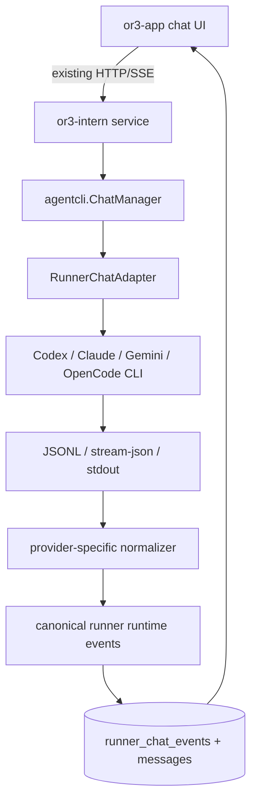

# External Runner Polish Design

## Overview

Keep the current `or3-intern` external runner architecture: Go service, CLI child processes, SQLite-backed `runner_chat_sessions` / `runner_chat_turns` / `runner_chat_events`, and SSE/polling APIs. Borrow T3Code's normalization idea, not its full Node/WebSocket/provider-server stack.

The core design is a thin canonical runtime layer inside `internal/agentcli`: provider-specific parsers convert CLI JSON/stream-json events into a shared Go event model. The existing service continues persisting and streaming events, while `or3-app` can consume richer event payloads without knowing provider protocols.

## Affected areas

- `internal/agentcli/chat_adapters.go`
  - Add Codex, Claude, and Gemini native resume command branches.
  - Add native ref extractors for Codex, Claude, and Gemini.
  - Expand event normalization into canonical payloads while retaining legacy `text_delta`.
- `internal/agentcli/runners.go`
  - Add small Go structs/constants for canonical runtime events if JSON maps become too loose.
  - Keep the existing `RunnerChatAdapter` interface unless implementation proves a helper type is needed.
- `internal/agentcli/registry.go`
  - Enable `ChatNativeSession`, `ChatResume`, and `ChatSessionRefExtractable` only after parser/command tests pass for each runner.
  - Enable `StreamToolEvents` when adapter mappings produce canonical tool lifecycle events.
- `internal/agentcli/chat_manager.go`
  - Preserve native-mode validation and native ref persistence.
  - Ensure `turn.completed` / `runtime.error` equivalents finalize turns consistently with existing completion handling.
- `internal/controlplane` and `cmd/or3-intern/service_runner_chat.go`
  - Expose canonical payloads through existing event list/SSE responses without adding new transport endpoints.
- `or3-app` integration surface
  - Update the app-side runner event adapter separately to render canonical payloads as native chat messages and activity rows.

## Control flow / architecture



Runtime behavior:
1. For native-capable runners, the first turn starts a provider-native session with only the current user message.
2. The adapter parses provider output for a stable native session ref.
3. Later native turns use explicit provider resume plus only the new user message; they do not replay the full OR3 transcript.
4. Replay prompts are reserved for unsupported runners, explicit replay mode, missing refs, or replay-based forks.
5. Provider-specific raw events are converted once into canonical event payloads.
6. The service persists both legacy-compatible event fields and richer canonical payload JSON.
7. The app renders the normalized stream, not Codex/OpenCode/Claude/Gemini-specific shapes.

This is the fix for the input-caching concern: once a provider session ref exists, the token-heavy chat history is no longer sent as prompt text. Provider-native session storage provides continuity, and the OR3 transcript remains local persistence/UI state rather than repeated model input.

## Data and persistence

No schema migration is required for the first implementation because:
- `runner_chat_sessions.native_session_ref` already stores provider session refs.
- `runner_chat_events.payload_json` can carry canonical event payloads.
- `runner_chat_turns` already tracks continuation mode, final text, errors, and job linkage.
- `messages.payload_json` already links user-visible messages to runner chat session/turn metadata.

If later querying by canonical event type becomes necessary, add an indexed `canonical_type` column in a follow-up migration. Do not add it preemptively.

Config changes are not required. Existing runner detection, auth checks, cwd, mode, isolation, timeout, and output limits remain authoritative.

## Interfaces and types

Prefer a minimal Go model close to T3Code's useful contract:

```go
type RuntimeContentStreamKind string

const (
	StreamAssistantText        RuntimeContentStreamKind = "assistant_text"
	StreamReasoningText        RuntimeContentStreamKind = "reasoning_text"
	StreamReasoningSummaryText RuntimeContentStreamKind = "reasoning_summary_text"
	StreamPlanText             RuntimeContentStreamKind = "plan_text"
	StreamCommandOutput        RuntimeContentStreamKind = "command_output"
	StreamFileChangeOutput     RuntimeContentStreamKind = "file_change_output"
	StreamUnknown              RuntimeContentStreamKind = "unknown"
)

type RuntimeEventPayload struct {
	Type       string         `json:"type"`
	StreamKind string         `json:"stream_kind,omitempty"`
	Delta      string         `json:"delta,omitempty"`
	ItemType   string         `json:"item_type,omitempty"`
	Status     string         `json:"status,omitempty"`
	Title      string         `json:"title,omitempty"`
	Detail     string         `json:"detail,omitempty"`
	Data       map[string]any `json:"data,omitempty"`
}
```

Use typed helpers for common events, but keep `RunnerChatEvent.Payload` as `json.RawMessage` for compatibility and forward flexibility.

Recommended canonical item types for OR3-app activity parity:
- `assistant_message` for assistant answer lifecycle.
- `reasoning` for model reasoning/summary updates.
- `plan` for explicit plan/TodoWrite/proposed-plan updates.
- `command_execution` for shell/command tools and command output.
- `file_change` for edits, patches, diffs, and file-change output.
- `mcp_tool_call`, `web_search`, `collab_agent_tool_call`, `dynamic_tool_call`, and `unknown` for provider-specific tools that do not fit command/file categories.

`or3-app` should treat `content.delta` with `assistant_text` as chat message text. Other stream kinds and item lifecycle events should become activity rows, collapsible tool output, plan panels, or diff panels, matching the existing OR3 Intern experience.

## App-facing event contract

Runner chat list and SSE responses keep the existing outer event shape and add canonical detail under `payload`:

- `text_delta`, `runner_output`, `completion`, `assistant`, and existing error/status fields remain valid for older clients.
- `payload.type` is the canonical runtime event name: `content.delta`, `item.started`, `item.updated`, `item.completed`, `request.opened`, `request.resolved`, `turn.plan.updated`, `turn.diff.updated`, `turn.completed`, `runtime.warning`, or `runtime.error`.
- `content.delta` uses `stream_kind` to route text: `assistant_text` appends to the assistant message, reasoning streams update reasoning state, and command/file streams render as activity output.
- Item lifecycle payloads use `item_type`, `status`, `title`, `detail`, and optional `data` so the app can render command/file/MCP/search/subagent/dynamic tool rows without knowing provider-specific JSON.
- Raw provider diagnostics are sanitized and bounded before they are stored under `payload.raw`; app renderers should prefer the canonical fields and treat `raw` as debug-only.

`or3-app` now normalizes these canonical payloads in its runner stream adapter so external runners surface assistant text, reasoning, tool calls, command output, file changes, requests, warnings, errors, and turn completion through the same message/activity path as OR3 Intern.

## Failure modes and safeguards

- Invalid or unknown provider JSON: keep bounded `runner_output`; do not fail the turn solely because an optional canonical parse failed.
- Missing native ref after first turn: keep replay mode until a ref appears.
- Accidental transcript replay in native mode: tests must fail if a native resume command uses `ReplayPrompt` instead of `UserMessage` once `NativeSessionRef` is set.
- Native resume command fails with recoverable missing-session error: mark the turn failed initially; consider automatic replay retry only after tests prove provider error messages are stable.
- Provider emits duplicate text: adapters must track known delta patterns and avoid converting full-message snapshots into repeated deltas.
- Provider requests approval/user input: surface `request.opened` / `user-input.requested` as activity first; command response plumbing can remain a later enhancement if current approval flow cannot answer provider-native requests.
- Large tool output: preserve existing output bounds and artifact/spill behavior; canonical payloads must use summaries/details, not unlimited raw logs.

## Testing strategy

Use Go `testing` with fixture-driven adapter tests.

- Unit tests in `internal/agentcli/chat_adapters_test.go` and adjacent files:
  - Command args for Codex/Claude/Gemini native resume vs first-turn replay.
  - Native ref extraction fixtures for Codex `thread.started`, Claude `system/init`, Gemini `init`, and noisy streams.
  - Canonical event mapping for assistant text, reasoning, command output, file-change output, plan updates, approvals, and errors.
- Manager tests in `internal/agentcli/chat_manager_test.go`:
  - Native ref persistence remains one-time and session-scoped.
  - Unsupported native mode still returns `ErrUnsupportedNativeSession`.
  - Turn finalization remains compatible with legacy `completion` events.
- Service/controlplane tests:
  - SSE/list responses include canonical payload JSON and keep legacy fields.
  - Reload/reconnect can reconstruct active/completed turn state.
- Manual smoke tests:
  - Two concurrent sessions per runner do not cross-contaminate.
  - Second turn uses native resume and understands first-turn context without replaying full transcript.
