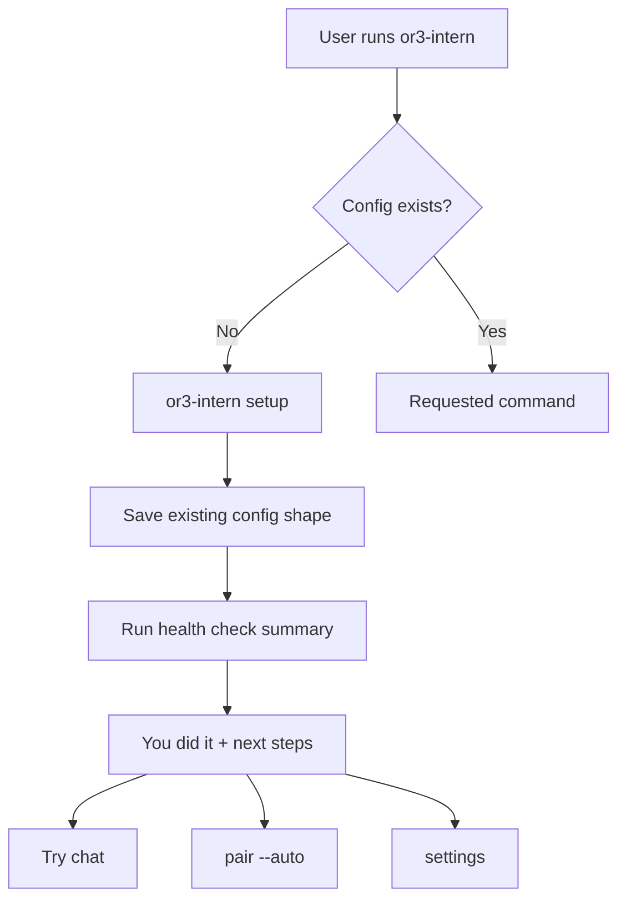
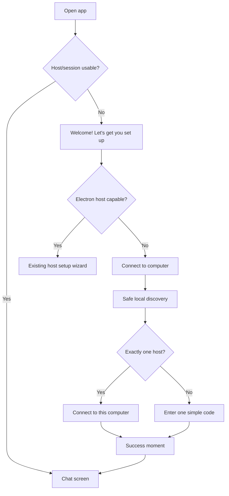
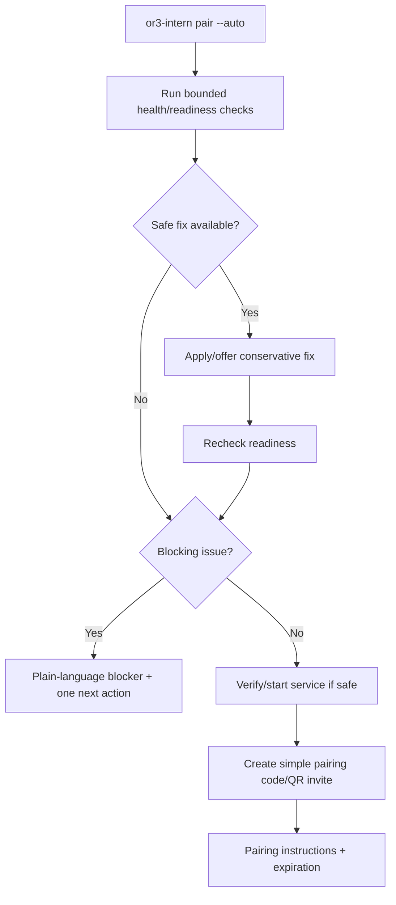

# Grandma UX Simplification Design

## Overview

The implementation should create one normal-user path through OR3:

1. Open CLI or app.
2. See a clear welcome/setup entry point.
3. Run one setup flow.
4. Pair through auto-discovery or one simple code.
5. Get a success moment.
6. Start chatting.
7. Find only a small number of settings, with advanced controls behind a gate.

This design deliberately does **not** remove OR3’s advanced capabilities. Instead, it changes the default routing, help text, app cards, and command aliases so normal users see one path while operators can still reach raw config, legacy pairing, custom integrations, health filters, and existing scriptable commands.

It fits the current architecture because `or3-intern` already owns setup commands, health/doctor checks, pairing prerequisites, service startup, config persistence, and CLI help. `or3-app` already has an Electron host setup wizard, pairing pages, settings pages, and route-level empty states that can be reused rather than replaced.

## Affected areas

### `or3-intern`

- `cmd/or3-intern/main.go`
  - Route new `health` command and `pair --auto` entry points.
  - Keep `doctor`, `init`, `configure`, `connect-device`, `devices`, and lower-level pairing commands as compatibility/advanced paths.

- `cmd/or3-intern/setup.go` or existing setup-related files
  - Make setup the canonical first-run path.
  - Add success/next-step output after setup.
  - Persist or infer setup milestone state using existing config/DB patterns.

- `cmd/or3-intern/init.go`
  - Delegate to the canonical setup engine or clearly label as compatibility.
  - Preserve existing non-interactive behavior where scripts rely on it.

- `cmd/or3-intern/configure.go` and `cmd/or3-intern/configure_tui.go`
  - Move from normal setup path to advanced/manual configuration in help/copy.
  - Keep `--section` compatibility.

- `cmd/or3-intern/doctor.go` and `internal/doctor`
  - Add `health` as the normal command wrapper around the existing structured doctor engine.
  - Make default behavior equivalent to check/readiness.
  - Keep advanced filters and `doctor` alias.

- `cmd/or3-intern/connect_device_cmd.go`, pairing command files, and service pairing helpers
  - Add or route to `pair --auto`.
  - Reuse existing local pairing flow, but precede it with readiness checks and safe fixes.
  - Hide raw request IDs/tokens in default output.

- `cmd/or3-intern/help.go` or root help rendering
  - Group commands by normal/setup/advanced.
  - Prefer `setup`, `chat`, `health`, `pair --auto`, `settings`, and `serve` in normal help.

- `internal/uxstate`, `internal/uxcopy`, `internal/uxformat`
  - Shape default settings sections and milestone copy.
  - Keep advanced labels precise.

- `internal/config`
  - Preserve existing config structure and `--section` keys.
  - Add any optional milestone flags only if they can be backward-compatible and safely defaulted.

- `internal/db`
  - Store first-chat or first-pairing milestone state only if config is not the right place. Use additive tables/keys and existing migration patterns.

- Docs:
  - `README.md`
  - `docs/getting-started.md`
  - `docs/cli-reference.md`
  - `docs/configuration-reference.md`
  - app integration docs under `docs/v1/user-guide/app-integration/`

### `or3-app`

- `app/pages/index.vue` or chat landing components
  - Render a welcome/setup card when no host/session is connected.
  - Route connected users to chat as today.

- `app/pages/pair.vue`, `app/pages/settings/pair.vue`, and pairing components such as `SecurePairingCard.vue`, `HostConnectionCard.vue`, or related connection cards
  - Prefer auto-discovery first, then one simple code flow.
  - Move legacy/manual methods behind Advanced.

- `app/components/ElectronHostSetupWizard.vue`
  - Reuse for Electron first-run host setup rather than creating a second app setup flow.
  - Add setup completion success moment if not already present.

- Settings pages/components such as `app/pages/settings/index.vue`, `app/pages/settings/section/[section].vue`, and Simple Settings components
  - Collapse visible settings to at most five sections plus Advanced.
  - Move observability/logs/raw config/developer tools behind Advanced or Developer Mode.

- Chat message/composer flow components
  - Track first successful chat completion and show a one-time success/next-step prompt.

- App local storage or existing composables for host/session state
  - Store one-time milestone dismissal/completion flags without introducing a new persistence system.

## Control flow / architecture

### Normal first-run CLI flow



The setup engine remains the source of truth for first-run defaults. `init` and `configure` should not be removed in the first pass; they should delegate, redirect, or move to advanced help.

### Normal app first-run flow



The app should not display a normal chat box as the primary state when sending cannot work. The welcome card is a routing and confidence layer, not a new backend mode.

### `pair --auto` flow



`pair --auto` should reuse the structured health engine rather than duplicating readiness logic. It should avoid broad network scanning and never auto-widen exposure. Safe fixes include local directory/key/default repairs and loopback/private-mode consistency; unsafe fixes require explicit confirmation or are manual-only.

## Data and persistence

### SQLite changes

No major schema change is required for setup, health aliasing, help grouping, or settings section reduction.

Potential additive storage options:

- A small KV-style milestone entry in an existing app/local store for app-only milestones:
  - `welcome_seen`
  - `pairing_success_seen`
  - `first_chat_success_seen`
- If CLI milestone state needs persistence independent of config, use an additive SQLite KV row or existing metadata table rather than a new table.

Avoid storing secrets, pairing tokens, request IDs, or invite contents in milestone state.

### Config/env changes

Prefer no new config keys for the first pass. If a setting is needed to control advanced/default visibility, it should be optional, default to normal-user mode, and preserve unknown fields.

Existing config sections remain the source of truth:

- provider/model settings remain in current provider/config structures;
- safety settings continue to map to existing runtime/hardening fields;
- pairing/service settings remain in existing service/auth/pairing structures;
- raw advanced sections remain addressable by existing `--section` names.

### Session and memory implications

- First-chat success should be scoped to the user/app install or CLI config, not to every session key.
- Chat history, session keys, memory retrieval, embeddings, and document indexing should not change as part of this plan.
- The app welcome card should depend on connection/session capability, not on memory state.

## Interfaces and types

### Health command compatibility

Suggested CLI behavior:

```text
or3-intern health          # default check
or3-intern health --check  # explicit alias for default check
or3-intern health --fix    # safe repairs
or3-intern health --json   # machine-readable report
or3-intern doctor ...      # compatibility alias, advanced/deprecated copy
```

Implementation approach:

```go
type healthArgs struct {
    Check bool
    Fix bool
    JSON bool
    Advanced bool
    // advanced flags continue to exist but are hidden from short help
}

func runHealthCommand(cfgPath string, cfg config.Config, validationError string, args []string, stdin io.Reader, stdout, stderr io.Writer) error {
    return runDoctorCommand(cfgPath, cfg, validationError, normalizeHealthArgs(args), stdin, stdout, stderr)
}
```

`normalizeHealthArgs` should map omitted subcommands to the default readiness check and preserve advanced doctor flags.

### Pair auto command

Suggested CLI:

```text
or3-intern pair --auto
or3-intern pair --auto --name "Brendon's iPhone"
or3-intern pair --auto --role viewer|operator
or3-intern pair --manual       # advanced fallback
```

Suggested input/options:

```go
type pairAutoOptions struct {
    DeviceName string
    Role string
    Manual bool
    JSON bool
    NoFix bool
}
```

Suggested result:

```go
type pairAutoResult struct {
    Status string
    DeviceName string
    Role string
    Code string
    ExpiresAt time.Time
    AppInstruction string
    AppliedFixes []string
    NextAction string
}
```

Default human output should show only display fields. JSON output may include stable machine fields but must still omit secrets unless explicitly required for an internal handoff.

### App setup capability response

If the existing app bootstrap route can provide this, extend it additively. Otherwise add a small endpoint in the consumer facade plan.

```go
type appSetupState struct {
    Connected bool `json:"connected"`
    NeedsSetup bool `json:"needs_setup"`
    CanHostLocally bool `json:"can_host_locally"`
    RecommendedAction string `json:"recommended_action"` // setup_host|pair|chat
    CompletedMilestones []string `json:"completed_milestones,omitempty"`
}
```

`or3-app` can render the welcome card from this state plus existing local Electron/mobile capabilities.

### Settings sections

Use a display-first section model for normal settings:

```go
type visibleSettingsSection struct {
    Key string `json:"key"`
    Title string `json:"title"`
    Description string `json:"description"`
    Priority int `json:"priority"`
    Advanced bool `json:"advanced"`
}
```

Default visible sections should be capped at five:

1. `ai_service`
2. `workspace`
3. `safety`
4. `connected_apps_devices`
5. `appearance_preferences` where supported, otherwise `memory_search` only if it is truly user-actionable
6. `advanced` as the explicit gate, not counted as a normal section

## Failure modes and safeguards

### Invalid or partial setup

- Setup should run a bounded health summary after saving.
- If setup cannot complete, it should leave existing config untouched or write only validated staged changes.
- Output should include one next action rather than a long command list.

### Pairing auto-repair risk

- `pair --auto` must not silently bind a service to public interfaces.
- Trusted origins/CIDRs should not be broadened automatically beyond safe local/private assumptions.
- If remote/mobile reachability requires Tailscale, firewall changes, or public DNS, the command should explain the manual step rather than guessing.

### Discovery ambiguity

- If app discovery finds multiple hosts, do not auto-connect; show named choices or fall back to code.
- If discovery times out, fall back to code quickly.
- If discovery is unavailable on a platform, skip directly to code with reassuring copy.

### Secret leakage

- Default output must not print service secrets, bearer tokens, request IDs, raw device IDs, invite internals, fingerprints, or CIDR details.
- Logs and advanced/debug output should redact values unless explicit machine-readable output needs non-secret stable identifiers.

### Compatibility drift

- `doctor`, `init`, `configure`, `connect-device`, old pairing subcommands, existing config sections, and internal routes remain available during rollout.
- Docs and help may de-emphasize old paths before removal.
- Tests should verify old entry points still execute or redirect as intended.

### Settings over-collapse

- Do not delete advanced settings; move them behind gates.
- The advanced gate should be searchable/reachable for operators.
- Default settings should remain useful: AI service, workspace, safety, connected apps/devices, and appearance/preferences cover the normal jobs.

### Destructive action safety

- App confirmations should include visible names and consequences.
- CLI confirmations should be skipped only when explicitly non-interactive/force flags are used.
- Undo should be offered only where the backend can actually undo.

## Testing strategy

### Unit tests

- CLI argument parsing for `health`, `doctor` alias behavior, and hidden/advanced help.
- `pair --auto` option parsing and readiness-to-output mapping.
- Settings section builders enforcing at most five normal sections.
- Success milestone copy builders avoiding banned advanced terms.
- Confirmation guards for destructive actions.

### SQLite-backed tests

- Any milestone persistence stored in SQLite or config-adjacent storage.
- Backward compatibility for existing config loading and `--section` keys.
- Pairing state creation if `pair --auto` reuses existing pairing DB tables.

### Integration tests

- `or3-intern setup` happy path writes compatible config and prints success + next steps.
- `or3-intern health` and `or3-intern doctor` both evaluate the same report.
- `or3-intern pair --auto` handles ready, auto-fixable, and blocked configurations.
- Existing `connect-device`/manual pairing paths still work or redirect safely.

### App tests

- Unpaired app renders welcome card instead of a broken chat entry point.
- Electron welcome action routes to host setup wizard.
- Web/mobile welcome action routes to simplified pairing.
- Pairing flow prefers discovery and falls back to code.
- Default settings renders no more than five sections plus Advanced.
- First successful chat shows one-time success/next-step prompt.
- Destructive actions require confirmation.

### Regression checks

- No default setup/pairing/health/success output leaks raw tokens or secrets.
- Existing advanced CLI commands remain documented/tested as compatibility paths.
- App works against older backends by falling back gracefully if new capability fields are missing.
