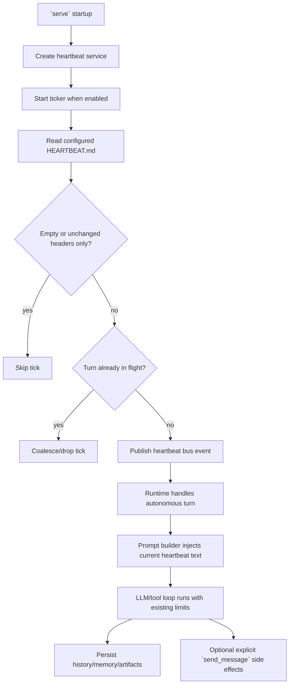

# Overview

`or3-intern` already has most of the primitives needed for heartbeat automation:

- `HeartbeatConfig` already exists in `internal/config/config.go`
- `HEARTBEAT.md` content is already supported by `internal/agent/prompt.go` for autonomous turns
- the bus/runtime pipeline already handles cron, webhook, and file-change autonomous events
- runtime already enforces bounded tool loops, artifacts, and memory behavior

The missing piece is a real scheduler that publishes heartbeat turns and a small runtime adjustment so those turns are autonomous but not auto-delivered like user/channel replies.

The design therefore adds a lightweight `internal/heartbeat` service, extends event typing to distinguish heartbeat work, and refreshes heartbeat prompt text per autonomous turn so file edits apply without restart.

# Affected areas

- `internal/config/config.go`
  - extend `HeartbeatConfig` with any minimal additional fields such as `SessionKey`
- `internal/bus/bus.go`
  - add a heartbeat event type if using a dedicated event discriminator
- `internal/heartbeat/service.go`
  - new ticker-driven service that publishes coalesced heartbeat events
- `cmd/or3-intern/main.go`
  - construct/start/stop the heartbeat service during `serve`
- `internal/agent/runtime.go`
  - classify heartbeat turns as autonomous and suppress unintended auto-delivery
- `internal/agent/prompt.go`
  - refresh or override heartbeat text dynamically for autonomous turns
- `README.md`
  - document heartbeat configuration and operating model
- tests in `internal/heartbeat`, `internal/agent`, `internal/config`, and maybe `cmd/or3-intern`

# Control flow / architecture



## Service behavior

The heartbeat service should be intentionally simple:

- sleep on a configured interval
- read the current heartbeat file
- skip when the file is missing, unreadable, or effectively empty
- publish one autonomous event when work should be checked
- avoid piling up multiple concurrent heartbeat turns

This fits the repo better than duplicating nanobot's separate decision and execution callbacks.

## Event model

Preferred v1 approach:

- add `bus.EventHeartbeat`
- publish events with:
  - `Type: EventHeartbeat`
  - `SessionKey: cfg.Heartbeat.SessionKey` or default
  - `Channel: "system"` or another non-delivery pseudo-channel
  - `From: "heartbeat"`
  - `Message: fixed seed instruction such as "Review HEARTBEAT.md and execute any active recurring tasks."`
  - `Meta: {"heartbeat": true}`

Using a distinct event type is cleaner than overloading cron and makes runtime behavior easier to test.

## Prompt freshness

Today `cmd/or3-intern/main.go` loads `HeartbeatText` once at startup. That is not enough for a live heartbeat service because edits to `HEARTBEAT.md` would be stale until restart.

A repo-aligned fix is to keep the existing builder structure but allow per-turn heartbeat text refresh. Two viable options:

1. `Builder` stores the heartbeat file path and reloads it only for autonomous turns.
2. Runtime passes a heartbeat-text override into prompt building for heartbeat events.

The smaller and more generally useful option is to let `Builder` reload heartbeat text on autonomous turns from the configured file path / workspace fallback. That also benefits cron/webhook/file-watch events.

## Delivery behavior

Heartbeat turns should not use the normal assistant reply delivery path because there is no user waiting on a heartbeat channel.

Runtime should therefore:

- treat heartbeat turns as autonomous for prompt construction
- persist assistant output if produced
- skip default reply delivery for heartbeat events
- rely on explicit tool calls like `send_message` for any external notification

This avoids accidental delivery failures or noisy CLI/system output while preserving useful side effects.

# Data and persistence

## SQLite changes

No schema migration is required.

Heartbeat work can reuse normal message persistence under its configured session key. Existing history, consolidation, and memory retrieval flows already work on arbitrary session keys.

## Config changes

Existing config already has:

```go
type HeartbeatConfig struct {
    Enabled         bool   `json:"enabled"`
    IntervalMinutes int    `json:"intervalMinutes"`
    TasksFile       string `json:"tasksFile"`
}
```

Add the smallest useful extension:

```go
type HeartbeatConfig struct {
    Enabled         bool   `json:"enabled"`
    IntervalMinutes int    `json:"intervalMinutes"`
    TasksFile       string `json:"tasksFile"`
    SessionKey      string `json:"sessionKey"`
}
```

Recommended default:

- `SessionKey = "heartbeat:default"`

This keeps behavior explicit and avoids mixing background task history into the CLI default session.

Optional future knobs like `runOnStart`, `channel`, or `notify` should stay out of v1 unless clearly needed.

## Session implications

Heartbeat turns operate under a dedicated session key. This means:

- history and memory remain stable across ticks
- the agent can maintain ongoing background task context
- users can still use existing scope linking if they want heartbeat context shared elsewhere

# Interfaces and types

## Heartbeat service

Add a small service package:

```go
type Service struct {
    Config     config.HeartbeatConfig
    Bus        *bus.Bus
    inFlight   atomic.Bool
    cancel     context.CancelFunc
}

func New(cfg config.HeartbeatConfig, eventBus *bus.Bus) *Service
func (s *Service) Start(ctx context.Context)
func (s *Service) Stop()
```

Key behavior:

- no-op when disabled
- coalesced trigger semantics
- bounded file checks per tick
- no provider dependency inside the service itself

## Runtime changes

`internal/agent/runtime.go` should classify heartbeat like other autonomous work:

- autonomous prompt mode enabled
- normal reply delivery suppressed
- persistence, tools, consolidation, and artifact spill remain intact

## Prompt builder changes

`internal/agent/prompt.go` should load the latest heartbeat text for autonomous turns from configured path/workspace fallback, or accept a runtime-provided override. The implementation should avoid rereading unrelated bootstrap files on every user turn.

# Failure modes and safeguards

- Missing heartbeat file
  - skip tick quietly with bounded logging
- Empty/comment-only heartbeat file
  - skip provider work entirely
- Bus full
  - log and coalesce/drop the tick instead of blocking indefinitely
- In-flight heartbeat turn
  - do not enqueue another overlapping run
- Runtime/tool failure
  - use existing runtime error handling; the next tick still proceeds normally
- Misconfigured session key
  - fall back to a stable default during config normalization
- Unintended reply delivery
  - suppress default delivery path for heartbeat events

# Testing strategy

Use Go `testing` with focused coverage.

## Unit tests

- `internal/heartbeat/service_test.go`
  - start/stop behavior
  - tick skipping for disabled/missing/empty files
  - non-overlap / coalescing behavior
  - published event shape and session key
- `internal/config/config_test.go`
  - default `HeartbeatConfig` values and session-key normalization

## Runtime / prompt tests

- `internal/agent/prompt_test.go`
  - heartbeat text refresh applies to autonomous turns after file edits
- `internal/agent/runtime_test.go`
  - heartbeat events are treated as autonomous
  - heartbeat events do not auto-deliver a default assistant reply
  - normal user/channel events remain unchanged

## Startup integration tests

- `cmd/or3-intern`-level tests where practical to ensure `serve` wires the service only when enabled
- regression tests confirming cron, webhook, and file-watch startup behavior is unchanged
