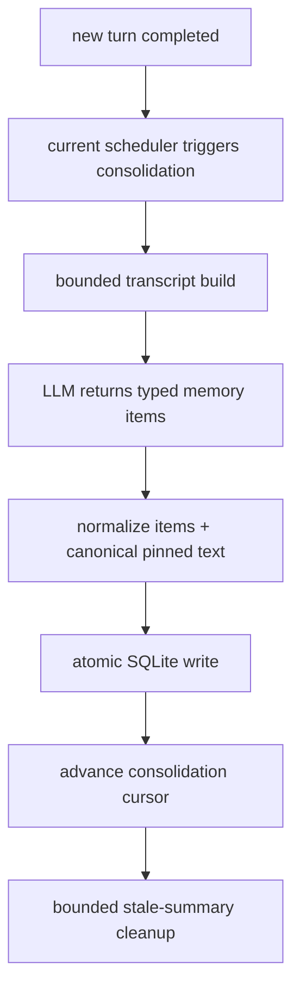

# Overview

This design keeps the current OR3 memory architecture intact: `memory_notes` remains the main long-term store, `memory_pinned` remains the always-included canonical store, consolidation still runs through the current bounded scheduler, and prompt assembly still happens in `internal/agent/prompt.go`.

The lightweight upgrade is:

1. add note metadata directly onto `memory_notes`,
2. have consolidation emit a structured summary plus typed durable items,
3. let retrieval scoring read that metadata,
4. log note usage when retrieved notes make it into prompts, and
5. trim stale summary and episode rows with a bounded rule.

This fits the repo because it extends the current SQLite tables, retrieval helpers, and prompt builder instead of creating another service or memory stack.

# Affected areas

- `internal/db/db.go`
  - Add additive `memory_notes` columns and any small supporting index for scope/kind/status cleanup queries.
- `internal/db/store.go`
  - Extend note row/query structs with metadata, update vector/FTS search joins, add usage-touch helpers, and add a bounded stale-summary cleanup helper.
- `internal/memory/consolidate.go`
  - Change consolidation output parsing from plain summary-only JSON to structured typed items while preserving fallback behavior and the current scheduler entry points.
- `internal/memory/retrieve.go`
  - Extend `Retrieved` with metadata and apply small score adjustments for kind, importance, usage, and age.
- `internal/agent/prompt.go`
  - Add Memory Digest formatting, keep the current prompt section layout mostly intact, and log note usage after retrieved notes are selected for the prompt.
- `internal/db/db_test.go`, `internal/memory/consolidate_test.go`, `internal/memory/retrieve_test.go`, `internal/agent/prompt_test.go`
  - Cover migrations, structured consolidation writes, ranking behavior, digest formatting, and usage logging.

# Control flow / architecture

## Prompt-time retrieval flow

1. `Builder.BuildWithOptions` resolves the scope key and loads pinned memory as it does today.
2. The builder embeds the user message and calls the existing `memory.Retriever`.
3. Retrieval still combines vector and FTS candidates, but candidate rows now include note metadata from `memory_notes`.
4. The retriever computes the current hybrid score, then applies small bounded metadata adjustments:
   - active > stale,
   - durable kinds such as fact/procedure slightly above rolling summary/context,
   - higher `importance` gets a small boost,
   - modest reuse boosts via capped `use_count`,
   - age decays from `last_used_at` when present, otherwise `created_at`,
   - old summaries and episodes get a small demotion.
5. The builder formats:
   - `Pinned Memory` as today,
   - a new short `Memory Digest` built from top active facts, preferences, goals, and procedures,
   - the existing `Retrieved Memory` detail block.
6. After the retrieved notes are finalized for prompt inclusion, the builder performs a best-effort usage update for those note IDs.

## Consolidation flow

1. The existing runtime and scheduler still call `Consolidator.RunOnce`.
2. The consolidator builds the bounded transcript exactly as today.
3. The LLM prompt changes from summary-only output to one JSON object with:
   - `summary`,
   - `facts`,
   - `preferences`,
   - `goals`,
   - `procedures`.
4. Parsed items are normalized into a small set of note writes:
   - the summary becomes one `kind='summary'` note,
   - each fact, preference, goal, or procedure becomes its own typed note,
   - each note defaults to `status='active'`,
   - `importance` is bounded to a small numeric range and can remain optional in the model output.
5. The DB write path inserts those notes atomically, updates tiny canonical pinned entries only for ultra-stable items, and advances `last_consolidated_msg_id`.
6. After a successful write, a bounded cleanup helper marks old, never-used summary or episode rows stale in the same scope.



# Data and persistence

## SQLite changes

Additive `memory_notes` columns only:

```sql
ALTER TABLE memory_notes ADD COLUMN kind TEXT NOT NULL DEFAULT 'note';
ALTER TABLE memory_notes ADD COLUMN status TEXT NOT NULL DEFAULT 'active';
ALTER TABLE memory_notes ADD COLUMN importance REAL NOT NULL DEFAULT 0;
ALTER TABLE memory_notes ADD COLUMN use_count INTEGER NOT NULL DEFAULT 0;
ALTER TABLE memory_notes ADD COLUMN last_used_at INTEGER NOT NULL DEFAULT 0;
```

Recommended supporting index:

```sql
CREATE INDEX IF NOT EXISTS memory_notes_scope_kind_status_created_at
ON memory_notes(session_key, kind, status, created_at DESC);
CREATE INDEX IF NOT EXISTS memory_notes_session_key ON memory_notes(session_key);
CREATE INDEX IF NOT EXISTS memory_notes_kind ON memory_notes(kind);
CREATE INDEX IF NOT EXISTS memory_notes_status ON memory_notes(status);
```

Backfill rules stay intentionally small:

- rows with `tags='consolidation'` or a consolidation tag substring become `kind='summary'`,
- all legacy rows default to `status='active'`,
- `importance` defaults to a neutral low value,
- usage counters start at zero.

No new tables, no new vector store, and no new scheduler tables are needed.

## Config and env

No new config or env surface is required in the first pass. The feature can use conservative in-code constants for:

- allowed `kind` and `status` values,
- score adjustments,
- stale-summary age/use thresholds,
- cleanup batch size.

This keeps config loading backward compatible and avoids new operator complexity.

## Session and scope implications

- Memory scope rules stay unchanged: retrieval still merges global memory with the resolved session scope.
- Usage logging and cleanup must operate on the resolved scope key, not just the physical session key.
- `memory_pinned` remains scope-keyed and continues to hold canonical long-term memory such as `long_term_memory`.

# Interfaces and types

Use small Go-native extensions rather than new packages or abstractions.

Possible note metadata model:

```go
type MemoryKind string

const (
    MemoryKindNote       MemoryKind = "note"
    MemoryKindSummary    MemoryKind = "summary"
    MemoryKindFact       MemoryKind = "fact"
    MemoryKindPreference MemoryKind = "preference"
    MemoryKindGoal       MemoryKind = "goal"
    MemoryKindProcedure  MemoryKind = "procedure"
    MemoryKindEpisode    MemoryKind = "episode"
)

type MemoryStatus string

const (
    MemoryStatusActive     MemoryStatus = "active"
    MemoryStatusStale      MemoryStatus = "stale"
    MemoryStatusSuperseded MemoryStatus = "superseded"
)
```

Extend retrieval rows instead of inventing a second result type:

```go
type Retrieved struct {
    Source     string
    ID         int64
    Text       string
    Score      float64
    Kind       string
    Status     string
    Importance float64
    UseCount   int
    CreatedAt  int64
    LastUsedAt int64
}
```

Structured consolidation output can stay compact:

```go
type consolidationOutput struct {
    Summary     string   `json:"summary"`
    Facts       []string `json:"facts"`
    Preferences []string `json:"preferences"`
    Goals       []string `json:"goals"`
    Procedures  []string `json:"procedures"`
}
```

Likely DB helpers:

```go
func (d *DB) TouchMemoryNotes(ctx context.Context, scopeKey string, ids []int64, usedAt int64) error
func (d *DB) CleanupStaleMemoryNotes(ctx context.Context, scopeKey string, nowMS int64, limit int) (int, error)
```

To keep the current consolidation transaction shape, either:

- extend `ConsolidationWrite` to carry multiple note writes, or
- add one small batch-oriented helper that still performs a single atomic transaction.

Either option is acceptable as long as cursor advance, note inserts, and pinned updates stay atomic.

# Failure modes and safeguards

- **Migration failure**
  - Follow the existing `tableHasColumn` migration pattern so old DBs upgrade incrementally.
- **Malformed structured consolidation output**
  - Fall back to a single summary-style note or cursor-only advancement instead of aborting the runtime turn.
- **Over-aggressive ranking**
  - Keep metadata boosts small so vector/FTS relevance still dominates.
- **Prompt inflation**
  - Cap Memory Digest length and reuse current `BootstrapMaxChars` / `BootstrapTotalMaxChars` truncation.
- **Usage-write failure**
  - Treat note usage logging as best-effort; prompt building should still succeed.
- **Cleanup deleting useful notes**
  - Limit cleanup to summary or episode rows, require age plus zero usage, and cap rows touched per pass.
- **Scope leakage**
  - Reuse current scope resolution helpers so global and linked-session memory remain isolated from unrelated sessions.

# Testing strategy

- **SQLite-backed migration tests**
  - verify new `memory_notes` columns appear on existing DBs,
  - verify legacy consolidation-tag rows backfill to `kind='summary'`,
  - verify reopen compatibility.
- **DB helper tests**
  - usage touch increments `use_count` and `last_used_at`,
  - cleanup only affects stale summary rows in the same scope,
  - vector/FTS queries surface metadata fields correctly.
- **Retriever tests**
  - higher-importance active facts outrank otherwise similar stale summaries,
  - reuse boosts are capped and deterministic,
  - stale penalties do not break hybrid retrieval ordering.
- **Consolidation tests**
  - structured JSON parses into summary, fact, preference, goal, and procedure note writes,
  - malformed output falls back safely,
  - pinned canonical memory remains limited to ultra-stable content.
- **Prompt tests**
  - Memory Digest section appears when retrieved notes exist,
  - Memory Digest stays bounded and favors top active facts/preferences/goals/procedures,
  - Retrieved Memory remains present,
  - usage logging only touches prompted note IDs.
