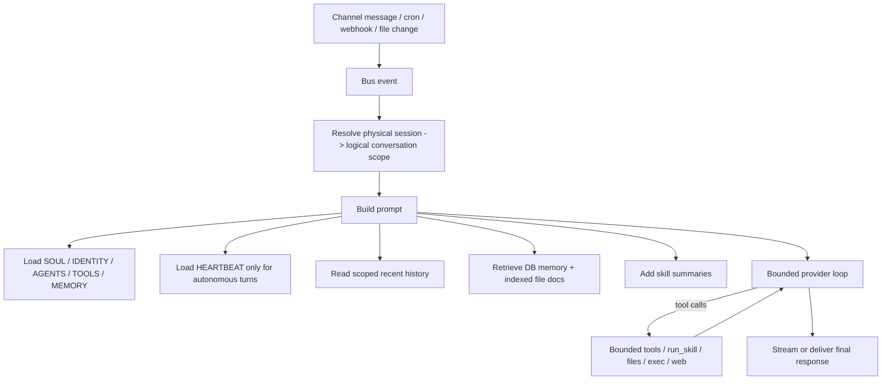

# Overview

Implement a lightweight parity layer in the existing Go runtime rather than trying to imitate OpenClaw with new services. The design adds three durable building blocks and two ephemeral ones:

- durable SQLite-backed conversation scopes for cross-channel continuity
- durable SQLite-backed indexed memory/context documents for file retrieval
- durable skill metadata with optional manifest-declared entrypoints
- an ephemeral trigger service for webhooks and file polling
- an optional streaming delivery path layered onto the existing provider/runtime/channel flow

This fits the current architecture because `or3-intern` already has a bounded runtime loop, a single SQLite store, per-channel session keys, prompt construction in `internal/agent`, and a small channel manager in `internal/channels`. The work extends those pieces instead of replacing them.

# Affected areas

- `internal/config/config.go`
  - Add file-path, document-index, skill-runtime, webhook, and file-watch config with safe defaults and env overrides.
- `cmd/or3-intern/main.go`
  - Ensure/load the new bootstrap files, construct the new services, and wire streaming-capable delivery where available.
- `internal/agent/prompt.go`
  - Add `IDENTITY.md`, `MEMORY.md`, conditional `HEARTBEAT.md`, indexed document excerpts, and richer skill summaries to the prompt.
- `internal/agent/runtime.go`
  - Resolve logical conversation scope before history/memory lookup and add a streaming-capable provider path.
- `internal/db/db.go`
  - Add SQLite schema for conversation links and indexed document metadata/FTS.
- `internal/db/store.go`
  - Add helpers for scope resolution, scoped history reads, session linking, and indexed document upserts/lookups.
- `internal/memory`
  - Add a small doc indexer/retriever that reuses current ranking ideas without turning the whole workspace into a search engine.
- `internal/skills/skills.go`
  - Extend scanning to parse lightweight skill manifests and summaries.
- `internal/tools`
  - Keep `read_skill`, add `run_skill`, and keep all execution inside current safety limits.
- `internal/cron/cron.go`
  - Add optional target session/scope routing while preserving current job compatibility.
- `internal/bus/bus.go`
  - Add explicit webhook/file-change event types or equivalent trigger metadata.
- `internal/channels`
  - Add an optional streaming delivery interface, implemented first by CLI and left as final-only fallback for the other channels.
- `internal/triggers`
  - New small package for webhook ingress and file polling; justified because both features publish to the same bus but do not belong in `internal/cron` or channel packages.

# Control flow / architecture



End-to-end behavior:

1. Every inbound event still lands on the existing bus.
2. Runtime resolves the event’s physical session key to a logical conversation scope key.
3. Prompt assembly uses:
   - direct bootstrap files from disk
   - scoped recent history across linked sessions
   - scoped pinned memory / memory notes
   - indexed file excerpts from configured memory/context roots
   - skill name + summary metadata
4. The provider runs through the existing bounded tool loop.
5. If the provider/channel pair supports streaming, deltas are emitted incrementally. Otherwise the current final-delivery behavior is preserved.
6. Autonomous events include `HEARTBEAT.md` guidance and route to the configured scope key instead of always using `cli:default`.

# Data and persistence

## SQLite additions

### 1. Conversation scope links

Add a small table that maps physical session keys to a logical scope key:

```sql
CREATE TABLE IF NOT EXISTS session_links(
    session_key TEXT PRIMARY KEY,
    scope_key TEXT NOT NULL,
    linked_at INTEGER NOT NULL,
    metadata_json TEXT NOT NULL DEFAULT '{}'
);
CREATE INDEX IF NOT EXISTS session_links_scope_key
    ON session_links(scope_key);
```

Behavior:
- If a session has no row, its logical scope is its own session key.
- Raw messages remain stored with the physical session key in `messages`.
- Reads for history and memory resolve through `scope_key`.

This gives cross-channel continuity without rewriting or duplicating message rows.

### 2. Indexed file documents

Add a table for bounded, opt-in file indexing:

```sql
CREATE TABLE IF NOT EXISTS memory_docs(
    id INTEGER PRIMARY KEY AUTOINCREMENT,
    scope_key TEXT NOT NULL,
    path TEXT NOT NULL,
    kind TEXT NOT NULL,
    title TEXT NOT NULL DEFAULT '',
    summary TEXT NOT NULL DEFAULT '',
    text TEXT NOT NULL,
    embedding BLOB,
    hash TEXT NOT NULL,
    mtime_ms INTEGER NOT NULL,
    size_bytes INTEGER NOT NULL,
    active INTEGER NOT NULL DEFAULT 1,
    updated_at INTEGER NOT NULL,
    UNIQUE(scope_key, path)
);
CREATE INDEX IF NOT EXISTS memory_docs_scope_path
    ON memory_docs(scope_key, path);
CREATE VIRTUAL TABLE IF NOT EXISTS memory_docs_fts
    USING fts5(title, summary, text, content='memory_docs', content_rowid='id');
```

Behavior:
- Only configured roots are indexed.
- Embeddings are optional and can be disabled entirely or limited by file size.
- `active=0` supports clean deactivation when a file disappears without destructive table rewrites.

## Config changes

Additive config only. Suggested new fields:

```go
type Config struct {
    IdentityFile string `json:"identityFile"`
    MemoryFile   string `json:"memoryFile"`
    DocIndex     DocIndexConfig `json:"docIndex"`
    Skills       SkillsConfig   `json:"skills"`
    Triggers     TriggerConfig  `json:"triggers"`
}

type DocIndexConfig struct {
    Enabled         bool     `json:"enabled"`
    Roots           []string `json:"roots"`
    MaxFiles        int      `json:"maxFiles"`
    MaxFileBytes    int      `json:"maxFileBytes"`
    MaxChunks       int      `json:"maxChunks"`
    EmbedMaxBytes   int      `json:"embedMaxBytes"`
    RefreshSeconds  int      `json:"refreshSeconds"`
    RetrieveLimit   int      `json:"retrieveLimit"`
}

type SkillsConfig struct {
    EnableExec        bool `json:"enableExec"`
    MaxRunSeconds     int  `json:"maxRunSeconds"`
}

type TriggerConfig struct {
    Webhook   WebhookConfig   `json:"webhook"`
    FileWatch FileWatchConfig `json:"fileWatch"`
}
```

Additional notes:
- `HEARTBEAT.md` can continue to use `Heartbeat.TasksFile` to avoid another breaking rename.
- `CronPayload` gains an optional `SessionKey string`.
- Webhook defaults bind to `127.0.0.1` and are disabled unless a secret is configured.
- File watches are disabled by default and opt into a narrow list of files/directories.

## Session and memory implications

- `AppendMessage` stays physical-session based.
- `GetLastMessages` gains a scoped variant that merges rows across all sessions linked to the same scope, ordered by `messages.id`.
- `GetPinned`, memory retrieval, and indexed-doc retrieval normalize through logical scope keys.
- This preserves auditability while making linked sessions feel continuous.

# Interfaces and types

Suggested Go-facing additions:

```go
// internal/db/store.go
func (d *DB) LinkSession(ctx context.Context, sessionKey, scopeKey string, meta map[string]any) error
func (d *DB) ResolveScopeKey(ctx context.Context, sessionKey string) (string, error)
func (d *DB) ListScopeSessions(ctx context.Context, scopeKey string) ([]string, error)
func (d *DB) GetLastMessagesScoped(ctx context.Context, sessionKey string, limit int) ([]Message, error)
```

```go
// internal/memory/docs.go
type IndexedDoc struct {
    ID        int64
    ScopeKey  string
    Path      string
    Kind      string
    Title     string
    Summary   string
    Text      string
    Embedding []byte
    MTimeMS   int64
    SizeBytes int64
}

type DocIndexer struct {
    DB         *db.DB
    Provider   *providers.Client
    EmbedModel string
}

func (x *DocIndexer) SyncRoots(ctx context.Context, scopeKey string, roots []string) error
func (r *Retriever) RetrieveDocs(ctx context.Context, scopeKey, query string, queryVec []float32, topK int) ([]Retrieved, error)
```

```go
// internal/skills/skills.go
type SkillEntry struct {
    Name           string   `json:"name"`
    Command        []string `json:"command"`
    TimeoutSeconds int      `json:"timeoutSeconds"`
    AcceptsStdin   bool     `json:"acceptsStdin"`
}

type SkillMeta struct {
    Name        string
    Path        string
    Summary     string
    Entrypoints []SkillEntry
}
```

```go
// internal/tools/skill_run.go
type RunSkill struct {
    Base
    Inventory  *skills.Inventory
    Exec       *ExecTool
    MaxBytes   int
}
```

```go
// internal/channels/stream.go
type StreamWriter interface {
    WriteDelta(ctx context.Context, text string) error
    Close(ctx context.Context, finalText string) error
    Abort(ctx context.Context) error
}

type StreamingChannel interface {
    BeginStream(ctx context.Context, to string, meta map[string]any) (StreamWriter, error)
}
```

The runtime should treat streaming as optional:
- If the channel implements `StreamingChannel`, stream deltas.
- Otherwise keep the existing buffered final delivery path.

# Failure modes and safeguards

- **Missing bootstrap files**
  - Fallback to current defaults or empty sections; startup does not fail.
- **Large or unsafe indexed roots**
  - Skip symlinks, hidden giant directories, and out-of-root paths.
  - Enforce hard caps on file count, bytes, and chunk count.
- **Cross-channel mis-linking**
  - Linking is explicit through a CLI/admin path; there is no automatic identity matching.
  - Delivery still uses the source channel/recipient of the current event.
- **Webhook abuse**
  - Bind loopback by default, cap body size, require secret/HMAC, reject unknown routes with no side effects.
- **File-watch churn**
  - Poll configured paths only, debounce repeated mtimes, publish at most one event per configured interval.
- **Skill misuse**
  - `run_skill` executes manifest-declared argv only, with no shell expansion and no arbitrary working directory escape.
  - Entrypoints inherit current exec timeout, output bounds, and allowed-root restrictions.
- **Provider or stream failure**
  - Abort the active stream cleanly and fall back to a final error or buffered response without double-delivery.
- **Backward compatibility**
  - Old configs keep working.
  - Existing cron jobs without `sessionKey` still target `DefaultSessionKey`.
  - Existing skill directories without manifests remain readable and discoverable.

# Testing strategy

- **Config and bootstrap tests**
  - Extend `internal/config/config_test.go` and `cmd/or3-intern/init_test.go` for additive config and defaults.
- **SQLite-backed scope tests**
  - Add DB tests for `session_links`, scoped history ordering, and unlinked fallback behavior.
- **Indexed doc tests**
  - Add tests in `internal/memory` and `internal/db` for sync, FTS retrieval, optional embeddings, and cap enforcement.
- **Prompt builder tests**
  - Add coverage for `IDENTITY.md`, `MEMORY.md`, conditional `HEARTBEAT.md`, and indexed-doc excerpt injection.
- **Skill tests**
  - Extend `internal/skills/skills_test.go` and add `internal/tools/skill_run_test.go` for manifest parsing, summaries, and bounded execution.
- **Cron and trigger tests**
  - Extend `internal/cron/cron_test.go` for per-job session targeting.
  - Add trigger tests for auth failure, accepted webhooks, file polling dedupe, and bounded payload handling.
- **Runtime/channel tests**
  - Add runtime tests for linked-session continuity and streaming fallback behavior.
  - Add CLI streaming tests first; keep non-CLI channels on final-only delivery until each adapter adds native streaming support.
