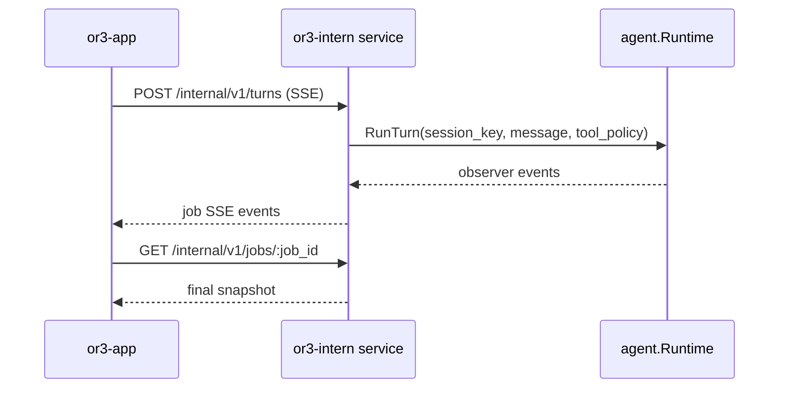
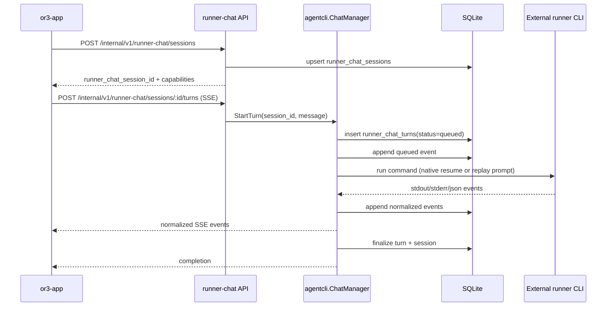
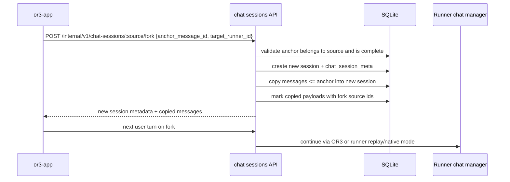

# Runner Chat Selection Design

## Overview

The safest architecture is to make runner-backed chat a new transport under the existing `or3-intern` service, while keeping the current OR3 chat path untouched.

`or3-app` should gain a chat transport abstraction:

- `or3-intern` transport: current `/internal/v1/turns` + `/internal/v1/jobs/:id/stream`.
- `runner-chat` transport: new `/internal/v1/runner-chat/...` APIs that create a persistent backend runner chat session and stream one turn at a time.

`or3-intern` should gain a small runner chat manager that reuses the existing `internal/agentcli` execution, detection, environment, cwd, and policy controls. The manager owns chat-specific persistence, turn state, transcript replay, native resume capability gates, and event normalization.

Session history and forking should be implemented at the common chat-session layer, not inside each runner. The existing `sessions` and `messages` tables become the normalized user-visible timeline for every chat transport. External runner-specific tables keep raw process events and native session refs, but every completed user/assistant exchange also gets mirrored into `messages` with payload metadata. This gives old-session browsing and message-point forks one implementation that works for `or3-intern`, Codex, Claude, Gemini, and OpenCode.

This fits the repo because it keeps SQLite as the persistence layer, keeps execution inside the current Go service, and avoids pushing shell or runner-specific state into the frontend.

## Affected Areas

### `or3-intern`

- `internal/agentcli/runners.go`
  - Extend runner capability metadata with chat/session capability fields.
  - Add chat request, turn, session, and event types.

- `internal/agentcli/registry.go`
  - Keep `BuildCommand(req AgentRunRequest)` for one-shot jobs.
  - Add optional chat-aware adapter interface methods for replay and native continuation.

- `internal/agentcli/manager.go`
  - Keep existing job manager behavior.
  - Either add chat orchestration methods here or create `internal/agentcli/chat_manager.go` to keep concerns separated.

- `internal/agentcli/stream.go` and `internal/agentcli/result_extract.go`
  - Reuse process stream reading.
  - Add normalized chat event conversion per runner, while still preserving raw output for diagnostics.

- `internal/db/db.go`
  - Add `runner_chat_sessions`, `runner_chat_turns`, `runner_chat_events`, and chat session metadata tables/indexes.

- `internal/db/runner_chat_store.go`
  - New store methods for create/read/update/list session, create/claim/finalize turn, append/list events, active turn lookup, and restart reconciliation.

- `internal/db/chat_session_store.go`
  - New store methods for listing chat sessions, reading paginated messages, upserting metadata, renaming/archiving, and forking through message copy.

- `cmd/or3-intern/service_agents.go` or new `cmd/or3-intern/service_runner_chat.go`
  - Add route handlers for chat runner discovery, session creation/read, turn streaming, snapshots, and abort.

- New `cmd/or3-intern/service_chat_sessions.go`
  - Add route handlers for general session history, message pagination, rename/archive, and fork.

- `cmd/or3-intern/service_request.go`
  - Add request decoders for runner chat session and turn payloads.

- `internal/app/service_app.go`
  - Add thin methods that call the runner chat manager and chat session store, matching the existing `StartAgentCLIRun` pattern.

- `internal/controlplane/controlplane.go`
  - Add response builders for runner chat sessions, turns, and events.

- `internal/config/types.go`, `internal/config/env.go`
  - Add only minimal chat-specific knobs if existing `AgentCLIConfig` limits are insufficient.

### `or3-app`

- `../or3-app/app/types/app-state.ts`
  - Extend `ChatSession`, `AssistantSendPayload`, and error code types for runner chat metadata.

- `../or3-app/app/types/or3-api.ts`
  - Add runner chat request/response/event types and chat capability fields.

- `../or3-app/app/composables/useLocalCache.ts`
  - Normalize old cached sessions to `runnerId: "or3-intern"` on load.

- `../or3-app/app/composables/useChatSessions.ts`
  - Create, activate, list, hydrate, fork, rename, archive, and update sessions with runner metadata.
  - Add safe runner-switch helpers.

- New `../or3-app/app/composables/useSessionHistory.ts`
  - Load backend session history, hydrate message pages, perform session forks, and reconcile backend metadata with local cache.

- `../or3-app/app/composables/useAssistantStream.ts`
  - Split transport-neutral message/event state handling from backend transport calls.

- New `../or3-app/app/composables/useChatRunners.ts`
  - Load and cache chat-capable runners from `GET /internal/v1/chat-runners`.

- New `../or3-app/app/composables/chatTransports/*`
  - `or3InternTransport.ts`
  - `runnerChatTransport.ts`
  - shared `types.ts`

- `../or3-app/app/components/assistant/AssistantComposer.vue`
  - Add the runner picker to `or3-composer-menu`.

- New or updated `../or3-app/app/components/assistant/SessionHistoryPanel.vue`
  - Show recent sessions, search/filter controls, archived filter, runner labels, and fork parent indicators.

- `../or3-app/app/components/assistant/ChatMessage.vue`
  - Add a per-message fork action and disable it for incomplete/unsafe anchors.

- `../or3-app/app/pages/index.vue`
  - Bind selected runner state into the composer and send payload.

## Control Flow / Architecture

### OR3 Default Transport

The existing path stays as-is:



### External Runner Transport



### Recovery

On app reload:

1. `useAssistantStream` sees an assistant message with `status: "streaming"` and `runnerChatSessionId`.
2. Runner transport calls `GET /internal/v1/runner-chat/sessions/:id`.
3. If there is an active turn, it streams from `GET /internal/v1/runner-chat/sessions/:id/turns/:turn_id/stream?after_seq=N`.
4. If no active turn exists, it fetches the latest turn snapshot and applies persisted events.
5. If service restart aborted the turn, the app marks the assistant message failed/aborted and keeps retry payload.

### Session History

`or3-app` currently treats `useLocalCache` as the primary session list. That should become a local mirror of backend session metadata for connected hosts:

1. App opens chat and calls `GET /internal/v1/chat-sessions?limit=50`.
2. Backend reads `chat_session_meta`, `sessions`, `messages`, and latest runner metadata.
3. App merges backend sessions into local cache by `sessionKey`, preserving local drafts and UI-only IDs.
4. When the user opens an old session, app calls `GET /internal/v1/chat-sessions/:session_key/messages?limit=100`.
5. App hydrates or replaces the local message list for that session using stable backend message IDs stored on `ChatMessage.backendMessageId`.

The local cache remains useful for offline-ish UI state, drafts, pending optimistic messages, and fast startup, but the service becomes the source of truth for sessions that have successfully interacted with the backend.

### Message-Point Forking



Forking is runner-agnostic because the copied message prefix is a normalized transcript. Native runner fork/resume can be used only when a runner exposes a specific-session, specific-state fork primitive. Otherwise, the new session continues in replay mode. This is the behavior that makes forks work across all agents.

## Data And Persistence

### SQLite Tables

Add tables through `internal/db/db.go` migrations:

```sql
CREATE TABLE IF NOT EXISTS chat_session_meta(
    session_key TEXT PRIMARY KEY,
    title TEXT NOT NULL DEFAULT '',
    runner_id TEXT NOT NULL DEFAULT 'or3-intern',
    runner_chat_session_id TEXT NOT NULL DEFAULT '',
    parent_session_key TEXT NOT NULL DEFAULT '',
    fork_anchor_message_id INTEGER NOT NULL DEFAULT 0,
    forked_from_runner_id TEXT NOT NULL DEFAULT '',
    fork_strategy TEXT NOT NULL DEFAULT '',
    archived INTEGER NOT NULL DEFAULT 0,
    message_count INTEGER NOT NULL DEFAULT 0,
    last_message_preview TEXT NOT NULL DEFAULT '',
    metadata_json TEXT NOT NULL DEFAULT '{}',
    created_at INTEGER NOT NULL,
    updated_at INTEGER NOT NULL,
    FOREIGN KEY(session_key) REFERENCES sessions(key) ON DELETE CASCADE
);

CREATE TABLE IF NOT EXISTS runner_chat_sessions(
    id TEXT PRIMARY KEY,
    app_session_key TEXT NOT NULL,
    runner_id TEXT NOT NULL,
    continuation_mode TEXT NOT NULL DEFAULT 'replay',
    native_session_ref TEXT NOT NULL DEFAULT '',
    cwd TEXT NOT NULL DEFAULT '',
    model TEXT NOT NULL DEFAULT '',
    mode TEXT NOT NULL DEFAULT '',
    isolation TEXT NOT NULL DEFAULT '',
    status TEXT NOT NULL DEFAULT 'active',
    active_turn_id TEXT NOT NULL DEFAULT '',
    last_turn_id TEXT NOT NULL DEFAULT '',
    metadata_json TEXT NOT NULL DEFAULT '{}',
    created_at INTEGER NOT NULL,
    updated_at INTEGER NOT NULL,
    UNIQUE(app_session_key, runner_id)
);

CREATE TABLE IF NOT EXISTS runner_chat_turns(
    id TEXT PRIMARY KEY,
    session_id TEXT NOT NULL,
    job_id TEXT NOT NULL UNIQUE,
    agent_cli_run_id TEXT NOT NULL DEFAULT '',
    user_message TEXT NOT NULL,
    replay_prompt_preview TEXT NOT NULL DEFAULT '',
    assistant_message TEXT NOT NULL DEFAULT '',
    runner_id TEXT NOT NULL,
    model TEXT NOT NULL DEFAULT '',
    mode TEXT NOT NULL DEFAULT '',
    isolation TEXT NOT NULL DEFAULT '',
    cwd TEXT NOT NULL DEFAULT '',
    status TEXT NOT NULL,
    error_message TEXT NOT NULL DEFAULT '',
    requested_at INTEGER NOT NULL,
    started_at INTEGER NOT NULL DEFAULT 0,
    completed_at INTEGER NOT NULL DEFAULT 0,
    timeout_seconds INTEGER NOT NULL DEFAULT 0,
    meta_json TEXT NOT NULL DEFAULT '{}',
    FOREIGN KEY(session_id) REFERENCES runner_chat_sessions(id) ON DELETE CASCADE
);

CREATE TABLE IF NOT EXISTS runner_chat_events(
    id INTEGER PRIMARY KEY AUTOINCREMENT,
    session_id TEXT NOT NULL,
    turn_id TEXT NOT NULL,
    job_id TEXT NOT NULL,
    seq INTEGER NOT NULL,
    ts TEXT NOT NULL,
    type TEXT NOT NULL,
    stream TEXT NOT NULL DEFAULT '',
    chunk TEXT NOT NULL DEFAULT '',
    payload_json TEXT NOT NULL DEFAULT '',
    UNIQUE(turn_id, seq),
    FOREIGN KEY(session_id) REFERENCES runner_chat_sessions(id) ON DELETE CASCADE,
    FOREIGN KEY(turn_id) REFERENCES runner_chat_turns(id) ON DELETE CASCADE
);

CREATE INDEX IF NOT EXISTS idx_runner_chat_sessions_app
    ON runner_chat_sessions(app_session_key, updated_at DESC);
CREATE INDEX IF NOT EXISTS idx_runner_chat_turns_session
    ON runner_chat_turns(session_id, requested_at DESC);
CREATE INDEX IF NOT EXISTS idx_runner_chat_turns_status
    ON runner_chat_turns(status, requested_at);
CREATE INDEX IF NOT EXISTS idx_runner_chat_events_turn_seq
    ON runner_chat_events(turn_id, seq);
CREATE INDEX IF NOT EXISTS idx_runner_chat_events_job_seq
    ON runner_chat_events(job_id, seq);
CREATE INDEX IF NOT EXISTS idx_chat_session_meta_updated
    ON chat_session_meta(archived, updated_at DESC);
CREATE INDEX IF NOT EXISTS idx_chat_session_meta_runner
    ON chat_session_meta(runner_id, updated_at DESC);
```

Rationale:

- `chat_session_meta` is the lightweight searchable index for session history, titles, runner binding, archive state, and fork metadata.
- `runner_chat_sessions` is the durable mapping from app chat thread to runner-specific state.
- `runner_chat_turns` makes each user message a terminal unit, preserving the current one-shot process model.
- `runner_chat_events` gives replay/recovery without depending on the short-lived in-memory `JobRegistry`.
- `agent_cli_run_id` links to the existing one-shot execution record when the chat manager uses `agent_cli_runs` internally.

### Normalized Message Timeline

The existing `messages` table should stay the user-visible transcript for all chat sessions:

- `or3-intern` turns continue using the existing `agent.Runtime` writes.
- External runner turns append:
  - a `user` message before execution starts;
  - an `assistant` message after final text is known or an error/aborted placeholder when needed;
  - optional `system` messages for local-only notices, never raw process logs.
- `payload_json` carries metadata, for example:

```json
{
  "transport": "runner_chat",
  "runner_id": "codex",
  "runner_chat_session_id": "rcs_123",
  "runner_chat_turn_id": "rct_456",
  "continuation_mode": "replay",
  "source_message_id": 42,
  "forked_from_session_key": "or3-app:local:session_a"
}
```

The app should store backend message IDs on local `ChatMessage.backendMessageId`. When hydrating old sessions, local message IDs can remain UI IDs while backend IDs are used for fork anchors and pagination.

### Config

Prefer reusing `AgentCLIConfig`:

- `Enabled`
- `DisabledRunners`
- `MaxConcurrent`
- `MaxQueued`
- `DefaultTimeoutSeconds`
- `MaxTimeoutSeconds`
- `AllowSandboxAuto`
- `DefaultMode`
- `DefaultIsolation`
- `EventChunkMaxBytes`
- `PreviewMaxBytes`
- `ChildEnvAllowlist`

Add only if needed:

```go
type AgentCLIConfig struct {
    // Existing fields...
    ChatEnabled bool `json:"chatEnabled"`
    ChatReplayMaxTurns int `json:"chatReplayMaxTurns"`
    ChatReplayMaxBytes int `json:"chatReplayMaxBytes"`
}
```

Defaults:

- `ChatEnabled`: defaults to `Enabled`.
- `ChatReplayMaxTurns`: 12.
- `ChatReplayMaxBytes`: 48 KiB.

Environment overrides:

- `OR3_AGENT_CLI_CHAT_ENABLED`
- `OR3_AGENT_CLI_CHAT_REPLAY_MAX_TURNS`
- `OR3_AGENT_CLI_CHAT_REPLAY_MAX_BYTES`

### Session And Memory Scope

External runner chats should write normalized visible messages into the existing `messages` table so history and forks work uniformly. Runner-native raw events, stdout/stderr chunks, and low-level tool details stay in `runner_chat_events`.

Memory consolidation needs a conservative default:

- OR3-native messages keep current memory behavior.
- External runner messages are eligible for prompt replay and UI history immediately.
- Long-term memory consolidation should skip external runner messages by default unless `payload_json.transport` is allowed by a future explicit setting.
- Forked messages should preserve source IDs in payload metadata, but memory consolidation should not treat copied fork prefixes as new facts unless a later turn adds new content.

## Interfaces And Types

### Backend Capability Types

```go
type RunnerChatCapabilities struct {
    ChatSelectable          bool `json:"chatSelectable"`
    ReplaySession          bool `json:"replaySession"`
    NativeSession          bool `json:"nativeSession"`
    NativeResume           bool `json:"nativeResume"`
    SessionRefExtractable  bool `json:"sessionRefExtractable"`
    StreamText             bool `json:"streamText"`
    StreamToolEvents       bool `json:"streamToolEvents"`
}

type RunnerSupports struct {
    StructuredOutput    bool `json:"structuredOutput"`
    StreamingJSON       bool `json:"streamingJson"`
    ModelFlag           bool `json:"modelFlag"`
    PermissionsMode     bool `json:"permissionsMode"`
    SafeSandboxFlag     bool `json:"safeSandboxFlag"`
    DangerousBypassFlag bool `json:"dangerousBypassFlag"`
    StdinPrompt         bool `json:"stdinPrompt"`
    Chat                RunnerChatCapabilities `json:"chat"`
}
```

### Adapter Split

Keep the existing one-shot adapter unchanged for agent jobs:

```go
type RunnerAdapter interface {
    ID() RunnerID
    DisplayName() string
    Spec() RunnerSpec
    Detect(ctx context.Context, opts DetectOptions) RunnerInfo
    BuildCommand(req AgentRunRequest) (CommandSpec, error)
}
```

Add optional chat interfaces:

```go
type RunnerChatAdapter interface {
    RunnerAdapter
    ChatCapabilities() RunnerChatCapabilities
    BuildReplayCommand(req RunnerChatCommandRequest) (CommandSpec, error)
    NormalizeChatEvent(raw AgentRunEvent) []RunnerChatEvent
}

type NativeRunnerChatAdapter interface {
    RunnerChatAdapter
    BuildNativeChatCommand(req RunnerChatCommandRequest) (CommandSpec, error)
    ExtractNativeSessionRef(event AgentRunEvent, out ProcessOutput) (string, bool)
}

type RunnerChatCommandRequest struct {
    SessionID        string
    NativeSessionRef string
    RunnerID         string
    UserMessage      string
    ReplayPrompt     string
    Cwd              string
    Model            string
    Mode             string
    Isolation        string
    MaxTurns         int
    TimeoutSeconds   int
    Meta             map[string]any
}
```

### Suggested Per-Runner Strategy

OpenCode:

- Strong candidate for first native implementation.
- Use `opencode run --format json --session <id> <message>` when a session ref exists.
- Extract session ID from JSON events or `opencode session list/export` only if stable in tests.
- Replay mode remains fallback.

Claude:

- Candidate for native continuation with `claude --print --continue <prompt>` or `--resume` once a stable session ID path is verified.
- Avoid using "continue latest" for multiple simultaneous chats because it is process-global and can cross wires.
- Native mode should require explicit session ref support, not only `--continue`.

Gemini:

- Candidate for native continuation with `gemini --resume <session_id>` and `--output-format stream-json`.
- Verify that non-interactive prompt plus resume works without entering TUI.

Codex:

- Keep replay mode for MVP.
- Native mode only after adapter tests can extract a stable session ID from JSON output or session logs and resume a specific session by ID.

### Service API

General chat session APIs:

```text
GET   /internal/v1/chat-sessions
POST  /internal/v1/chat-sessions
GET   /internal/v1/chat-sessions/:session_key
PATCH /internal/v1/chat-sessions/:session_key
GET   /internal/v1/chat-sessions/:session_key/messages
POST  /internal/v1/chat-sessions/:session_key/fork
```

Fork request:

```json
{
  "anchor_message_id": 42,
  "target_runner_id": "claude",
  "title": "Forked investigation",
  "continuation_mode": "replay"
}
```

Fork response:

```json
{
  "session": {
    "session_key": "or3-app:local:session_fork",
    "title": "Forked investigation",
    "runner_id": "claude",
    "parent_session_key": "or3-app:local:session_original",
    "fork_anchor_message_id": 42,
    "fork_strategy": "replay"
  },
  "messages": []
}
```

Runner chat APIs:

```text
GET  /internal/v1/chat-runners
POST /internal/v1/runner-chat/sessions
GET  /internal/v1/runner-chat/sessions/:id
POST /internal/v1/runner-chat/sessions/:id/turns
GET  /internal/v1/runner-chat/sessions/:id/turns/:turn_id
GET  /internal/v1/runner-chat/sessions/:id/turns/:turn_id/stream?after_seq=0
POST /internal/v1/runner-chat/sessions/:id/abort
```

Create session request:

```json
{
  "app_session_key": "or3-app:local:session_123",
  "runner_id": "codex",
  "model": "gpt-5.3-codex",
  "mode": "safe_edit",
  "isolation": "host_workspace_write",
  "cwd": "/Users/brendon/Documents/or3-intern",
  "continuation_mode": "replay"
}
```

Start turn request:

```json
{
  "message": "Update the failing test",
  "timeout_seconds": 900,
  "max_turns": 8,
  "meta": {
    "source": "or3-app"
  }
}
```

SSE events should match the app's existing event shape:

```json
{
  "type": "text_delta",
  "sequence": 4,
  "data": {
    "runner_id": "codex",
    "runner_chat_session_id": "rcs_...",
    "runner_chat_turn_id": "rct_...",
    "content": "I found the issue..."
  }
}
```

### Frontend Transport Interface

Session and message state additions:

```ts
export interface ChatSession {
    id: string;
    hostId: string;
    sessionKey: string;
    title: string;
    createdAt: string;
    updatedAt: string;
    runnerId?: string;
    runnerLabel?: string;
    runnerChatSessionId?: string;
    runnerContinuationMode?: 'replay' | 'native';
    runnerModel?: string;
    runnerMode?: string;
    runnerIsolation?: string;
    runnerCwd?: string;
    parentSessionKey?: string;
    forkAnchorMessageId?: number;
    forkedFromRunnerId?: string;
    forkStrategy?: 'replay' | 'native' | string;
    archived?: boolean;
}

export interface ChatMessage {
    backendMessageId?: number;
    sourceMessageId?: number;
    forkedFromSessionKey?: string;
    runnerId?: string;
    runnerChatSessionId?: string;
    runnerChatTurnId?: string;
}
```

```ts
export interface ChatTransportStart {
    session: ChatSession;
    payload: AssistantSendPayload;
    signal: AbortSignal;
    onOpen(jobIdOrTurnId: string): void;
    onEvent(event: NormalizedTurnEvent): void;
}

export interface ChatTransport {
    id: 'or3-intern' | 'runner-chat';
    canHandle(session: ChatSession): boolean;
    startTurn(input: ChatTransportStart): Promise<ChatTransportResult>;
    recover(input: ChatTransportRecover): Promise<void>;
    abort(input: ChatTransportAbort): Promise<void>;
}
```

The existing event application logic in `useAssistantStream.ts` should become transport-neutral. The transport should only decide which endpoint to call and how to map stream events into `NormalizedTurnEvent`.

## Failure Modes And Safeguards

- Runner missing:
  - Discovery returns `status: "missing"`.
  - Start session/turn returns HTTP 400 with code `runner_missing`.
  - App disables the option and shows a concise status.

- Runner auth missing:
  - Discovery returns `auth_status: "missing"`.
  - Start turn fails before spawning.
  - No retry loop.

- Unsupported native chat:
  - If user requests `continuation_mode: "native"` but adapter lacks verified native capability, return HTTP 400 `unsupported_native_session`.
  - App can offer replay mode.

- Active turn conflict:
  - A session may have at most one active runner chat turn.
  - Starting a second turn returns HTTP 409 `runner_chat_turn_active`.

- Timeout:
  - Child context uses bounded timeout.
  - Turn finalized as `timed_out`.
  - App message becomes failed with retry payload.

- Service restart:
  - On manager start, running runner chat turns are reconciled to `aborted`.
  - Persisted events remain replayable.

- Output explosion:
  - Stream chunks use `EventChunkMaxBytes`.
  - Previews use `PreviewMaxBytes`.
  - Raw runner output events are optional and bounded.

- Transcript replay explosion:
  - Build replay prompt from newest turns within `ChatReplayMaxTurns` and `ChatReplayMaxBytes`.
  - Truncation must be deterministic and visible in prompt metadata.

- Session isolation mistakes:
  - `runner_chat_sessions.app_session_key` must match the app session key supplied by the active `ChatSession`.
  - Native resume must use stored `native_session_ref`, never "latest" continuation in multi-session contexts.

- Secrets:
  - Continue using `BuildAgentCLIEnv`.
  - Do not persist env vars, tokens, or auth headers in metadata.

- Tool semantics mismatch:
  - External runner tool calls are informational for MVP.
  - Do not map runner-native approvals to OR3 approvals until there is an explicit adapter contract.

- Invalid fork anchor:
  - Return HTTP 400/404 when the anchor does not exist or does not belong to the source session.
  - Return a stable code such as `invalid_fork_anchor`.

- Incomplete fork anchor:
  - Return HTTP 409 `fork_anchor_incomplete` for streaming or pending assistant messages unless the request explicitly asks for `anchor_policy: "last_complete_before_anchor"`.
  - The app should disable fork buttons while streaming to avoid most of these cases.

- Native fork unavailable:
  - If the user requests native fork and the runner cannot provide it, return `unsupported_native_fork` with replay guidance.
  - If the request permits fallback, create the fork with `fork_strategy: "replay"`.

- History payload leakage:
  - Session list responses include previews and metadata only.
  - Message reads include transcript content but must strip approval tokens, secret-like metadata fields, raw child env, and raw command output payloads.

## Testing Strategy

### Go Unit Tests

- `internal/db/runner_chat_store_test.go`
  - table creation
  - create/get session
  - unique app session + runner binding
  - create/finalize turn
  - active turn conflict
  - append/list events
  - restart reconciliation

- `internal/db/chat_session_store_test.go`
  - upsert metadata for existing `sessions` rows
  - list sessions ordered by updated time
  - bounded previews and message counts
  - paginated message reads
  - fork copies messages through anchor only
  - fork preserves source metadata and does not copy sensitive token fields
  - archive and rename behavior

- `internal/agentcli/chat_prompt_test.go`
  - replay prompt ordering
  - byte/turn bounds
  - deterministic truncation
  - role separation

- `internal/agentcli/chat_adapter_test.go`
  - adapter capability declarations
  - replay command construction for Codex, Claude, Gemini, OpenCode
  - native mode gated off unless `ExtractNativeSessionRef` is verified
  - policy validation reused from `ValidateRunPolicy`

- `internal/agentcli/chat_manager_test.go`
  - queues or runs a turn
  - publishes normalized events
  - finalizes success/failure/abort/timeout
  - stores final assistant text

### Go API Tests

- `cmd/or3-intern/service_runner_chat_test.go`
  - `GET /internal/v1/chat-runners`
  - create session
  - start turn SSE
  - read turn snapshot
  - stream persisted events after `after_seq`
  - abort active turn
  - auth middleware route classification

- `cmd/or3-intern/service_chat_sessions_test.go`
  - list sessions
  - read session messages
  - rename/archive session
  - fork OR3 session from a user message
  - fork runner-backed session into replay mode
  - reject invalid or incomplete anchors
  - ensure previews are bounded

- Existing tests:
  - `/internal/v1/turns` contract tests
  - `/internal/v1/agent-runs` contract tests
  - job stream route tests
  - auth rollout tests

### Frontend Tests

- `useLocalCache`
  - old sessions normalize to `runnerId: "or3-intern"`.
  - corrupted runner metadata falls back safely.

- `useChatSessions`
  - empty session runner switch.
  - non-empty session switch requires fork/new-session path.
  - hydrate backend session metadata into local cache.
  - activate old sessions and load message pages.
  - create local fork sessions from backend fork responses.

- `useAssistantStream`
  - selects OR3 transport for `or3-intern`.
  - selects runner transport for external runner.
  - recovers external runner active turn by `runnerChatSessionId`.
  - applies runner chat events to message content, activity log, failures, and completion.

- `useSessionHistory`
  - lists sessions by current host.
  - filters by runner, archived state, and search text.
  - preserves local drafts during backend hydration.
  - calls fork API and activates the returned session.

- `AssistantComposer.vue`
  - loads runner picker options.
  - disables unavailable runners.
  - emits selected runner updates.
  - does not break existing mode and attachment behavior.

- `ChatMessage.vue`
  - shows fork action for complete messages.
  - disables fork while streaming or approval state is pending.

### Manual Verification

1. Start `or3-intern service` with agent CLI enabled.
2. Open `or3-app`.
3. Confirm a new chat defaults to `or3-intern`.
4. Switch to an installed external runner in an empty session.
5. Send a prompt and verify streamed assistant output.
6. Reload during a running turn and verify recovery.
7. Stop a running turn and verify backend abort plus UI state.
8. Switch runners after messages exist and verify confirmation/new-session behavior.
