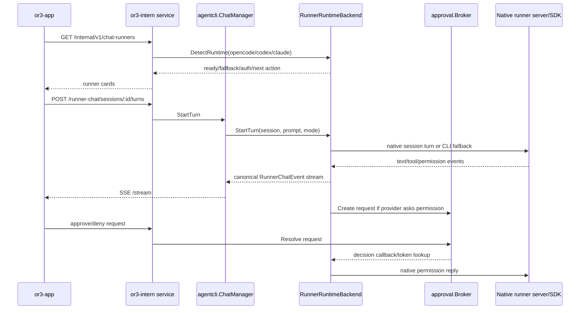

# Runner UX Design

## Overview

The current runner path already has useful primitives: `internal/agentcli` has runner specs and adapters, `ChatManager` persists runner chat sessions/turns/events, the service exposes `/internal/v1/runner-chat/*`, and or3-app streams runner-chat events into the normal chat UI. The missing piece is a first-class runtime layer that can talk to native runner servers/SDKs instead of always building command lines.

This design adds a small provider-neutral `RunnerRuntimeBackend` contract in `internal/agentcli`. Backends are selected in this order: configured preferred backend, native server/SDK backend if healthy, then existing CLI adapter fallback. OpenCode and Codex get native backends first because their server protocols are available and local. Claude gets an optional SDK bridge path because the official Agent SDK is not Go-native; the current CLI backend remains the stable default until the bridge proves reliable.

Research notes that shaped the design:

- OpenCode exposes `opencode serve`, SDK clients, sessions, prompt APIs, SSE events, and permission reply APIs.
- Codex exposes `codex app-server --listen stdio://|unix://|ws://IP:PORT`, JSON-RPC methods such as `initialize`, `thread/start`, `thread/resume`, `turn/start`, `turn/interrupt`, and streamed notifications.
- Claude Agent SDK exposes query/session APIs, resume/session stores, `can_use_tool`, and hooks for permission checks, but using it from Go likely requires a small bridge process or delaying native support.
- t3code's useful pattern is not its framework stack; it is the adapter contract: managed provider sessions, canonical runtime events, pending approval maps, provider inventory/readiness, and native approval replies.

## Affected areas

- `internal/agentcli/runners.go`
  - Add runtime backend types, runtime capability fields, and provider-neutral approval/request structs.
- `internal/agentcli/registry.go`
  - Register native and CLI backends per runner; keep existing adapters as CLI fallback.
- `internal/agentcli/manager.go`
  - Select a backend for each run/turn, preserve queue limits, persist run metadata, and emit normalized events.
- `internal/agentcli/chat_manager.go`
  - Route runner chat turns through the selected backend, persist native session refs, mirror native approval/completion events, and keep replay fallback.
- `internal/agentcli/process.go`
  - Keep existing command process execution unchanged for fallback mode.
- New `internal/agentcli/opencode_runtime.go`
  - Manage loopback OpenCode server startup/connection, session creation, prompt submission, event subscription, permission replies, and shutdown.
- New `internal/agentcli/codex_runtime.go`
  - Manage Codex app-server stdio or loopback transport, JSON-RPC handshake, thread lifecycle, turn lifecycle, server request handling, approval replies, and interrupt.
- New `internal/agentcli/claude_runtime.go` or `internal/agentcli/claude_bridge.go`
  - Define the optional Claude SDK bridge contract and health detection without making it mandatory for normal builds.
- `internal/approval`
  - Reuse existing broker/allowlist primitives for runner-native permission requests; add a runner approval domain only if current domain typing cannot express native runner requests cleanly.
- `cmd/or3-intern/service_chat_sessions.go`
  - Include runtime backend readiness and fallback state in `/internal/v1/chat-runners`.
- `cmd/or3-intern/service_runner_chat.go`
  - Surface stable error codes for native backend unavailable, fallback used, approval required, unsupported runtime, and interrupted turn.
- `internal/controlplane`
  - Extend response builders for runner runtime fields and user-facing next actions.
- `internal/config/types.go` and `internal/config/load.go`
  - Add minimal optional config for preferred runtime mode and server startup limits.
- `docs/v1/architecture/external-agent-cli/*` and `docs/v1/user-guide/workflows/external-agent-runner-workflow.md`
  - Update docs from “CLI runner” language to “runner runtime” language.
- `or3-app/app/composables/useChatRunners.ts`
  - Consume new readiness/runtime fields and expose friendly status labels.
- `or3-app/app/utils/assistant-stream/*`
  - Render native runtime events through existing activity/message paths; avoid provider-specific UI branches where possible.
- `or3-app/app/pages/activity.vue`, agents/settings pages, and approval sheets
  - Present runner health, runtime mode, and approval details as first-class OR3 actions.

## Control flow / architecture

Runner detection and execution become runtime-aware while preserving the current queue and streaming model.



Backend selection should be deterministic:

1. If runner is `or3-intern`, use the existing direct OR3 turn path.
2. If config disables the runner, mark it disabled and do not fallback silently.
3. If config sets a runner runtime to `cli`, use the existing CLI adapter.
4. If config sets a runner runtime to `native`, require the native backend and return a clear error if it is unavailable.
5. If config uses `auto` or omits the setting, try native backend first and fallback to CLI only when no destructive provider action has begun.

Native lifecycle ownership should also be deterministic:

1. `or3-intern service`, `scripts/restart-service.sh restart`, and `scripts/restart-service.sh start` should start only the OR3 service process, not eagerly boot OpenCode or Codex helper servers.
2. Native runner servers should start lazily on the first turn or explicit health probe that actually needs them.
3. Before spawning a new native server, OR3 should probe for a compatible already-running instance in this order:
  - configured explicit server URL,
  - OR3-owned cached instance metadata for the same runner/workspace,
  - provider-native local discovery only when the instance can be verified as local, healthy, and safe to attach.
4. If OR3 attaches to an externally managed instance, it must mark that runtime as `external` and never stop it during turn abort, idle cleanup, or service shutdown.
5. If ownership is unknown, startup should prefer a new isolated instance or CLI fallback instead of forcefully reusing or killing the unknown server.

## Data and persistence

Prefer using existing SQLite tables for the first implementation pass:

- `runner_chat_sessions.native_session_ref` stores OpenCode session IDs, Codex thread IDs, or Claude SDK session IDs.
- `runner_chat_sessions.meta_json` stores backend-specific non-secret metadata such as runtime kind, provider model slug, or resume cursor shape.
- `runner_chat_turns.meta_json` stores selected runtime backend and native turn/request IDs for diagnostics and recovery.
- `runner_chat_events.payload_json` stores canonical OR3 event payloads, not raw provider payloads by default.
- `agent_cli_runs.meta_json` can keep the historical table name but should record `runner_runtime_kind` so existing activity pages still work.

No schema migration is required for phase 1 if metadata is enough. Additive columns are justified only if filtering by runtime mode or pending native request becomes necessary, for example:

```sql
ALTER TABLE runner_chat_turns ADD COLUMN runtime_kind TEXT NOT NULL DEFAULT 'cli';
ALTER TABLE runner_chat_turns ADD COLUMN native_turn_ref TEXT NOT NULL DEFAULT '';
```

Config additions should stay small and backward-compatible:

```go
type AgentCLIConfig struct {
    // existing fields...
    RunnerRuntimeMode map[string]string `json:"runnerRuntimeMode"` // auto|native|cli
    NativeServerIdleSeconds int `json:"nativeServerIdleSeconds"`
    NativeServerStartupSeconds int `json:"nativeServerStartupSeconds"`
}
```

Defaults:

- `RunnerRuntimeMode`: empty means `auto` for OpenCode/Codex and `cli` for Claude until the SDK bridge is enabled.
- `NativeServerIdleSeconds`: 300.
- `NativeServerStartupSeconds`: 10.
- Managed native servers bind to `127.0.0.1` or stdio only.
- Managed native servers are lazy-start by default; no boot-time warm start is required for `or3-intern service`.

Secrets and auth tokens must not be persisted in SQLite. If a native server needs a transient token, keep it in memory and expose only redacted status.

## Interfaces and types

Add a runtime backend interface in `internal/agentcli` while preserving existing `RunnerAdapter`.

```go
type RunnerRuntimeKind string

const (
    RunnerRuntimeCLI RunnerRuntimeKind = "cli"
    RunnerRuntimeOpenCodeServer RunnerRuntimeKind = "opencode_server"
    RunnerRuntimeCodexAppServer RunnerRuntimeKind = "codex_app_server"
    RunnerRuntimeClaudeSDK RunnerRuntimeKind = "claude_sdk"
)

type RunnerRuntimeStatus struct {
    RunnerID string
    Kind RunnerRuntimeKind
    Ready bool
    Preferred bool
    FallbackKind RunnerRuntimeKind
  Ownership string // managed|external|none|unknown
    Message string
    NextAction string
    SupportsApprovals bool
    SupportsResume bool
    SupportsInterrupt bool
}

type RunnerRuntimeBackend interface {
    RunnerID() RunnerID
    Kind() RunnerRuntimeKind
    DetectRuntime(ctx context.Context, opts DetectOptions) RunnerRuntimeStatus
    StartTurn(ctx context.Context, req RunnerRuntimeTurnRequest, sink RunnerRuntimeEventSink) (RunnerRuntimeTurn, error)
    AbortTurn(ctx context.Context, turn RunnerRuntimeTurn) error
    RespondToApproval(ctx context.Context, ref RunnerApprovalRef, decision RunnerApprovalDecision) error
}
```

The CLI backend wraps today's adapter/process path:

```go
type CLIRuntimeBackend struct {
    Adapter RunnerChatAdapter
    Process *ProcessManager
}
```

Native backends convert provider events into canonical runtime events before they reach `ChatManager`:

```go
type RunnerRuntimeEvent struct {
    Type string
    Stream string
    Text string
    Payload json.RawMessage
    ProviderRequest *RunnerProviderRequest
    NativeSessionRef string
    NativeTurnRef string
}
```

Approval mapping should use one provider-neutral shape:

```go
type RunnerProviderRequest struct {
    RunnerID string
    RuntimeKind RunnerRuntimeKind
    ProviderRequestID string
    RequestType string // command_execution,file_change,file_read,tool,permission,user_input,unknown
    Title string
    Detail string
    ArgsJSON string
    Risk string // low,medium,high
}
```

Provider notes:

- OpenCode server backend:
  - Prefer attach/reuse when a healthy configured or previously OR3-managed local server already exists.
  - Start with `opencode serve --hostname 127.0.0.1 --port 0 --pure` unless config allows plugins.
  - Parse the listening URL from process output or use configured URL.
  - Use Go SDK session create/prompt/event streaming/permission reply APIs.
  - Convert permission replies to `once`, `always`, or `reject`.
- Codex app-server backend:
  - Prefer stdio child-process transport for OR3-managed instances because it avoids stale port ownership and external exposure.
  - If future websocket attach mode is supported, attach only to explicit configured loopback endpoints with verified auth.
  - Start with `codex app-server --listen stdio://` first to avoid exposed ports.
  - Implement a tiny JSON-RPC client over stdio with request IDs, notification dispatch, and bounded read buffers.
  - Send `initialize`, then `initialized`, then `thread/start` or `thread/resume`, then `turn/start`.
  - Convert server request methods such as `item/commandExecution/requestApproval` and `item/fileChange/requestApproval` into OR3 approvals and reply to the blocked JSON-RPC request when resolved.
- Claude SDK backend:
  - Treat as experimental because OR3 is Go-first and the official Agent SDK path is not Go-native.
  - Use a small local bridge only if it can be packaged, health-checked, and bounded without requiring users to understand Python/Node.
  - Map `can_use_tool` and permission hooks to OR3 approvals.
  - Keep CLI fallback as the default until bridge install/auth/recovery is reliable.

## Failure modes and safeguards

- Already-running native server exists:
  - Probe health and ownership before using it.
  - Reuse only if it is explicitly configured, previously OR3-managed, or otherwise safely verifiable.
  - Never terminate an externally managed instance during cleanup.
- Service boot/restart semantics are misunderstood:
  - Document clearly that service scripts start only `or3-intern`; runner servers are lazy-started when needed.
  - Keep a future warm-start mode opt-in only.
- Stale pid file, stale cached URL, or occupied port:
  - Verify health by handshake instead of trusting cached metadata.
  - If the probe fails, discard the stale metadata and start a fresh isolated runtime or fallback to CLI.
- Supervisor or external tool restarts a runner server behind OR3's back:
  - Detect ownership mismatch on the next probe and downgrade to reconnect/new instance/fallback instead of assuming the old session is valid.
- Service restart leaves child runtime processes alive:
  - On startup, reconcile OR3-managed metadata, verify whether the process is still reachable, and either reattach safely or mark the cached runtime stale.
- Native server startup fails:
  - In `auto`, emit a warning event and fallback to CLI before the turn starts.
  - In `native`, fail with `runner_native_unavailable` and friendly remediation.
- Native protocol handshake fails:
  - Stop the managed process, redact logs, and fallback only if no provider action has started.
- Provider asks for approval and the app disconnects:
  - Keep the OR3 approval request pending until timeout/cancel; the provider request remains blocked in memory for that turn.
  - On service restart, mark the turn aborted unless the backend can safely resume.
- User denies approval:
  - Reply deny/reject to the native provider and emit `request.resolved` plus a user-friendly assistant message.
- Approval allowlist is used:
  - Apply only to normalized OR3 runner approval subjects, never to raw provider JSON.
- Runner event payload is oversized:
  - Chunk and preview through existing limits; spill or redact raw provider payloads rather than appending huge JSON to chat.
- Native backend returns malformed events:
  - Preserve a bounded diagnostic event and continue when possible; otherwise finalize the turn with a clear error.
- Fallback could change safety behavior:
  - CLI fallback must use the same requested OR3 mode/isolation and existing `ValidateRunPolicy` checks.
- Missing auth or unsupported version:
  - Detection returns stable status and next action; execution does not repeatedly spawn failing native servers.
- Non-loopback server config:
  - Reject by default. Allow only with explicit config and documented risk.
- Multiple OR3 requests race to start the same runtime:
  - Guard startup with a per-runner/per-workspace lock so only one managed instance is created and the rest wait or attach.
- Service script/status checks run repeatedly:
  - Detection/startup paths should be idempotent and not leak extra child servers.

## Testing strategy

Use Go's `testing` package for `or3-intern` and existing Vitest tests for `or3-app`.

Unit tests:

- `internal/agentcli`: backend selection (`auto`, `native`, `cli`, disabled runner), native status merging, fallback behavior, and runtime event normalization.
- `internal/agentcli`: fake OpenCode event stream maps text/tool/permission/idle/error events to canonical events.
- `internal/agentcli`: fake Codex JSON-RPC notifications and server requests map to canonical events and approvals.
- `internal/agentcli`: Claude bridge health and permission callback mapping without requiring a real SDK.
- `internal/approval`: runner approval subjects summarize command/file/tool requests and redact secrets.

SQLite-backed tests:

- Runner chat sessions persist native session refs and meta safely.
- Active turns reconcile correctly after service restart.
- Approval-required turns remain visible and recoverable in `/internal/v1/runner-chat/*` responses.

Service tests:

- `/internal/v1/chat-runners` includes runtime status and keeps OR3 fallback on discovery failure.
- Starting a turn through each fake backend emits canonical SSE events and finalizes the turn.
- Approval approve/deny calls reach fake native backends and unblock pending turns.
- Abort calls native interrupt APIs where available and falls back to process abort for CLI.
- Repeated service boot/status/restart checks do not eagerly start helper runtimes or leak duplicate managed instances.

or3-app tests:

- `useChatRunners` normalizes runtime/fallback states and keeps non-technical labels stable.
- Assistant stream rendering handles native runner events, approval-required events, and native fallback warnings.
- Approval sheets render runner-native requests without exposing raw sensitive payloads by default.