<!-- artifact_id: 9d1a7d39-3c47-4925-8a7e-871468ce6c77 -->

# Secure Connections Architecture

## Executive Summary

OR3 secure connections are built around one rule: the relay can connect people to their computers, but it cannot control those computers.

The desktop host owns trust. A phone, browser, or second desktop becomes trusted only after a physical pairing ceremony and local desktop approval. The relay may know that a customer account has a host online and a device trying to reach it, but all command traffic is opaque end-to-end encrypted data. If the relay is compromised, the attacker can disrupt routing and see limited metadata, but cannot decrypt commands, add a device, approve an action, or mint a working control session.

The consumer flow is deliberately simple:

1. Desktop shows a QR code.
2. Phone scans it.
3. Desktop approves the named device.

Everything else happens behind the scenes.

## Security Promise

No serious system should claim to be impossible to hack. OR3 should claim something testable:

```text
Compromising OR3 cloud infrastructure is not enough to control a customer's computer.
```

This is enforced by four independent barriers:

1. The relay does not have plaintext or session keys.
2. The relay cannot create host-signed enrollment certificates.
3. The host checks its local trust list before executing commands.
4. Sensitive actions still pass through local policy, step-up, approvals, profiles, and audit.

## Threat Model

### Assets

- Customer computer control.
- Local files, terminal, tools, secrets, memories, and model prompts.
- Host private keys and device private keys.
- Enrollment records and revocation state.
- Passkey credentials and auth sessions.
- Customer account metadata and billing state.

### Attackers

- Internet attacker with no account.
- Attacker with stolen OR3 account session.
- Attacker controlling or observing the relay.
- Malicious relay operator or compromised cloud admin panel.
- Attacker with stolen phone app storage.
- Attacker with a malicious browser origin or injected web code.
- Attacker on the same network as the host.
- Malware on the host. This is partially out of scope because malware already on the host can attack local processes, but OR3 should avoid making it easier.

### Non-Goals

- OR3 cannot protect a computer already fully compromised by local malware.
- OR3 cannot make a user safe if they intentionally approve an attacker's device while misunderstanding the prompt; this is why prompt UX is a security requirement.
- OR3 cannot hide all metadata from the relay. Routing requires some timing, account, host, and device metadata.
- OR3 cannot make browser storage equivalent to Secure Enclave or Android hardware-backed keys.

## Trust Boundaries

```mermaid
flowchart TB
    subgraph CustomerHost[Customer Desktop]
        HostUI[Electron Host UI]
        HostKeys[Host Identity Keys]
        Runtime[or3-intern Runtime]
        Trust[(Host Trust List)]
        Audit[(Audit Chain)]
    end

    subgraph CustomerDevice[Customer Device]
        App[OR3 App]
        DeviceKeys[Device Identity Keys]
        SecureStore[Platform Secure Storage]
    end

    subgraph OR3Cloud[OR3 Cloud]
        Relay[Relay Router]
        Account[Account + Passkeys]
        Push[Push Wakeups]
        Abuse[Rate Limit / Abuse]
    end

    HostUI --> HostKeys
    HostUI --> Runtime
    Runtime --> Trust
    Runtime --> Audit
    App --> DeviceKeys
    DeviceKeys --> SecureStore

    App <-->|Encrypted endpoint frames| Relay
    Relay <-->|Encrypted endpoint frames| HostUI
    Account --> Relay
    Push --> App
    Abuse --> Relay

    Relay -.no private keys.-> HostKeys
    Relay -.no plaintext.-> Runtime
    Account -.routing only.-> Runtime
```

## System Deployment View

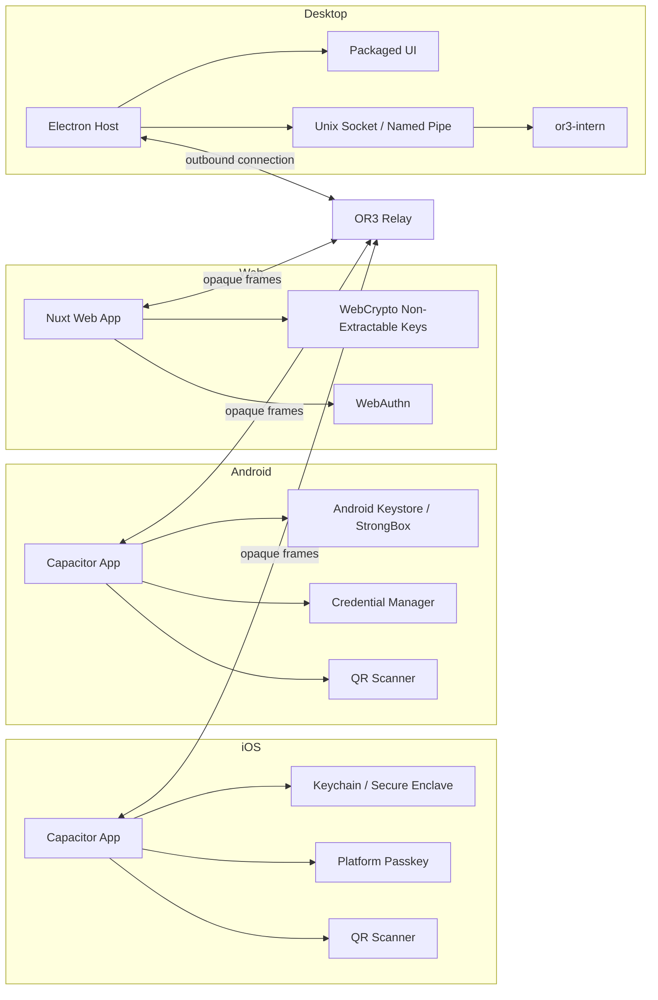

## Key Hierarchy

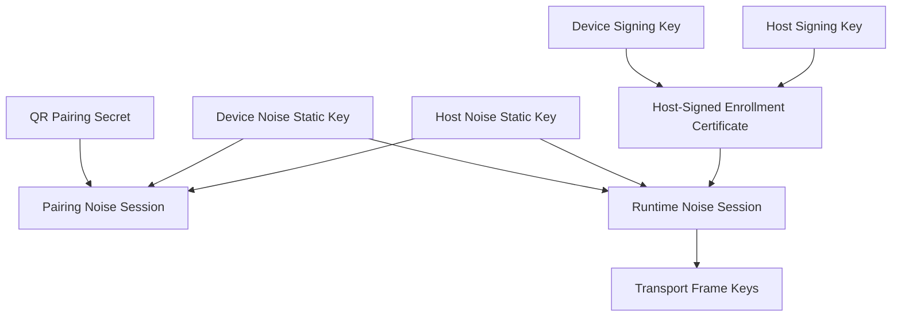

Key rules:

- Host signing keys sign durable trust records.
- Host and device Noise keys authenticate encrypted sessions.
- Pairing secrets are short-lived and single-use.
- Session keys exist only in memory.
- Passkey private keys stay inside platform authenticators and are scoped to OR3 RP IDs.

## Normal Pairing Flow

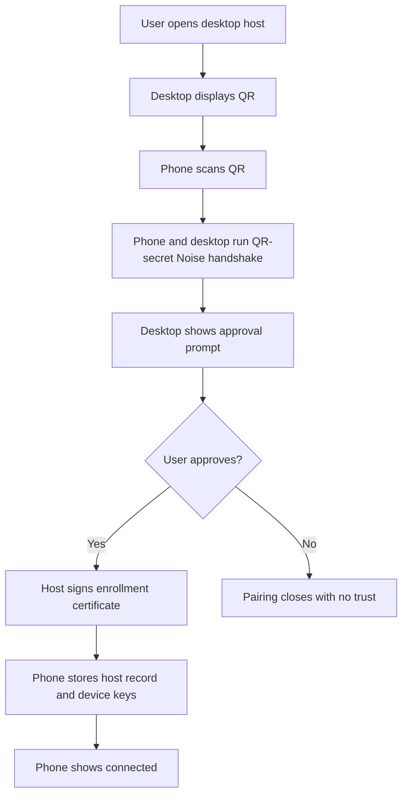

User-visible steps:

1. Scan QR.
2. Approve on desktop.
3. Done.

Security work hidden behind the flow:

- Desktop generates high-entropy QR secret.
- Phone generates local device identity keys.
- Relay routes only rendezvous frames.
- Pairing secret is mixed into a Noise handshake.
- Host signs enrollment after local approval.
- Phone stores trust material in secure storage.

## Pairing Sequence

```mermaid
sequenceDiagram
    participant H as Host Desktop
    participant R as Relay
    participant D as Device App
    participant DB as Host Trust DB

    H->>H: Generate pairing secret, host public keys, rendezvous ID
    H->>R: Create rendezvous with commitment and expiry
    H->>H: Render QR with secret and host identity
    D->>D: Scan QR, generate device identity keys
    D->>R: Join rendezvous by ID
    R->>H: Notify device joined
    H<->>D: Noise_XXpsk0 over relay frames
    D->>H: Encrypted enrollment proposal
    H->>H: Show local approval UI
    H->>DB: Persist approved device and certificate
    H->>D: Encrypted host-signed enrollment certificate
    H->>R: Consume rendezvous
```

## Runtime Session Flow

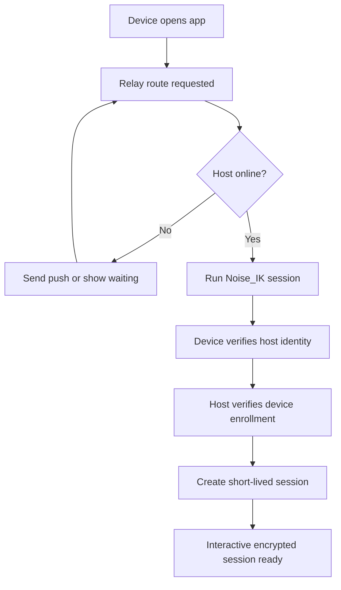

## Command Execution Flow

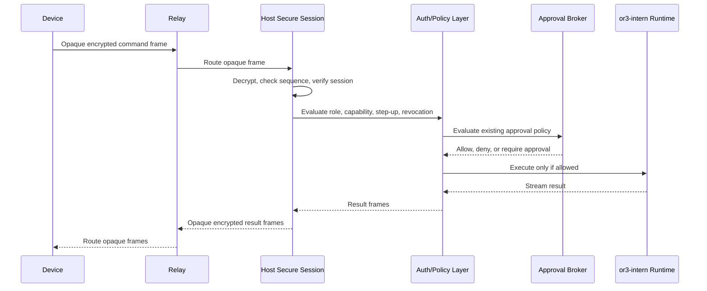

The relay is never in the authorization path. It only moves bytes.

## Sensitive Action Flow

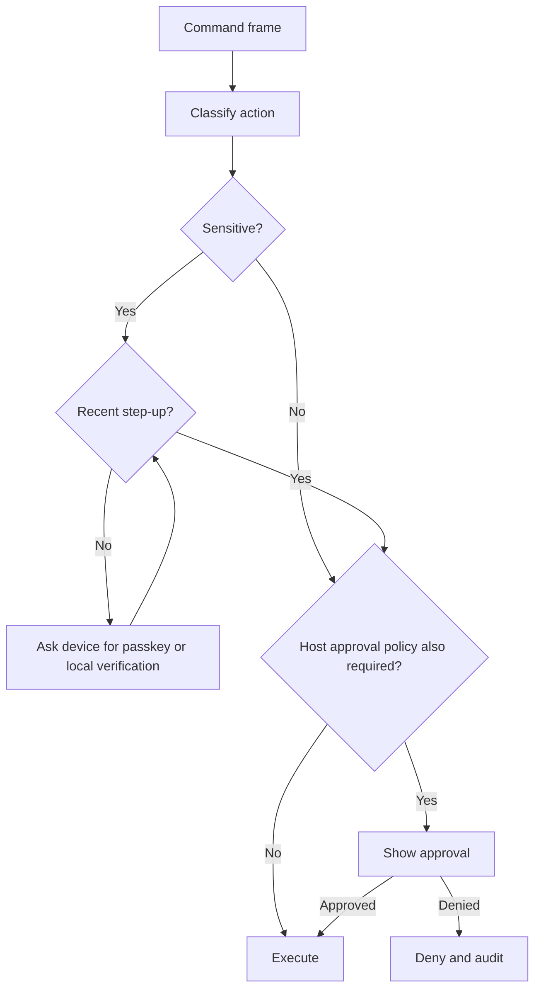

Sensitive examples:

- Terminal input.
- File writes/deletes/moves.
- Tool execution.
- Secrets access.
- Device revocation or role change.
- Security settings changes.
- Runtime profile escalation.

## Relay Compromise Scenario

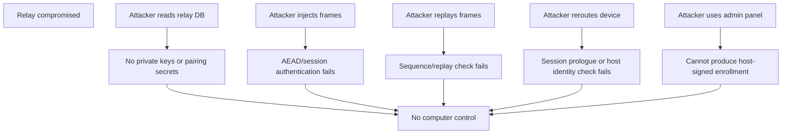

What a compromised relay can still do:

- Deny service.
- Delay messages.
- Observe limited metadata.
- Attempt phishing through compromised web surfaces if release and origin protections fail.

Mitigations:

- App-layer E2EE.
- Exact host identity binding.
- Local approval for enrollment.
- Metadata minimization.
- Strong web origin security and release integrity.
- Incident runbooks and relay credential rotation.

## Lost Phone and Revocation Flow

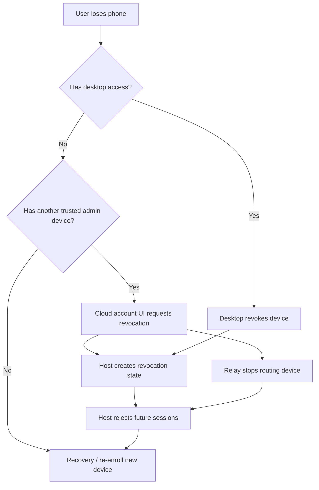

Revocation is strongest when performed on the host. Cloud-side revocation can stop routing immediately, but host-local trust state must also reject the device for control.

## Host Identity Change Flow

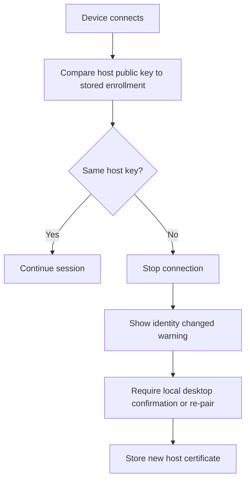

Never auto-accept host identity changes. A relay attacker could otherwise impersonate a host after causing a key mismatch.

## Platform Matrix

| Platform                | Default Trust Level                        | Key Storage                                   | Pairing                              | Sensitive Action Policy                                        |
| ----------------------- | ------------------------------------------ | --------------------------------------------- | ------------------------------------ | -------------------------------------------------------------- |
| iOS native              | High if Keychain/Secure Enclave available  | Keychain, Secure Enclave where possible       | QR camera + Universal Links fallback | Passkey/device unlock step-up, host policy                     |
| Android native          | High if hardware-backed Keystore available | Android Keystore, StrongBox where appropriate | QR camera + App Links fallback       | Passkey/device credential step-up, host policy                 |
| Electron desktop client | Medium/high depending storage and signing  | OS keychain or encrypted local store          | QR/deep link/local approval          | Host policy and local OS unlock where needed                   |
| Web browser             | Lower by default                           | WebCrypto non-extractable keys where possible | QR or desktop confirmation           | Short sessions, frequent passkey step-up, limited capabilities |

## UX Architecture

### First-Run Desktop

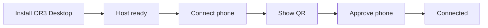

Desktop copy should answer one thing at a time:

- Before scan: "Scan with OR3 on your phone."
- During wait: "Waiting for your phone."
- Approval: "Allow Brendon's iPhone to control this computer?"
- Success: "Brendon's iPhone is connected."

Avoid showing URLs, tokens, relay names, cryptographic terms, or setup commands in the mainstream flow.

### Failure States

| Failure                 | Primary UI                                                      | Technical Behavior               |
| ----------------------- | --------------------------------------------------------------- | -------------------------------- |
| QR expired              | "This code expired. Show a new one."                            | Invalidate rendezvous and secret |
| Phone offline           | "Phone is offline. Try again when connected."                   | No enrollment state change       |
| Relay unavailable       | "OR3 cannot reach the connection service."                      | No trust change, retry/backoff   |
| Desktop rejects         | "Connection was not allowed."                                   | Destroy pairing session          |
| Host identity changed   | "This computer's identity changed. Reconnect from the desktop." | Block session until re-pair      |
| Storage lower assurance | "This device can connect, but it needs more frequent unlocks."  | Shorter TTL, lower trust level   |

## State Machines

### Pairing State

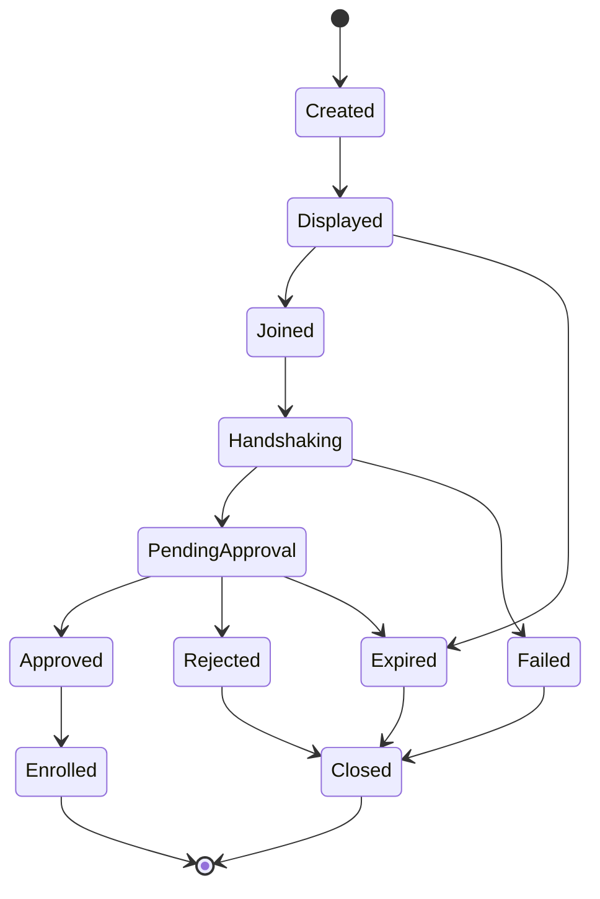

### Runtime Session State

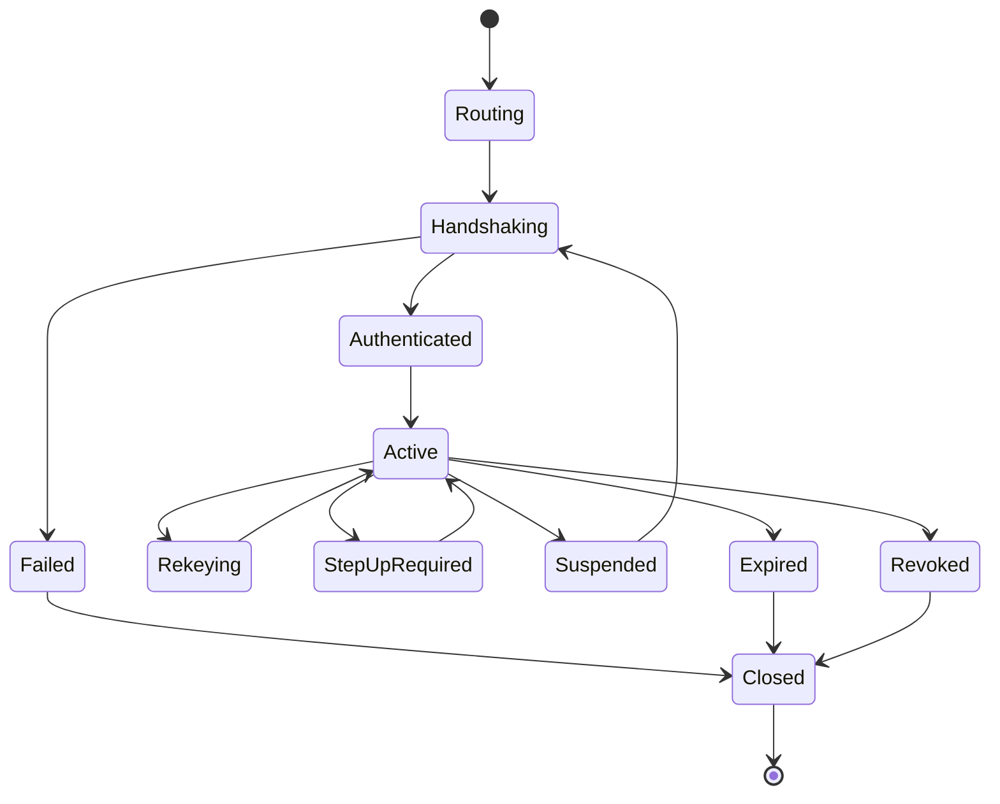

## Data Flow Privacy

```mermaid
flowchart LR
    Plain[Plain command]
    Encrypt[Encrypt on device]
    RelayFrame[Relay sees ciphertext + metadata]
    Decrypt[Decrypt on host]
    Execute[Execute locally]
    Result[Plain result]
    EncryptResult[Encrypt on host]
    RelayResult[Relay sees ciphertext + metadata]
    DeviceResult[Decrypt on device]

    Plain --> Encrypt --> RelayFrame --> Decrypt --> Execute --> Result --> EncryptResult --> RelayResult --> DeviceResult
```

Relay-visible metadata should be limited to:

- Route IDs.
- Account or tenant IDs needed for entitlement.
- Pseudonymous host/device identifiers.
- Connection timestamps.
- Frame sizes and counts.
- Delivery status.
- Safe error reason codes.

Relay-hidden data:

- Commands.
- Prompts.
- Files and file paths where feasible.
- Terminal contents.
- Tool arguments.
- Approval decisions contents.
- Memory/context payloads.
- Runtime results.

## Integration With Existing OR3 Systems

### Existing Pairing

The current six-digit pairing flow becomes legacy:

- Keep it for local development and compatibility.
- Do not use it for relay-mediated enrollment by default.
- Offer upgrade prompts for existing paired devices.
- Replace bearer-token authority with device identity and signed enrollment.

### Existing Passkeys

Existing passkey work remains valuable:

- Keep canonical RP ID `or3.chat` for production.
- Preserve exact-origin validation.
- Use passkeys for cloud account access and sensitive step-up.
- Keep recovery and revocation docs aligned with host-local trust.

### Existing Approvals and Profiles

Secure connections feed verified actor context into existing policy:

- `deviceId`.
- `role`.
- `capabilities`.
- `trustLevel`.
- `sessionId`.
- `stepUpAt`.
- `relayRouteId`.

Existing approval broker and runtime profiles still make the final execution decision.

## Attack Walkthroughs

### Attacker Steals OR3 Cloud Account

1. Attacker signs in to cloud account.
2. Attacker sees host metadata and tries to add a device.
3. Host requires QR secret and desktop approval.
4. Attacker cannot see desktop QR or approve locally.
5. Enrollment fails.

### Attacker Compromises Relay

1. Attacker reads relay database and route state.
2. Pairing secrets and private keys are not present.
3. Attacker routes injected frames to a host.
4. Host Noise decrypt/authentication fails.
5. No command executes.

### Attacker Steals Phone Storage

1. Attacker copies app files.
2. Device private keys are non-exportable or wrapped by platform secure storage.
3. Copied state cannot complete Noise session from another device.
4. If the original phone is also stolen and unlocked, role/capability limits and step-up still apply until revocation.

### Attacker Tricks User With Fake Web Page

1. Fake site attempts to use passkey or pairing.
2. WebAuthn RP ID/origin validation blocks credentials outside allowed origins.
3. Pairing requires desktop QR secret and local desktop approval.
4. Sensitive actions require host policy and step-up.

## Architecture Decisions

| Decision          | Choice                    | Reason                                                        |
| ----------------- | ------------------------- | ------------------------------------------------------------- |
| Relay trust       | Hostile relay             | Cloud compromise must not imply desktop compromise            |
| Pairing UX        | QR plus desktop approval  | Simple for consumers and physically grounded                  |
| Pairing crypto    | Noise with QR PSK         | Avoid low-entropy codes and protect against relay MITM        |
| Runtime crypto    | Noise IK after enrollment | Fast, mutually authenticated, forward-secret sessions         |
| Account auth      | Passkeys at OR3 RP ID     | Phishing-resistant cloud auth and step-up                     |
| Device authority  | Host-signed enrollment    | Cloud cannot mint device trust                                |
| Browser trust     | Lower assurance           | Web origins and storage are weaker than native secure storage |
| Local desktop IPC | Socket/pipe               | Avoid broad TCP exposure and renderer privilege escalation    |
| Migration         | Additive v2 path          | Existing users can upgrade without sudden lockout             |

## Open Design Spikes

1. Confirm exact cross-platform crypto library choices for X25519, Ed25519, ChaCha20-Poly1305, BLAKE2s/SHA-256, and CBOR/protobuf canonical encoding.
2. Validate iOS and Android plugins for non-exportable device keys that can sign or unwrap Noise keys without fragile custom native code.
3. Decide whether WebRTC DataChannels are MVP or phase 2. WSS relay is simpler; WebRTC may reduce latency but adds ICE/signaling complexity.
4. Define relay metadata retention limits with legal/support needs.
5. Choose how web devices expire by default and how explicit user elevation works.
6. Decide whether host signing and Noise keys live in Electron-managed OS secure storage, `or3-intern` secret store, or a shared local key service.

## Release Readiness Checklist

- Threat model reviewed.
- Protocol spec reviewed by external security expert.
- Cross-language crypto vectors committed.
- Malicious relay tests pass.
- Pairing usability validated.
- Revocation and recovery validated.
- Electron hardening validated.
- Capacitor secure storage validated on iOS and Android.
- Passkey RP ID, Associated Domains, and Digital Asset Links validated in production.
- Legacy pairing migration tested.
- Incident runbook rehearsed.
