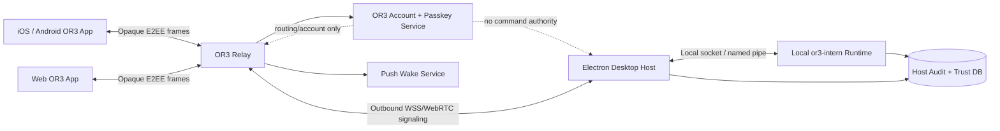
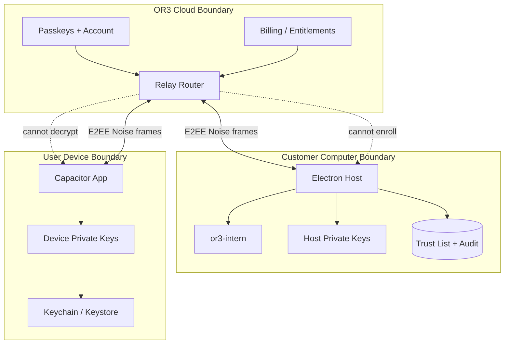
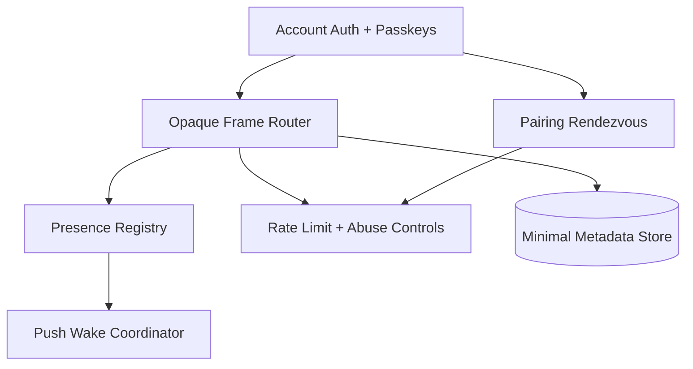
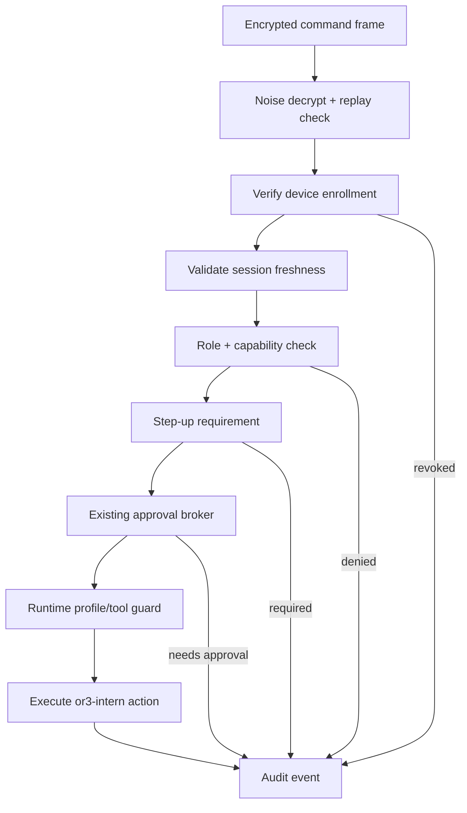

<!-- artifact_id: 2d5b8a3f-4f6e-48e0-a0d9-62acdf3585f1 -->

# Secure Connections Design

## Overview

Secure Connections v2 replaces URL/code-based remote pairing with a host-authoritative, QR-based, end-to-end encrypted connection system. The relay becomes a reachability and account service, not a security authority for computer control. The desktop host owns enrollment decisions. Devices own local identity keys. Every control session runs an application-layer encrypted protocol over relay-routed transports.

The current codebase already has useful foundations:

- `or3-app` is a Nuxt/Capacitor app with native mobile shells, passkey domain configuration, noble crypto dependencies, secure-token storage abstractions, pairing composables, active-host state, and passkey session UI logic.
- `or3-intern` already has WebAuthn/passkey support, paired-device records, approvals, roles, audit logs, secret storage, runtime profiles, access profiles, and hardening plans.
- The existing pairing system uses six-digit codes and bearer paired tokens. Secure Connections v2 keeps the device-management concepts but changes the security primitive to cryptographic device identity plus host-signed enrollment records.

## Design Principles

1. **The relay is hostile by design.** It can route, rate-limit, bill, and wake devices. It cannot authorize commands, decrypt frames, enroll devices, or reset host trust.
2. **The host is root for computer control.** OR3 cloud account state can stop routing, but only the host trust list can permit control.
3. **Pairing is physical.** A remote attacker must not pair without seeing the desktop QR and getting local host approval.
4. **Passkeys prove account and owner presence.** They do not replace host-local device enrollment.
5. **Native apps get stronger device assurance than browsers.** Web access is useful, but treated as lower trust unless explicitly elevated.
6. **Security prompts are product surfaces.** Confusing approval UX is a security bug.

## Research Summary

This design borrows mature patterns rather than inventing new cryptography:

- **Noise Protocol Framework:** static plus ephemeral key agreement, forward secrecy, transcript binding, PSK support for QR pairing, and compact transport frames.
- **WireGuard-style stance:** small cryptographic state machine, long-term public keys as identity, host-local trust lists, and explicit key rotation.
- **Magic Wormhole-style pairing:** a short-lived human ceremony gives two endpoints a high-entropy rendezvous secret while the network broker remains untrusted.
- **Signal-style safety model:** identities are stable, sessions are forward-secret, and identity changes require visible user handling.
- **Syncthing/SSH-style device trust:** devices are known by public identity keys and local approval, not by cloud-issued bearer tokens alone.
- **Tailscale Tailnet Lock-style cloud skepticism:** cloud coordination is useful, but local signatures should be required for membership authority.
- **WebAuthn/passkeys:** phishing-resistant user verification scoped to a relying-party domain, with exact origin validation and local authenticator user verification.
- **Electron and Capacitor guidance:** avoid remote code with native privileges, use restrictive CSP, validate IPC senders, use secure platform storage, avoid custom URL schemes for sensitive material, and prefer App Links/Universal Links.

## High-Level Architecture



### Component Responsibilities

| Component               | Responsibilities                                                                                   | Must Never Do                                                                |
| ----------------------- | -------------------------------------------------------------------------------------------------- | ---------------------------------------------------------------------------- |
| Electron host           | Show QR, approve enrollment, hold host trust root, run secure transport, gate local runtime access | Load arbitrary remote code with Node privileges, accept relay-only approval  |
| `or3-intern` runtime    | Execute commands, enforce profiles, approval broker, audit, passkeys, device records               | Trust relay metadata as execution authority                                  |
| Mobile app              | Generate device identity, scan QR, store keys securely, run E2EE sessions, present approvals       | Persist raw long-lived secrets in browser storage when secure storage exists |
| Web app                 | Provide lower-assurance access, passkey step-up, non-extractable browser keys where possible       | Default to full host-control trust without explicit host enrollment          |
| Relay                   | Account auth, host/device presence, rendezvous, opaque frame routing, push wake, abuse controls    | Decrypt payloads, mint host enrollment, approve commands, store private keys |
| Account/passkey service | Manage OR3 account login, billing, passkeys, recovery, device metadata                             | Override host-local trust list for control                                   |

## Trust Boundaries



## Cryptographic Model

### Keys

Use separate keys for identity signatures and transport key agreement. Do not reuse a key across signing, ECDH, WebAuthn, and Noise roles.

| Key                      | Owner         | Purpose                                                              | Storage                                                                            |
| ------------------------ | ------------- | -------------------------------------------------------------------- | ---------------------------------------------------------------------------------- |
| `host_sign_ed25519`      | Host          | Sign enrollment records, revocations, host key rotations             | Desktop OS secure store or encrypted `or3-intern` secret store                     |
| `host_noise_x25519`      | Host          | Static Noise responder key for pairing/session transport             | Desktop OS secure store or encrypted `or3-intern` secret store                     |
| `device_sign_ed25519`    | Device        | Sign device enrollment proposals, rekey requests, local attestations | iOS Keychain/Secure Enclave where possible, Android Keystore where possible        |
| `device_noise_x25519`    | Device        | Static Noise initiator key for runtime sessions                      | Platform secure storage; non-exportable unwrap key if direct X25519 is unavailable |
| `pairing_secret_256`     | QR ceremony   | Short-lived PSK for pairing handshake                                | Generated on host, encoded in QR, never sent to relay as plaintext                 |
| `session_keys`           | Device + host | Noise transport encryption keys                                      | Memory only                                                                        |
| WebAuthn credential keys | Authenticator | Account login and step-up user verification                          | Managed by platform authenticator, scoped to RP ID                                 |

### Algorithms

Initial target algorithms:

- Noise protocol framework for app-layer E2EE.
- X25519 for Diffie-Hellman transport key agreement.
- Ed25519 for enrollment and trust-list signatures.
- ChaCha20-Poly1305 for AEAD transport where available.
- BLAKE2s or SHA-256 for transcript hashing and identifiers.
- HKDF for local key derivation where needed.
- WebAuthn with `userVerification: "required"` for sensitive step-up.

Implementation note: if browser or platform support makes Ed25519/X25519 uneven in WebCrypto, use well-reviewed userland libraries already compatible with OR3's stack or add a focused crypto dependency such as `@noble/curves`. The design requirement is stable protocol behavior and cross-language test vectors, not a specific package.

## Pairing Protocol

### QR Payload

The desktop host generates a short-lived QR payload using deterministic binary encoding such as CBOR or protobuf. Do not sign or parse ad hoc JSON for cryptographic payloads.

```ts
interface PairingQRCodeV1 {
    version: 1;
    relayOrigin: string;
    rendezvousId: string;
    hostId: string;
    hostDisplayName: string;
    hostSigningPublicKey: string;
    hostNoisePublicKey: string;
    pairingSecret: string;
    expiresAtUnixMs: number;
    requestedAccountId?: string;
    capabilities: string[];
    qrNonce: string;
}
```

Encoding format:

```text
or3pair:v1:<base64url(cbor(PairingQRCodeV1))>
```

The relay receives only the `rendezvousId`, expiry, account/host routing metadata, and a commitment such as `HMAC(pairingSecret, "or3 relay rendezvous")`. It does not receive the raw `pairingSecret`.

### Pairing Flow

```mermaid
sequenceDiagram
    participant Desktop as Electron Host
    participant Relay as OR3 Relay
    participant Phone as Mobile App
    participant Runtime as or3-intern

    Desktop->>Desktop: Generate QR secret, host keys, rendezvous ID
    Desktop->>Relay: Register rendezvous ID + secret commitment + expiry
    Desktop->>Desktop: Display QR
    Phone->>Phone: Scan QR and generate device keys
    Phone->>Relay: Join rendezvous ID without revealing QR secret
    Relay-->>Desktop: Phone joined rendezvous
    Desktop<->>Phone: Noise_XXpsk0 handshake over opaque relay frames
    Phone->>Desktop: Encrypted enrollment proposal
    Desktop->>Desktop: Show local approval prompt
    Desktop->>Runtime: Persist paired device v2 after approval
    Desktop->>Phone: Host-signed enrollment certificate
    Phone->>Phone: Store host record + device keys securely
    Desktop->>Relay: Close rendezvous, mark single-use
```

Pairing uses `Noise_XXpsk0_25519_ChaChaPoly_BLAKE2s` or equivalent vetted parameters:

- `XX` allows mutual static key disclosure inside the encrypted handshake.
- `psk0` mixes the QR secret into the handshake from the start.
- The Noise prologue includes `protocolVersion`, `relayOrigin`, `rendezvousId`, `hostId`, `hostSigningPublicKey`, `hostNoisePublicKey`, `qrNonce`, and `expiresAtUnixMs`.
- Both sides abort if the prologue does not match their local view.

The enrollment proposal is encrypted inside the pairing session:

```ts
interface DeviceEnrollmentProposalV1 {
    version: 1;
    deviceId: string;
    deviceDisplayName: string;
    platform: 'ios' | 'android' | 'web' | 'desktop';
    deviceSigningPublicKey: string;
    deviceNoisePublicKey: string;
    requestedRole: 'viewer' | 'operator' | 'admin';
    requestedCapabilities: string[];
    accountBinding?: AccountBindingProof;
    secureStorageEvidence?: SecureStorageEvidence;
    createdAtUnixMs: number;
}
```

The host approval produces an enrollment certificate:

```ts
interface HostEnrollmentCertificateV1 {
    version: 1;
    hostId: string;
    deviceId: string;
    deviceSigningPublicKey: string;
    deviceNoisePublicKey: string;
    role: 'viewer' | 'operator' | 'admin';
    capabilities: string[];
    trustLevel:
        | 'native-hardware'
        | 'native-software'
        | 'web-limited'
        | 'legacy';
    accountId?: string;
    enrollmentEpoch: number;
    issuedAtUnixMs: number;
    expiresAtUnixMs?: number;
    hostSigningPublicKey: string;
    signature: string;
}
```

The signature covers all fields except `signature`, encoded canonically with domain separation:

```text
OR3-ENROLLMENT-CERTIFICATE-V1 || canonical_bytes(certificate_without_signature)
```

## Runtime Session Protocol

After enrollment, devices connect through the relay using a mutually authenticated Noise session.

Recommended pattern: `Noise_IK_25519_ChaChaPoly_BLAKE2s`.

- The device knows the host static Noise public key from the enrollment certificate.
- The host knows the device static Noise public key from the local trust list.
- The device authenticates the host before sending sensitive command data.
- The host authenticates the device before accepting command frames.

Session prologue:

```ts
interface SessionPrologueV1 {
    protocol: 'or3-secure-session';
    version: 1;
    relayOrigin: string;
    routeId: string;
    hostId: string;
    deviceIdHash: string;
    enrollmentCertificateHash: string;
    accountId?: string;
    minProtocolVersion: number;
    maxProtocolVersion: number;
}
```

Runtime flow:

```mermaid
sequenceDiagram
    participant Device
    participant Relay
    participant Host
    participant Runtime as or3-intern

    Host->>Relay: Maintain outbound host connection
    Device->>Relay: Request route to host ID
    Relay-->>Host: Incoming opaque session request
    Device<->>Host: Noise_IK handshake with transcript-bound prologue
    Host->>Runtime: Validate device trust, role, revocation epoch
    Runtime-->>Host: Accepted session claims
    Device->>Host: Encrypted command frame
    Host->>Runtime: Authorize and execute through existing policy layers
    Runtime-->>Host: Result stream
    Host-->>Device: Encrypted result frames
```

## Secure Frame Format

The relay routes opaque binary frames. Inside the Noise transport payload, endpoints exchange typed frames.

```ts
type SecureFrameKind =
    | 'hello'
    | 'command'
    | 'commandResult'
    | 'approvalRequest'
    | 'approvalDecision'
    | 'sessionRekey'
    | 'revocationNotice'
    | 'heartbeat'
    | 'error';

interface SecureFrameV1 {
    version: 1;
    kind: SecureFrameKind;
    sessionId: string;
    sequence: number;
    correlationId: string;
    sentAtUnixMs: number;
    body: Uint8Array;
}
```

Rules:

- Sequence numbers are monotonic per direction.
- Duplicate sequence numbers are rejected.
- Unexpected gaps are tolerated only for transports that explicitly support out-of-order delivery and maintain replay windows.
- Frame bodies use protobuf/CBOR schemas by kind.
- Errors are structured but do not leak secrets or plaintext payloads to relay logs.
- Rekey happens by policy: duration, message count, data volume, app resume, host request, or device request.

## Relay Design

### Relay Services



Relay accepts these facts as routing metadata:

- Account ID or pseudonymous route namespace.
- Host ID hash and device ID hash.
- Rendezvous ID and expiry.
- Subscription/entitlement state.
- Presence status.
- Frame size, timing, delivery state.

Relay must not have:

- Host private keys.
- Device private keys.
- Pairing secrets.
- Noise session keys.
- Plaintext command frames.
- Host trust-list write authority.

### Relay API Sketch

```ts
interface RelayClient {
    connectHost(input: HostRelayConnectInput): AsyncIterable<RelayEnvelope>;
    connectDevice(input: DeviceRelayConnectInput): AsyncIterable<RelayEnvelope>;
    createRendezvous(
        input: CreateRendezvousInput,
    ): Promise<CreateRendezvousResult>;
    joinRendezvous(input: JoinRendezvousInput): AsyncIterable<RelayEnvelope>;
    sendFrame(input: SendRelayFrameInput): Promise<void>;
    closeRoute(input: CloseRouteInput): Promise<void>;
}

interface RelayEnvelope {
    routeId: string;
    fromEndpointIdHash: string;
    toEndpointIdHash: string;
    frameType: 'noiseHandshake' | 'noiseTransport' | 'control';
    ciphertext: Uint8Array;
    receivedAtUnixMs: number;
}
```

The `control` frame type is only for relay-level routing state, never host command authorization. All host-control messages remain inside endpoint-encrypted frames.

## Host Runtime Integration

### Host Connection Manager

```go
type HostConnectionManager interface {
    StartRelayConnection(ctx context.Context) error
    CreatePairingQRCode(ctx context.Context, input PairingIntent) (PairingQRCode, error)
    HandlePairingSession(ctx context.Context, rendezvousID string) error
    ApproveEnrollment(ctx context.Context, request EnrollmentApprovalRequest) (EnrollmentCertificate, error)
    RejectEnrollment(ctx context.Context, requestID string, reason string) error
    AcceptSecureSession(ctx context.Context, request SecureSessionRequest) (SecureSession, error)
    RevokeDevice(ctx context.Context, deviceID string, reason string) error
}
```

### Local Runtime Channel

Electron should not call privileged APIs through a broad remote renderer bridge. The desktop host should communicate with `or3-intern` over:

- Unix domain socket on macOS/Linux.
- Named pipe on Windows.
- Loopback TCP only as a development or compatibility fallback.

The local channel uses existing `or3-intern` auth/session/profile logic, but host-originated requests include secure-connection claims:

```go
type SecureConnectionClaims struct {
    HostID          string
    DeviceID        string
    EnrollmentEpoch int64
    Role            string
    Capabilities    []string
    TrustLevel       string
    SessionID        string
    StepUpAt         time.Time
    RelayRouteID     string
}
```

These claims are derived from host-verified encrypted sessions, not from relay headers.

## Authorization Pipeline



Policy order:

1. Transport authentication.
2. Enrollment and revocation check.
3. Session freshness and replay check.
4. Role/capability check.
5. Sensitive action classification.
6. Passkey/biometric step-up check where configured.
7. Existing approval broker evaluation.
8. Runtime profile/tool/file/network policy.
9. Audit.

## Passkey Design

OR3 uses passkeys in two places:

1. **Cloud account authentication:** Sign in to `or3.chat`, billing, relay routing, recovery dashboard, host list.
2. **Owner presence for sensitive local actions:** Recent user verification that the host can require before sensitive commands execute.

Passkeys do not create host trust by themselves. A user with cloud account access must still complete local host enrollment for a new device.

### Account Binding During Pairing

During pairing, the mobile app may include an account binding proof inside the encrypted enrollment proposal:

```ts
interface AccountBindingProof {
    accountId: string;
    passkeySessionId?: string;
    relayIssuedAccountTokenHash?: string;
    signedNonce?: string;
}
```

The host uses this for display and policy:

- Show which OR3 account is requesting enrollment.
- Bind enrollment to the expected customer account if the host is signed in.
- Reject mismatched account enrollments in consumer mode.

The account binding proof does not bypass desktop approval.

## Platform Design

### Electron Desktop

Electron hardening requirements:

- Package OR3 UI locally or load only exact trusted HTTPS origins.
- Disable Node integration for renderer content.
- Enable context isolation.
- Enable sandboxing.
- Use a restrictive CSP.
- Validate IPC sender frames and origins.
- Expose a narrow typed API through `contextBridge`.
- Deny unexpected navigation and new windows.
- Avoid `file://`; prefer a custom app protocol for local packaged content.
- Do not call `shell.openExternal` with untrusted URLs.
- Flip Electron fuses that remove unneeded Node/inspect behavior in production.

Desktop host keys should be initialized during first launch and recoverable only through local desktop control. Key rotation must be visible and require re-trust on enrolled devices.

### Capacitor iOS

Requirements:

- Use Associated Domains for `applinks:or3.chat` and `webcredentials:or3.chat`.
- Host `apple-app-site-association` under the canonical domain without redirect.
- Store device identity material in Keychain, using Secure Enclave-backed keys where plugin capabilities allow.
- Use Universal Links for sensitive flows.
- Keep pairing QR scan native and direct.
- Treat local biometric plugins as convenience unlocks unless paired with server/passkey verification.

### Capacitor Android

Requirements:

- Use Digital Asset Links for app links and passkey credential delegation.
- Include production, beta, and debug signing fingerprints explicitly.
- Store device identity material in Android Keystore, preferring hardware-backed keys when available.
- Use App Links for sensitive flows.
- Prefer strong biometric or device credential authorization for key use where practical.
- Detect lower-assurance environments and apply policy.

### Web App

Browser access uses the same protocol but lower trust defaults:

- Browser devices enroll through host approval.
- Identity keys use WebCrypto non-extractable keys where possible.
- Sensitive actions require passkey step-up more often.
- Browser enrollment certificates default to shorter expiration.
- The UI labels browser devices separately from native devices.
- Cross-origin iframes and untrusted origins are not eligible for enrollment.

## Data Models

### Host Trust Store

Additive SQLite tables in `or3-intern` or equivalent local store:

```sql
CREATE TABLE secure_connection_devices (
  device_id TEXT PRIMARY KEY,
  host_id TEXT NOT NULL,
  display_name TEXT NOT NULL,
  platform TEXT NOT NULL,
  role TEXT NOT NULL,
  capabilities_json TEXT NOT NULL,
  trust_level TEXT NOT NULL,
  device_signing_public_key TEXT NOT NULL,
  device_noise_public_key TEXT NOT NULL,
  enrollment_certificate BLOB NOT NULL,
  enrollment_epoch INTEGER NOT NULL,
  status TEXT NOT NULL,
  created_at TEXT NOT NULL,
  last_seen_at TEXT,
  revoked_at TEXT,
  revoked_reason TEXT
);

CREATE TABLE secure_connection_sessions (
  session_id TEXT PRIMARY KEY,
  device_id TEXT NOT NULL,
  host_id TEXT NOT NULL,
  relay_route_id TEXT NOT NULL,
  enrollment_epoch INTEGER NOT NULL,
  status TEXT NOT NULL,
  created_at TEXT NOT NULL,
  last_seen_at TEXT NOT NULL,
  expires_at TEXT NOT NULL,
  step_up_at TEXT,
  last_sequence_in INTEGER NOT NULL DEFAULT 0,
  last_sequence_out INTEGER NOT NULL DEFAULT 0,
  FOREIGN KEY(device_id) REFERENCES secure_connection_devices(device_id)
);

CREATE TABLE secure_connection_pairing_sessions (
  rendezvous_id TEXT PRIMARY KEY,
  host_id TEXT NOT NULL,
  secret_commitment TEXT NOT NULL,
  status TEXT NOT NULL,
  requested_role TEXT NOT NULL,
  created_at TEXT NOT NULL,
  expires_at TEXT NOT NULL,
  consumed_at TEXT
);
```

### Relay Metadata Store

The relay stores only routing and account metadata:

```sql
CREATE TABLE relay_hosts (
  host_id_hash TEXT PRIMARY KEY,
  account_id TEXT NOT NULL,
  host_public_metadata_json TEXT NOT NULL,
  status TEXT NOT NULL,
  last_seen_at TEXT
);

CREATE TABLE relay_routes (
  route_id TEXT PRIMARY KEY,
  account_id TEXT NOT NULL,
  host_id_hash TEXT NOT NULL,
  device_id_hash TEXT,
  status TEXT NOT NULL,
  created_at TEXT NOT NULL,
  expires_at TEXT NOT NULL
);

CREATE TABLE relay_rendezvous (
  rendezvous_id TEXT PRIMARY KEY,
  account_id TEXT,
  host_id_hash TEXT NOT NULL,
  secret_commitment TEXT NOT NULL,
  status TEXT NOT NULL,
  created_at TEXT NOT NULL,
  expires_at TEXT NOT NULL,
  consumed_at TEXT
);
```

The relay does not store enrollment certificates as authority unless they are encrypted to the host or treated as cache-only public metadata. Host-local state remains authoritative.

## Error Handling

Use structured errors across host, app, and relay. Do not expose cryptographic details in user-facing copy.

```ts
type SecureConnectionErrorCode =
    | 'PAIRING_EXPIRED'
    | 'PAIRING_CONSUMED'
    | 'PAIRING_REJECTED'
    | 'RELAY_UNAVAILABLE'
    | 'HANDSHAKE_FAILED'
    | 'HOST_IDENTITY_CHANGED'
    | 'DEVICE_REVOKED'
    | 'SESSION_EXPIRED'
    | 'STEP_UP_REQUIRED'
    | 'CAPABILITY_DENIED'
    | 'APPROVAL_REQUIRED'
    | 'PROTOCOL_VERSION_UNSUPPORTED'
    | 'LOW_ASSURANCE_STORAGE';

interface SecureConnectionResult<T> {
    ok: boolean;
    value?: T;
    error?: {
        code: SecureConnectionErrorCode;
        safeMessage: string;
        correlationId: string;
        retryable: boolean;
    };
}
```

User-facing principles:

- Say what happened and what to do next.
- Avoid terms like Noise, PSK, CBOR, WSS, or relay in primary UI.
- For identity changes, stop and require explicit re-trust.
- For expired pairing, show a fresh QR action.
- For relay unavailability, show offline/retry state and local options.

## Migration Plan

### Current State

Current pairing uses:

- App starts pairing through `/internal/v1/pairing/requests`.
- Backend creates a six-digit code.
- Desktop approval can happen through CLI/code.
- App exchanges code for a paired-device bearer token.
- App stores host token using `useSecureHostTokens`.

### v2 Migration

1. Add secure connection capability discovery while leaving existing routes intact.
2. Add host identity and trust-list storage.
3. Add QR pairing v2 endpoints and relay rendezvous.
4. Add device identity generation in app secure storage.
5. Add host-signed enrollment certificates.
6. Add E2EE relay sessions.
7. Upgrade existing paired devices after local confirmation.
8. Disable six-digit remote pairing for relay paths.
9. Keep six-digit pairing only for local development or explicit legacy mode.
10. Remove legacy bearer-token remote control after a deprecation window.

## Testing Strategy

### Cryptographic Protocol Tests

- Cross-language Noise handshake vectors between Go and TypeScript.
- QR pairing test vectors with known encoded payloads, commitments, and transcript hashes.
- Enrollment certificate signing and verification vectors.
- Negative tests for tampered prologue, wrong relay origin, wrong host ID, wrong enrollment hash, invalid DH public keys, wrong PSK, and stale protocol versions.
- Replay tests for duplicate frame sequence numbers and reused rendezvous IDs.
- Rekey tests at message count, duration, and app resume boundaries.

### Malicious Relay Tests

- Relay drops handshake frames.
- Relay duplicates old handshake frames.
- Relay swaps host IDs between two accounts.
- Relay injects random bytes.
- Relay replays a previous approved command frame.
- Relay delays revocation notices.
- Relay routes a device to the wrong host.
- Relay database leak exposes route metadata and rendezvous commitments.
- Relay operator tries to synthesize an enrollment.

Expected result: no plaintext disclosure and no host command execution without endpoint-valid encrypted authorization.

### Pairing Tests

- QR entropy and TTL validation.
- Single-use rendezvous enforcement.
- Desktop approval required.
- Approval timeout.
- Reject path.
- Two phones race to use one QR.
- Camera failure fallback.
- Mobile offline during approval.
- Account mismatch warning.
- Host identity changed before approval.

### Host Authorization Tests

- Viewer cannot mutate.
- Operator cannot perform admin-only config.
- Revoked device cannot reconnect.
- Device with stale enrollment epoch cannot reconnect.
- Sensitive routes require step-up.
- Existing approval broker still triggers after secure session auth succeeds.
- Runtime profiles and tool guards still apply.
- Audit events are written without plaintext secrets.

### Electron Security Tests

- `nodeIntegration` disabled for renderer content.
- `contextIsolation` enabled.
- Sandbox enabled.
- CSP blocks inline and remote unapproved scripts.
- IPC sender validation rejects unexpected frames.
- Navigation allowlist blocks external origins.
- New window handler denies unexpected windows.
- Production fuses configured.
- Packaged UI does not use `file://` where a custom protocol is required.

### Capacitor Native Tests

- iOS Associated Domains validation.
- Android Digital Asset Links validation for all signing fingerprints.
- Secure storage availability and fallback states.
- Key generation, use, deletion, and reinstall behavior.
- Biometric/device credential key-use gating where available.
- Universal Links/App Links do not leak pairing secrets to custom schemes.
- Root/jailbreak/debug signal policy tests where implemented.

### Web Tests

- Non-extractable WebCrypto key path.
- Browser storage fallback limits.
- Passkey step-up required for sensitive actions.
- Cross-origin iframe enrollment blocked.
- XSS/CSP regression tests for auth and pairing pages.

### UX Tests

- First-glance comprehension under 500 ms.
- First-time pairing in three steps.
- Error recovery after expired QR.
- Lost phone revocation comprehension.
- Identity-change prompt comprehension.
- Sensitive approval prompt comprehension.
- Accessibility tests for QR alternatives, screen readers, focus order, timeouts, and reduced-motion flows.

### Performance Tests

- Pairing QR generation under interactive thresholds.
- Relay session establishment p50/p95/p99.
- Frame encryption/decryption throughput.
- Battery and background-resume behavior on mobile.
- Relay deploy/restart reconnect behavior.
- Host sleep/wake reconnect behavior.

## Release Gates

Before enabling secure relay control for production customers:

1. External cryptography/security review of the pairing and session protocols.
2. Threat model review and sign-off.
3. Cross-language test vectors committed and passing.
4. Malicious relay test suite passing.
5. Electron security checklist automated or manually verified for release builds.
6. iOS/Android association files validated in production.
7. Recovery and revocation flows tested end to end.
8. Legacy pairing migration tested from existing app state.
9. UX study validates the three-step flow and prompt comprehension.
10. Incident-response runbook tested in a tabletop exercise.
