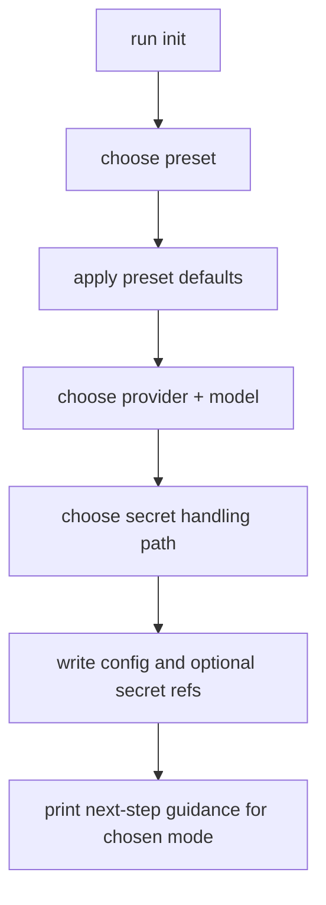

# Design

## Overview

The work should be implemented as a hardening program inside the existing `cmd/or3-intern` startup path and existing internal packages, not as a new service layer. The center of gravity is:

- `init` for generating safe starting configurations
- `doctor` for evaluating security posture
- startup gating in `main.go`, `service.go`, and `security_setup.go`
- service auth hardening in `service_auth.go`
- outbound policy enforcement in `internal/security` and `internal/mcp`
- profile enforcement through existing config + runtime profile resolution
- SQLite-backed persistence for service job history and any durable MCP tool catalog state

This fits the current architecture because the repo already has:

- a single-process CLI entrypoint
- structured config defaults and env overrides
- secret-store and audit primitives
- access profiles for channels/triggers
- host-policy validation for outbound network access
- an MCP manager abstraction and job registry model

The plan raises the default posture by tightening those seams, not by introducing a frontend, REST control plane rewrite, or extra infrastructure.

## Affected areas

- `cmd/or3-intern/init.go`
  - Add security presets, service-facing bootstrap flow, safer API key handling, and preset-aware generated config.
- `cmd/or3-intern/doctor.go`
  - Separate advisory warnings from blocking findings and encode enforceable startup policy for service/webhook/exposed modes.
- `cmd/or3-intern/main.go`
  - Invoke strict validation before starting service-facing ingress and before connecting remote MCP in hardened modes.
- `cmd/or3-intern/service.go`
  - Enforce stricter service startup preconditions and integrate any local transport additions.
- `cmd/or3-intern/service_auth.go`
  - Add bounded replay protection and future request-binding extension points.
- `cmd/or3-intern/security_setup.go`
  - Centralize config secret resolution, audit verification, host policy validation, and startup enforcement checks.
- `cmd/or3-intern/service_request.go`
  - Potential home for request binding metadata if service auth later binds tokens to request details.
- `internal/config/config.go`
  - Extend config defaults and possibly add a preset/mode marker or additional service/auth settings.
- `internal/security/*`
  - Reuse secret store, audit, and network host policy code; possibly add nonce cache utilities if kept outside `cmd`.
- `internal/mcp/manager.go`
  - Add reconnect/backoff behavior, tool catalog lifecycle improvements, and persistence hooks.
- `internal/db/*`
  - Add SQLite migrations/tables for service job history and optionally MCP tool catalog snapshots.
- `internal/agent/job_registry.go`
  - Bridge in-memory job events to durable storage while preserving current streaming semantics.
- `docs/security-and-hardening.md`, `docs/configuration-reference.md`, `docs/mcp-tool-integrations.md`, `docs/cli-reference.md`, `README.md`
  - Document presets, startup enforcement, transport choices, and updated MCP capabilities.

## Control flow / architecture

### 1. Preset-driven initialization

`init` should stop being a generic local-only questionnaire and instead become a mode selector that writes a coherent security posture.

High-level flow:



Implementation notes:

- Keep `config.Default()` as the baseline source of truth.
- Layer preset mutations on top of `initDefaults(cwd)`.
- Avoid embedding mode-specific logic throughout startup by encoding the desired posture directly into generated config.
- Prefer adding small helper functions such as `applySecurityPreset`, `promptSecretStorageMode`, and `generateStrongServiceSecret`.

### 2. Startup enforcement path

Today, config loads, security setup runs, and subsystems start. The hardened design adds an explicit validation gate between config resolution and subsystem start.

Proposed flow in `main.go`:

1. Load config and apply env overrides.
2. Open SQLite and resolve secret/audit setup through `setupSecurity`.
3. Build a startup validation context from the effective config.
4. Run a stricter variant of doctor/startup validation.
5. Refuse startup for blocking findings based on active ingress and mode.
6. Only then build providers, MCP manager, channels, triggers, and service listeners.

This keeps the policy deterministic and centralized. `doctor` remains the policy engine; startup simply consumes the same rule set in enforcement mode.

### 3. Doctor as policy engine, not just output formatter

`doctor.go` should evolve from a flat warning printer into a rule source with severities and enforcement classes.

Suggested shape:

```go
type doctorSeverity string

const (
    severityInfo  doctorSeverity = "info"
    severityWarn  doctorSeverity = "warn"
    severityBlock doctorSeverity = "block"
)

type doctorFinding struct {
    Level   doctorSeverity
    Area    string
    Message string
    Code    string
}

type doctorMode struct {
    Strict        bool
    EnforceStart  bool
    Exposed       bool
    Command       string
}
```

Key idea:

- some findings remain advisory in local/dev mode
- the same finding can be blocking for `service`, `webhook`, open-access channels, or exposed presets
- startup gating should use finding codes rather than parsing output strings

This lets tests and config fixtures assert exact enforcement outcomes.

### 4. Replay-safe service auth

The existing service bearer token format is lightweight and appropriate for this repo. Keep that format initially, but add nonce uniqueness tracking within the token validity window.

Recommended approach:

- add a bounded in-memory nonce cache keyed by nonce + issued-at bucket
- store expiry timestamps and evict old entries opportunistically on insert/check
- inject the replay guard into `serviceAuthMiddleware` / `validateServiceAuthorization`

Possible shape:

```go
type serviceReplayGuard struct {
    mu        sync.Mutex
    seen      map[string]time.Time
    maxEntries int
}

func (g *serviceReplayGuard) CheckAndStore(nonce string, expiresAt time.Time, now time.Time) error
```

Why in-memory first:

- matches single-process runtime
- no migration required for the core fix
- bounded RAM is easy to reason about
- avoids distributed coordination complexity the repo does not need

Follow-on extension point:

- extend `serviceTokenClaims` with optional request binding fields, such as `Method`, `Path`, and `BodySHA256`
- validate those only when explicitly enabled, preserving backward compatibility for existing OR3 Net callers

### 5. Safer same-host transport

For same-machine OR3 Net integration, Unix domain sockets are the most repo-aligned addition.

Recommended design:

- extend `config.ServiceConfig` with optional transport settings, e.g. `Transport string`, `UnixSocket string`
- keep TCP loopback as today’s default
- when `transport=unix`, start the same HTTP handlers over a Unix listener instead of `ListenAndServe`
- keep auth middleware enabled initially for consistency, even on Unix sockets

This yields a safer local path without introducing a new protocol or service. Windows named pipes can be left as a future parity task unless explicitly prioritized.

### 6. Mandatory profile resolution for non-CLI ingress

The repo already has profile resolution logic in the doctor/runtime surface. The plan should standardize it as a startup invariant.

Rules:

- `service` must resolve to an effective profile when enabled outside local/dev mode
- `triggers.webhook` must resolve to a trigger profile when enabled
- every enabled open-access channel must resolve to an effective channel/default profile
- profiles with privileged capability must also enumerate `allowedTools`
- public ingress must not reach `exec` or `run_skill_script` unless an explicit profile allowlist says so

Implementation strategy:

- reuse existing `resolveEffectiveProfile` helpers inside startup enforcement
- avoid duplicating policy logic in channel packages
- continue enforcing tool capability at runtime, but move misconfiguration detection to startup as well

### 7. Remote MCP hardening and completeness

#### Hardening path

Remote HTTP MCP is already wired through host policy and startup endpoint validation. The missing piece is fail-closed startup behavior.

Rules:

- if any enabled MCP server uses `sse` or `streamablehttp`, require `security.network.enabled=true`
- require `defaultDeny=true`
- reject literal `*` and broad allowlists in strict/exposed modes
- validate configured endpoints before connection attempts

This belongs in startup validation plus `setupSecurity` endpoint checks.

#### Completeness path

The MCP manager can be extended in-place:

- add reconnect loop/backoff for remote transports
- persist discovered tool metadata in SQLite for operational visibility and faster warm starts
- support add/remove/reload on config refresh or explicit command path later

The docs already call these gaps out, so the design should keep them incremental:

- do not add a separate gateway in this phase
- do not create long-lived unbounded goroutine trees
- bound reconnect timers and failure logs

### 8. Durable service job history

Current service jobs are tracked in-memory through `agent.JobRegistry`. To improve completeness while preserving current streaming behavior:

- keep the in-memory registry as the live fan-out mechanism
- persist lifecycle events to SQLite on register/start/progress/complete/fail/abort
- read durable state for inspection/recovery endpoints later

A small additive schema is sufficient, e.g.:

```sql
CREATE TABLE service_jobs (
  job_id TEXT PRIMARY KEY,
  kind TEXT NOT NULL,
  status TEXT NOT NULL,
  session_key TEXT,
  created_at INTEGER NOT NULL,
  updated_at INTEGER NOT NULL,
  completed_at INTEGER,
  error_text TEXT,
  final_text_preview TEXT,
  event_summary_json TEXT
);
```

Boundedness:

- truncate stored final output using existing preview/truncation patterns
- store event summaries rather than full unbounded SSE history
- keep cleanup/manual retention rules simple at first

## Data and persistence

### SQLite changes

Required if implementing the completeness track:

- add a `service_jobs` table and indexes for status/timestamps
- optionally add a `mcp_tool_catalog` table if remote tool catalog snapshots are persisted

Migration rules:

- additive migrations only
- no backfill required for old service jobs
- startup must tolerate an empty new table

### Config changes

Likely additions:

- init preset selection metadata or helper-only logic
- optional service transport settings for Unix sockets
- optional service auth settings, such as replay cache size / token max age / binding mode
- possibly a hardened mode marker if needed for docs/UX, though preset-generated concrete config is preferred over a global mode switch

Config compatibility notes:

- existing configs must continue to load unchanged
- env overrides remain supported
- stricter behavior should be tied to active ingress and explicit hardened presets where necessary to avoid breaking local CLI usage

### Session and memory scope implications

- no change to chat/session key formats is required
- service/profile enforcement must preserve existing session isolation semantics
- job history persistence must avoid cross-session leakage by storing session key metadata only where already part of the service contract
- no memory retrieval schema changes are required for the security track

## Interfaces and types

### Initialization helpers

Likely additions in `cmd/or3-intern/init.go`:

```go
type initSecurityPreset struct {
    Name        string
    Description string
}

func applySecurityPreset(cfg *config.Config, preset string, cwd string)
func promptSecretStorageMode(reader *bufio.Reader, out io.Writer, cfg config.Config) (string, error)
func generateStrongServiceSecret() (string, error)
```

### Doctor / startup validation

```go
type startupValidationMode struct {
    Command      string
    Strict       bool
    Exposed      bool
    EnforceStart bool
}

func doctorFindingsForMode(cfg config.Config, mode startupValidationMode) []doctorFinding
func validateStartupConfig(cfg config.Config, mode startupValidationMode) error
```

### Service auth replay protection

```go
type serviceReplayGuard struct {
    mu         sync.Mutex
    seen       map[string]time.Time
    maxEntries int
}

func newServiceReplayGuard(maxEntries int) *serviceReplayGuard
func (g *serviceReplayGuard) CheckAndStore(claims serviceTokenClaims, now time.Time) error
func validateServiceAuthorization(secret, header string, now time.Time, guard *serviceReplayGuard, req *http.Request) error
```

A small wrapper can preserve the current public call shape while routing through the new guard-aware implementation.

### Service job persistence

Likely interfaces in `internal/db` or `internal/agent`:

```go
type ServiceJobRecord struct {
    JobID            string
    Kind             string
    Status           string
    SessionKey       string
    CreatedAtUnix    int64
    UpdatedAtUnix    int64
    CompletedAtUnix  int64
    ErrorText        string
    FinalTextPreview string
    EventSummaryJSON string
}

func (d *DB) UpsertServiceJob(ctx context.Context, rec ServiceJobRecord) error
func (d *DB) GetServiceJob(ctx context.Context, jobID string) (ServiceJobRecord, error)
```

### MCP persistence / reconnect types

Keep these modest and internal to `internal/mcp`:

```go
type reconnectPolicy struct {
    InitialBackoff time.Duration
    MaxBackoff     time.Duration
    MaxAttempts    int
}

type persistedRemoteTool struct {
    ServerName  string
    LocalName   string
    RemoteName  string
    SchemaJSON  string
    UpdatedAt   int64
}
```

## Failure modes and safeguards

- **Invalid preset expansion**
  - Preset helpers should always start from `config.Default()`/`initDefaults()` and only set known fields.
- **Secret store unavailable during init**
  - If the user selected secret-store-backed credentials for a hardened preset and secret store setup fails, the flow should stop or explicitly fall back only when the user chooses unsafe local-only storage.
- **Startup validation false positives**
  - Use finding codes and command-aware modes to avoid blocking plain CLI chat unnecessarily.
- **Audit verification failures**
  - Continue to fail startup when strict audit with `verifyOnStart` is enabled and verification fails.
- **Replay cache growth**
  - Bound replay cache size and evict expired entries on access/insert.
- **Remote MCP endpoint misconfiguration**
  - Validate before connect, fail closed in strict/exposed mode, and log concise errors.
- **Broad allowlists silently widening exposure**
  - Treat literal `*` and broad host lists as blocking in exposed contexts.
- **Unix socket file hygiene**
  - Ensure stale socket cleanup and restrictive filesystem permissions.
- **Job persistence drift from in-memory state**
  - Write lifecycle changes from the same state transitions that publish registry events to avoid split-brain semantics.
- **Session isolation mistakes**
  - Preserve current profile resolution and tool guard checks even after startup enforcement is added; startup rejection supplements runtime checks, not replaces them.

## Testing strategy

Use Go’s `testing` package and keep coverage concentrated on the risky seams.

### Unit tests

- `cmd/or3-intern/init_test.go`
  - preset selection, secret handling choices, generated config expectations
- `cmd/or3-intern/doctor_test.go`
  - blocking vs advisory findings, startup enforcement modes, ingress/profile requirements, remote MCP/network requirements
- `cmd/or3-intern/service_test.go`
  - service startup refusal, transport selection, protected route behavior
- `cmd/or3-intern/service_auth_test` additions in `service_test.go`
  - replay rejection, expiry, future timestamps, bad signatures, malformed tokens, optional request binding hooks
- `cmd/or3-intern/security_setup_test.go`
  - startup validation integration with secret resolution and endpoint validation
- `internal/security/network_test.go`
  - deny-by-default behavior, broad allowlist rejection helpers, endpoint parsing
- `internal/mcp/manager_test.go`
  - reconnect/backoff logic, persisted catalog loading, remote endpoint policy behavior

### Integration tests

- SQLite-backed tests for service job persistence in `internal/db` and/or `cmd/or3-intern/service_test.go`
- startup accept/reject tests using fixture configs for safe local, safe private service, unsafe public/no profiles, unsafe remote MCP/no network policy, and unsafe privileged/no sandbox
- service command tests over TCP loopback and Unix sockets where supported

### Regression coverage

Add table-driven regression cases for each high-signal doctor/startup condition:

- weak/missing service secret
- non-loopback service bind
- profiles disabled or missing ingress mappings
- webhook missing secret/effective profile
- privileged tools without Bubblewrap
- empty exec allowlist
- remote MCP without deny-by-default network policy
- wildcard or broad allowed hosts
- skill execution without quarantine/trust policy
- public ingress reaching skill execution or exec posture

### Fuzzing

Add Go fuzz targets for:

- service request decoding
- service subagent request decoding
- structured autonomy/task parsing where current parsing is security-sensitive
- webhook payload parsing
- host policy endpoint parsing/validation

### CI / quality gates

Document and wire gates for:

- `go test ./...`
- `go test -race ./...`
- focused fuzz smoke runs on security-sensitive parsers
- `staticcheck ./...`
- `gosec ./...`
- targeted coverage thresholds for `cmd/or3-intern` auth/doctor code and `internal/security`
