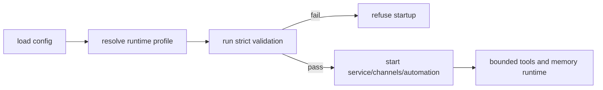

# Overview

This plan makes `or3-intern` smaller in responsibility and stricter in posture without rewriting the runtime. It builds on existing service mode, doctor checks, security profiles, audit, secret store, network policy, and channel tooling.

The lightweight approach is:

1. freeze the internal API contract that `or3-net` depends on,
2. define a handful of supported runtime profiles on top of existing config,
3. make strict hardening checks mandatory in hosted modes, and
4. prove the SQLite and retrieval path under longer-lived workloads.

# Affected areas

- `cmd/or3-intern/service*.go` — stable v1 service behavior, startup refusal, compatibility checks.
- `cmd/or3-intern/doctor.go` — stricter hosted-mode gating and clearer operator output.
- `internal/config/*` — runtime profile definitions, validation, defaults, and env/config mapping.
- `internal/security/*` — network policy, MCP HTTP posture, audit/secret-store requirements.
- `internal/channels/*`, `internal/skills/*`, `internal/mcp/*` — duplicate protection, safer defaults, and hosted-profile restrictions.
- `internal/db/*`, `internal/memory/*` — benchmark and persistence validation coverage.
- `docs/*` — service contract, hardening profiles, and operational procedures.

# Control flow / architecture

Profiles stay additive and config-driven rather than introducing a new runtime layer.

1. Config load resolves a named runtime profile.
2. Startup validation expands that profile into required hardening expectations.
3. `doctor --strict` or equivalent validation runs automatically for hosted profiles, service mode, channels, or automation.
4. If validation passes, runtime starts with the existing service, channel, tool, and memory packages.
5. If the selected profile disallows local exec or risky integrations, those paths are refused early and point operators toward `or3-sandbox` for isolation.



# Data and persistence

SQLite remains the single persistence layer for sessions, memory, secrets, audit state, and service-related data.

Additive changes only where needed:

- profile selection may be stored in config with backward-compatible defaults,
- service contract compatibility tests should not require schema changes,
- migration and durability work should reuse the current migration and integrity-check paths rather than adding a new store.

Config and env changes:

- add a small named runtime-profile setting if one does not already exist,
- map each profile to existing security, tool, service, and channel settings instead of creating duplicate knobs,
- keep explicit overrides available for advanced local use, but fail closed in hosted profiles.

# Interfaces and types

Prefer small Go-native config and validation shapes.

Example profile model:

```go
type RuntimeProfile string

const (
    ProfileLocalDev RuntimeProfile = "local-dev"
    ProfileHostedService RuntimeProfile = "hosted-service"
    ProfileHostedNoExec RuntimeProfile = "hosted-no-exec"
)
```

Example validation hook:

```go
func ValidateProfile(cfg Config) error
```

Service contract work should stay version-first, for example by pinning `internal/v1` request and response fixtures used by `or3-net` compatibility tests.

# Failure modes and safeguards

- Service contract drift: compatibility tests fail when request aliases, stream events, or abort behavior change unexpectedly.
- Unsafe hosted config: startup refuses weak secrets, missing audit/secret store, or unsafe network/MCP posture in strict profiles.
- Channel duplication: inbound dedupe blocks repeated delivery from causing repeated tool execution.
- Risky integrations: hosted profiles disable or quarantine local exec, unsafe skills, or non-loopback MCP HTTP unless explicitly allowed.
- Retrieval bloat: benchmarks and soak tests catch query or prompt-assembly regressions before they become operational issues.
- Migration mistakes: migration tests and integrity-check procedures keep backward compatibility visible.

# Testing strategy

- Unit tests for profile resolution, validation errors, channel dedupe, and hosted-mode restrictions.
- Service API compatibility tests for turn, subagent, stream, and abort flows, including `or3-net` request aliases that are intentionally supported.
- SQLite-backed tests for migrations, integrity checks, scoped retrieval, and long-session behavior.
- Benchmarks for history load, hybrid retrieval, prompt assembly, and document indexing hot paths.
- Regression coverage ensuring hosted profiles route isolation-sensitive execution toward `or3-sandbox` rather than broad local exec.
