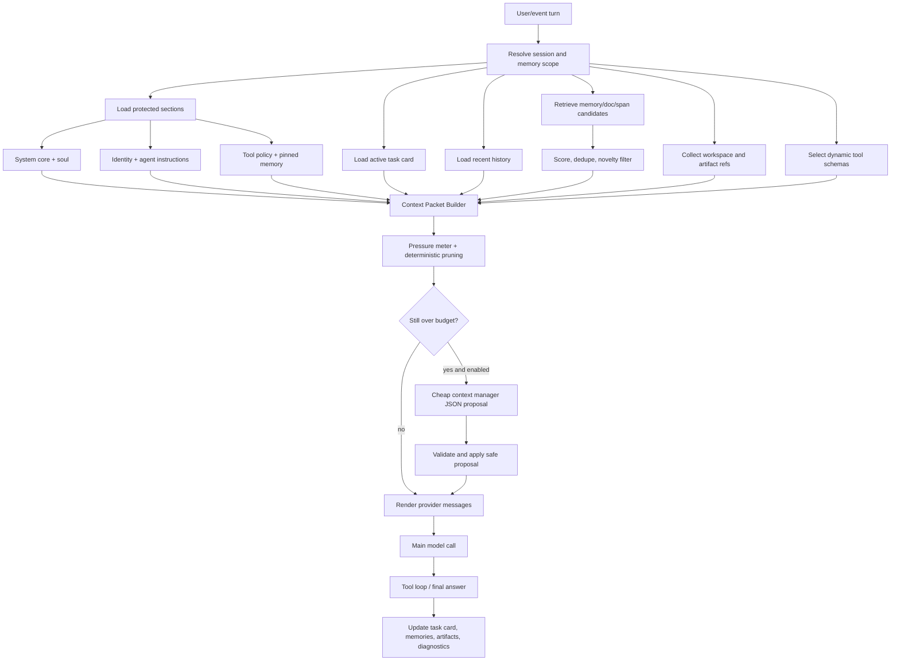

# Design: Token-Efficient Context Packets

## Overview

or3-intern already has the right primitives for a memory hierarchy: SQLite-backed messages, pinned memory, typed consolidation notes, FTS, sqlite-vec vector search, workspace context, skills, tool guards, and artifact storage. The proposed design keeps those systems and **routes every model call through a budgeted, cache-aware assembly path inside the existing `internal/agent` package**. It does not introduce a new top-level package, a new service, a new daemon, or a new external dependency.

The design fits the current architecture because it is a refactor of `internal/agent.Builder.BuildWithOptions` and `composeSystemPrompt`, plus small in-place extensions to `internal/memory.Retriever`, `internal/db`, `internal/artifacts`, `internal/tools`, and `internal/config`. It converts the current char-capped system prompt assembly into a sectioned packet model with explicit budgets, pressure diagnostics, dynamic retrieval packing, task state, optional cheap-model maintenance, and a stable prefix tuned for provider prompt caching.

Core ideas:

> Preserve rich agent identity and capability, but make every optional context source earn its place in the packet.
>
> Order the prompt so that the slow, expensive part of every turn is **already cached** by the provider.

Non-goals (explicit):

- No new top-level package such as `internal/contextpack`. New code is added as files inside the existing packages it extends.
- No new SQLite tables when an existing table can carry the data with an added column or a new `kind` value.
- No replacement of `internal/memory.Retriever`; it is extended in place with a new optional candidate-mode method while the existing `Retrieve` API stays.
- No removal or rewrite of soul, identity, AGENTS, tool policy, pinned memory, or skills behavior.

## Affected areas

All changes are in-place inside packages that already exist. The list below names the files that grow or are added inside their existing package.

- `internal/agent/prompt.go` (existing, edited)
  - `Builder.BuildWithOptions` is refactored to assemble the packet through new helpers in the same package.
  - `composeSystemPrompt` is split into `renderStablePrefix` and `renderVolatileSuffix` so the cache boundary is explicit.
  - Existing `PromptParts`, history reconstruction, vision attachment handling, and tool-call/result reconstruction stay byte-compatible.

- `internal/agent/prompt_budget.go` (new file, same package)
  - Owns `ContextPacket`, `ContextSection`, `ContextSnippet`, `ContextRef`, `BudgetReport`, `SectionUsage`, `PruneEvent`, deterministic token estimation, section budget accounting, pressure states, and deterministic pruning.
  - Lives next to the existing prompt code so it remains discoverable and avoids cross-package indirection.

- `internal/agent/task_card.go` (new file, same package)
  - Typed task-card struct, deterministic merge/update logic, deterministic rendering with a token budget, and DB read/write helpers that delegate to `internal/db`.

- `internal/agent/runtime.go` and `internal/agent/structured_autonomy.go` (existing, edited)
  - Hook into task-card update points after assistant turns and significant tool results.
  - Record artifact summaries (as `memory_notes` of `kind = 'artifact_summary'`) and emit pressure diagnostics.

- `internal/config/config.go` (existing, edited)
  - Adds an optional `Context` config block and an optional `ContextManager` block.
  - Keeps existing `HistoryMax`, `MemoryRetrieve`, `VectorK`, `FTSK`, `BootstrapMaxChars`, `BootstrapTotalMaxChars`, and `MaxToolBytes` as the source of truth when no `Context` block is set, so legacy configs are not regressed.

- `internal/db/db.go` and `internal/db/store.go` (existing, edited)
  - Adds the `task_state` table (the only genuinely new table) and additive `ALTER TABLE memory_notes` columns guarded by existing migration helpers.
  - **Does not** add `message_spans` or `artifact_summaries` tables in the first iteration. Span-level retrieval reuses `messages` plus consolidation summaries; artifact summaries reuse `memory_notes` + `artifacts`.

- `internal/memory/retrieve.go` (existing, edited)
  - Adds an internal `retrieveCandidates` step (more candidates than today's top-K) and a `packToBudget` step. The existing `Retriever.Retrieve` signature stays as a thin wrapper that calls `retrieveCandidates` then `packToBudget` with current defaults, preserving every existing caller.
  - Adds task-overlap, novelty, status, expiration, confidence, and source-quality signals to scoring.

- `internal/memory/consolidate.go` (existing, edited)
  - Reuses the existing structured consolidation approach. New kinds (`decision`, `warning`, `artifact_summary`, `file_summary`) are added gradually; existing typed JSON validation is shared with the optional cheap context manager.

- `internal/artifacts/store.go` (existing, edited)
  - Adds a small helper to write a paired `memory_notes` summary row when a large tool output is artifacted. The artifact binary store itself is unchanged.

- `internal/tools/registry.go` and tool registration call sites (existing, edited)
  - Adds optional `Group` / `Capabilities` metadata on registered tools and a deterministic selector used by the prompt builder.
  - `ToolGuardFromContext`, approval broker, sandbox, and runtime profile checks remain authoritative at execution time.

- Tests live next to the code they exercise: `internal/agent/*_test.go`, `internal/memory/*_test.go`, `internal/db/*_test.go`, `internal/config/*_test.go`, `internal/tools/*_test.go`.

Files created across the whole change: roughly `internal/agent/prompt_budget.go`, `internal/agent/task_card.go`, and the matching `_test.go` files. Everything else is an in-place edit.

## Control flow / architecture

### Per-turn context assembly



### Context packet sections

`ContextPacket` should explicitly separate protected, always-present sections from optional or prunable sections.

```go
type ContextPacket struct {
    SystemCore      ContextSection
    SoulIdentity    ContextSection
    ToolPolicy      ContextSection
    ActiveTaskCard  ContextSection
    PinnedMemory    ContextSection
    MemoryDigest    ContextSection
    RecentHistory   []providers.ChatMessage
    Retrieved       []ContextSnippet
    Workspace       []ContextSnippet
    ToolSchemas     []providers.ToolDef
    ArtifactRefs    []ContextRef
    OutputReserve   int
    BudgetReport    BudgetReport
}

type ContextSection struct {
    Name      string
    Text      string
    Protected bool
    Required  bool
    Budget    int
    Used      int
    MinBudget int
}

type ContextSnippet struct {
    ID          string
    Kind        string
    Text        string
    Summary     string
    Score       float64
    SourceRef   ContextRef
    TokenEstimate int
    Reason      string
}

type ContextRef struct {
    Type string // message|memory|artifact|file|doc|tool
    ID   string
    Path string
    Why  string
}
```

Protected sections (always present, with minimum budgets):

- System core
- Soul / identity / behavior
- Tool policy and safety rules
- Pinned memory
- Active task card minimum viable state

Prunable sections, in this order:

1. Low-score retrieved snippets
2. Redundant retrieved snippets
3. Workspace excerpts not tied to current files
4. Artifact previews beyond summaries
5. Older recent history except unresolved tool-call/result pairs
6. Memory digest lines below importance threshold
7. Tool schemas for unlikely optional tools
8. Task card detail beyond required fields, never the whole card

### Cache-aware section ordering

The renderer is split into two regions so providers (OpenAI, Anthropic, OpenRouter, etc.) can cache the expensive prefix:

**Stable prefix** (eligible for provider prompt caching, byte-stable across turns within a session as long as inputs are unchanged):

1. System Core (immutable runtime identity, response style, memory policy, tool-use policy)
2. Soul (`SOUL.md` or default soul)
3. Identity (`IDENTITY.md`)
4. AGENTS (`AGENTS.md`)
5. Tool Policy (`TOOLS.md`, safety notes, channel/autonomy constraints, exposed tool group notes)
6. Static Memory (`MEMORY.md` content surfaced today)
7. Pinned Memory (deterministic order: by `id` ASC)
8. Tool schemas (only the exposed set; sorted by tool name; re-emitted only when the exposed set changes)

**Cache breakpoint** is inserted here. For Anthropic, this is where `cache_control: {type: "ephemeral"}` is attached to the last stable system content block. For OpenAI/OpenRouter automatic prompt caching, the boundary is implicit but we still keep the prefix byte-stable so the provider's hash matches.

**Volatile suffix** (changes every turn or every few turns; never cached):

9. Memory Digest (derived from current scope/session state)
10. Retrieved RAG Snippets (per-turn search results)
11. Workspace Context (current files, doc retriever output)
12. Heartbeat (clock, intervals) — moved out of the cached prefix
13. Structured Trigger Context (event metadata) — moved out of the cached prefix
14. Active Task Card (compact, but updated each turn)
15. Recent Rolling Chat (raw history window plus unresolved tool-call/result pairs; user's latest request always retained)
16. Output Reserve (not text; reserves generation budget)

Rules that protect cache hits:

- The stable prefix must not contain timestamps, random IDs, map-iteration-ordered fields, or any per-turn mutable text.
- Tool schemas in the stable prefix are sorted by tool name and serialized through a deterministic JSON encoder.
- The exposed tool set is recomputed per turn but only swapped into the prefix when it actually changes; minor intent shifts that do not change the set leave the prefix bytes identical.
- A regression test renders the same packet twice in the same session with no input changes and asserts the stable-prefix bytes match exactly.
- When `Hardening` settings, soul, identity, AGENTS, tool policy, pinned memory, or the exposed tool set genuinely change, the prefix changes and the next call rebuilds the cache (this is correct).

This ordering is the single biggest token-cost lever in the plan: with provider prompt caching, the stable prefix (typically 2k-6k tokens of soul + identity + AGENTS + tool policy + static memory + pinned memory + tool schemas) is billed at a small fraction of normal input tokens after the first call, so cost reductions compound on top of the budget work below.

### Current `prompt.go` mapping (repo-grounded Phase 1 baseline)

The current implementation in [internal/agent/prompt.go](internal/agent/prompt.go) already gives us a strong starting point for Phase 1.

Today, `Builder.BuildWithOptions` assembles prompt inputs in this order:

1. Resolve `scopeKey` from `DB.ResolveScopeKey`.
2. Load pinned memory via `DB.GetPinned` and render it with `formatPinned`.
3. Retrieve durable memory via `Mem.Retrieve`, then split it into:
  - `memText` via `formatRetrievedBounded`
  - `digestText` via `formatMemoryDigestBounded`
4. Load indexed doc context via `DocRetriever.RetrieveDocs`.
5. Load workspace context via `memory.BuildWorkspaceContext`.
6. Load recent scoped history via `DB.GetLastMessagesScoped`, preserving tool-call/result pairing and vision attachment expansion.
7. Load the task card via `loadTaskCard` and render it with `renderTaskCard`.
8. For autonomous turns only, load:
  - heartbeat text via `currentHeartbeatText`
  - structured trigger metadata via `formatStructuredEventContext`
9. Render the system prompt via `composeSystemPrompt`.

Current section layout, exactly as rendered by `renderStablePrefix` / `renderVolatileSuffix` today:

**Already in the stable prefix**

- `SOUL.md`
- `Identity` when `IdentityText` is non-empty
- `AGENTS.md`
- `Static Memory` when `Builder.StaticMemory` is non-empty
- `TOOLS.md`
- `Pinned Memory`
- `Memory Digest` when durable notes were retrieved
- `Retrieved Memory`
- `Workspace Context` when workspace snippets are available
- `Indexed File Context` when doc retrieval returns matches
- `Skills Inventory`

**Already in the volatile suffix**

- `Heartbeat` (autonomous turns only)
- `Structured Trigger Context`
- `active_task_card` is currently embedded inside `Structured Trigger Context`, not rendered as its own top-level section yet

**Still outside the system prompt**

- Raw recent history remains in `PromptParts.History`, not in the system prompt text
- User message content and any image attachments remain separate provider messages
- Tool schemas are not yet serialized into the prompt path at all; they are a later provider-request concern, not a Phase 1 `prompt.go` concern

**Protected content for first implementation**

The following content must be treated as protected under budget pressure because it is already part of the repo's behavioral identity and is tested today:

- `SOUL.md` / default soul
- `Identity`
- `AGENTS.md`
- `TOOLS.md`
- `Pinned Memory`
- `Skills Inventory`

`Memory Digest`, `Retrieved Memory`, `Workspace Context`, and `Indexed File Context` remain important but are the first stable-prefix sections that may be budget-reduced after protected content reaches minimums.

Existing test coverage already proves most of this baseline and should be reused rather than rewritten:

- [internal/agent/prompt_test.go](internal/agent/prompt_test.go) covers identity inclusion, static memory inclusion, section ordering (`SOUL.md` → `Identity` → `AGENTS.md`; `AGENTS.md` → `Static Memory` → `TOOLS.md`), workspace/doc context inclusion, memory digest inclusion, stable-prefix byte stability, and volatile heartbeat/trigger isolation.
- [internal/agent/runtime_test.go](internal/agent/runtime_test.go) already covers artifact-overflow behavior by asserting that oversized tool output is stored as an artifact summary memory note rather than left inline.

This is why Phase 1 can stay intentionally small: most of the foundational behavior is already present in the live codebase, so the remaining work is mainly to preserve it, measure it, and avoid regressing cache stability while later phases add budgets and retrieval packing.

### How sections fit together

The prompt renderer keeps a clear hierarchy. Numbering below matches the cache-aware order above.

1. **System Core** — small immutable identity of the runtime, response style, memory policy, tool-use policy. Target: 300-800 tokens.
2. **Soul / Identity / Behavior** — `SOUL.md`, `IDENTITY.md`, and `AGENTS.md` content, compressed only semantically and with minimum budgets. Must not be deleted for token savings.
3. **Tool Policy** — safety notes, tool constraints, output artifacting rules, channel/autonomy constraints, exposed tool group notes.
4. **Static Memory** — `MEMORY.md` content surfaced today by `Builder.StaticMemory`.
5. **Pinned Memories** — ultra-stable facts/preferences/project rules from `memory_pinned`. Always included, capped and summarized only when above budget.
6. **Tool schemas** — only schemas for exposed tools for this turn. The registry still enforces permissions at execution time. Sorted deterministically.
7. **Memory Digest** — short stable project/session summary derived from pinned memory, high-confidence durable notes, and current scope.
8. **Retrieved RAG Snippets** — top relevant snippets after score, dedupe, novelty, lifecycle, and budget packing. Includes IDs and reasons instead of full old messages.
9. **Workspace Context** — existing `memory.BuildWorkspaceContext` and `memory.DocRetriever` outputs, repacked as snippets with budgets.
10. **Heartbeat** — current clock/interval text from `Builder.currentHeartbeatText`.
11. **Structured Trigger Context** — event metadata for triggered turns.
12. **Active Task Card** — small working state for the current session. Replaces dependence on long raw rolling history for task continuity.
13. **Recent Rolling Chat** — short window of raw messages plus unresolved tool-call/result pairs. User's latest request is always retained.
14. **Artifact References** — summaries and IDs for large tool outputs or attachments. Full content fetched only on demand.

## Data and persistence

### Config changes

Add a config section while preserving old fields:

```go
type ContextConfig struct {
    Mode string `json:"mode"` // poor|balanced|quality|custom
    TokenEstimator string `json:"tokenEstimator"` // approx|provider
    MaxInputTokens int `json:"maxInputTokens"`
    OutputReserveTokens int `json:"outputReserveTokens"`
    SafetyMarginTokens int `json:"safetyMarginTokens"`
    Sections ContextSectionBudgets `json:"sections"`
    Retrieval ContextRetrievalConfig `json:"retrieval"`
    Pressure ContextPressureConfig `json:"pressure"`
    Tools ContextToolConfig `json:"tools"`
    Artifacts ContextArtifactConfig `json:"artifacts"`
    TaskCard ContextTaskCardConfig `json:"taskCard"`
}

type ContextSectionBudgets struct {
    SystemCore int `json:"systemCore"`
    SoulIdentity int `json:"soulIdentity"`
    ToolPolicy int `json:"toolPolicy"`
    ActiveTaskCard int `json:"activeTaskCard"`
    PinnedMemory int `json:"pinnedMemory"`
    MemoryDigest int `json:"memoryDigest"`
    RecentHistory int `json:"recentHistory"`
    RetrievedMemory int `json:"retrievedMemory"`
    WorkspaceContext int `json:"workspaceContext"`
    ToolSchemas int `json:"toolSchemas"`
    ArtifactRefs int `json:"artifactRefs"`
}
```

Recommended default budgets, all user-adjustable:

| Section | Poor | Balanced | Quality |
|---|---:|---:|---:|
| System core | 500 | 650 | 800 |
| Soul / identity / behavior | 600 | 900 | 1400 |
| Tool policy | 400 | 600 | 900 |
| Active task card | 300 | 450 | 700 |
| Pinned memories | 500 | 800 | 1200 |
| Memory digest | 350 | 600 | 900 |
| Recent rolling chat | 900 | 1800 | 3500 |
| Retrieved RAG snippets | 700 | 1400 | 2800 |
| Workspace context | 500 | 1000 | 2500 |
| Tool schemas | 700 | 1200 | 2500 |
| Artifact references | 200 | 350 | 700 |
| Safety margin | 300 | 500 | 800 |
| Output reserve | 1200 | 2000 | 4000 |
| Approx input target | 5k | 9k | 18k |

Mode behavior:

- Poor mode:
  - Recent history: around 6 messages plus unresolved tool pairs.
  - Retrieved memory: top 3 packed snippets.
  - Tool schemas: read/search/list defaults; write/exec/web only on intent.
  - Cheap context manager: only above 70% pressure or large tool output.

- Balanced mode:
  - Recent history: around 10 messages plus unresolved tool pairs.
  - Retrieved memory: top 5 packed snippets.
  - Tool schemas: task-relevant groups.
  - Recommended for cost-sensitive users; opt-in.
  - Cheap context manager: above 80% pressure, task shift, low-confidence retrieval, or 8+ turns.

- Quality mode:
  - Recent history: around 16 messages plus unresolved tool pairs.
  - Retrieved memory: top 8 packed snippets.
  - Workspace and tool budgets are larger, but still reference-first.
  - Cheap context manager: above 85% pressure or maintenance events.

**First-release default is `quality`** so users upgrading from the current build do not see any silent reduction in context. `balanced` becomes the recommended default in a follow-up release once evaluation fixtures confirm parity. Users can opt into `poor`/`balanced` explicitly via config from day one.

Existing fields:

- `HistoryMax` remains as a compatibility fallback for recent-history message count.
- `MemoryRetrieve`, `VectorK`, and `FTSK` remain retrieval candidate knobs and can seed new defaults.
- `BootstrapMaxChars` and `BootstrapTotalMaxChars` remain as legacy safety caps until prompt rendering fully moves to token budgets.

### SQLite schema changes

Additive migration for task state:

```sql
CREATE TABLE IF NOT EXISTS task_state (
    id INTEGER PRIMARY KEY AUTOINCREMENT,
    session_key TEXT NOT NULL,
    task_key TEXT NOT NULL,
    state_json TEXT NOT NULL,
    source_message_ids TEXT NOT NULL DEFAULT '[]',
    source_memory_ids TEXT NOT NULL DEFAULT '[]',
    source_artifact_ids TEXT NOT NULL DEFAULT '[]',
    status TEXT NOT NULL DEFAULT 'active',
    created_at INTEGER NOT NULL,
    updated_at INTEGER NOT NULL,
    completed_at INTEGER NOT NULL DEFAULT 0,
    UNIQUE(session_key, task_key)
);
CREATE INDEX IF NOT EXISTS task_state_session_status ON task_state(session_key, status, updated_at);
```

Task card JSON shape:

```json
{
  "current_user_goal": "make or3-intern token efficient without quality loss",
  "current_plan": ["add context packet builder", "add task card", "budget RAG snippets"],
  "hard_constraints": ["preserve soul and safety", "SQLite-first", "bounded RAM"],
  "decisions_made": ["use deterministic pruning before cheap model"],
  "open_questions": [],
  "relevant_message_ids": [1842],
  "relevant_memory_ids": [91],
  "relevant_artifact_ids": [],
  "active_files": ["internal/agent/prompt.go", "internal/memory/retrieve.go"],
  "last_known_status": "planning context packet design"
}
```

Additive migration for message spans is **deferred**. The first iteration reuses the existing `messages` table for retrieval (already FTS-indexed via the existing memory pipeline that consolidates into `memory_notes`) plus on-demand consolidation summaries written to `memory_notes` with `kind = 'summary'`. A dedicated `message_spans` table is only added in a later iteration if measurements show that retrieving from `messages` + consolidated summaries is insufficient. This avoids carrying a second nearly-duplicate corpus and a second FTS index in every user database.

If and when spans become justified, the table shape would mirror the existing `memory_notes` + `memory_fts` + `memory_vec` triple rather than introducing a third pattern.

Additive memory metadata migration:

```sql
ALTER TABLE memory_notes ADD COLUMN summary TEXT NOT NULL DEFAULT '';
ALTER TABLE memory_notes ADD COLUMN source_artifact_id TEXT NOT NULL DEFAULT '';
ALTER TABLE memory_notes ADD COLUMN confidence REAL NOT NULL DEFAULT 0;
ALTER TABLE memory_notes ADD COLUMN updated_at INTEGER NOT NULL DEFAULT 0;
ALTER TABLE memory_notes ADD COLUMN expires_at INTEGER NOT NULL DEFAULT 0;
ALTER TABLE memory_notes ADD COLUMN supersedes_id INTEGER;
```

Each `ALTER TABLE` call is wrapped in the existing column-existence check helper so re-running migrations on already-migrated databases is a no-op. Existing rows keep all current columns and remain readable by the existing retrieval paths.

Memory kinds:

- `pinned`: remains in `memory_pinned`; render as part of protected pinned section.
- `fact`, `preference`, `goal`, `procedure`, `episode`: extend current constants.
- `decision`, `warning`, `artifact_summary`, `file_summary`: add to `db` constants for durable notes.
- `task_state`: lives in the new `task_state` table, not in `memory_notes`. Only durable task lessons should ever become memory.

Artifact summaries reuse existing tables — no new `artifact_summaries` table:

- The full output stays in the existing `artifacts` store.
- A companion `memory_notes` row is written with `kind = 'artifact_summary'`, `source_artifact_id` set to the artifact ID, `summary` set to a bounded summary, `importance` reflecting how load-bearing the artifact is, `scope` matching the resolved session/scope, and `status = 'active'`.
- This row is indexed by the existing `memory_fts` and `memory_vec` machinery, so retrieval, novelty, dedupe, and lifecycle (`stale`/`superseded`/`expired`) are already handled by current code.
- Diagnostic queries like "all artifact summaries for this session" use the existing memory store with a kind filter; no new index needed beyond what `memory_notes` already has.

This collapses what was previously planned as three new tables (`task_state`, `message_spans`, `artifact_summaries`) into one new table (`task_state`) plus additive columns on `memory_notes`.

### Session and memory-scope implications

- The packet builder resolves scope with existing `DB.ResolveScopeKey` before loading memory, pinned items, task state, spans, and docs.
- Session-specific task state stays keyed by the channel/session key; durable memory retrieval uses resolved scope rules.
- Channel isolation must honor `Hardening.IsolateChannelPeers` and existing session-link behavior.
- Global memory is merged only through existing `GetPinned`/retriever scope behavior.

## Interfaces and types

### In-place agent helpers

No new package. The new types live inside `internal/agent` (in `prompt_budget.go` and `task_card.go`) so they sit next to the existing `Builder` and `PromptParts`.

```go
package agent

// in prompt_budget.go

type ContextPacket struct {
    StablePrefix []ContextSection // System Core, Soul, Identity, AGENTS, Tool Policy,
                                  // Static Memory, Pinned Memory, Tool Schemas
    VolatileSuffix []ContextSection // Memory Digest, Retrieved, Workspace, Heartbeat,
                                    // Structured Trigger, Task Card, Recent History
    RecentHistory []providers.ChatMessage
    ToolSchemas   []providers.ToolDef // mirrored into StablePrefix as serialized text
    OutputReserve int
    Budget        BudgetReport
}

// Build extends Builder.BuildWithOptions in place; it is called by the existing
// public method, which still returns PromptParts so callers do not change.
func (b *Builder) buildPacket(ctx context.Context, opts BuildOptions) (ContextPacket, []memory.Retrieved, error)

// Render produces the strings/messages currently produced by composeSystemPrompt,
// but split so the stable prefix can be marked for provider caching.
func renderStablePrefix(p ContextPacket) string
func renderVolatileSuffix(p ContextPacket) string
func renderProviderMessages(p ContextPacket, history []providers.ChatMessage, user any) []providers.ChatMessage

// SelectTools is a deterministic selector used before provider request assembly.
func (b *Builder) selectTools(opts BuildOptions, taskCard TaskCard) []providers.ToolDef
```

`Builder.BuildWithOptions` keeps its current signature `(PromptParts, []memory.Retrieved, error)`. Internally it now does `buildPacket` then `renderProviderMessages`, and the `BudgetReport` is attached to `PromptParts` via a new optional field that defaults to zero value for callers that ignore it.

### Budget and pressure types

```go
type BudgetReport struct {
    Mode string
    EstimatedInputTokens int
    OutputReserveTokens int
    MaxInputTokens int
    BudgetUsedPercent float64
    Pressure string // normal|warning|high|emergency
    Sections []SectionUsage
    LargestSections []string
    Pruned []PruneEvent
    RetrievalRejected []RetrievalReject
}

type SectionUsage struct {
    Name string
    Budget int
    Used int
    Protected bool
    Truncated bool
}

type PruneEvent struct {
    Section string
    Ref ContextRef
    TokensSaved int
    Reason string
}
```

Pressure states:

- Normal: 0-60% of input budget.
  - Include normal balanced packet.
  - Keep configured history and snippet count.

- Warning: 60-80%.
  - Reduce low-score retrieved snippets.
  - Prefer summaries over raw spans.
  - Drop optional workspace/doc snippets not tied to active files.

- High pressure: 80-95%.
  - Summarize old history/tool outputs.
  - Shrink recent history to unresolved tool pairs plus latest messages.
  - Expose only the most likely tool groups.
  - Consider cheap context manager if enabled and trigger conditions match.

- Emergency compaction: 95%+ or over hard budget.
  - Keep protected sections with minimum budgets.
  - Keep task card minimum, latest user request, unresolved tool pair, top 1-3 snippets, and fetchable refs.
  - Do not remove soul, identity, pinned memory, tool policy, or safety rules.
  - If still over budget, fail closed with a clear internal error rather than silently weakening safety.

### RAG strategy

What to store:

- Durable memory notes: typed facts, preferences, goals, procedures, decisions, warnings, episodes, summaries, artifact summaries, and file summaries.
- Pinned memory: ultra-stable items in `memory_pinned`, protected and separately capped.
- Message spans: bounded chunks of chat/tool messages, with summaries and embeddings where available.
- Artifact summaries: short records for large outputs and attachments.
- File summaries: from doc index or workspace inspections when high-confidence and useful.

Chunking messages:

- Split long messages into spans by paragraphs or line groups with a target of roughly 150-350 tokens per span.
- Preserve `message_id`, `chunk_index`, role, session key, token estimate, source artifact IDs if present, and tool call IDs from payload JSON.
- Summarize tool outputs immediately when above preview threshold.
- Do not embed secrets; skip or redact spans that match secret-like patterns or come from secret-bearing tool/config sources.

Candidate retrieval (in-place extension of `memory.Retriever`, existing `Retrieve` API preserved as a wrapper):

1. Build query from latest user request plus active task card goal/constraints/active files.
2. Retrieve candidates from:
   - `memory_notes` vector and FTS (existing).
   - `memory_docs` doc retriever (existing).
   - `memory_notes` rows of `kind = 'artifact_summary'` for artifact-relevant queries (reuses existing FTS/vector indexes).
   - The `messages` table directly when the agent or a tool explicitly asks for a message ref. (No `message_spans` corpus in this iteration.)
3. Retrieve more than the final injection count, for example 30 candidates in balanced mode.
4. Merge by stable source ID.
5. Score and dedupe.
6. Pack snippets to budget.

Scoring formula:

```text
score =
  semantic_score       * 0.35
+ keyword_score        * 0.20
+ task_overlap_score   * 0.20
+ importance_score     * 0.10
+ recency_score        * 0.05
+ source_quality       * 0.05
+ novelty_score        * 0.05
- redundancy_penalty
- stale_penalty
- expired_penalty
- low_confidence_penalty
```

Novelty/dedupe:

- Reject a candidate if it is too similar to an already selected snippet, using embedding similarity when available and normalized text shingle/Jaccard fallback otherwise.
- Reject or demote snippets that merely repeat pinned memory or the task card.
- Prefer candidates that add a new fact, constraint, decision, procedure, warning, artifact, or source reference.
- Keep a `RetrievalRejected` record with reason: stale, superseded, expired, duplicate, repeats_pinned, low_score, over_budget, wrong_scope, or unsafe.

Avoid stuffing irrelevant RAG:

- Retrieval produces candidates; packing decides what enters the prompt.
- `RetrievedMemory` has a token budget and max snippet count.
- Include concise rendered snippets:

```text
[M91 goal score=.84 src=chat:1842]
Goal: Make or3-intern token-efficient without quality loss. Ref: m1842.
```

- Prefer references when useful context is large:

```text
Refs:
- message:1842 original token-efficiency brainstorm
- artifact:test-output-2026-04-25 failing memory retriever tests
- file:internal/memory/retrieve.go hybrid retriever implementation
```

When to fetch full source messages:

- The main model asks via a safe read/fetch tool.
- A snippet is important but ambiguous.
- The user explicitly asks about prior conversation details.
- A tool result summary indicates details are necessary for debugging.
- Never fetch solely because a message is semantically similar; the packet should start with snippets and refs.

### Cheap context-manager model

Add optional config:

```go
type ContextManagerConfig struct {
    Enabled bool `json:"enabled"`
    APIBase string `json:"apiBase"`
    APIKey string `json:"apiKey"`
    Model string `json:"model"`
    TimeoutSeconds int `json:"timeoutSeconds"`
    MaxInputTokens int `json:"maxInputTokens"`
    MaxOutputTokens int `json:"maxOutputTokens"`
    TriggerPressurePercent int `json:"triggerPressurePercent"`
    TriggerTurnInterval int `json:"triggerTurnInterval"`
    AllowRAGFiltering bool `json:"allowRagFiltering"`
    AllowStaleProposals bool `json:"allowStaleProposals"`
}
```

Use the cheap context manager for:

- Task card updates.
- Memory extraction proposals.
- Stale/superseded memory proposals.
- RAG relevance filtering for borderline candidates.
- Summarizing old history.
- Summarizing tool outputs.
- Producing compaction proposals when deterministic pruning cannot fit budget.

Do not use it for:

- Final high-stakes answers.
- Security-sensitive approvals.
- Permanent deletion of memories.
- Removing identity, soul, pinned memory, tool policy, or safety rules.
- Silent weakening of safety or tool restrictions.

Structured JSON output:

```json
{
  "task_card_update": {
    "current_user_goal": "...",
    "current_plan": ["..."],
    "hard_constraints": ["..."],
    "decisions_made": ["..."],
    "open_questions": [],
    "relevant_message_ids": [1842],
    "relevant_memory_ids": [91],
    "relevant_artifact_ids": [],
    "active_files": ["internal/agent/prompt.go"],
    "last_known_status": "..."
  },
  "keep_message_ids": [1821, 1823],
  "drop_message_ids": [1811],
  "retrieval_ids_to_keep": [44, 71, 82],
  "memory_proposals": [
    {"memory_id": 91, "action": "mark_stale", "reason": "superseded by m104"}
  ],
  "artifact_summaries": [
    {"artifact_id": "abc", "summary": "3 failing memory retrieval tests", "key_lines": ["..."]}
  ],
  "reason": "Kept only items required for current architecture decision."
}
```

Validation:

- Decode with `json.Decoder.DisallowUnknownFields` for stable schema versions.
- Enforce max list lengths and max string lengths.
- Verify referenced message/memory/artifact IDs belong to the session/scope or are allowed global refs.
- Reject protected-section removals and safety-policy changes.
- Treat stale/delete proposals as proposals; apply deterministic thresholds or require user approval for destructive actions.
- On invalid output, ignore the proposal and fall back to deterministic pruning.

### Active task card updates

Update after each assistant turn:

1. Collect latest user message, assistant response summary, tool calls/results, artifact IDs, active files, and key memory refs used.
2. Apply deterministic extraction first:
   - user goal from latest request when clear;
   - constraints from explicit user/system instructions;
   - decisions from final answer or accepted plan;
   - active files from tools/prompt builder;
   - artifact refs from tool output storage.
3. If enabled and useful, ask cheap context manager for a bounded JSON task-card update.
4. Merge update with existing task state:
   - preserve hard constraints unless contradicted by higher-priority instructions;
   - keep only bounded recent refs;
   - mark completed or stale subtasks;
   - update `last_known_status`.
5. Persist to `task_state` with `updated_at`.
6. Optionally write durable memory only for stable facts/preferences/goals/procedures/decisions, not temporary task noise.

### Compression strategy

Use semantic compression, not tokenizer tricks.

Preferred methods:

- Stable labels: `Goal`, `Constraint`, `Decision`, `Open question`, `Ref`, `Warning`, `Procedure`.
- Short structured bullets with source refs.
- Compact JSON for SQLite storage where structure matters.
- Readable natural text for prompts.
- Summaries that preserve constraints, decisions, unresolved questions, source IDs, and status.
- Deduplicated snippets with references instead of repeated raw history.

Avoid by default:

- `CamelCaseWithoutSpaces` prompt text.
- Minified prose.
- Dropping punctuation that improves comprehension.
- Compressing safety policy so far that semantics become ambiguous.

Reasoning:

CamelCase/no-space compression may not save many tokens with modern tokenizers, often hurts readability, impairs debugging, and may degrade retrieval and summarization quality. Use concise structured text instead.

### Tool schema efficiency

Dynamic tool exposure should happen before provider request assembly.

Tool groups:

- `core_read`: read/search/list/status/context refs.
- `memory`: memory_recent, memory_get_pinned, memory lookup/fetch refs.
- `write`: file edit/create operations.
- `exec`: exec/spawn/shell-like tools.
- `web`: web fetch/search/browser/network tools.
- `cron`: scheduling and triggers.
- `skills`: skill execution and skill management.
- `channels`: Telegram/Slack/Discord/WhatsApp delivery/admin.
- `mcp`: external MCP tools.
- `service`: control plane/service operations.

Selection policy:

- Always expose a minimal safe read/ref set where applicable.
- Expose write tools only when the user asks to modify files or implementation is clearly required.
- Expose exec only when running/building/testing is needed and allowed by hardening.
- Expose web only when current information, external docs, or explicit browsing is needed and network policy allows it.
- Expose cron only for scheduling intent.
- Expose channel tools only for channel delivery/admin tasks.
- Expose MCP tools only when selected by user/config or relevant by intent.

Safety:

- Dynamic exposure is a token optimization, not an authorization mechanism.
- `ToolGuardFromContext`, approval broker, sandbox, network policy, path restrictions, quotas, and runtime profile checks remain authoritative.
- If a provider requires full schemas for callable tools, register fewer tools per turn.
- If a hidden tool is requested by model text, it is ignored unless exposed and authorized in a subsequent turn.

### Artifact strategy

Large tool outputs and attachments should be handled as artifact-backed context refs.

Flow:

1. Tool result arrives.
2. If result is under preview threshold, keep full bounded result in history.
3. If result exceeds threshold:
   - Save full output through `artifacts.Store`.
   - Append a tool message with a short preview, artifact ID, summary placeholder or generated summary, MIME/type, size, and key lines.
   - Write or update `artifact_summaries`.
   - Add artifact ref to task card when relevant.
4. Context packets include artifact summaries/refs, not full output.
5. The agent can fetch full artifact content on demand through a safe tool, subject to session/scope and file-size caps.

Tool result prompt shape:

```text
Tool result summary:
- artifact: a1b2c3
- tool: go test ./internal/memory
- size: 421 KB
- summary: 3 failures in retrieval dedupe tests
- key lines: TestRetrieveNoveltyRejectsDuplicate failed; expected 1 snippet got 2
```

Never keep huge logs in rolling history. History should contain previews and refs only.

## Failure modes and safeguards

- Invalid config:
  - Clamp negative budgets to defaults.
  - Reject unknown mode names except `custom` with explicit budgets.
  - Warn if protected-section budgets are below minimums.
  - On any unrecognized field in the new `Context`/`ContextManager` blocks, fall back to legacy behavior driven by `HistoryMax`/`MemoryRetrieve`/etc., never panic.

- Prompt cache regressions:
  - A stable-prefix byte-stability test runs in CI; if it fails, the build fails.
  - If the prefix renderer accidentally inserts a timestamp, random ID, or unsorted map iteration, the test catches it before release.
  - Tool-schema reordering across turns is treated as a regression and gated by the same test.

- Migration failures:
  - Keep migrations additive and idempotent.
  - Do not block existing prompt assembly unless a required table is partially migrated; fail with actionable error.

- Context over budget:
  - Apply deterministic pruning first.
  - Run cheap context manager only if enabled.
  - If still too large, fail closed instead of dropping protected sections.

- Cheap manager invalid JSON:
  - Ignore proposal, record diagnostic, use deterministic packet.

- Cheap manager unsafe proposal:
  - Reject changes to soul, identity, pinned memory, tool policy, safety rules, or destructive memory actions.

- Retrieval scope mistakes:
  - Verify all refs belong to resolved session/scope or allowed global memory before rendering.

- Stale memory injection:
  - Exclude stale/superseded/expired memories unless explicitly requested or they are needed to explain history.

- Tool misuse:
  - Dynamic exposure reduces schemas but does not replace existing guard checks.
  - Approval and sandbox remain mandatory for privileged execution.

- Oversized outputs:
  - Artifact full content, preview bounded content, summarize key lines, and keep refs.

- Secret leakage:
  - Redact known secret patterns before summarization, task card storage, artifact preview, and diagnostics.
  - Do not include provider API keys or env values in context reports.

- Channel delivery failures:
  - Keep channel-specific session state and artifact refs; do not merge isolated peer context when hardening forbids it.

- Provider/API failures:
  - If embedding fails, use FTS/lexical fallback.
  - If context manager fails, continue deterministic path.
  - If main provider rejects oversized request, re-run emergency compaction once, then report failure.

## Testing strategy

Use Go’s `testing` package, temporary SQLite databases, and fake providers/tools where possible.

Unit tests:

- `internal/agent/prompt_budget_test.go`
  - `TestBudgetEnforcesSectionCaps`
  - `TestProtectedSectionsRetainedUnderEmergencyPressure`
  - `TestOutputReserveReducesInputBudget`
  - `TestPressureStatesNormalWarningHighEmergency`
  - `TestPruneEventsIncludeReasons`

- `internal/agent/prompt_pack_test.go`
  - `TestPacketIncludesAllRequiredSections`
  - `TestPinnedMemoryAlwaysRetained`
  - `TestSoulIdentityAndToolPolicyAlwaysRetained`
  - `TestRecentHistoryKeepsLatestUserRequest`
  - `TestUnresolvedToolPairSurvivesHistoryPruning`
  - `TestArtifactRefsRenderedWithoutFullOutput`

- `internal/agent/task_card_test.go`
  - `TestTaskCardSurvivesHistoryPruning`
  - `TestTaskCardUpdateMergesConstraintsAndRefs`
  - `TestTaskCardCapsRefsAndPlanItems`
  - `TestTaskCardDoesNotWriteTemporaryNoiseToMemory`

- `internal/agent/prompt_compress_test.go`
  - `TestSemanticCompressionKeepsSourceRefs`
  - `TestCamelCaseCompressionNotUsedByDefault`

DB/integration tests:

- `internal/db/context_schema_test.go`
  - `TestMigrationsAddTaskStateAndMemoryColumns`
  - `TestExistingMemoryRowsRemainReadableAfterMigration`
  - `TestTaskStateScopedBySession`
  - `TestArtifactSummaryStoredAsMemoryNote` — confirms artifact summaries reuse `memory_notes` with `kind = 'artifact_summary'` and a populated `source_artifact_id`.
  - `TestRepeatedMigrationIsNoOp` — running migrations twice on the same DB does not error and does not duplicate columns.

- `internal/memory/retrieve_test.go`
  - `TestRelevantMemoryRetrievedWithTaskOverlap`
  - `TestIrrelevantRAGPruned`
  - `TestStaleMemoryNotInjected`
  - `TestSupersededMemoryDemoted`
  - `TestNoveltyRejectsDuplicateMemory`
  - `TestArtifactSummaryRetrievedViaMemoryNotes`
  - `TestMessageRefRenderedInsteadOfFullHistory`
  - `TestFTSFallbackWhenVectorUnavailable`
  - `TestExistingRetrieveAPIStillWorks` — calling the legacy `Retriever.Retrieve` returns the same shape and does not regress current callers.

Agent/runtime tests:

- `internal/agent/prompt_test.go`
  - `TestBuilderUsesContextPacketRenderer`
  - `TestSafetyRulesNotRemovedUnderPressure`
  - `TestConfigModesAffectHistoryAndRetrievalBudgets`
  - `TestLegacyHistoryMaxStillWorksWithoutContextConfig`
  - `TestArtifactedToolOutputNotRehydratedIntoHistory`
  - `TestStablePrefixIsByteStableAcrossTurns` — renders two consecutive packets in the same session with unchanged inputs and asserts `renderStablePrefix` output is byte-identical.
  - `TestStablePrefixExcludesHeartbeatAndTriggerMetadata` — asserts heartbeat clock and structured trigger context appear only in the volatile suffix.
  - `TestToolSchemasSortedDeterministically` — asserts exposed tool schemas are emitted in tool-name order.
  - `TestExposedToolSetChangeRebuildsPrefix` — asserts that when the exposed tool set changes, the prefix changes (correctness check that we did not accidentally cache stale schemas).
  - `TestLegacyConfigRendersPacketWithoutRegression` — loads a config with no `Context` block and asserts the rendered prompt still includes `SOUL.md`, `IDENTITY.md`, `AGENTS.md`, `TOOLS.md`, pinned memory, memory digest, retrieved memory, workspace context, and skills inventory.

- `internal/agent/runtime_test.go`
  - `TestLargeToolOutputSavedAsArtifactSummary`
  - `TestTaskCardUpdatedAfterToolRun`
  - `TestContextPressureDiagnosticRecorded`

Tool tests:

- `internal/tools/registry_test.go`
  - `TestDynamicToolExposureSelectsReadToolsByDefault`
  - `TestWriteToolsExposedOnlyForWriteIntent`
  - `TestExecToolStillRequiresGuardWhenExposed`
  - `TestHiddenToolSchemaNotSent`

Cheap manager tests:

- `internal/agent/context_manager_test.go`
  - `TestCheapManagerJSONValidation`
  - `TestCheapManagerRejectsUnknownFields`
  - `TestCheapManagerCannotRemoveProtectedSections`
  - `TestCheapManagerCannotDeleteMemoryPermanently`
  - `TestCheapManagerFallbackOnInvalidJSON`
  - `TestCheapManagerAppliesSafeTaskCardUpdate`

Configuration tests:

- `internal/config/config_test.go`
  - `TestDefaultContextModeBalanced`
  - `TestPoorBalancedQualityBudgetsLoad`
  - `TestCustomBudgetsOverrideDefaults`
  - `TestLegacyConfigGetsContextDefaults`
  - `TestInvalidContextBudgetsAreClampedOrRejected`

Regression/evaluation tests:

- Build fixtures that simulate coding, planning, long-running tasks, large logs, repeated memories, stale memory, and channel sessions.
- Compare packet sizes and required-section presence across modes.
- Confirm balanced mode preserves expected useful context while reducing default raw history from current `HistoryMax` behavior.
- Add a small benchmark for packet construction with thousands of memory notes and message spans to enforce bounded query/packing behavior.
