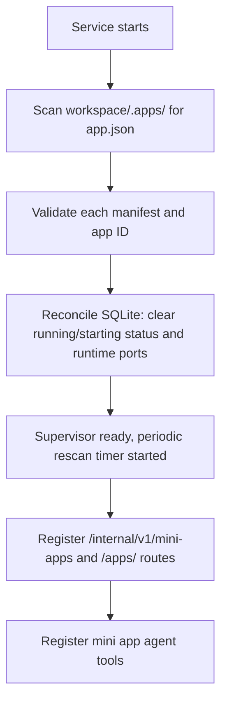
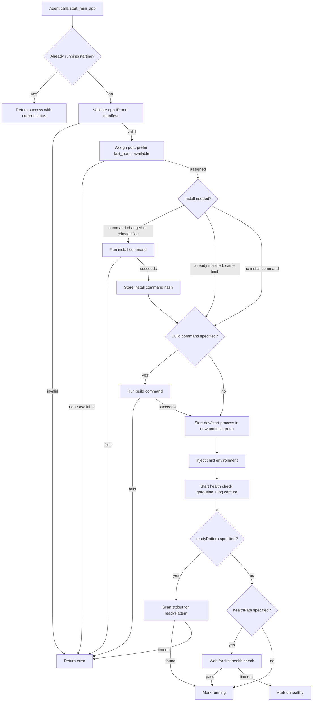
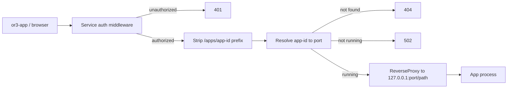

# Mini Apps Design

## Overview

Mini apps are a lightweight process-supervision and reverse-proxy feature integrated into the existing or3-intern service. The design adds a new `internal/miniapp` package for the supervisor, new service routes and proxy handlers in `cmd/or3-intern`, new agent tools in `internal/tools`, and a small additive SQLite table for state persistence.

This fits the current architecture because:

- The service already runs an HTTP server with auth middleware, route registration, and process management patterns.
- The tool registry already supports adding new tool groups and capability levels.
- SQLite migrations are additive and idempotent.
- The workspace directory model already provides file boundaries for the agent.
- The existing `exec` tool demonstrates bounded command execution with approval controls.

The design avoids building a platform. OR3 does not wrap the app's database, framework, or storage. It only manages the process, the port, the proxy, and the data directory.

## Affected areas

- `internal/miniapp/` (new package)
  - Core supervisor: manifest parsing, app ID validation, process lifecycle, port allocation, health checks, log capture, app discovery.
  - This is the main new code surface and contains all mini app business logic.

- `internal/tools/miniapp.go` (new file)
  - Agent tool implementations: `create_mini_app`, `list_mini_apps`, `start_mini_app`, `stop_mini_app`, `restart_mini_app`, `mini_app_status`, `mini_app_logs`, `delete_mini_app`.
  - Follows the existing tool pattern (embed `Base`, implement `Tool` interface).
  - Read tools use `CapabilitySafe` + `ToolGroupRead`; lifecycle tools use `CapabilityGuarded` + `ToolGroupExec`.

- `cmd/or3-intern/service_miniapp.go` (new file)
  - HTTP handlers for `/internal/v1/mini-apps` service routes.
  - Delegates to `internal/miniapp.Supervisor`.

- `cmd/or3-intern/service_miniapp_proxy.go` (new file)
  - Reverse proxy handler for `/apps/<app-id>/*` with path stripping.
  - Uses `net/http/httputil.ReverseProxy` with WebSocket upgrade and SSE streaming support.
  - Auth enforced through existing service middleware.

- `cmd/or3-intern/service_routes.go`
  - Add mini app route specs and the `/apps/` proxy subtree.

- `cmd/or3-intern/main.go`
  - Wire the mini app supervisor into the service startup.
  - Register mini app tools in `buildToolRegistryWithOptions`.

- `internal/config/types.go`
  - Add `MiniAppsConfig` struct to `Config`.

- `internal/config/defaults.go`
  - Add default values for mini app config (port range, data dir, health interval, log buffer size, rescan interval).

- `internal/db/db.go`
  - Add `mini_apps` table migration (additive, idempotent).

- `cmd/or3-intern/service_auth_rollout_test.go`
  - Add mini app routes to the auth sensitivity matrix.

## Proxy path contract

This is the single most important design decision for app compatibility. OR3 strips the `/apps/<app-id>` prefix before forwarding, so apps see requests as if they are running at root `/`.

### How it works

```text
Browser request:  GET /apps/invoice-maker/api/data?id=5
Proxy strips:     /apps/invoice-maker
App receives:     GET /api/data?id=5

Browser request:  GET /apps/invoice-maker/assets/style.css
App receives:     GET /assets/style.css

WebSocket:        ws://host/apps/invoice-maker/ws
App receives:     ws://127.0.0.1:49152/ws
```

### Headers injected by the proxy

```text
X-Or3-App-Id: invoice-maker
X-Forwarded-Prefix: /apps/invoice-maker
X-Forwarded-For: <client-ip>
X-Forwarded-Proto: http
```

`X-Forwarded-Prefix` lets apps that need absolute URLs reconstruct the external path. Most apps should use relative paths and never read this header.

### Framework-specific configuration

The agent must set the base path when creating apps so that asset URLs (script tags, CSS links, images) are generated correctly:

**Vite (Vue, React, Svelte):**

```js
// vite.config.js
export default {
  base: '/apps/invoice-maker/',
  server: {
    host: '127.0.0.1',
    port: process.env.PORT,
    hmr: { path: 'ws' }
  }
}
```

**Next.js:**

```js
// next.config.js
module.exports = {
  basePath: '/apps/invoice-maker',
  async rewrites() { return [] }
}
```

**Nuxt:**

```ts
// nuxt.config.ts
export default defineNuxtConfig({
  app: { baseURL: '/apps/invoice-maker/' },
  devServer: { host: '127.0.0.1', port: process.env.PORT }
})
```

**Go (net/http):**

```go
// No config needed; app receives requests at /
http.HandleFunc("/api/data", handler)
http.ListenAndServe("127.0.0.1:"+os.Getenv("PORT"), nil)
```

**Static HTML (python -m http.server, serve, etc.):**

```text
No config needed; files are served from root.
```

### Why path stripping (not path preservation)

Path stripping was chosen over preserving the prefix because:

1. Apps can be developed and tested standalone without knowing about OR3.
2. Most frameworks have simpler config for `base`/`basePath` than for rewriting all internal routes.
3. HMR WebSocket paths work without special configuration because the proxy strips the prefix on upgrade requests too.
4. The app's dev server does not need to know it is behind a proxy.

### Redirect for missing trailing slash

When a request arrives at `/apps/invoice-maker` (no trailing slash), the proxy redirects to `/apps/invoice-maker/` with a `301`. This prevents relative URL breakage when the app returns HTML with relative asset paths.

## Control flow / architecture

### Startup flow



### App start flow



### Proxy request flow



## Data and persistence

### SQLite changes

One additive table:

```sql
CREATE TABLE IF NOT EXISTS mini_apps(
    id TEXT PRIMARY KEY,
    name TEXT NOT NULL DEFAULT '',
    runtime TEXT NOT NULL DEFAULT '',
    status TEXT NOT NULL DEFAULT 'stopped',
    port INTEGER NOT NULL DEFAULT 0,
    last_port INTEGER NOT NULL DEFAULT 0,
    pid INTEGER NOT NULL DEFAULT 0,
    started_at INTEGER NOT NULL DEFAULT 0,
    stopped_at INTEGER NOT NULL DEFAULT 0,
    exit_code INTEGER NOT NULL DEFAULT -1,
    last_error TEXT NOT NULL DEFAULT '',
    installed INTEGER NOT NULL DEFAULT 0,
    install_hash TEXT NOT NULL DEFAULT '',
    manifest_json TEXT NOT NULL DEFAULT '{}',
    workspace TEXT NOT NULL DEFAULT '',
    updated_at INTEGER NOT NULL
);

CREATE INDEX IF NOT EXISTS mini_apps_status ON mini_apps(status, updated_at);
CREATE INDEX IF NOT EXISTS mini_apps_workspace ON mini_apps(workspace);
```

Column semantics:

- `port`: Runtime port, non-zero only while app is `starting`, `running`, or `unhealthy`. Cleared to `0` on stop or service restart.
- `last_port`: Last successfully assigned port. Retained across restarts as a hint for future allocation (the allocator tries this port first, falls back to the pool).
- `install_hash`: SHA-256 hash of the `commands.install` string. Used to detect when install needs to re-run.
- `workspace`: The workspace path at the time the app was created. Used to filter apps when the workspace changes.

State reconciliation on startup:

- Any row with `status = 'running'` or `status = 'starting'` is reset to `stopped` because the service process restarted and no child processes survived.
- `port` is cleared to `0` for all stopped apps.
- `last_port` is preserved.
- `pid` is cleared to `0`.

### Config/env changes

Add to `Config` in `internal/config/types.go`:

```go
type MiniAppsConfig struct {
    Enabled              bool   `json:"enabled"`
    PortRangeStart       int    `json:"portRangeStart"`
    PortRangeEnd         int    `json:"portRangeEnd"`
    DataDir              string `json:"dataDir"`
    HealthIntervalSecs   int    `json:"healthIntervalSecs"`
    HealthTimeoutSecs    int    `json:"healthTimeoutSecs"`
    LogBufferBytes       int    `json:"logBufferBytes"`
    InstallTimeoutSecs   int    `json:"installTimeoutSecs"`
    BuildTimeoutSecs     int    `json:"buildTimeoutSecs"`
    StopGraceSecs        int    `json:"stopGraceSecs"`
    ReadyTimeoutSecs     int    `json:"readyTimeoutSecs"`
    RescanIntervalSecs   int    `json:"rescanIntervalSecs"`
    ProxyTimeoutSecs     int    `json:"proxyTimeoutSecs"`
}
```

Defaults in `internal/config/defaults.go`:

```go
MiniApps: MiniAppsConfig{
    Enabled:            true,
    PortRangeStart:     49152,
    PortRangeEnd:       49252,
    DataDir:            filepath.Join(root, "mini-apps"),
    HealthIntervalSecs: 10,
    HealthTimeoutSecs:  3,
    LogBufferBytes:     65536,
    InstallTimeoutSecs: 120,
    BuildTimeoutSecs:   120,
    StopGraceSecs:      5,
    ReadyTimeoutSecs:   30,
    RescanIntervalSecs: 30,
    ProxyTimeoutSecs:   30,
}
```

Environment overrides:

```go
applyEnvBool("OR3_MINI_APPS_ENABLED", &cfg.MiniApps.Enabled)
applyEnvString("OR3_MINI_APPS_DATA_DIR", &cfg.MiniApps.DataDir)
```

### Session and memory implications

- Mini apps do not interact with the chat/session/memory system directly.
- The agent creates apps using existing file tools within the workspace boundary.
- App lifecycle events are not stored in chat history; they are tool results.
- Audit events are emitted for lifecycle operations when the audit logger is available.

## Interfaces and types

### App ID validation (`internal/miniapp/id.go`)

```go
var appIDPattern = regexp.MustCompile(`^[a-z0-9][a-z0-9-]{0,63}$`)

func ValidateAppID(id string) error
```

Rejects empty strings, `..`, path separators, uppercase, underscores, leading hyphens, and anything over 64 chars.

### Manifest types (`internal/miniapp/manifest.go`)

```go
type Manifest struct {
    SchemaVersion int              `json:"schemaVersion,omitempty"`
    ID            string           `json:"id"`
    Name          string           `json:"name"`
    Runtime       string           `json:"runtime,omitempty"`
    Commands      ManifestCommands `json:"commands"`
    Server        ManifestServer   `json:"server"`
}

type ManifestCommands struct {
    Install string `json:"install,omitempty"`
    Dev     string `json:"dev,omitempty"`
    Build   string `json:"build,omitempty"`
    Start   string `json:"start,omitempty"`
}

type ManifestServer struct {
    PortEnv      string `json:"portEnv,omitempty"`
    HealthPath   string `json:"healthPath,omitempty"`
    ReadyPattern string `json:"readyPattern,omitempty"`
}

const SupportedSchemaVersion = 1

func ParseManifest(path string) (*Manifest, error)
func (m *Manifest) Validate() error
```

`storage.mode` is removed from the manifest for V1. The only storage mode is `app-data-dir` (always provided via `OR3_APP_DATA_DIR`). This can be reintroduced in V2 if apps need to declare storage preferences.

`server.portEnv` is now optional (defaults to empty). When set, the supervisor injects the custom env name in addition to `PORT` and `OR3_APP_PORT`.

### Supervisor types (`internal/miniapp/supervisor.go`)

```go
type AppStatus string

const (
    AppStatusStopped   AppStatus = "stopped"
    AppStatusStarting  AppStatus = "starting"
    AppStatusRunning   AppStatus = "running"
    AppStatusUnhealthy AppStatus = "unhealthy"
    AppStatusError     AppStatus = "error"
)

type AppState struct {
    ID         string
    Name       string
    Runtime    string
    Status     AppStatus
    Port       int
    LastPort   int
    PID        int
    StartedAt  time.Time
    StoppedAt  time.Time
    ExitCode   int
    LastError  string
    Installed  bool
    Manifest   Manifest
    UpdatedAt  time.Time
}

type StartOptions struct {
    Reinstall bool
}

type Supervisor struct {
    mu          sync.RWMutex
    cfg         config.MiniAppsConfig
    workspace   string
    db          *db.DB
    apps        map[string]*managedApp
    portPool    *portAllocator
    rescanDone  chan struct{}
    audit       AuditLogger
}

type managedApp struct {
    mu         sync.Mutex
    state      AppState
    cmd        *exec.Cmd
    logBuf     *ringBuffer
    cancel     context.CancelFunc
    healthDone chan struct{}
}

type AuditLogger interface {
    Log(ctx context.Context, eventType string, payload map[string]any)
}

func NewSupervisor(cfg config.MiniAppsConfig, workspace string, d *db.DB, audit AuditLogger) *Supervisor
func (s *Supervisor) Scan() ([]AppState, error)
func (s *Supervisor) List() []AppState
func (s *Supervisor) Get(id string) (AppState, bool)
func (s *Supervisor) Create(id string, manifest Manifest) error
func (s *Supervisor) Start(ctx context.Context, id string, opts StartOptions) error
func (s *Supervisor) Stop(id string) error
func (s *Supervisor) Restart(ctx context.Context, id string) error
func (s *Supervisor) Delete(ctx context.Context, id string) error
func (s *Supervisor) Logs(id string, lines int) ([]string, error)
func (s *Supervisor) ResolvePort(id string) (int, bool)
func (s *Supervisor) Shutdown()
```

### Concurrency model

- `Supervisor.mu` (RWMutex): protects the `apps` map for read/write access.
- `managedApp.mu` (Mutex): per-app lock for lifecycle operations (start, stop, restart, delete).
- Different apps can be started/stopped concurrently.
- Same-app operations are serialized: `start` + `delete` on the same app will not race.
- Idempotent operations (`start` when running, `stop` when stopped) check state under the per-app lock and return early.

### Port allocator (`internal/miniapp/portalloc.go`)

```go
type portAllocator struct {
    mu       sync.Mutex
    start    int
    end      int
    assigned map[int]string
}

func newPortAllocator(start, end int) *portAllocator
func (p *portAllocator) Acquire(appID string, preferredPort int) (int, error)
func (p *portAllocator) Release(port int)
func (p *portAllocator) IsAvailable(port int) bool
```

`Acquire` tries `preferredPort` first (if non-zero and available), then scans the range. Uses `net.Listen` to verify a port is not occupied by an external process.

### Ring buffer and persisted log tail (`internal/miniapp/ringbuf.go`)

```go
type ringBuffer struct {
    mu   sync.Mutex
    data []byte
    size int
    pos  int
    full bool
}

func newRingBuffer(size int) *ringBuffer
func (r *ringBuffer) Write(p []byte) (int, error)
func (r *ringBuffer) Lines(n int) []string
func (r *ringBuffer) Tail(maxBytes int) []byte
func (r *ringBuffer) Reset()
```

On process exit (clean or crash), the supervisor writes `ringBuffer.Tail(8192)` to `<data-dir>/.or3-last.log`. `Logs()` reads from the ring buffer when the app is running, or from the persisted file when stopped.

### Agent tools (`internal/tools/miniapp.go`)

```go
type MiniAppSupervisor interface {
    Create(id string, manifest miniapp.Manifest) error
    List() []miniapp.AppState
    Start(ctx context.Context, id string, opts miniapp.StartOptions) error
    Stop(id string) error
    Restart(ctx context.Context, id string) error
    Delete(ctx context.Context, id string) error
    Logs(id string, lines int) ([]string, error)
    Get(id string) (miniapp.AppState, bool)
}

type CreateMiniAppTool struct {
    Base
    Supervisor MiniAppSupervisor
    Workspace  string
}

type ListMiniAppsTool struct {
    Base
    Supervisor MiniAppSupervisor
}

type StartMiniAppTool struct {
    Base
    Supervisor MiniAppSupervisor
}

type StopMiniAppTool struct {
    Base
    Supervisor MiniAppSupervisor
}

type RestartMiniAppTool struct {
    Base
    Supervisor MiniAppSupervisor
}

type MiniAppStatusTool struct {
    Base
    Supervisor MiniAppSupervisor
}

type MiniAppLogsTool struct {
    Base
    Supervisor MiniAppSupervisor
}

type DeleteMiniAppTool struct {
    Base
    Supervisor MiniAppSupervisor
    Broker     *approval.Broker
}
```

Capability and group assignments:

| Tool | Capability | Group |
|---|---|---|
| `list_mini_apps` | `CapabilitySafe` | `ToolGroupRead` |
| `mini_app_status` | `CapabilitySafe` | `ToolGroupRead` |
| `mini_app_logs` | `CapabilitySafe` | `ToolGroupRead` |
| `create_mini_app` | `CapabilityGuarded` | `ToolGroupExec` |
| `start_mini_app` | `CapabilityGuarded` | `ToolGroupExec` |
| `stop_mini_app` | `CapabilityGuarded` | `ToolGroupExec` |
| `restart_mini_app` | `CapabilityGuarded` | `ToolGroupExec` |
| `delete_mini_app` | `CapabilityGuarded` | `ToolGroupExec` |

This matches the existing pattern: read-only tools (`web_search`, `read_file`) are `Safe`; mutating tools (`exec`, `write_file`) are `Guarded`.

### Service route handlers (`cmd/or3-intern/service_miniapp.go`)

```go
func (s *serviceServer) handleMiniApps(w http.ResponseWriter, r *http.Request)
```

Dispatches based on path and method:

```text
GET    /internal/v1/mini-apps                          -> list all apps
POST   /internal/v1/mini-apps                          -> create app
GET    /internal/v1/mini-apps/<id>                     -> get app status
POST   /internal/v1/mini-apps/<id>/start               -> start app (body: {reinstall: bool})
POST   /internal/v1/mini-apps/<id>/stop                -> stop app
POST   /internal/v1/mini-apps/<id>/restart             -> restart app
GET    /internal/v1/mini-apps/<id>/logs                -> get logs
DELETE /internal/v1/mini-apps/<id>                     -> delete app
```

### Proxy handler (`cmd/or3-intern/service_miniapp_proxy.go`)

```go
func (s *serviceServer) handleMiniAppProxy(w http.ResponseWriter, r *http.Request)
```

Behavior:

1. Extract `<app-id>` from the path.
2. If path is `/apps/<app-id>` (no trailing slash), redirect to `/apps/<app-id>/`.
3. Strip `/apps/<app-id>` prefix from the request path.
4. Resolve port via `Supervisor.ResolvePort`.
5. If not found: `404`. If not running: `502`.
6. Build `httputil.ReverseProxy` with `Director` that sets `Host`, `X-Or3-App-Id`, `X-Forwarded-Prefix`, `X-Forwarded-For`, `X-Forwarded-Proto`.
7. For WebSocket upgrades: hijack, dial backend, bidirectional copy.
8. For SSE/streaming: set `FlushInterval: -1` (flush immediately).
9. Apply `ProxyTimeoutSecs` for non-streaming requests.

### Process supervision details

Commands are run through a shell because `npm run dev`, `make dev`, and similar wrappers require it:

```go
cmd := exec.CommandContext(ctx, "sh", "-c", commandString)
cmd.Dir = appDir
cmd.Env = childEnv
cmd.Stdout = logBuf
cmd.Stderr = logBuf
cmd.SysProcAttr = &syscall.SysProcAttr{Setpgid: true}
```

Stop sends signals to the entire process group:

```go
// SIGTERM to process group
syscall.Kill(-cmd.Process.Pid, syscall.SIGTERM)
// Wait StopGraceSecs
// SIGKILL to process group if still alive
syscall.Kill(-cmd.Process.Pid, syscall.SIGKILL)
```

### Child environment builder

```go
func buildChildEnv(cfg config.MiniAppsConfig, appID string, port int, dataDir string, servicePort string, portEnv string) []string {
    base := buildBaseChildEnv(cfg.ChildEnvAllowlist)
    additions := []string{
        "PORT=" + strconv.Itoa(port),
        "OR3_APP_PORT=" + strconv.Itoa(port),
        "OR3_APP_ID=" + appID,
        "OR3_APP_DATA_DIR=" + dataDir,
        "OR3_APP_URL=http://127.0.0.1:" + servicePort + "/apps/" + appID,
        "HOST=127.0.0.1",
        "NODE_ENV=development",
    }
    if portEnv != "" {
        additions = append(additions, portEnv+"="+strconv.Itoa(port))
    }
    return append(base, additions...)
}
```

`buildBaseChildEnv` reuses the existing `ChildEnvAllowlist` config to inherit `PATH`, `HOME`, `TMPDIR`, `LANG`, `LC_ALL`, etc.

### Audit events

When the audit logger is available, the supervisor emits events for lifecycle operations:

```go
s.audit.Log(ctx, "mini_app.start", map[string]any{"app_id": id, "port": port})
s.audit.Log(ctx, "mini_app.stop", map[string]any{"app_id": id, "exit_code": code})
s.audit.Log(ctx, "mini_app.delete", map[string]any{"app_id": id})
s.audit.Log(ctx, "mini_app.error", map[string]any{"app_id": id, "error": errMsg})
```

`delete_mini_app` also goes through the `ApprovalBroker` when the runtime profile requires approval for destructive operations.

### Periodic rescan

A background goroutine rescans `<workspace>/.apps/` every `RescanIntervalSecs` (default 30s). It detects:

- New apps (directories with valid `app.json` not yet in the supervisor).
- Removed apps (directories deleted while the app was stopped).
- Changed manifests (re-parse and update SQLite).

Apps that are currently running are not affected by rescan. The rescan only updates the discovery state.

## Failure modes and safeguards

### Invalid manifest or app ID

- `ValidateAppID` rejects non-conforming IDs before any filesystem operation.
- `ParseManifest` returns a structured error with the field that failed validation.
- The supervisor marks the app as `error` in SQLite with the validation message.
- Agent tools return the error as a tool result; the agent can fix and retry.

### Port exhaustion

- `portAllocator.Acquire` returns an error when all ports in the range are assigned.
- The supervisor returns the error to the caller; no app is started.
- The port range is configurable; the default (100 ports) is sufficient for V1.

### Process crash

- The supervisor's wait goroutine detects process exit.
- The app state is updated to `stopped` with the exit code and timestamp.
- The port is released.
- The last 8KB of log output is persisted to `<data-dir>/.or3-last.log`.
- The ring buffer is preserved in memory until the next start.

### Health check failure

- After 3 consecutive failures, the app is marked `unhealthy`.
- The supervisor does not automatically restart in V1 (the agent or user can restart).
- Health check goroutine exits when the app is stopped or the supervisor shuts down.

### Install/build failure

- The command output (last 4KB) is captured and stored in `last_error`.
- The app is marked `error` and not started.
- The agent can read logs, fix the issue, and retry.
- The install hash is NOT updated on failure.

### Proxy to stopped/missing app

- `ResolvePort` returns `false` for stopped or missing apps.
- The proxy handler returns `502` for stopped apps and `404` for missing apps.
- No connection attempt is made to the app port.

### Service restart

- On startup, the supervisor reconciles SQLite: all `running`/`starting` entries are reset to `stopped`.
- Runtime `port` and `pid` are cleared. `last_port` is preserved as a hint.
- Apps are not auto-restarted in V1; the agent or user must start them.
- Persisted log tails (`.or3-last.log`) remain available for debugging.

### Stale port assignments

- On startup, the port allocator scans for ports that are actually in use (by checking `net.Listen`).
- If a port from the pool is occupied by a non-OR3 process, it is skipped.
- `last_port` hints that conflict with occupied ports are ignored; the allocator picks the next available.

### Workspace not configured

- When `WorkspaceDir` is empty, mini app tools return a clear error: "workspace not configured; set workspaceDir in config".
- The supervisor is not created; no routes are registered.

### Workspace changed

- The supervisor operates only on the current workspace.
- SQLite rows from a previous workspace are filtered by the `workspace` column and ignored.
- Data directories under the old workspace are not touched.

### Concurrent start/stop/delete

- Per-app mutex serializes lifecycle operations on the same app.
- `start` on a `running` app returns success (idempotent).
- `stop` on a `stopped` app returns success (idempotent).
- `delete` on a `running` app stops it first under the same lock.
- Different apps can be started/stopped concurrently.

### Environment isolation

- App processes receive a bounded environment built from `ChildEnvAllowlist` plus mini-app-specific vars.
- `HOST=127.0.0.1` is always injected to encourage loopback binding.
- Service secrets, master keys, auth tokens, and database paths are never injected.

### Proxy auth and hardening

- The `/apps/` subtree goes through the same `serviceAuthMiddleware` and `serviceRouteRequirementForRequest` as other service routes.
- Unauthenticated requests are rejected before reaching the proxy handler.
- Proxy requests are subject to `ProxyTimeoutSecs` (default 30s) for non-streaming responses.
- Request body size is limited by the existing service body limit middleware.
- Streaming/SSE responses use `FlushInterval: -1` to avoid buffering.

### Symlinks under .apps/

- Discovery skips symlinked directories under `.apps/` to prevent path traversal.
- `resolveServiceFilePath`-style symlink checks are not needed because discovery uses `os.ReadDir` + `Lstat`.

## Testing strategy

Use Go's `testing` package and existing service test helpers.

### Unit tests (`internal/miniapp/`)

- **App ID validation:** Valid IDs, invalid chars, `..`, path separators, too long, empty.
- **Manifest parsing:** Valid manifests, missing fields, invalid JSON, duplicate IDs, schema version checks, `portEnv` optional.
- **Port allocator:** Acquire, release, exhaustion, concurrent access, stale port detection, preferred port reuse.
- **Ring buffer:** Write, overflow, line extraction, tail extraction, concurrent access.
- **Supervisor lifecycle:** Create, start (with mock exec), stop, restart, delete, status transitions, idempotent start/stop.
- **Health checker:** Pass, fail, consecutive failures, timeout, loopback-only connection.
- **Install hash:** Hash computation, change detection, reinstall flag.

### Integration tests (`internal/miniapp/`)

- **SQLite state:** Create app row, update status, reconcile on startup, list/query, workspace filtering.
- **Process supervision:** Start a real `python3 -m http.server` process, verify port binding, stop with SIGTERM to process group, verify cleanup, verify orphan process termination.
- **Log capture:** Start a process that writes to stdout, verify ring buffer contains expected lines, verify persisted tail after stop.
- **Proxy path stripping:** Verify `/apps/test/foo` forwards as `/foo` to the backend.

### Service tests (`cmd/or3-intern/`)

- **Route registration:** Verify `/internal/v1/mini-apps` and `/apps/` are registered.
- **Auth matrix:** Add mini app routes to `service_auth_rollout_test.go`.
- **API contract:** Test list, create, start, stop, restart, logs, delete endpoints with a mock supervisor.
- **Proxy:** Test proxy to a running test server with path stripping, 502 for stopped, 404 for missing, header injection (`X-Forwarded-Prefix`, `X-Or3-App-Id`).
- **Proxy redirect:** Test `/apps/test` redirects to `/apps/test/`.
- **WebSocket proxy:** Test WebSocket upgrade and bidirectional message passing with path stripping.
- **SSE proxy:** Test streaming response flush behavior.

### Tool tests (`internal/tools/`)

- **Create:** Verify ID validation, directory and manifest creation.
- **List:** Verify status aggregation, workspace filtering.
- **Start/stop/restart:** Verify delegation to supervisor, idempotent behavior.
- **Logs:** Verify line count and content, persisted tail fallback.
- **Delete:** Verify cleanup of source and data directories, audit event emission.
- **Capability levels:** Verify read tools are `Safe`, lifecycle tools are `Guarded`.

### Regression tests

- Existing service routes remain unchanged.
- Existing tool registry behavior is unaffected.
- SQLite migration is additive and does not affect existing tables.
- Service startup without workspace configured does not crash.
- Service startup with stale running rows reconciles cleanly.
