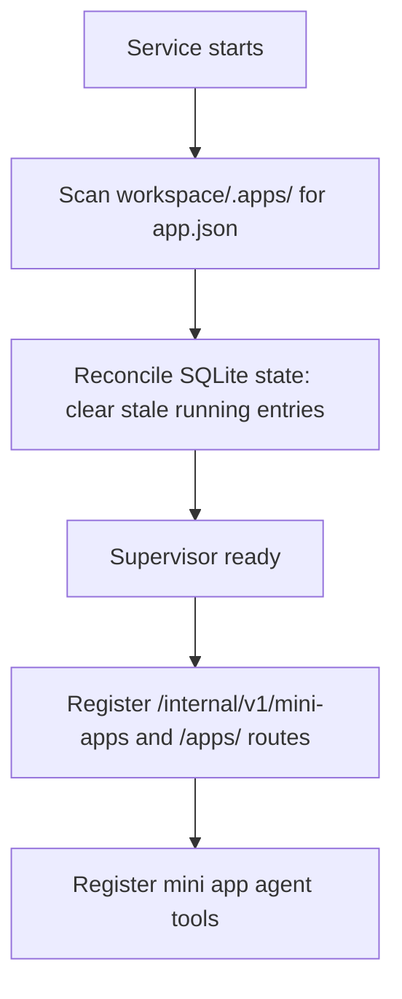
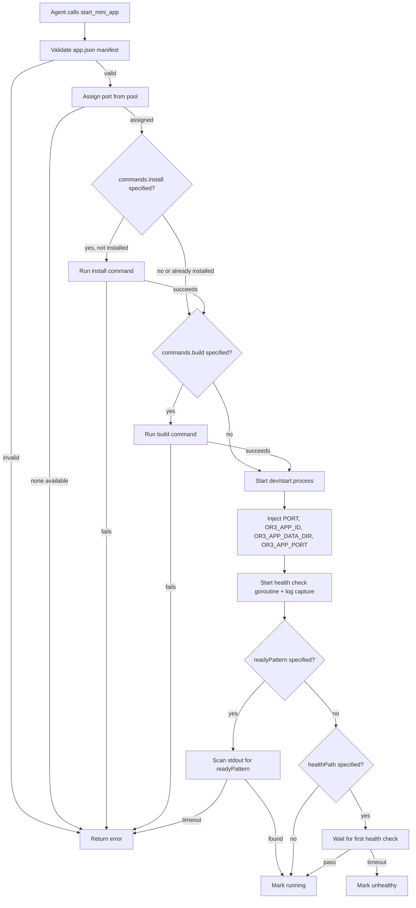
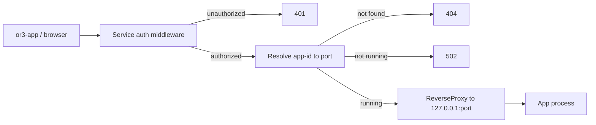

# Mini Apps Design

## Overview

Mini apps are a lightweight process-supervision and reverse-proxy feature integrated into the existing or3-intern service. The design adds a new `internal/miniapp` package for the supervisor, new service routes and proxy handlers in `cmd/or3-intern`, new agent tools in `internal/tools`, and a small additive SQLite table for state persistence.

This fits the current architecture because:

- The service already runs an HTTP server with auth middleware, route registration, and process management patterns.
- The tool registry already supports adding new tool groups and capability levels.
- SQLite migrations are additive and idempotent.
- The workspace directory model already provides file boundaries for the agent.
- The existing `exec` tool demonstrates bounded command execution with approval controls.

The design avoids building a platform. OR3 does not wrap the app's database, framework, or storage. It only manages the process, the port, the proxy, and the data directory.

## Affected areas

- `internal/miniapp/` (new package)
  - Core supervisor: manifest parsing, process lifecycle, port allocation, health checks, log capture, app discovery.
  - This is the main new code surface and contains all mini app business logic.

- `internal/tools/miniapp.go` (new file)
  - Agent tool implementations: `create_mini_app`, `list_mini_apps`, `start_mini_app`, `stop_mini_app`, `restart_mini_app`, `mini_app_status`, `mini_app_logs`, `delete_mini_app`.
  - Follows the existing tool pattern (embed `Base`, implement `Tool` interface, report `CapabilityGuarded`).

- `cmd/or3-intern/service_miniapp.go` (new file)
  - HTTP handlers for `/internal/v1/mini-apps` service routes.
  - Delegates to `internal/miniapp.Supervisor`.

- `cmd/or3-intern/service_miniapp_proxy.go` (new file)
  - Reverse proxy handler for `/apps/<app-id>/*`.
  - Uses `net/http/httputil.ReverseProxy` with WebSocket upgrade support.
  - Auth enforced through existing service middleware.

- `cmd/or3-intern/service_routes.go`
  - Add mini app route specs and the `/apps/` proxy subtree.

- `cmd/or3-intern/main.go`
  - Wire the mini app supervisor into the service startup.
  - Register mini app tools in `buildToolRegistryWithOptions`.

- `internal/config/types.go`
  - Add `MiniAppsConfig` struct to `Config`.

- `internal/config/defaults.go`
  - Add default values for mini app config (port range, data dir, health interval, log buffer size).

- `internal/db/db.go`
  - Add `mini_apps` table migration (additive, idempotent).

- `cmd/or3-intern/service_auth_rollout_test.go`
  - Add mini app routes to the auth sensitivity matrix.

## Control flow / architecture

### Startup flow



### App start flow



### Proxy request flow



## Data and persistence

### SQLite changes

One additive table:

```sql
CREATE TABLE IF NOT EXISTS mini_apps(
    id TEXT PRIMARY KEY,
    name TEXT NOT NULL DEFAULT '',
    runtime TEXT NOT NULL DEFAULT '',
    status TEXT NOT NULL DEFAULT 'stopped',
    port INTEGER NOT NULL DEFAULT 0,
    pid INTEGER NOT NULL DEFAULT 0,
    started_at INTEGER NOT NULL DEFAULT 0,
    stopped_at INTEGER NOT NULL DEFAULT 0,
    exit_code INTEGER NOT NULL DEFAULT -1,
    last_error TEXT NOT NULL DEFAULT '',
    installed INTEGER NOT NULL DEFAULT 0,
    manifest_json TEXT NOT NULL DEFAULT '{}',
    updated_at INTEGER NOT NULL
);

CREATE INDEX IF NOT EXISTS mini_apps_status ON mini_apps(status, updated_at);
```

State reconciliation on startup:
- Any row with `status = 'running'` or `status = 'starting'` is reset to `stopped` because the service process restarted and no child processes survived.
- Port assignments are cleared (`port = 0`) for stopped apps.

### Config/env changes

Add to `Config` in `internal/config/types.go`:

```go
type MiniAppsConfig struct {
    Enabled              bool   `json:"enabled"`
    PortRangeStart       int    `json:"portRangeStart"`
    PortRangeEnd         int    `json:"portRangeEnd"`
    DataDir              string `json:"dataDir"`
    HealthIntervalSecs   int    `json:"healthIntervalSecs"`
    HealthTimeoutSecs    int    `json:"healthTimeoutSecs"`
    LogBufferBytes       int    `json:"logBufferBytes"`
    InstallTimeoutSecs   int    `json:"installTimeoutSecs"`
    BuildTimeoutSecs     int    `json:"buildTimeoutSecs"`
    StopGraceSecs        int    `json:"stopGraceSecs"`
    ReadyTimeoutSecs     int    `json:"readyTimeoutSecs"`
}
```

Defaults in `internal/config/defaults.go`:

```go
MiniApps: MiniAppsConfig{
    Enabled:            true,
    PortRangeStart:     49152,
    PortRangeEnd:       49252,
    DataDir:            filepath.Join(root, "mini-apps"),
    HealthIntervalSecs: 10,
    HealthTimeoutSecs:  3,
    LogBufferBytes:     65536,
    InstallTimeoutSecs: 120,
    BuildTimeoutSecs:   120,
    StopGraceSecs:      5,
    ReadyTimeoutSecs:   30,
}
```

Environment overrides:

```go
applyEnvBool("OR3_MINI_APPS_ENABLED", &cfg.MiniApps.Enabled)
applyEnvString("OR3_MINI_APPS_DATA_DIR", &cfg.MiniApps.DataDir)
```

### Session and memory implications

- Mini apps do not interact with the chat/session/memory system directly.
- The agent creates apps using existing file tools within the workspace boundary.
- App lifecycle events are not stored in chat history; they are tool results.

## Interfaces and types

### Manifest types (`internal/miniapp/manifest.go`)

```go
type Manifest struct {
    ID       string           `json:"id"`
    Name     string           `json:"name"`
    Runtime  string           `json:"runtime,omitempty"`
    Commands ManifestCommands `json:"commands"`
    Server   ManifestServer   `json:"server"`
    Storage  ManifestStorage  `json:"storage,omitempty"`
}

type ManifestCommands struct {
    Install string `json:"install,omitempty"`
    Dev     string `json:"dev,omitempty"`
    Build   string `json:"build,omitempty"`
    Start   string `json:"start,omitempty"`
}

type ManifestServer struct {
    PortEnv      string `json:"portEnv"`
    HealthPath   string `json:"healthPath,omitempty"`
    ReadyPattern string `json:"readyPattern,omitempty"`
}

type ManifestStorage struct {
    Mode string `json:"mode,omitempty"`
}

func ParseManifest(path string) (*Manifest, error)
func (m *Manifest) Validate() error
```

### Supervisor types (`internal/miniapp/supervisor.go`)

```go
type AppStatus string

const (
    AppStatusStopped   AppStatus = "stopped"
    AppStatusStarting  AppStatus = "starting"
    AppStatusRunning   AppStatus = "running"
    AppStatusUnhealthy AppStatus = "unhealthy"
    AppStatusError     AppStatus = "error"
)

type AppState struct {
    ID         string
    Name       string
    Runtime    string
    Status     AppStatus
    Port       int
    PID        int
    StartedAt  time.Time
    StoppedAt  time.Time
    ExitCode   int
    LastError  string
    Installed  bool
    Manifest   Manifest
    UpdatedAt  time.Time
}

type Supervisor struct {
    mu          sync.RWMutex
    cfg         config.MiniAppsConfig
    workspace   string
    db          *db.DB
    apps        map[string]*managedApp
    portPool    *portAllocator
}

type managedApp struct {
    state     AppState
    cmd       *exec.Cmd
    logBuf    *ringBuffer
    cancel    context.CancelFunc
    healthDone chan struct{}
}

func NewSupervisor(cfg config.MiniAppsConfig, workspace string, d *db.DB) *Supervisor
func (s *Supervisor) Scan() ([]AppState, error)
func (s *Supervisor) List() []AppState
func (s *Supervisor) Get(id string) (AppState, bool)
func (s *Supervisor) Create(id string, manifest Manifest) error
func (s *Supervisor) Start(ctx context.Context, id string) error
func (s *Supervisor) Stop(id string) error
func (s *Supervisor) Restart(ctx context.Context, id string) error
func (s *Supervisor) Delete(id string) error
func (s *Supervisor) Logs(id string, lines int) ([]string, error)
func (s *Supervisor) ResolvePort(id string) (int, bool)
func (s *Supervisor) Shutdown()
```

### Port allocator (`internal/miniapp/portalloc.go`)

```go
type portAllocator struct {
    mu       sync.Mutex
    start    int
    end      int
    assigned map[int]string
}

func newPortAllocator(start, end int) *portAllocator
func (p *portAllocator) Acquire(appID string) (int, error)
func (p *portAllocator) Release(port int)
func (p *portAllocator) IsAvailable(port int) bool
```

### Ring buffer (`internal/miniapp/ringbuf.go`)

```go
type ringBuffer struct {
    mu   sync.Mutex
    data []byte
    size int
    pos  int
    full bool
}

func newRingBuffer(size int) *ringBuffer
func (r *ringBuffer) Write(p []byte) (int, error)
func (r *ringBuffer) Lines(n int) []string
func (r *ringBuffer) Reset()
```

### Agent tools (`internal/tools/miniapp.go`)

```go
type MiniAppSupervisor interface {
    Create(id string, manifest miniapp.Manifest) error
    List() []miniapp.AppState
    Start(ctx context.Context, id string) error
    Stop(id string) error
    Restart(ctx context.Context, id string) error
    Delete(id string) error
    Logs(id string, lines int) ([]string, error)
    Get(id string) (miniapp.AppState, bool)
}

type CreateMiniAppTool struct {
    Base
    Supervisor MiniAppSupervisor
    Workspace  string
}

type ListMiniAppsTool struct {
    Base
    Supervisor MiniAppSupervisor
}

type StartMiniAppTool struct {
    Base
    Supervisor MiniAppSupervisor
}

type StopMiniAppTool struct {
    Base
    Supervisor MiniAppSupervisor
}

type RestartMiniAppTool struct {
    Base
    Supervisor MiniAppSupervisor
}

type MiniAppStatusTool struct {
    Base
    Supervisor MiniAppSupervisor
}

type MiniAppLogsTool struct {
    Base
    Supervisor MiniAppSupervisor
}

type DeleteMiniAppTool struct {
    Base
    Supervisor MiniAppSupervisor
}
```

All tools report `CapabilityGuarded` and belong to `ToolGroupExec`.

### Service route handlers (`cmd/or3-intern/service_miniapp.go`)

```go
func (s *serviceServer) handleMiniApps(w http.ResponseWriter, r *http.Request)
```

Dispatches based on path and method:

```text
GET    /internal/v1/mini-apps                          -> list all apps
GET    /internal/v1/mini-apps/<id>                     -> get app status
POST   /internal/v1/mini-apps/<id>/start               -> start app
POST   /internal/v1/mini-apps/<id>/stop                -> stop app
POST   /internal/v1/mini-apps/<id>/restart             -> restart app
GET    /internal/v1/mini-apps/<id>/logs                -> get logs
DELETE /internal/v1/mini-apps/<id>                     -> delete app
```

### Proxy handler (`cmd/or3-intern/service_miniapp_proxy.go`)

```go
func (s *serviceServer) handleMiniAppProxy(w http.ResponseWriter, r *http.Request)
```

Extracts `<app-id>` from the path, resolves the port via `Supervisor.ResolvePort`, and proxies using `httputil.ReverseProxy`. WebSocket upgrades are handled via `hijack` and bidirectional copy.

## Failure modes and safeguards

### Invalid manifest

- `ParseManifest` returns a structured error with the field that failed validation.
- The supervisor marks the app as `error` in SQLite with the validation message.
- Agent tools return the error as a tool result; the agent can fix and retry.

### Port exhaustion

- `portAllocator.Acquire` returns an error when all ports in the range are assigned.
- The supervisor returns the error to the caller; no app is started.
- The port range is configurable; the default (100 ports) is sufficient for V1.

### Process crash

- The supervisor's wait goroutine detects process exit.
- The app state is updated to `stopped` with the exit code and timestamp.
- The port is released.
- The last log lines are preserved in the ring buffer and SQLite `last_error`.

### Health check failure

- After 3 consecutive failures, the app is marked `unhealthy`.
- The supervisor does not automatically restart in V1 (the agent or user can restart).
- Health check goroutine exits when the app is stopped or the supervisor shuts down.

### Install/build failure

- The command output (last 4KB) is captured and stored in `last_error`.
- The app is marked `error` and not started.
- The agent can read logs, fix the issue, and retry.

### Proxy to stopped/missing app

- `ResolvePort` returns `false` for stopped or missing apps.
- The proxy handler returns `502` for stopped apps and `404` for missing apps.
- No connection attempt is made to the app port.

### Service restart

- On startup, the supervisor reconciles SQLite: all `running`/`starting` entries are reset to `stopped`.
- Port assignments are cleared.
- Apps are not auto-restarted in V1; the agent or user must start them.

### Stale port assignments

- On startup, the port allocator scans for ports that are actually in use (by checking `net.Listen`).
- If a port from the pool is occupied by a non-OR3 process, it is skipped.

### Workspace not configured

- When `WorkspaceDir` is empty, mini app tools return a clear error: "workspace not configured; set workspaceDir in config".
- The supervisor is not created; no routes are registered.

### Concurrent start/stop

- The supervisor uses a per-app mutex (`managedApp.mu`) to serialize lifecycle operations on the same app.
- Different apps can be started/stopped concurrently.

### Environment isolation

- App processes receive a minimal environment: `PATH`, `HOME`, `TMPDIR`, `PORT`, `OR3_APP_PORT`, `OR3_APP_ID`, `OR3_APP_DATA_DIR`, `OR3_APP_URL`.
- Service secrets, master keys, auth tokens, and database paths are never injected.
- The child environment allowlist follows the existing `ChildEnvAllowlist` config pattern.

### Proxy auth

- The `/apps/` subtree goes through the same `serviceAuthMiddleware` and `serviceRouteRequirementForRequest` as other service routes.
- Unauthenticated requests are rejected before reaching the proxy handler.
- LAN/mobile access works through the existing OR3 auth model (paired device token, secure session, or passkey session).

## Testing strategy

Use Go's `testing` package and existing service test helpers.

### Unit tests (`internal/miniapp/`)

- **Manifest parsing:** Valid manifests, missing fields, invalid JSON, duplicate IDs.
- **Port allocator:** Acquire, release, exhaustion, concurrent access, stale port detection.
- **Ring buffer:** Write, overflow, line extraction, concurrent access.
- **Supervisor lifecycle:** Create, start (with mock exec), stop, restart, delete, status transitions.
- **Health checker:** Pass, fail, consecutive failures, timeout.

### Integration tests (`internal/miniapp/`)

- **SQLite state:** Create app row, update status, reconcile on startup, list/query.
- **Process supervision:** Start a real `sleep` or `python -m http.server` process, verify port binding, stop with SIGTERM, verify cleanup.
- **Log capture:** Start a process that writes to stdout, verify ring buffer contains expected lines.

### Service tests (`cmd/or3-intern/`)

- **Route registration:** Verify `/internal/v1/mini-apps` and `/apps/` are registered.
- **Auth matrix:** Add mini app routes to `service_auth_rollout_test.go`.
- **API contract:** Test list, start, stop, restart, logs, delete endpoints with a mock supervisor.
- **Proxy:** Test proxy to a running test server, 502 for stopped app, 404 for missing app.
- **WebSocket proxy:** Test WebSocket upgrade and bidirectional message passing.

### Tool tests (`internal/tools/`)

- **Create:** Verify directory and manifest creation.
- **List:** Verify status aggregation.
- **Start/stop/restart:** Verify delegation to supervisor.
- **Logs:** Verify line count and content.
- **Delete:** Verify cleanup of source and data directories.

### Regression tests

- Existing service routes remain unchanged.
- Existing tool registry behavior is unaffected.
- SQLite migration is additive and does not affect existing tables.
- Service startup without workspace configured does not crash.
