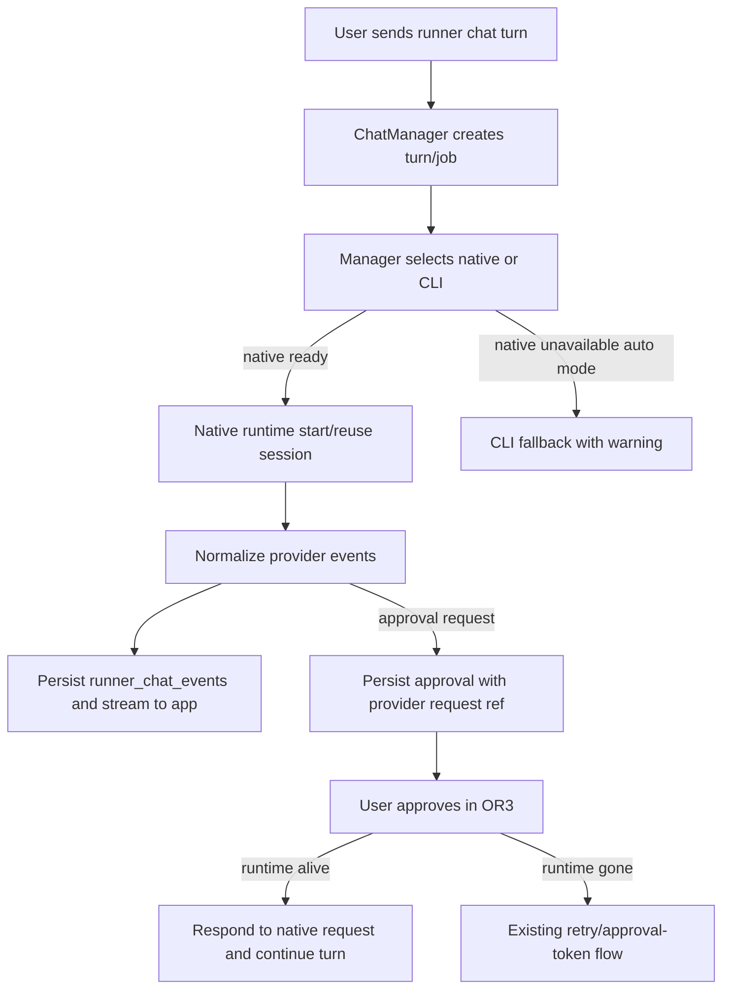

# Native Runner Improvements Design

## Overview

Extend the existing `internal/agentcli` runner model instead of introducing a new provider stack. The core change is to make native runners first-class session runtimes with richer snapshots and resumable approval handling, while keeping CLI execution as the compatibility fallback.

## Affected Areas

- `internal/agentcli/runners.go`: extend runtime/model/capability structs for snapshots, model options, request refs, and next-action copy.
- `internal/agentcli/native_runtime.go`: split Codex/OpenCode native implementations into clearer session/runtime helpers.
- `internal/agentcli/manager.go`: stop native runtimes on shutdown, improve native fallback warnings, and preserve request refs.
- `internal/agentcli/chat_manager.go`: persist native request IDs, approval payloads, and request-resolution events.
- `internal/agentcli/chat_adapters.go`: expand canonical event normalization.
- `internal/db`: add backward-compatible columns or payload fields for native request/session metadata if JSON payloads are insufficient.
- `cmd/or3-intern/service_chat_sessions.go` and `internal/controlplane`: expose richer runner metadata.
- `or3-app/app/types/or3-api.ts`, `useChatRunners.ts`, `AssistantComposer.vue`, approval components: consume model options, runtime status, and resumable approvals.

## Control Flow



## Data and Persistence

Prefer storing new provider refs in `runner_chat_events.payload_json` first. Add DB columns only if queryability is needed:

```sql
ALTER TABLE runner_chat_turns ADD COLUMN native_request_ref TEXT;
ALTER TABLE runner_chat_turns ADD COLUMN native_runtime_state TEXT;
```

Config additions should stay under `agentCLI`:

- native server idle TTL seconds
- native event log enable/path/max bytes
- optional Codex/OpenCode native startup timeout overrides

No memory-store changes are required.

## Interfaces and Types

Add a small session-oriented native contract without replacing the current interface:

```go
type NativeRunnerSession interface {
    RunnerID() RunnerID
    SessionRef() string
    SendTurn(ctx context.Context, req RunnerTurnRequest) (ProcessOutput, error)
    RespondToRequest(ctx context.Context, ref NativeRequestRef, decision approval.Decision) error
    Abort(ctx context.Context) error
    Close(ctx context.Context) error
}
```

Extend `RunnerModelInfo` with option descriptors:

```go
type RunnerModelOption struct {
    ID string `json:"id"`
    Label string `json:"label"`
    Type string `json:"type"` // select|boolean
    Options []RunnerModelOptionValue `json:"options,omitempty"`
    CurrentValue string `json:"current_value,omitempty"`
}
```

## Failure Modes and Safeguards

- Native startup failure: emit `runtime.warning`, include bounded diagnostic detail, then CLI fallback only in auto mode.
- Approval request with dead runtime: mark turn `approval_required` and allow approved retry.
- OpenCode managed server crash: emit session/runtime error, clear managed endpoint, do not kill external servers.
- Codex app-server protocol drift: keep raw event payload bounded, test unknown event fallback, and preserve CLI path.
- Model probe failure: runner remains selectable when binary/auth are usable, with empty or configured fallback models.
- Logs: redact tokens, env vars, Authorization headers, and large payloads.

## Testing Strategy

- Unit tests in `internal/agentcli` for Codex RPC sessions, OpenCode server lifecycle, approval refs, and event normalization.
- SQLite-backed tests for persisted request refs, approval-required turns, retry/continue behavior, and startup reconciliation.
- Control-plane contract tests for enriched runner JSON.
- `or3-app` type/composable tests for model option parsing, runtime labels, and approval hydration.
- Keep fixture-based tests; do not require real Codex/OpenCode accounts.
