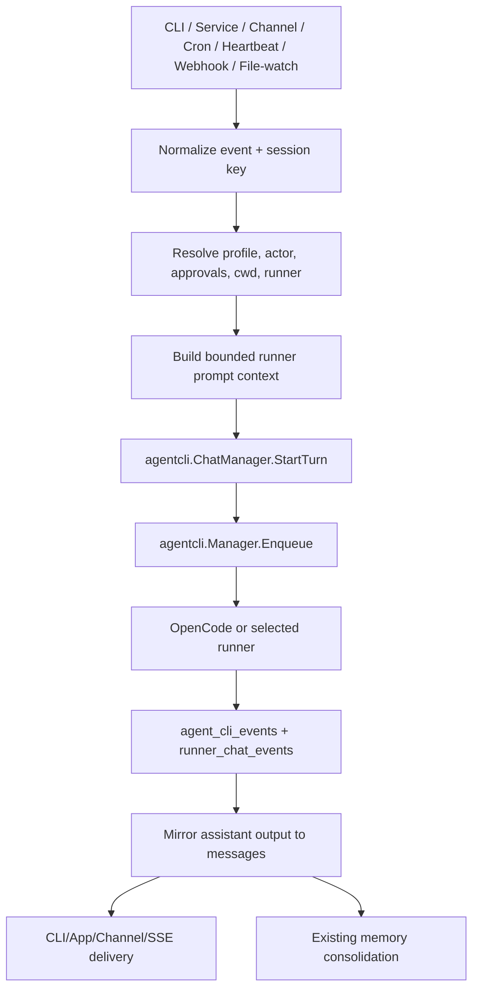

# Design: Runner-First Agent Removal

## Overview

The smallest viable path is to make `internal/agentcli` and runner chat the primary execution runtime, while preserving `or3-intern` as the orchestration host. The app keeps accepting work from CLI, service, channels, cron, heartbeat, webhooks, and file-watch triggers, but converts that work into runner chat turns or direct runner runs. OpenCode is the default runner because it is already modeled in `internal/agentcli` with structured output, streaming JSON, native session support, and permission helpers.

This fits the current architecture because runner infrastructure already exists: `agent_cli_runs`, `agent_cli_events`, `runner_chat_sessions`, `runner_chat_turns`, `runner_chat_events`, `agentcli.Manager`, `agentcli.ChatManager`, external runner detection, native runtime support, and `cronrunner` support for `PayloadAgentCLIRun`.

The key architectural change is replacing `agent.Runtime.Handle` as the central turn executor with a smaller orchestration layer that:

- receives ingress events,
- resolves session/profile/context,
- builds bounded runner prompts,
- enqueues runner turns,
- mirrors output back to `messages` and channels,
- keeps memory/artifact/approval/audit behavior intact.

## Affected areas

- `cmd/or3-intern/main.go`
  - Replace `runWorkers(..., *agent.Runtime, ...)` turn handling with runner-backed event handling.
  - Keep startup for DB, artifacts, memory, tools, channels, triggers, heartbeat, cron, approvals, and service.
  - Change `chat` one-shot behavior to create runner chat turns instead of calling `rt.Handle`.

- `cmd/or3-intern/runtime_build_runtime.go`
  - Promote `agentcli.Manager` construction from optional delegation to required/default runner runtime for chat/service/serve.
  - Keep compatibility for disabled runner mode only if needed for read-only tools/admin flows.

- `internal/agentcli`
  - Keep and extend `Manager`, `ChatManager`, runner adapters, native runtime registry, permission handling, OpenCode permission generation, cwd validation, output extraction, and event normalization.
  - Remove `RunnerOR3` from default selectable runners or mark it legacy/internal-only during transition.
  - Add a runner prompt/context builder if existing replay prompt support is not sufficient.

- `internal/app/service_app.go`
  - Replace `RunTurn` provider/runtime execution with `StartRunnerTurn` or similar runner-backed method.
  - Keep service helpers for replaying approved tool calls only if still needed by retained approval flows; otherwise migrate them to runner permission APIs.

- `cmd/or3-intern/service_agents.go` and `cmd/or3-intern/service_chat_sessions.go`
  - Treat runner endpoints as the primary agent execution endpoints.
  - Stop advertising OR3 as always available.
  - Preserve SSE/job event compatibility by mapping runner events to the existing job event response shape.

- `cmd/or3-intern/service_doctor_admin_brain.go` and `service_doctor_session.go`
  - Remove hidden fallback to `RunnerOR3`.
  - Use runner chat for doctor/admin brain sessions when a runner is selected.
  - If API-key internal admin brain remains temporarily, isolate it as admin-only deprecated behavior, not the default agent.

- `internal/cronrunner` and `internal/cron`
  - Prefer `PayloadAgentCLIRun` for new jobs.
  - Translate or deprecate `PayloadAgentTurn` and `PayloadSystemEvent` so they enter runner chat rather than the old bus-to-runtime loop.

- `internal/heartbeat` and `internal/triggers`
  - Keep publishing events to the bus initially, but have the bus worker convert them into runner turns.
  - Longer-term option: publish a structured runner turn request directly.

- `internal/db`
  - Keep existing tables.
  - Add a small migration only if needed to record default runner migration state or legacy runner labels.
  - Preserve legacy session/history rows.

- `internal/agent`
  - Split into retained primitives and removable runtime code.
  - Retain or relocate: job registry/events, chat attachments, prompt/context builder pieces that remain useful, public error codes, observer/streaming interfaces, active plan/task-card helpers if still used.
  - Remove/quarantine: provider-driven turn loop, tool-call loop, tool-loop budgets, direct model runtime, subagent provider loop if replaced by runners.

- `internal/memory`, `internal/tools`, `internal/artifacts`, `internal/clawhub`, `internal/channels`, `internal/approval`
  - Keep packages, but decouple any imports from old agent runtime types where possible.

- `docs/agent-runtime.md`, `docs/cli-reference.md`, `docs/configuration-reference.md`, `docs/channels.md`, `docs/memory-and-context.md`, `README.md`
  - Rewrite runtime docs around runner-first execution and OpenCode setup.

## Control flow / architecture

### Target turn flow



### Runtime behavior

1. Startup opens SQLite, initializes artifacts, memory retrieval, tools, approvals, audit, channels, trigger services, cron, and `agentcli.Manager`.
2. Config loading enables runner execution by default and resolves a default runner, initially `opencode`.
3. Ingress sources create a normalized work item with session key, channel/from metadata, message, trigger kind, profile/capability, and optional attachments.
4. The worker chooses runner chat for conversational/event work, and direct `agent_cli_run` for explicit background tasks.
5. `agentcli.ChatManager` creates or reuses a `runner_chat_sessions` row, builds a bounded prompt for replay mode or uses native runner continuation when safe, persists the user message, and enqueues the run.
6. `agentcli.Manager` validates runner readiness, cwd, mode, isolation, queue depth, timeouts, and child environment, then executes the runner.
7. Runner events are persisted and mirrored into chat messages. Channel/SSE delivery consumes the same normalized events/messages.
8. Memory consolidation continues from the `messages` table and does not depend on the old agent loop.

## Data and persistence

### SQLite

Keep existing tables:

```sql
messages
agent_cli_runs
agent_cli_events
runner_chat_sessions
runner_chat_turns
runner_chat_events
chat_session_meta
memory_notes / memory vector and FTS tables
approval and audit tables
```

Likely additive migration:

```sql
ALTER TABLE chat_session_meta ADD COLUMN legacy_runner_id TEXT NOT NULL DEFAULT '';
```

Only add this if the implementation needs to preserve prior `runner_id='or3-intern'` while moving active sessions to `opencode`. If app compatibility can be handled in response shaping, avoid the schema change.

No existing history or memory data should be deleted. Existing OR3-agent session rows should remain listable. New turns for those sessions should either:

- migrate the session metadata to the configured default runner on first use, recording legacy label in response metadata, or
- require the caller to choose a supported runner before sending.

### Config and env

Current `AgentCLIConfig` already contains the required safety controls. Add only minimal fields if needed:

```go
type AgentCLIConfig struct {
    Enabled bool `json:"enabled"`
    DefaultRunner string `json:"defaultRunner,omitempty"`
    // existing fields: RuntimeMode, DefaultModels, MaxConcurrent, MaxQueued,
    // DefaultTimeoutSeconds, MaxTimeoutSeconds, DefaultMode, DefaultIsolation,
    // EventChunkMaxBytes, PreviewMaxBytes, MaxPersistedOutputBytes, ChildEnvAllowlist
}
```

Default behavior:

- `agentCLI.enabled=true` for new configs.
- `agentCLI.defaultRunner="opencode"` for new configs.
- Existing configs without `agentCLI.enabled` should be upgraded cautiously; if preserving exact old behavior is required, `doctor` can guide opt-in, but the target end state should be runner-first.
- Env override: `OR3_AGENT_CLI_DEFAULT_RUNNER=opencode|codex|claude|gemini`.

### Session and memory scope

- Keep session keys unchanged: `cli:default`, channel-derived keys, `heartbeat:default`, etc.
- `runner_chat_sessions.app_session_key` remains the bridge from app/channel sessions to runner-native sessions.
- Memory retrieval uses the same default/global scope behavior, with runner prompt context replacing old provider prompt injection.
- Direct messages sharing behavior must continue to use `Session.DirectMessagesShareDefault` and identity scope mapping.

## Interfaces and types

### New or refactored orchestration interface

Add a small interface so workers do not depend on `agent.Runtime`:

```go
type TurnOrchestrator interface {
    StartTurn(ctx context.Context, req TurnRequest) (TurnResult, error)
}

type TurnRequest struct {
    SessionKey string
    Channel string
    From string
    Message string
    TriggerKind string
    RunnerID string
    Model string
    Mode string
    Isolation string
    Cwd string
    Attachments []ChatAttachment
    Meta map[string]any
    ApprovalToken string
    Actor string
    Role string
    ProfileName string
    Capability tools.CapabilityLevel
}

type TurnResult struct {
    RunnerChatSessionID string
    RunnerChatTurnID string
    AgentCLIRunID string
    AgentCLIJobID string
}
```

This can live in `internal/app`, `internal/agentcli`, or a new small `internal/runtime` package. Prefer `internal/app` first to avoid adding layers.

### Runner context builder

`agentcli.BuildReplayPrompt` currently builds transcript replay. Extend with an input that includes retained OR3 context:

```go
type RunnerPromptContext struct {
    UserMessage string
    History []RunnerHistoryMessage
    Bootstrap []ContextBlock
    RetrievedMemory []ContextBlock
    RetrievedDocs []ContextBlock
    TriggerInstructions string
    Attachments []ChatAttachment
    MaxBytes int
}

func BuildRunnerPrompt(ctx RunnerPromptContext) string
```

Reuse logic from `agent.Builder` where possible, but avoid keeping the old provider/tool-loop dependency alive solely for prompt building.

### Runner selection

```go
func ResolveDefaultRunner(cfg config.Config, registry *agentcli.RunnerRegistry) agentcli.RunnerID
func ValidateSelectableRunner(id agentcli.RunnerID) error
```

`RunnerOR3` should be removed from `AllRunners()` or marked non-chat-selectable during the transition.

## Failure modes and safeguards

- **OpenCode missing/auth missing**: startup can continue for service/read-only operations, but chat/turn attempts fail with `runner_not_ready` and actionable install/auth guidance.
- **Runner disabled by config**: default runner resolution must fail closed and recommend selecting another enabled runner.
- **Invalid cwd**: reject before enqueue using existing `resolveAgentCLICwd` behavior.
- **Unsafe isolation/mode**: preserve `ValidateRunPolicy`; do not enable `sandbox_auto` unless explicitly configured.
- **Runner native session ambiguity**: use replay mode unless adapter confirms native session refs are extractable and resume is specific-session safe.
- **Oversized prompt/output**: clamp prompt context, event chunks, preview bytes, persisted output, and artifact spill size.
- **Secret leakage**: preserve child env allowlist and avoid injecting secret config values into runner prompts or events.
- **Channel delivery failure**: persist runner output/events even when delivery fails, then report delivery errors through logs/audit.
- **Migration failure**: SQLite open should remain compatible; optional metadata backfills should be best-effort and not block session listing.
- **Legacy OR3 session selection**: do not silently run removed built-in agent; migrate to default runner or require explicit runner choice.
- **Approval mismatch**: channel approval commands should keep resolving existing pending approvals without starting a runner turn.

## Testing strategy

- Unit tests with Go `testing`:
  - runner default resolution and OpenCode preference,
  - `AllRunners` no longer exposes OR3 as selectable,
  - worker event-to-runner-turn mapping,
  - bounded runner prompt construction,
  - legacy OR3 session metadata handling,
  - config env/default loading for `agentCLI.defaultRunner`.

- SQLite-backed tests:
  - existing DB with `chat_session_meta.runner_id='or3-intern'` opens and lists sessions,
  - first new turn migrates or rejects legacy sessions deterministically,
  - runner chat turn writes user/assistant messages and updates summaries,
  - agent CLI run/event records remain queryable by service APIs.

- Integration-style package tests:
  - `cmd/or3-intern` service/chat runner endpoints show OpenCode and hide OR3 fallback,
  - `serve` worker handles channel event by enqueuing a runner turn,
  - cron `PayloadAgentCLIRun` still enqueues through `agentcli.Manager`,
  - legacy cron `PayloadAgentTurn` path is translated or returns migration guidance.

- Regression tests:
  - OpenCode missing/auth missing produces actionable errors,
  - disabled default runner fails closed,
  - channel approval messages do not start runner turns,
  - output and prompt bounds are enforced.

- Manual verification:
  - `go test ./internal/agentcli ./internal/db ./internal/app ./internal/cronrunner ./cmd/or3-intern`
  - `or3-intern health --json` reports runner readiness,
  - `or3-intern chat` uses OpenCode after `opencode auth list` succeeds,
  - `or3-intern serve` accepts one channel/webhook/heartbeat event and records runner chat messages.