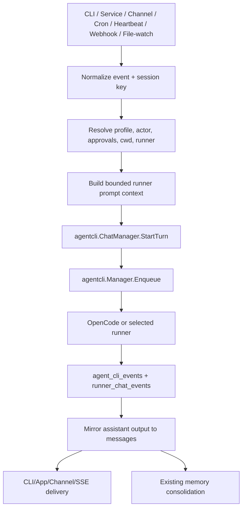

# Design: Runner-First Agent Removal

## Overview

The smallest viable path is to make `internal/agentcli` and runner chat the primary execution runtime, while preserving `or3-intern` as the orchestration host. The app keeps accepting work from CLI, service, channels, cron, heartbeat, webhooks, and file-watch triggers, but converts that work into runner chat turns or direct runner runs. OpenCode is the default runner because it is already modeled in `internal/agentcli` with structured output, streaming JSON, native session support, and permission helpers.

This fits the current architecture because runner infrastructure already exists: `agent_cli_runs`, `agent_cli_events`, `runner_chat_sessions`, `runner_chat_turns`, `runner_chat_events`, `agentcli.Manager`, `agentcli.ChatManager`, external runner detection, native runtime support, and `cronrunner` support for `PayloadAgentCLIRun`.

The key architectural change is replacing `agent.Runtime.Handle` as the central turn executor with a smaller orchestration layer that:

- receives ingress events,
- resolves session/profile/context,
- builds bounded runner prompts,
- enqueues runner turns,
- mirrors output back to `messages` and channels,
- keeps memory/artifact/approval/audit behavior intact.

## Affected areas

- `cmd/or3-intern/main.go`
  - Replace `runWorkers(..., *agent.Runtime, ...)` turn handling with runner-backed event handling.
  - Keep startup for DB, artifacts, memory, tools, channels, triggers, heartbeat, cron, approvals, and service.
  - Change `chat` one-shot behavior to create runner chat turns instead of calling `rt.Handle`.

- `cmd/or3-intern/runtime_build_runtime.go`
  - Promote `agentcli.Manager` construction from optional delegation to required/default runner runtime for chat/service/serve.
  - Keep compatibility for disabled runner mode only if needed for read-only tools/admin flows.

- `internal/agentcli`
  - Keep and extend `Manager`, `ChatManager`, runner adapters, native runtime registry, permission handling, OpenCode permission generation, cwd validation, output extraction, and event normalization.
  - Remove `RunnerOR3` from default selectable runners or mark it legacy/internal-only during transition.
  - Add a runner prompt/context builder if existing replay prompt support is not sufficient.

- `internal/app/service_app.go`
  - Replace `RunTurn` provider/runtime execution with `StartRunnerTurn` or similar runner-backed method.
  - Keep service helpers for replaying approved tool calls only if still needed by retained approval flows; otherwise migrate them to runner permission APIs.

- `cmd/or3-intern/service_agents.go` and `cmd/or3-intern/service_chat_sessions.go`
  - Treat runner endpoints as the primary agent execution endpoints.
  - Stop advertising OR3 as always available.
  - Preserve SSE/job event compatibility by mapping runner events to the existing job event response shape.

- `cmd/or3-intern/service_doctor_admin_brain.go` and `service_doctor_session.go`
  - Remove hidden fallback to `RunnerOR3`.
  - Use runner chat for doctor/admin brain sessions when a runner is selected.
  - If API-key internal admin brain remains temporarily, isolate it as admin-only deprecated behavior, not the default agent.

- `internal/cronrunner` and `internal/cron`
  - Prefer `PayloadAgentCLIRun` for new jobs.
  - Translate or deprecate `PayloadAgentTurn` and `PayloadSystemEvent` so they enter runner chat rather than the old bus-to-runtime loop.

- `internal/heartbeat` and `internal/triggers`
  - Keep publishing events to the bus initially, but have the bus worker convert them into runner turns.
  - Longer-term option: publish a structured runner turn request directly.

- `internal/db`
  - Keep existing tables.
  - Add a small migration only if needed to record default runner migration state or legacy runner labels.
  - Preserve legacy session/history rows.

- `internal/agent`
  - Split into retained primitives and removable runtime code.
  - Retain or relocate: job registry/events, chat attachments, trusted system prompt/bootstrap loading, prompt/context builder pieces that remain useful, prompt cache diagnostics if still useful, public error codes, observer/streaming interfaces, active plan/task-card helpers if still used.
  - Remove/quarantine: provider-driven turn loop, tool-call loop, tool-loop budgets, direct model runtime, subagent provider loop if replaced by runners.

- `internal/memory`, `internal/tools`, `internal/artifacts`, `internal/clawhub`, `internal/channels`, `internal/approval`
  - Keep platform packages, but decouple any imports from old agent runtime types where possible.
  - Shrink `internal/tools` by removing model-callable implementations that external runners already own.

- `docs/agent-runtime.md`, `docs/cli-reference.md`, `docs/configuration-reference.md`, `docs/channels.md`, `docs/memory-and-context.md`, `README.md`
  - Rewrite runtime docs around runner-first execution and OpenCode setup.

- `../or3-app/app/composables/useChatRunners.ts`
  - Remove the fake built-in OR3 runner fallback.
  - Change default runner selection to prefer selectable OpenCode, then another selectable external runner, then no runner with setup guidance.

- `../or3-app/app/composables/useJobs.ts`
  - Stop injecting `builtinInternRunner()` into runner lists.
  - Preserve legacy labels for old `or3-intern` jobs without making them selectable for new work.

- `../or3-app/app/types/or3-api.ts`
  - Split active/selectable runner IDs from legacy runner IDs if needed.
  - Keep response types compatible with older hosts that still return `or3-intern`.

- `../or3-app/app/pages/agents/index.vue`
  - Update task handoff to require a selectable external runner.
  - Remove branching that sends `or3-intern` jobs through old subagent paths when the user meant a runner task.
  - Replace empty states that say no external runners are optional with OpenCode/setup guidance.

- `../or3-app/app/pages/activity.vue` and `../or3-app/app/pages/scheduled.vue`
  - Update labels and filters so legacy OR3-agent runs remain readable but new scheduled tasks default to `agent_cli_run` with OpenCode or selected runner.

- `../or3-app/app/composables/useChatSessions.ts`, chat/doctor composables, and related chat components
  - Ensure chat session creation, session metadata, fork target selection, and doctor/admin chat use service-provided runner capabilities rather than hard-coded OR3-agent fallback.

- `../or3-app/server/api/or3/[...path].ts`
  - Likely unchanged because it is a generic authenticated proxy, but verify new runner endpoints and SSE paths pass through required headers and response headers.

## Control flow / architecture

### Target turn flow



### Runtime behavior

1. Startup opens SQLite, initializes artifacts, memory retrieval, tools, approvals, audit, channels, trigger services, cron, and `agentcli.Manager`.
2. Config loading enables runner execution by default and resolves a default runner, initially `opencode`.
3. Ingress sources create a normalized work item with session key, channel/from metadata, message, trigger kind, profile/capability, and optional attachments.
4. The runner prompt builder assembles trusted system instructions, bounded context, and untrusted user/task content into a deterministic runner prompt shape.
5. The worker chooses runner chat for conversational/event work, and direct `agent_cli_run` for explicit background tasks.
6. `agentcli.ChatManager` creates or reuses a `runner_chat_sessions` row, builds a bounded prompt for replay mode or uses native runner continuation when safe, persists the user message, and enqueues the run.
7. `agentcli.Manager` validates runner readiness, cwd, mode, isolation, queue depth, timeouts, and child environment, then executes the runner.
8. Runner events are persisted and mirrored into chat messages. Channel/SSE delivery consumes the same normalized events/messages.
9. Memory consolidation continues from the `messages` table and does not depend on the old agent loop.
10. OR3 App consumes service runner discovery and session metadata as source of truth, showing setup/remediation when no selectable runner is available.

## Data and persistence

### SQLite

Keep existing tables:

```sql
messages
agent_cli_runs
agent_cli_events
runner_chat_sessions
runner_chat_turns
runner_chat_events
chat_session_meta
memory_notes / memory vector and FTS tables
approval and audit tables
```

Likely additive migration:

```sql
ALTER TABLE chat_session_meta ADD COLUMN legacy_runner_id TEXT NOT NULL DEFAULT '';
```

Only add this if the implementation needs to preserve prior `runner_id='or3-intern'` while moving active sessions to `opencode`. If app compatibility can be handled in response shaping, avoid the schema change.

No existing history or memory data should be deleted. Existing OR3-agent session rows should remain listable. New turns for those sessions should either:

- migrate the session metadata to the configured default runner on first use, recording legacy label in response metadata, or
- require the caller to choose a supported runner before sending.

### Config and env

Current `AgentCLIConfig` already contains the required safety controls. Add only minimal fields if needed:

```go
type AgentCLIConfig struct {
    Enabled bool `json:"enabled"`
    DefaultRunner string `json:"defaultRunner,omitempty"`
    // existing fields: RuntimeMode, DefaultModels, MaxConcurrent, MaxQueued,
    // DefaultTimeoutSeconds, MaxTimeoutSeconds, DefaultMode, DefaultIsolation,
    // EventChunkMaxBytes, PreviewMaxBytes, MaxPersistedOutputBytes, ChildEnvAllowlist
}
```

Default behavior:

- `agentCLI.enabled=true` for new configs.
- `agentCLI.defaultRunner="opencode"` for new configs.
- Existing configs without `agentCLI.enabled` should be upgraded cautiously; if preserving exact old behavior is required, `doctor` can guide opt-in, but the target end state should be runner-first.
- Env override: `OR3_AGENT_CLI_DEFAULT_RUNNER=opencode|codex|claude|gemini`.

`or3-app` should not keep its own independent default-runner policy beyond ordering selectable service results. The service should expose enough metadata for the app to show:

- default runner,
- runner readiness status,
- install/auth remediation copy,
- legacy session labels.

### Session and memory scope

- Keep session keys unchanged: `cli:default`, channel-derived keys, `heartbeat:default`, etc.
- `runner_chat_sessions.app_session_key` remains the bridge from app/channel sessions to runner-native sessions.
- Memory retrieval uses the same default/global scope behavior, with runner prompt context replacing old provider prompt injection.
- Direct messages sharing behavior must continue to use `Session.DirectMessagesShareDefault` and identity scope mapping.

## Interfaces and types

### New or refactored orchestration interface

Add a small interface so workers do not depend on `agent.Runtime`:

```go
type TurnOrchestrator interface {
    StartTurn(ctx context.Context, req TurnRequest) (TurnResult, error)
}

type TurnRequest struct {
    SessionKey string
    Channel string
    From string
    Message string
    TriggerKind string
    RunnerID string
    Model string
    Mode string
    Isolation string
    Cwd string
    Attachments []ChatAttachment
    Meta map[string]any
    ApprovalToken string
    Actor string
    Role string
    ProfileName string
    Capability tools.CapabilityLevel
}

type TurnResult struct {
    RunnerChatSessionID string
    RunnerChatTurnID string
    AgentCLIRunID string
    AgentCLIJobID string
}
```

This can live in `internal/app`, `internal/agentcli`, or a new small `internal/runtime` package. Prefer `internal/app` first to avoid adding layers.

### Runner context builder

`agentcli.BuildReplayPrompt` currently builds transcript replay. Extend with an input that includes retained OR3 context:

```go
type RunnerPromptContext struct {
    UserMessage string
  TrustedSystemInstructions []ContextBlock
    History []RunnerHistoryMessage
    Bootstrap []ContextBlock
    RetrievedMemory []ContextBlock
    RetrievedDocs []ContextBlock
    TriggerInstructions string
    Attachments []ChatAttachment
    MaxBytes int
}

func BuildRunnerPrompt(ctx RunnerPromptContext) string
```

Reuse logic from `agent.Builder` where possible, but avoid keeping the old provider/tool-loop dependency alive solely for prompt building.

Trusted system prompt handling should preserve the old separation between OR3-controlled instructions and untrusted input even though most external runners accept a single task string. The generated runner prompt should use a stable structure such as:

```text
<trusted_or3_system_instructions>
...
</trusted_or3_system_instructions>

<or3_context>
bounded memory, docs, session replay, heartbeat/autonomous context
</or3_context>

<user_task>
untrusted user or trigger content
</user_task>
```

Adapters may map this structure to runner-native system/developer/message fields when available. When a runner only accepts a single prompt string, the boundaries must remain explicit in text and tests must cover prompt-injection-sensitive ordering.

### Prompt and context caching

The old built-in runtime contains provider-oriented prompt cache diagnostics and prompt-building caches. Runner-first execution should not depend on provider-native prompt caching because OpenCode/Codex/Claude/Gemini CLIs may each hide or expose cache behavior differently.

Use OR3-owned, deterministic caching only where it is safe:

- cache loaded bootstrap files by path, mtime, size, and content hash,
- cache memory/doc retrieval results by session/scope, query digest, retriever config, and embedding fingerprint,
- cache replay prompt fragments by runner chat session, last included message ID, runner ID, model, mode, isolation, and prompt builder version,
- cache runner detection results using the existing `agentCLIDetectCacheTTL`,
- never cache approval tokens, requester identities, secrets, raw tool credentials, or unredacted environment values.

Cache invalidation must happen when bootstrap files change, memory/doc indexes change, session history advances, runner/model/mode/isolation changes, or autonomous context such as `HEARTBEAT.md` changes. Cache failure should fall back to rebuilding the prompt and logging diagnostics rather than failing the turn.

### Tool cleanup disposition

Runner-first means OR3 should stop maintaining a parallel toolbox for general agent work. External runners already handle filesystem edits, shell commands, web access, and their own tool loops. OR3 should keep only the platform capabilities that make the product valuable around runners.

| Current tool/package | Disposition | Reason |
| --- | --- | --- |
| `exec` | Remove from model-callable registry; keep terminal/service execution separately | Runners already execute commands with their own permission model; OR3 shell tool is high-risk and duplicates runner behavior. |
| `read_file`, `search_file`, `write_file`, `edit_file`, `delete_file`, `list_dir` | Remove from model-callable registry; keep service file APIs and metadata/index scanners | Runners own workspace file access; OR3 App still needs file browsing/indexing as product features. |
| `web_fetch`, `web_fetch_markdown`, `web_search` | Remove | Runners have web/search tools or provider-specific browsing; OR3 web tools add SSRF/network policy burden. |
| `read_skill`, `run_skill`, `run_skill_script`, `builtin_skills/*` execution paths | Remove or freeze as legacy package metadata only | Runner CLIs can execute scripts/commands; OR3 skill execution duplicates shell/tooling complexity. Keep Clawhub/catalog metadata only if it feeds runner prompts or app browsing. |
| `spawn_subagent` and old subagent model loop | Remove | Runner-first delegation replaces OR3 subagents; background work should be runner jobs. |
| MCP model-callable tools | Remove from OR3 agent turns; consider runner-native MCP or service catalog only | Runners can own MCP/tool integrations; OR3 should not maintain a second model tool bridge unless needed for app/admin APIs. |
| Plan tools: `create_plan`, `update_plan`, `complete_plan_task`, `remove_plan` | Remove from general model tool registry; keep planning/task-card storage if used by app/admin flows | Runners can manage plans in files or output; OR3 may still store task cards as metadata. |
| `memory_set_pinned`, `memory_add_note`, `memory_search`, `memory_recent`, `memory_get_pinned` | Keep, but convert to internal runner-context/service APIs rather than general runner-callable tools | OR3 memory is a differentiator and should feed prompts/context. Direct writes should be guarded through app/admin APIs or explicit memory commands. |
| `read_artifact` and artifact store helpers | Keep internal/service API | Needed for oversized runner output, app inspection, auditability, and durable job artifacts. |
| Metadata scanner/context tools | Keep internal | Needed to build bounded runner context and app file/status views without giving runners unrestricted extra APIs. |
| `send_message` | Keep internal/service-only, not general runner-callable by default | Channels still need delivery, but autonomous outbound messages should be explicit OR3 orchestration decisions with approval/profile checks. |
| `cron` | Keep service/admin API; remove as model-callable tool | OR3 App and service manage scheduled tasks; runners should not freely rewrite schedules unless routed through explicit admin endpoints. |

The target registry should be split by caller:

- **Runner prompt context builders** use memory, metadata, doc index, and artifact summaries internally.
- **Service/admin APIs** expose files, artifacts, cron, approvals, memory, settings, and runner jobs to OR3 App with auth and roles.
- **Runner execution** receives context and permissions, but not a broad OR3 function-tool schema.
- **Legacy compatibility** keeps old records readable and old approval/tool names understandable in audit/history.

### Additional cleanup surfaces

The runner-first migration should also clean these non-tool seams so the old agent does not survive as terminology, config, or compatibility code that keeps influencing new behavior:

| Surface | Cleanup |
| --- | --- |
| Provider chat/runtime config | Keep provider clients for embeddings, memory consolidation, optional admin diagnostics, and migration commands; remove chat/subagent model roles, stream assembler, schema sanitizer, and provider tool-call code from active runtime if no longer used. |
| Bootstrap file names and copy | Keep `SOUL.md`, `AGENTS.md`, `IDENTITY.md`, `MEMORY.md`, and `HEARTBEAT.md` initially for compatibility, but document them as OR3 context files for runner prompts rather than built-in agent identity. Consider later renames only with migration aliases. |
| Tool/security config | Remove or deprecate config fields whose only purpose is OR3 model-callable tools: `tools.enableExec`, Brave web search key, skill execution toggles, dynamic tool exposure, task-card enforce-plan for tool calls, old tool allow/block lists. Keep hardening fields used by terminal, runners, service APIs, or approvals. |
| Access profiles and approvals | Keep profile/approval framework, but replace exec/skill/tool-call subjects with runner permission subjects and service/admin action subjects. Render legacy `exec`, `run_skill`, and tool quota records read-only. |
| Subagent queues and APIs | Stop creating `subagent_jobs`; keep store/API response compatibility only for old records or map UI concepts to runner jobs. Remove `spawn_subagent` and `agent.SubagentManager` active startup. |
| Skill-run plans | Keep `skill_run_plans` readable for audit/history if existing DBs contain them; stop creating new plans once skill execution is removed. |
| MCP manager | Keep catalog/settings only if useful for app configuration or runner-native setup; remove OR3 model-callable MCP registration. |
| Service replay-tool APIs | Remove or compatibility-gate approved tool-call replay routes that only made sense for the built-in tool loop; runner permission approval should use runner-specific continuation/resume behavior. |
| OR3 App cached defaults | Update local cache/session hydration/execution routing so missing runner metadata means “choose/configure a runner,” not `runnerId='or3-intern'`. |
| Docs and generated docs | Rewrite or archive `docs/v1` pages that describe provider tool loops, built-in tools, subagents, old request lifecycle, and “more built-in tools” roadmap. |
| Naming/API taxonomy | Prefer “runner jobs,” “runner chat,” and “automation” in new code. Keep `agent_cli_*` DB names and `/agent-runs` routes only as stable compatibility surfaces unless a migration is worth the churn. |

### Settings and config cleanup

The current settings surface is too broad for a runner-first product. Treat config migration as a first-class cleanup, not a cosmetic app pass. The target is a smaller active schema plus a compatibility reader for old config files.

| Config/settings area | Disposition | Notes |
| --- | --- | --- |
| `agentCLI` | Keep and promote | Add `defaultRunner`; default to enabled with OpenCode when available. Keep runner queue/timeouts/isolation/env allowlist/runtime-mode fields. Consider renaming UI labels from “External CLI Agents” to “Runners.” |
| `provider`, `providers`, `modelRouting`, `favoriteModels` | Shrink/split | Remove active chat/agent/subagent roles from setup and app settings. Keep provider profiles only for embeddings, memory consolidation/summarization, approval moderator, diagnostics, and migration compatibility. |
| `consolidationModel`, `contextManager.provider/model`, approval moderator provider/model | Keep if still provider-backed | Label these as background OR3 services, not the chat brain. Prefer role-specific names like memory summarizer or approval reviewer. |
| `subagents` and `OR3_SUBAGENTS_*` | Deprecate/read-only, then remove active use | Keep old values loadable for compatibility but stop showing them as active controls and stop starting subagent workers. |
| `tools` built-in fields: `braveApiKey`, `webProxy`, `enableExec`, `execTimeoutSeconds`, `restrictToWorkspace`, `allowFullFileRead`, `pathAppend` | Remove from active settings | These controlled OR3 model-callable web/file/shell tools. Runner filesystem/network/command access should be governed by runner isolation/profile settings instead. |
| `tools.mcpServers` and MCP settings UI | Convert or remove model-callable meaning | Keep only if OR3 App manages a catalog for runner-native MCP setup or service diagnostics; otherwise deprecate OR3 model-tool registration. |
| `skills.enableExec`, `skills.maxRunSeconds`, per-skill `apiKey/env/config`, skill trust policy | Remove active execution controls | Keep `skills.load`, `skills.entries.enabled`, and `skills.clawHub` only if skills remain a browsable/catalog/context source. Do not advertise OR3 skill execution. |
| `hardening.enableExecShell`, exec/web/subagent quotas, `allowedTools`, `allowSubagents` | Rename/re-scope | Preserve security posture for service/admin actions and runner permissions, but replace tool-specific fields with runner/service permission domains. |
| `context.tools.dynamicExpose`, `context.taskCard.enforcePlan`, `context.sections.toolSchemas`, `maxToolLoops`, `maxToolBytes` | Remove or repurpose | These are built-in tool-loop knobs. Keep context budgets for memory/history/workspace/runner prompt fragments; remove tool-schema budgeting from active settings. |
| `DocIndex`, memory retrieval, artifacts, workspace dirs, service/auth/security, channels, cron, heartbeat, triggers | Keep | These remain OR3 orchestration/control-plane settings and should become more prominent. |

Backend implementation should include a config compatibility layer:

- **Load**: accept removed JSON fields and legacy env vars without crashing; emit migration warnings through doctor/configure metadata.
- **Save**: write only active runner-first fields by default, plus an optional `legacy`/compatibility block only if needed for rollback.
- **Metadata**: mark fields as `active`, `deprecated`, `hidden`, or `compatibilityOnly` so CLI configure, service configure APIs, and OR3 App settings search render the same truth.
- **Migration guidance**: map old settings to replacements where possible, for example `tools.enableExec` → runner isolation/profile guidance, `provider.model` → runner-native model selection or memory summarizer config, and `subagents.enabled` → runner jobs.

OR3 App settings changes:

- Replace Provider/Models as the first-run chat setup with Runner setup/readiness.
- Remove actionable Tools/Skills execution settings from advanced search and section aliases.
- Keep Add-ons/MCP only if it describes runner-native add-ons or service diagnostics, not OR3 model-callable tools.
- Keep Heartbeat, channels, security, approval autopilot, memory, workspace, doc index, artifacts, and service pairing settings.
- Add empty states explaining that most command/file/web capability is configured in the selected runner, while OR3 controls orchestration, memory, approvals, and delivery.

### Runner selection

```go
func ResolveDefaultRunner(cfg config.Config, registry *agentcli.RunnerRegistry) agentcli.RunnerID
func ValidateSelectableRunner(id agentcli.RunnerID) error
```

`RunnerOR3` should be removed from `AllRunners()` or marked non-chat-selectable during the transition.

## Failure modes and safeguards

- **OpenCode missing/auth missing**: startup can continue for service/read-only operations, but chat/turn attempts fail with `runner_not_ready` and actionable install/auth guidance.
- **Runner disabled by config**: default runner resolution must fail closed and recommend selecting another enabled runner.
- **Invalid cwd**: reject before enqueue using existing `resolveAgentCLICwd` behavior.
- **Unsafe isolation/mode**: preserve `ValidateRunPolicy`; do not enable `sandbox_auto` unless explicitly configured.
- **Runner native session ambiguity**: use replay mode unless adapter confirms native session refs are extractable and resume is specific-session safe.
- **Oversized prompt/output**: clamp prompt context, event chunks, preview bytes, persisted output, and artifact spill size.
- **Stale system prompt/cache**: include prompt builder version and content hashes in cache keys; rebuild when files, memory/doc indexes, runner settings, or session history change.
- **Prompt injection through user content**: keep trusted system instructions before clearly delimited untrusted user/task content and preserve separate adapter fields where runners support them.
- **Secret leakage**: preserve child env allowlist and avoid injecting secret config values into runner prompts or events.
- **Removed tool references**: old configs, approvals, and chat history can mention removed tool names; readers should render them as legacy and new calls should fail with migration guidance.
- **Stale app/local-cache defaults**: cached app sessions may lack runner metadata; the app must prompt for runner setup instead of silently selecting `or3-intern`.
- **Provider config confusion**: users may still see provider/model settings; settings should explain which provider settings still affect embeddings/memory and which are deprecated for chat.
- **Config data loss**: existing config files may contain removed fields; migration must load them safely and avoid destructive rewrites until compatibility behavior is documented.
- **Settings search drift**: OR3 App aliases and doctor config metadata can keep removed fields discoverable; metadata status and app filtering must be tested together.
- **Channel delivery failure**: persist runner output/events even when delivery fails, then report delivery errors through logs/audit.
- **Migration failure**: SQLite open should remain compatible; optional metadata backfills should be best-effort and not block session listing.
- **Legacy OR3 session selection**: do not silently run removed built-in agent; migrate to default runner or require explicit runner choice.
- **OR3 App on old/new host mismatch**: detect missing runner endpoints or old hosts gracefully, but surface “update or3-intern / configure OpenCode” instead of synthesizing a fake OR3 runner.
- **Approval mismatch**: channel approval commands should keep resolving existing pending approvals without starting a runner turn.

## Testing strategy

- Unit tests with Go `testing`:
  - runner default resolution and OpenCode preference,
  - `AllRunners` no longer exposes OR3 as selectable,
  - worker event-to-runner-turn mapping,
  - bounded runner prompt construction,
  - trusted system prompt ordering and untrusted user-content delimiters,
  - prompt/context cache key invalidation for bootstrap, memory/doc, session, and runner changes,
  - tool registry split excludes removed general-purpose tools from runner-first turns,
  - legacy removed-tool references in approvals/audit/history remain readable,
  - app local-cache and execution-router paths do not default missing runner IDs to OR3,
  - provider/chat model settings are hidden, deprecated, or scoped to embeddings/memory where appropriate,
  - legacy OR3 session metadata handling,
  - config env/default loading for `agentCLI.defaultRunner`.

- SQLite-backed tests:
  - existing DB with `chat_session_meta.runner_id='or3-intern'` opens and lists sessions,
  - first new turn migrates or rejects legacy sessions deterministically,
  - runner chat turn writes user/assistant messages and updates summaries,
  - agent CLI run/event records remain queryable by service APIs.

- Integration-style package tests:
  - `cmd/or3-intern` service/chat runner endpoints show OpenCode and hide OR3 fallback,
  - `serve` worker handles channel event by enqueuing a runner turn,
  - cron `PayloadAgentCLIRun` still enqueues through `agentcli.Manager`,
  - legacy cron `PayloadAgentTurn` path is translated or returns migration guidance.

- OR3 App tests/type checks:
  - `useChatRunners` prefers OpenCode and returns no fake OR3 fallback when no runners are available,
  - `useJobs` preserves legacy OR3 labels without injecting OR3 into selectable runner lists,
  - Agents page blocks new task handoff until a selectable runner exists,
  - Scheduled task UI creates `agent_cli_run` payloads by default,
  - TypeScript compile catches removed active `or3-intern` assumptions.

- Regression tests:
  - OpenCode missing/auth missing produces actionable errors,
  - disabled default runner fails closed,
  - channel approval messages do not start runner turns,
  - output and prompt bounds are enforced.

- Manual verification:
  - `go test ./internal/agentcli ./internal/db ./internal/app ./internal/cronrunner ./cmd/or3-intern`
  - `or3-intern health --json` reports runner readiness,
  - `or3-intern chat` uses OpenCode after `opencode auth list` succeeds,
  - `or3-intern serve` accepts one channel/webhook/heartbeat event and records runner chat messages.
  - `or3-app` chat, Agents, Activity, Scheduled Tasks, and doctor/admin chat screens show OpenCode/default-runner state correctly against the updated service.