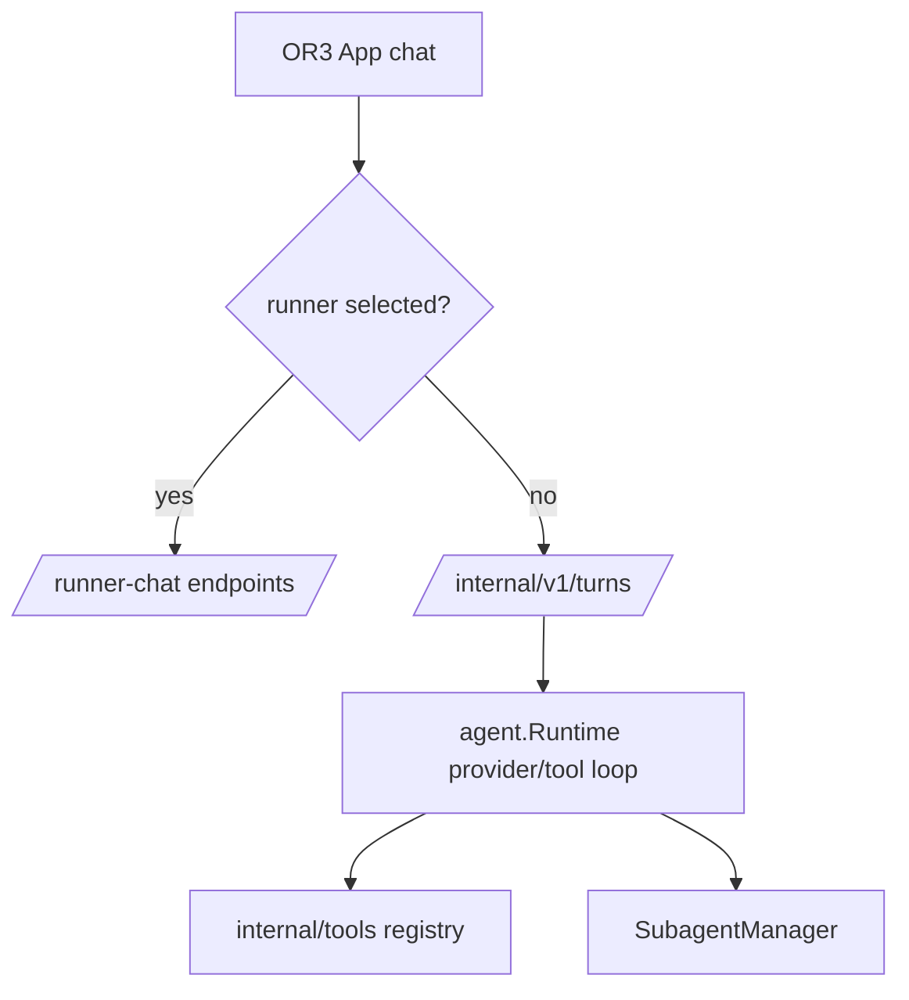
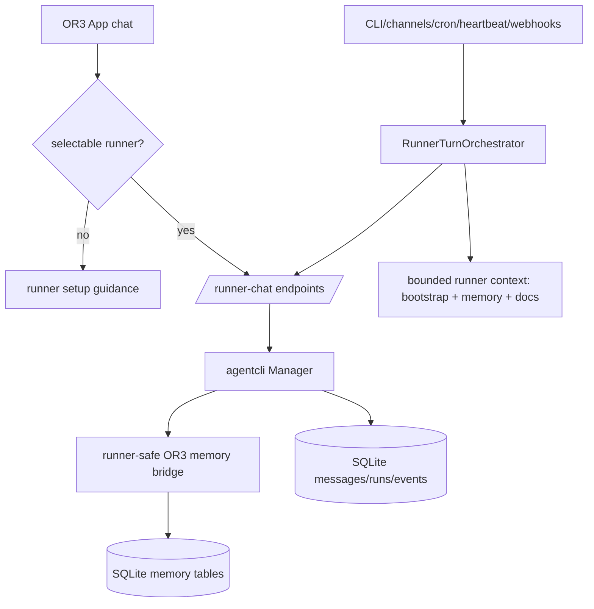

# Design: Runner-First Code Deletion

## 1. Overview

The current implementation made external runners primary, but the repository still carries the old built-in agent runtime, generic tool registry, model-callable tool implementations, legacy subagents, skill execution, direct-turn service API, replay-tool UI, and many tests/docs around those paths.

The cleanup should not start by deleting `internal/agent` and `internal/tools` wholesale. Those packages now contain two different kinds of code:

1. Legacy code to delete: provider/tool-loop runtime, model-callable tools, subagents, tool budgets, tool schemas, plan gates, direct tool replay.
2. Reusable platform code to keep temporarily and move: attachments, job events, stream observers, runner context bootstrap text, public error mapping, approval/capability/result primitives, memory access primitives, path/env helpers used by retained service APIs.

The design is therefore a collapse-and-delete sequence:

1. Extract shared platform types into smaller packages.
2. Switch all production code to those packages and runner-first APIs.
3. Remove direct-turn/subagent/tool replay app and service paths.
4. Delete legacy runtime/tool files and their tests.
5. Simplify config/docs/settings around the reduced architecture.

## 2. Affected areas

### `internal/agent` audit

Likely keep, but move/rename:

| Current file(s) | Current purpose | Proposed destination |
| --- | --- | --- |
| `chat_attachment.go` | Service/app/runner attachment shape and validation | `internal/turns` or `internal/chatctx` |
| `job_registry.go` | In-memory service job snapshots/SSE fanout | `internal/jobs` |
| `noop_streamer.go`, `service_runtime_context.go` | Service observer/streaming interfaces | `internal/turns` or `internal/streaming` |
| `error_codes.go` | Public API error code mapping | `internal/serviceerrors` |
| `prompt.go` bootstrap constants and non-runtime context helpers | Runner bootstrap/context text | `internal/runnercontext` or keep in `internal/app` |
| `tool_budget.go` only if Doctor internal brain remains briefly | Doctor/admin action limits | Replace with typed admin action policy or delete with Doctor runtime |

Delete after extraction/replacement:

| Current file group | Why removable |
| --- | --- |
| `runtime*.go`, `runtime_*_test.go` | Built-in provider/tool-loop execution |
| `tool_calls.go`, `tool_validation.go`, `tool_policy.go`, `tool_budget.go` | Model-callable tool loop policy and replay |
| `subagents.go`, `subagents_test.go` | Built-in background agents replaced by runner jobs |
| `plan_tools.go`, `plan_gate.go`, `active_plan*.go`, `task_card.go` if not used outside old tool loop | Model-callable plan enforcement |
| `structured_autonomy.go`, `recent_execution.go`, `turn_cleanup.go`, `turn_model_override.go` | Old model turn behavior |
| `context_evaluation.go`, prompt cache/provider prompt tests tied to old Builder if runner context uses a separate builder | Old prompt assembly diagnostics |
| skill runtime/prompt tests tied to built-in skills execution | Runners own skills/tools |

### `internal/tools` audit

Likely keep, but move/replace:

| Current file(s) | Current purpose | Proposed destination |
| --- | --- | --- |
| `tools.go` capability levels and `Base` schema helper | Generic tool interface; only capability may remain | `internal/capability` or delete schema helper |
| `context.go` requester identity, approval token, path/session context | Service/admin action context | `internal/requestctx` or `internal/approvalctx` |
| `result.go` `ToolResult` envelope and preview helpers | Doctor/admin result encoding and historical event rendering | `internal/actionresult` |
| `env.go`, parts of `files.go` path helpers, parts of `sandbox.go` only if service terminal/file APIs still use them | Safety utilities | `internal/safefs`, `internal/safeexec`, or direct service helpers |
| `metadata_scanner.go`, `tool_availability.go`, `tool_behavior.go` only if Doctor still scans non-OR3 tool catalogs | Likely delete with tool registry |

Delete after replacements:

| Current file group | Why removable |
| --- | --- |
| `exec.go`, `web.go`, `web_markdown.go`, `files.go` tool structs | Runners provide shell/file/web capabilities; service APIs should not be model tools |
| `memory.go` tool structs | Replace with runner-callable memory bridge/API; keep OR3 memory capability |
| `artifact.go` tool structs | Artifacts stay internal/service APIs, not model-callable tools |
| `skill.go`, `skill_exec.go`, `skill_run.go` | Runners own skill/tool execution |
| `spawn.go` | Old subagent spawning removed |
| `cron.go`, `message.go` tool structs | Cron/channel management should be direct service/admin APIs |
| `registry.go` once Doctor/admin no longer executes generic tools | Generic model-callable registry removed |
| All tests for deleted tools | No compatibility requirement |

### `cmd/or3-intern`

- `main.go`: remove full `agent.Runtime` construction, `buildRuntimeTools`, `buildBackgroundTools`, `SubagentManager` startup, `channelWorkerRuntime`, fallback `rt.Handle`, and tool registry wiring.
- `runtime_build_runtime.go`: keep runner manager/chat manager/orchestrator builders, remove runtime model config and job registry dependency on `agent` by switching to `internal/jobs`.
- `tool_registries.go`: delete after Doctor/admin tools no longer use generic registry.
- `service.go`: server should hold runner manager/chat manager/orchestrator, jobs, control, channels, broker, DB/auth dependencies; remove `runtime` and `subagentManager` fields.
- `service_agents.go`: remove direct built-in turn job path, replay-tool path, subagent creation path, and legacy event shaping that depends on `agent.JobEvent` after moving job types.
- `service_request.go`: remove `tool_policy`, `allowed_tools`, `restrict_tools`, `replay_tool_call`, and subagent decode paths from normal requests.
- `service_doctor_admin_brain.go` and `service_doctor_tools.go`: either convert Doctor internal brain to a runner-backed admin chat or replace generic Doctor tools with typed service actions. Then delete internal built-in Doctor runtime.
- `channel_approvals.go`: convert approval resume to runner permission continuation or direct channel notification; remove legacy runtime resume.
- `service_skills.go`: remove tool-backed skill execution endpoints if no catalog-only endpoint remains.

### `internal/app`

- `ServiceApp` should no longer accept `*agent.Runtime` or `*agent.SubagentManager`.
- `RunTurn` should be runner-only and fail closed when no runner orchestrator exists.
- `ReplayToolCall` should be deleted.
- `RunnerTurnRequest` should use moved attachment and capability/requester types.
- `RunnerContextBuilder` remains and becomes the main place for memory/doc/bootstrap context.
- Add a runner memory bridge/API surface so external runners can search, add notes, and manage pinned memory without depending on the old generic `tools.Registry`.

### `internal/agentcli`

- Replace imports from `internal/agent` with new packages for attachments and jobs.
- Replace imports from `internal/tools` with new capability/request context packages, or remove if only legacy `AllowedTools`/`RestrictTools` fields are deleted.
- Keep runner detection, manager, chat manager, native session support, and runner context cache.

### `internal/controlplane`

- Remove `agent.Runtime` dependency.
- Keep durable control plane operations for runner chat, agent CLI runs, approvals, auth, files, memory, cron, artifacts, and health.
- Remove subagent runtime controls and tool-loop status/capabilities.

### `internal/mcp`

- Remove model-callable tool registration into OR3 turns.
- Keep or add a local MCP-style runner bridge if that is the simplest way to give external runners OR3 memory capabilities. This MCP surface is for runner-to-OR3 platform APIs, not for the removed built-in OR3 tool loop.
- Keep MCP settings/catalog only if used by OR3 App for visibility, runner-native setup guidance, or the runner memory bridge.

### `or3-app`

- `useExecutionRouter.ts`, `useAssistantStream.ts`, `utils/assistant-stream/execution.ts`: delete direct `/internal/v1/turns` path and recovery fallback; use runner chat/follow-runner-turn only.
- `AssistantComposer.vue`, `pages/index.vue`: block send when no selectable runner exists; show setup guidance.
- `useJobs.ts`: delete `queueJob` and `/internal/v1/subagents` polling/creation for new work.
- `useDoctorAdminChat.ts`, `SettingsHealthChat.vue`, assistant stream event applier: remove replay-tool call retry UI unless replaced by runner permission retry.
- `types/or3-api.ts`, `types/app-state.ts`: remove direct turn, replay-tool, tool policy, allowed tools, and subagent creation types.
- Settings pages/search: remove deleted backend fields and controls.

## 3. Control flow / architecture

### Before cleanup



### After cleanup



Important control-flow changes:

- No fallback from runner-first to built-in provider runtime.
- No generic `tools.Registry` on normal turns.
- Memory remains runner-callable through a narrow OR3 platform bridge/API, not through the old generic tool registry.
- Channel commands are handled before runner turn creation so `/runner`, `/model`, `/settings`, `/approve`, and `/deny` are never accidentally sent to the runner as user prompts.
- No service API for replaying model tool calls.
- No app send path without a selectable runner.
- Doctor/admin work either uses external runner chat with typed service endpoints or typed direct service actions.

### Runner-callable memory bridge

Runners should have two memory channels:

1. **Passive context:** `RunnerContextBuilder` injects bounded retrieved memory, pinned memory, and indexed docs into the runner prompt at turn start.
2. **Active memory calls:** the runner can explicitly call OR3 to search memory, add a note, and read/update pinned memory.

The active bridge should be narrow and audited. Good implementation options are:

| Option | Shape | Notes |
| --- | --- | --- |
| Local MCP server | Expose `or3_memory_search`, `or3_memory_add_note`, `or3_memory_get_pinned`, `or3_memory_set_pinned` to runners that support MCP | Best fit for runner-native tool use if OpenCode/Codex/Gemini can consume local MCP config |
| Runner bridge command | Provide a small `or3-intern memory bridge` command with JSON stdin/stdout and document it for runner prompts | Simple and low dependency; works even without runner MCP support |
| Typed service endpoints | Add authenticated local endpoints for runner memory calls | Useful for OR3 App and service clients; runners need a way to call them safely |

Recommended direction: implement typed memory service functions first, then expose them through whichever runner bridge is easiest. Do not keep `internal/tools.Memory*` solely for this; move their validation and DB logic into an internal memory service that both OR3 App and runner bridge can use.

Memory bridge safeguards:

- Resolve session/global scope from the current runner chat session or explicit safe metadata.
- Bound search query length, result count, preview size, and total response bytes.
- Reject secret-looking memory notes using existing memory safety checks.
- Audit write operations with runner id, session key, actor/source, and turn id where available.
- Make writes explicit in runner instructions: remember only user-stated durable preferences, decisions, facts, or project lessons.

### Channel command routing and Telegram UX

Normal channel messages already fit the runner-first architecture: adapters publish `bus.EventUserMessage`, workers pass those events to `RunnerTurnOrchestrator`, and `RunnerTurnRequestFromBusEvent` can consume `runner_id` and `model` metadata. The remaining work is a small command/preference layer, not a new channel execution runtime.

Add a shared channel command router before `RunnerTurnOrchestrator.HandleBusEvent` runs. It should:

- Let approval handling keep first priority for `/approve` and `/deny`.
- Intercept channel management commands such as `/help`, `/settings`, `/runners`, `/runner <id>`, `/models`, `/model <name>`, and `/reset`.
- Persist runner/model preferences against the channel session key using existing runner chat session metadata where possible, especially `RunnerID` and `RunnerModel`.
- Resolve persisted preferences into event metadata (`runner_id`, `model`) before creating a runner turn.
- Validate the selected runner/model against the live runner catalog on every command and before each turn; stale selections should produce channel guidance or clear the preference.
- Return structured channel replies for command results instead of creating runner turns.

Telegram-specific behavior:

- Register bot commands with `setMyCommands` for discoverability: `help`, `settings`, `runners`, `runner`, `models`, `model`, `reset`, `approve`, and `deny`.
- Treat Telegram's slash-command UI as command-name autocomplete only. Telegram does not provide dynamic argument autocomplete for model names, so runner/model choices should be shown with inline keyboards, reply keyboards, or a follow-up prompt.
- Keep callback data short and opaque, because Telegram inline keyboard callback data is limited. Store any longer pending selection state server-side or encode only compact runner/model ids.
- Preserve peer isolation: preferences should key off the same Telegram session key rules as normal messages, including per-user isolation in group chats when enabled.

## 4. Data and persistence

### SQLite

No destructive SQLite migration is required for the first deletion pass. Existing historical tables can remain readable:

- `messages`
- `runner_chat_sessions`
- `runner_chat_turns`
- `agent_cli_runs`
- `agent_cli_events`
- `approval_requests`
- `artifacts`
- memory/doc index tables
- old `subagent_jobs` and `skill_run_plans` tables, if currently present

Recommended handling:

- Stop creating old `subagent_jobs` and `skill_run_plans` rows immediately.
- Keep read/list response shaping for old rows only if OR3 App Activity still displays historical records.
- Do not add migrations to drop tables in this cleanup; table deletion can happen later after app history views no longer reference them.

### Config/env

Remove active config fields for deleted runtime/tool behavior. Because nobody uses the project yet, old config compatibility can be limited to ignoring unknown JSON fields and warning for obsolete env vars.

Keep config areas for:

- `agentCLI` runner settings
- service auth/listen/capability for direct service APIs
- memory, embeddings, consolidation/context manager if retained
- channels, cron, heartbeat, triggers
- artifacts, workspace/files service settings
- approvals/audit/security profiles that still apply to service/admin/runner permissions

Remove or stop surfacing:

- built-in chat/subagent model routing
- `maxToolLoops`, tool loop quota/session quota fields
- `tools.enableExec`, `tools.braveAPIKey`, built-in web/file/exec fields
- skill execution fields
- subagent execution fields
- dynamic tool exposure/tool schema budgets
- plan-gate/tool-card fields if only used by built-in tools

### Sessions and memory

- Session keys and scope resolution remain unchanged.
- Runner turns continue to write normal messages/history.
- Passive memory retrieval moves through `RunnerContextBuilder`, not `agent.Builder`.
- Active runner memory calls go through the new runner memory bridge/API, not the old `tools.Registry` memory tools.
- Attachment metadata uses the moved attachment package.

## 5. Interfaces and types

### New or renamed packages

The exact names can be adjusted during implementation, but the plan should aim for narrow packages like:

```go
package turns

type Attachment struct { /* moved ChatAttachment */ }
func DecodeAttachments(raw any) []Attachment
func ValidateAttachments([]Attachment) error
```

```go
package jobs

type Event struct {
    Sequence int64          `json:"sequence"`
    Type     string         `json:"type"`
    Data     map[string]any `json:"data"`
}

type Snapshot struct {
    ID        string    `json:"id"`
    Kind      string    `json:"kind"`
    Status    string    `json:"status"`
    Events    []Event   `json:"events"`
    CreatedAt time.Time `json:"created_at"`
    UpdatedAt time.Time `json:"updated_at"`
}

type Registry struct { /* moved JobRegistry */ }
```

```go
package capability

type Level string
const (
    Safe Level = "safe"
    Guarded Level = "guarded"
    Privileged Level = "privileged"
)
```

```go
package actionresult

type Result struct {
    Kind       string         `json:"kind"`
    OK         bool           `json:"ok"`
    Status     string         `json:"status,omitempty"`
    Summary    string         `json:"summary,omitempty"`
    Preview    string         `json:"preview,omitempty"`
    ArtifactID string         `json:"artifact_id,omitempty"`
    RequestID  int64          `json:"request_id,omitempty"`
    Stats      map[string]any `json:"stats,omitempty"`
}
```

### Removed interfaces

Delete these rather than moving them unless implementation proves a retained user:

- `tools.Tool`
- `tools.Registry`
- function-style tool schemas
- `agent.Runtime`
- `agent.Builder` for model prompt construction
- `agent.SubagentManager`
- `agent.ServiceToolPolicy`
- `agent.ToolBudgetOverrides` after Doctor runtime conversion

### Service API shape

Runner-first endpoints remain:

- `/internal/v1/chat-runners`
- `/internal/v1/runner-chat/sessions`
- `/internal/v1/runner-chat/turns`
- `/internal/v1/runner-chat/events`
- `/internal/v1/agent-runs`
- `/internal/v1/jobs/{job_id}` for runner/service jobs
- cron, approvals, files, memory, artifacts, configure, doctor, auth endpoints that are still direct service APIs

Remove or hard-disable:

- `POST /internal/v1/turns`
- `POST /internal/v1/subagents`
- replay tool call payloads
- allowed tool/tool policy inputs for normal turns

## 6. Failure modes and safeguards

- **No runner installed:** App blocks send and service runner-chat returns setup/readiness errors. No fallback to built-in provider runtime.
- **Runner disabled live:** Apply live config to the running agent CLI manager/chat manager/orchestrator or require service restart with explicit status. Do not silently keep stale runner config.
- **Old direct-turn client calls service:** Return `410 Gone` or `400` with clear runner-chat replacement, not a legacy turn.
- **Old subagent client calls service:** Return `410 Gone` or `400` with `agent-runs` replacement.
- **Doctor/admin needs safe actions:** Use typed service actions with explicit auth/approval bounds, not generic model-callable tools.
- **Runner writes bad memories:** Reject secret-like content, bound write size, scope writes to the correct session/global target, and make memory writes visible in audit/activity.
- **Runner overuses memory search:** Enforce per-call result limits and optionally per-turn memory-call budgets in the bridge, independent of old tool-loop budgets.
- **Channel command reaches runner:** Command router must consume known channel commands and return a channel response without starting a turn.
- **Telegram autocomplete expectation mismatch:** Register command names through Telegram commands, but use buttons/keyboards/follow-up prompts for runner/model values because dynamic command argument autocomplete is not available.
- **Channel runner preference goes stale:** Validate stored runner/model preferences before turn creation and return setup guidance instead of silently changing execution behavior.
- **Historical rows reference deleted tools/subagents:** Render as historical/legacy activity without recreating execution paths.
- **Config contains deleted fields:** Loader ignores them safely; configure/settings do not write them back.
- **Accidental import resurrection:** Add tests or CI grep checks for forbidden production imports/symbols.

## 7. Testing strategy

### Go tests

- Add package-level tests for moved attachment/job/capability/action result packages before deleting originals.
- Update runner chat tests to import moved types and verify runner turns still persist messages/events.
- Add regression tests that `ServiceApp.RunTurn` fails closed without an orchestrator in runner-first mode.
- Add service tests that old `/internal/v1/turns` and `/internal/v1/subagents` do not create legacy jobs.
- Add config tests that old deleted fields/env vars are ignored or reported as obsolete.
- Keep focused tests for cron runner, channels, memory retrieval, approvals, artifacts, service auth, and runner detection.
- Add channel command tests covering command interception, preference persistence, metadata injection, stale runner/model guidance, approval command priority, and Telegram command registration/callback handling.
- Delete tests whose only assertion is old runtime/tool behavior.

### OR3 App tests

- Update chat tests so send requires a selectable runner and never calls `/internal/v1/turns`.
- Update Jobs/Agents/Scheduled tests so no path calls `/internal/v1/subagents`.
- Update Doctor/admin chat tests to remove replay-tool retry assumptions or cover runner permission flows.
- Update settings search tests so deleted fields cannot appear.

### Final validation

- Run focused package tests after each deletion slice.
- Run `go test ./...` after all backend cleanup.
- Run OR3 App typecheck and test suite after app/API cleanup.
