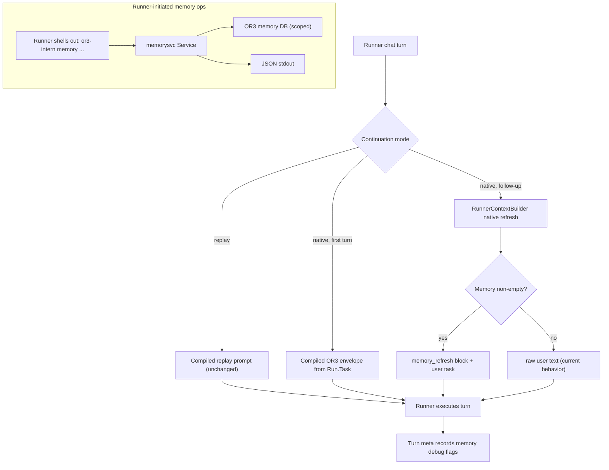

# Runner Memory Bridge and Global Skill Design

## Overview

Extend the existing runner-first prompt/context pipeline rather than adding a new memory stack.
The native continuation path gains a bounded fresh-memory refresh, a thin first-party CLI exposes
`memorysvc` to runners, and a bundled skill plus updated bootstrap text point runners at that CLI.
`RunnerContextBuilder` stays the single passive assembly path; the CLI is the only new write/read
surface, and it reuses `memorysvc` end to end.

## Affected Areas

- `internal/runners/chat_execution.go`: `ChatExecutionInput` learns to prepend a bounded memory
  refresh on native follow-up turns.
- `internal/runners/runners.go`: add `MemoryRefresh` to `RunnerChatCommandRequest`.
- `internal/runners/chat_manager.go`: thread a compiled memory refresh into `StartTurnRequest`
  and `agentMeta["runner_chat_memory_refresh"]`.
- `internal/runners/manager.go` and `internal/runners/native_runtime.go`: read
  `runner_chat_memory_refresh` into the chat command request alongside the existing user/replay
  keys.
- `internal/app/runner_context.go`: add a metadata-returning variant of context assembly and a
  bounded native refresh builder (memory blocks only).
- `internal/app/runner_prompt_compiler.go` and `internal/app/turn_orchestrator.go`: produce the
  native refresh and the per-turn memory debug metadata, and stash both on the start request.
- `internal/runnercontext/bootstrap.go`: rewrite the memory section of `DefaultRunnerNotes` to
  prefer the `or3-intern memory` CLI; demote HTTP endpoints to service-internal.
- `cmd/or3-intern/memory_cmd.go` (new): `runMemoryCommandWithDeps`, JSON output, `memorysvc` wiring.
- `cmd/or3-intern/main.go`: register the `memory` command and build the CLI memory service.
- `cmd/or3-intern/skills_cmd.go` / `service_skills.go`: resolve a stable bundled-skills directory
  (materialized from embedded content) so bundled skills load without workspace-local files.
- `cmd/or3-intern/setup_cmd.go` / `init.go`: materialize embedded bundled skills during setup.
- `builtin_skills/memory/SKILL.md` (new): the first-party memory skill, also embedded for fallback.
- `internal/skills` (embed): embed `builtin_skills/**` so the bundle is always available.

## Control Flow



## Native Memory Refresh

The gap is in `ChatExecutionInput`: once `NativeSessionRef` is set it returns only
`chat.UserMessage`, so a fresh `memory_context` is never delivered.

Plan:

- Add `MemoryRefresh string` to `RunnerChatCommandRequest`.
- `ChatExecutionInput` for `ContinuationNative` with a non-empty `NativeSessionRef`:
  - if `MemoryRefresh` is non-empty, return `MemoryRefresh + "\n\n" + UserMessage`;
  - else return `UserMessage` (today's behavior).
- The refresh is compiled by `RunnerContextBuilder` (memory blocks only: pinned, retrieved,
  digest), bounded by the existing `runnerPinnedMemoryMaxChars` / `runnerRetrievedMemoryMaxChars`
  / `runnerStaticMemoryMaxChars` limits. Docs/indexed excerpts are excluded to keep the refresh
  small and turn-relevant.
- The orchestrator computes the refresh for native follow-up turns and sets
  `StartTurnRequest.MemoryRefresh`; `StartTurn` writes it to
  `agentMeta["runner_chat_memory_refresh"]`, mirroring the existing user/replay/native keys.
- `manager.go` and `native_runtime.go` read `runner_chat_memory_refresh` into
  `RunnerChatCommandRequest.MemoryRefresh`.

This keeps `RunnerContextBuilder` as the single retrieval path and avoids duplicating memory
logic inside the runners package.

## Memory CLI Bridge

New `cmd/or3-intern memory` command, modeled on `skills_cmd.go`'s `runSkillsCommandWithDeps`:

```text
or3-intern memory search    --session <key> [--global] [--top-k N] <query>
or3-intern memory add-note  --session <key> [--global] [--tags a,b] <text>
or3-intern memory pinned get --session <key> [--global] [--key <k>]
or3-intern memory pinned set --session <key> [--global] --key <k> <content>
```

- Backed by `memorysvc.New(cfg, db, embedProvider, embedFingerprint)`, reusing the same
  construction as `service_runner_memory.go`'s `memoryService()`.
- JSON to stdout by default (search hits, note id + warning, pinned entries, `{ "ok": true }`),
  with an optional `--format text` for humans.
- Validation mirrors the service handlers: session+query required for search, session+text for
  notes, session+key+content for pinned set.
- `--global` maps to `GlobalOnly`; scope resolution stays inside `memorysvc`.
- The runner never needs a bearer token: authorization is the local process owning the OR3 data
  directory, which is the same trust boundary as the binary itself.

Registered in `main.go` alongside `case "skills"`, with a `memoryCommandDeps` struct so tests can
inject a fake service, stdout, and stderr.

## Bundled Memory Skill And Discoverability

`builtin_skills/memory/SKILL.md` frontmatter `name: memory` plus a one-line description and body
covering:

- when to recall (durable facts/decisions) vs rely on injected context;
- session scope vs `--global` memory;
- durable-note rules (persist preferences/decisions/lessons; never scratch work or secrets);
- pinned-memory rules (only facts that must always appear in future prompts);
- exact command examples and JSON output shape.

Discoverability: today `serviceBundledSkillsDir()` and `main.go` resolve
`filepath.Dir(cfgPath)/builtin_skills`, which only works when the repo directory is present.
Embed `builtin_skills/**` via `go:embed` and:

- materialize the embedded bundle into a stable path under the OR3 data dir (next to config)
  during `setup`/`init`;
- fall back to the embedded content if the on-disk bundled dir is missing, so the `memory` skill
  is always loadable as source `bundled` (not `workspace`) regardless of working directory.

## Bootstrap Text

Rewrite the memory section of `DefaultRunnerNotes` to lead with the CLI:

- "Use `or3-intern memory search/add-note/pinned ...` to recall durable facts, store durable
  notes, and read/set pinned memory."
- Keep the recall/note/pinned guidance (when to use each).
- Move the `/internal/v1/runner-memory/*` lines into a short "service API internals" note rather
  than runner instructions.

## Debug Metadata

Add a small struct surfaced from context assembly:

```go
type RunnerMemoryDebug struct {
    PassiveCompiled    bool `json:"passive_compiled"`
    NativeRefresh      bool `json:"native_refresh"`
    PinnedNonEmpty     bool `json:"pinned_non_empty"`
    RetrievedNonEmpty  bool `json:"retrieved_non_empty"`
    DigestNonEmpty     bool `json:"digest_non_empty"`
    DocsNonEmpty       bool `json:"docs_non_empty"`
}
```

- `RunnerContextBuilder` returns these flags from a metadata-aware build method; the compiler
  carries them on `RunnerPromptCompileResult`.
- The orchestrator writes them into the runner-chat turn meta JSON (extending
  `runnerChatTurnMetaJSON`) and/or `agentMeta`, never including raw memory text.

## Failure Modes and Safeguards

- Empty memory on native follow-up: refresh is empty, `ChatExecutionInput` returns raw user text;
  no behavior regression.
- Memory service unavailable in CLI (no DB/embed): commands exit non-zero with a clear message;
  search/add-note degrade to keyword/no-embedding with a surfaced warning when DB is present.
- Bundled dir missing on disk: embedded fallback keeps the `memory` skill eligible.
- Oversized refresh: bounded by existing caps; the compiled block is truncated, not dropped.
- Debug metadata must stay content-free to avoid leaking memory into logs/telemetry.

## Testing Strategy

- `internal/runners`: table tests for `ChatExecutionInput` covering first native turn, native
  follow-up with refresh, native follow-up without memory, and unchanged replay.
- `internal/app`: tests that the orchestrator/compiler produce a bounded native refresh and
  populate memory debug flags from non-empty sources.
- `cmd/or3-intern`: `runMemoryCommandWithDeps` tests for search, add-note, pinned get/set,
  global-only, JSON output, and missing-input validation, using an in-memory `memorysvc`.
- `internal/skills` / `cmd/or3-intern`: inventory tests asserting the `memory` skill is present,
  eligible, source `bundled` (not workspace), and discoverable from embedded content.
- Reuse existing focused suites: `TestRunnerPromptCompiler`, `TestChatExecutionInput`,
  `TestRunnerMemory`, `TestSkills`.
- Smoke: pin a fact, then ask a native OpenCode/Codex runner about it on a follow-up turn and
  confirm it is visible without switching to replay mode.
