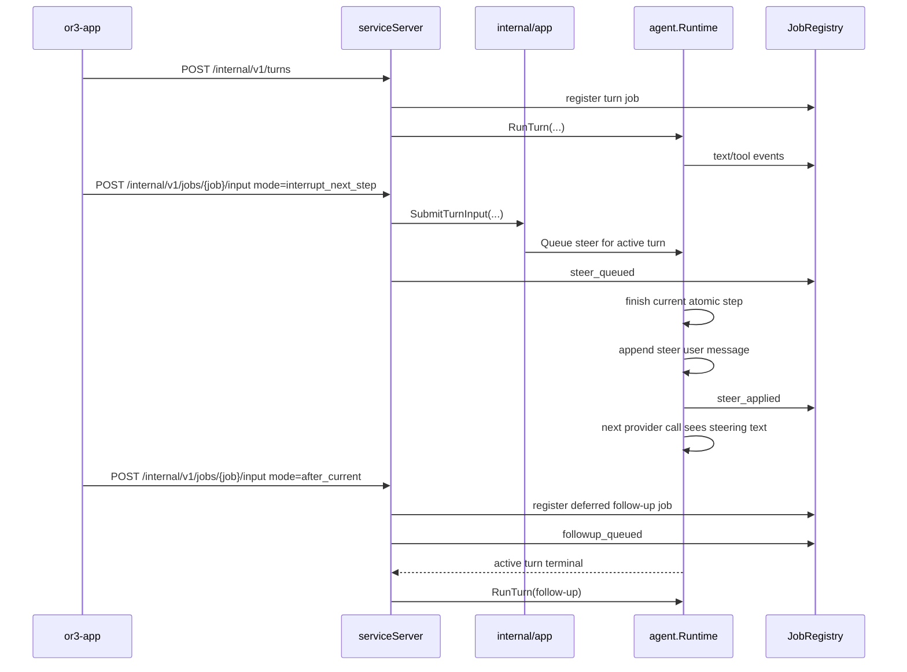

# Steer vs Follow-Up Input - Design

## Overview

Add a small turn-input coordination layer around service turn jobs and runtime execution. The layer should keep the current single-process model: `cmd/or3-intern` owns HTTP routes and `JobRegistry` events, `internal/app` exposes typed operations, and `internal/agent.Runtime` remains the only code that mutates chat history during a turn.

The smallest repo-aligned design is:

- `or3-app` targets the active turn job with a new job input route.
- `or3-intern` accepts either `interrupt_next_step` or `after_current`.
- Interrupt input is handed to the active runtime through a bounded in-memory steer controller.
- Follow-up input is registered as a deferred job and launched after the active job finishes, preserving the existing `/internal/v1/turns` execution path.

This avoids overlapping session turns, avoids raw history patching from the app, and does not introduce a new external queue or frontend-specific backend.

## Affected areas

- `cmd/or3-intern/service.go`
  - Add `POST /internal/v1/jobs/{job_id}/input` handling beside `stream` and `abort`.
  - Return stable JSON for accepted steer input and queued follow-up jobs.
- `cmd/or3-intern/service_request.go`
  - Add strict decoding for `serviceJobInputRequest` with `mode`, `message`, optional `client_message_id`, and optional `meta`.
- `cmd/or3-intern/service_agents.go`
  - Wire the input route into active turn job state, publish `steer_queued`, `steer_applied`, `followup_queued`, and fallback events.
  - Adjust turn-job start/completion bookkeeping so follow-ups launch after terminal states.
- `cmd/or3-intern/service_auth.go`
  - Confirm `POST /internal/v1/jobs/{id}/input` is treated as a service mutation with the same auth posture as `POST /internal/v1/turns` or job abort.
- `internal/app/service_app.go`
  - Add typed methods such as `SubmitTurnInput`, `RunDeferredTurn`, and optional `GetActiveTurnInputState`.
  - Keep HTTP details out of `internal/app`.
- `internal/agent/runtime.go`
  - Add optional `TurnSteerer` support to `Runtime.Handle` / `executeConversation`.
  - Apply steer messages at safe points without bypassing tool validation, approval, quota, or artifact handling.
- `internal/agent/runtime_execution.go`
  - Check pending steer before the next provider call.
  - Append applied steer input to both prompt messages and SQLite session history.
- `internal/agent/service_runtime_context.go`
  - Add context helpers for a turn input controller and observer callbacks if they are not kept in service-only context.
- `internal/agent/job_registry.go`
  - No structural change required, but add tests if new event names reveal response-shaping assumptions.
- `or3-app/app/components/assistant/AssistantComposer.vue`
  - Allow text entry while streaming.
  - Show distinct controls for interrupt, follow-up, and stop.
- `or3-app/app/composables/useAssistantStream.ts`
  - Add `sendRunningInput(mode, payload)` or extend `send` with a running input mode.
  - Track pending user messages and queued follow-up assistant placeholders.
- `or3-app/app/types/app-state.ts`
  - Add message/input state fields only if needed for queued/applied UI, for example `runningInputMode` and `queuedJobId`.
- `or3-app/app/types/or3-api.ts`
  - Add request/response types for job input mode.
- Tests in `or3-intern/internal/agent`, `or3-intern/cmd/or3-intern`, and `or3-app/tests/unit`.

## Control Flow / Architecture



### Active turn tracking

Add a small service-owned tracker because `JobRegistry` intentionally stores generic jobs and the runtime session lock does not know job IDs:

```go
type turnInputMode string

const (
    turnInputInterruptNextStep turnInputMode = "interrupt_next_step"
    turnInputAfterCurrent      turnInputMode = "after_current"
)

type serviceTurnInputRequest struct {
    Mode            turnInputMode
    Message         string
    ClientMessageID string
    Meta            map[string]any
}

type activeTurnState struct {
    JobID      string
    SessionKey string
    BaseReq    serviceTurnRequest
    Identity   serviceAuthIdentity
    Steerer    *agent.TurnSteerer
}
```

`serviceServer` can hold this state behind a mutex:

```go
type serviceTurnInputCoordinator struct {
    mu       sync.Mutex
    active   map[string]*activeTurnState // job_id -> state
    followup map[string][]deferredTurn    // active job_id -> FIFO follow-ups
}
```

The tracker is intentionally in-memory for v1. It coordinates live turns and avoids a schema migration. Once a steer is applied or a follow-up starts, the normal `messages` table persists the actual user input.

### Interrupt next step

Add a runtime-level steerer with a tiny bounded queue. A capacity of one is acceptable for v1 if the API documents that a later steer replaces an unapplied steer; a capacity of three is also reasonable if FIFO matters. Prefer capacity one for lower confusion:

```go
type TurnSteerInput struct {
    Message         string
    ClientMessageID string
    Meta            map[string]any
    ReceivedAtMS    int64
}

type TurnSteerer struct {
    mu      sync.Mutex
    pending *TurnSteerInput
}

func (s *TurnSteerer) Queue(input TurnSteerInput) (replaced bool)
func (s *TurnSteerer) Take() (TurnSteerInput, bool)
```

Context helpers keep the runtime API small:

```go
func ContextWithTurnSteerer(ctx context.Context, steerer *TurnSteerer) context.Context
func TurnSteererFromContext(ctx context.Context) *TurnSteerer
```

`executeConversation` should call a helper before each provider request:

```go
func (r *Runtime) applyPendingSteer(ctx context.Context, sessionKey string, messages *[]providers.ChatMessage) (bool, error)
```

When a steer is available:

1. Trim and validate the message.
2. Append it to SQLite with role `user` and payload:

   ```json
   {
     "channel": "service",
     "meta": {
       "input_mode": "interrupt_next_step",
       "client_message_id": "..."
     }
   }
   ```

3. Append `providers.ChatMessage{Role: "user", Content: steer.Message}` to the in-memory prompt.
4. Notify the observer through either a new optional interface or a generic job event emitted by service:

   ```go
   type TurnInputObserver interface {
       OnTurnInput(ctx context.Context, event TurnInputEvent)
   }
   ```

Safe point rules:

- Check before the first provider call only if a steer arrived between job creation and provider start.
- Check before each later provider call, after current tool results have been appended.
- Do not interrupt a provider stream or a tool execution mid-call.
- Do not insert a user message while there are unresolved provider tool calls.

If the active turn completes and `Steerer.Take()` still returns a message, service should enqueue it as a follow-up and publish `steer_deferred`.

### Add after this finishes

Follow-up input should use the same turn execution path as a normal request, but it should not start until the active job is terminal. The deferred item should store:

```go
type deferredTurn struct {
    JobID           string
    Request         serviceTurnRequest
    Identity        serviceAuthIdentity
    ClientMessageID string
    CreatedAt       time.Time
}
```

On `POST /internal/v1/jobs/{job_id}/input` with `after_current`:

1. Verify the target job is an active `turn` job.
2. Clone the active turn's `SessionKey`, tool policy, profile, approval token handling rules, and audit metadata.
3. Register a new `turn` job with `JobRegistry`.
4. Publish `queued` with `status=queued` and `deferred_after_job_id`.
5. Add it to the target job's follow-up FIFO.
6. Return:

   ```json
   {
     "ok": true,
     "mode": "after_current",
     "job_id": "job_...",
     "target_job_id": "job_...",
     "status": "queued"
   }
   ```

When the active turn is terminal, drain the FIFO in order. Each follow-up calls the existing `runTurnJob` path. The job should publish `started` only when execution actually begins, so the app does not show a deferred item as already running.

### Route shape

Request:

```http
POST /internal/v1/jobs/{job_id}/input
Content-Type: application/json

{
  "mode": "interrupt_next_step",
  "message": "Actually, don't edit store.go yet. Inspect the DB tests first.",
  "client_message_id": "msg_local_abc",
  "meta": {
    "ui_source": "chat_composer"
  }
}
```

Response for interrupt:

```json
{
  "ok": true,
  "mode": "interrupt_next_step",
  "job_id": "job_...",
  "target_job_id": "job_...",
  "status": "queued"
}
```

Response for follow-up:

```json
{
  "ok": true,
  "mode": "after_current",
  "job_id": "job_followup_...",
  "target_job_id": "job_...",
  "status": "queued"
}
```

Rejected states:

- `404`: job not found or not visible.
- `409`: target job is terminal or not a `turn` job.
- `400`: invalid mode, empty message, unknown fields, or oversized request.
- `503`: coordinator unavailable.

### App behavior

`AssistantComposer.vue` should treat streaming as a running-turn state, not an input-disabled state:

- The editor stays enabled.
- The send area shows:
  - icon button for interrupt next step.
  - icon button for add after this finishes.
  - icon button for stop/cancel.
- Tooltips and accessible labels name the actions.
- Enter can default to `Add after this finishes` while streaming to avoid accidental steering; the explicit interrupt button handles correction.

`useAssistantStream.ts` should add a separate path for running input:

```ts
export type RunningInputMode = 'interrupt_next_step' | 'after_current';

async function sendRunningInput(mode: RunningInputMode, payload: AssistantSendPayload) {
  // requires activeJobId.value
}
```

For `interrupt_next_step`:

- Add the user message to chat immediately with status `sending` or a new `queued` presentation.
- Call `/internal/v1/jobs/{activeJobId}/input`.
- Store the returned target job on the message.
- Mark complete when `steer_applied` arrives for the same `client_message_id`.

For `after_current`:

- Add the user message immediately with queued state.
- Add an assistant placeholder linked to the returned follow-up job.
- When the active stream finishes, follow the queued job through the existing `followJobId` path.

The current `send` early return:

```ts
if ((!text && !followJobId) || isStreaming.value) return;
```

should become mode-aware, so normal sends are still blocked during streaming but running input is not.

## Data and Persistence

No SQLite schema migration is required for v1.

Applied interrupt messages and started follow-up messages are persisted in the existing `messages` table through `DB.AppendMessage`. Use payload metadata to distinguish input modes:

```json
{
  "channel": "service",
  "from": "or3-net",
  "meta": {
    "input_mode": "interrupt_next_step",
    "target_job_id": "job_...",
    "client_message_id": "..."
  }
}
```

In-memory state that may be lost on service restart:

- Unapplied steer input.
- Deferred follow-up input that has not started.

That loss is acceptable for v1 only if the service publishes clear failures when the job is aborted/restarted and the app can retry. If durable pending input is later required, add an additive `turn_inputs` table with `id`, `target_job_id`, `session_key`, `mode`, `message`, `status`, `client_message_id`, `metadata_json`, and timestamps.

Config changes are not required for v1. If a bound is configurable, reuse existing service body limits and keep a hard-coded small per-job pending steer cap.

## Interfaces and Types

Suggested Go types:

```go
type TurnInputMode string

const (
    TurnInputInterruptNextStep TurnInputMode = "interrupt_next_step"
    TurnInputAfterCurrent      TurnInputMode = "after_current"
)

type SubmitTurnInputRequest struct {
    TargetJobID     string
    Mode            TurnInputMode
    Message         string
    ClientMessageID string
    Meta            map[string]any
    Actor           string
    Role            string
}

type SubmitTurnInputResponse struct {
    Mode        TurnInputMode
    TargetJobID string
    JobID       string
    Status      string
    Replaced    bool
}
```

Suggested service app method:

```go
func (a *ServiceApp) SubmitTurnInput(ctx context.Context, req SubmitTurnInputRequest) (SubmitTurnInputResponse, error)
```

If the coordinator is service-owned rather than app-owned, this method can remain on `serviceServer`; use `internal/app` only for `RunDeferredTurn`.

Suggested TypeScript types:

```ts
export type TurnRunningInputMode = 'interrupt_next_step' | 'after_current';

export interface TurnJobInputRequest {
  mode: TurnRunningInputMode;
  message: string;
  client_message_id?: string;
  meta?: Record<string, unknown>;
}

export interface TurnJobInputResponse {
  ok: boolean;
  mode: TurnRunningInputMode;
  job_id: string;
  target_job_id: string;
  status: 'queued' | 'applied' | string;
  replaced?: boolean;
}
```

## Failure Modes and Safeguards

- **Active job completes before steer applies:** service converts the steer into a follow-up job and emits `steer_deferred`.
- **Target job is terminal:** return `409`; app marks the pending user message failed and offers retry as a normal send.
- **Target job is not a turn:** return `409`; do not allow steering external CLI, subagent, terminal, or file jobs in v1.
- **Multiple steer messages arrive quickly:** keep only the latest unapplied steer or a tiny FIFO; response includes `replaced=true` when applicable.
- **Follow-up queue grows:** cap deferred follow-ups per active job, for example 8; return `429` when exceeded.
- **Provider/tool failure after steer:** existing error handling applies; the steer message remains part of history if already applied.
- **Approval-required active turn:** treat `approval_required` as terminal for follow-up dispatch. Do not apply steer by replaying or modifying a blocked tool approval.
- **Service restart:** active turn jobs are aborted by existing cancellation behavior; unapplied/deferred input is not guaranteed durable in v1.
- **App stream disconnect:** queued follow-up can be recovered if the response job ID is stored locally; live steer applied state is best-effort through job snapshot events.
- **Secret leakage:** events include only message previews/client IDs/mode/status, not approval tokens or requester credentials.

## Testing Strategy

### Go unit tests

- `internal/agent/runtime_test.go`
  - Steer queued during a tool call is appended before the next provider call.
  - Steer is persisted once with input-mode metadata.
  - Steer does not reset `MaxToolLoops` or bypass tool policy.
  - Multiple pending steer inputs follow the documented replacement/FIFO behavior.
- `cmd/or3-intern/service_test.go`
  - Strict decode accepts snake_case and rejects unknown fields.
  - `POST /jobs/{id}/input` rejects missing message, invalid mode, terminal job, unknown job, and non-turn job.
  - Interrupt publishes `steer_queued` and `steer_applied`.
  - After-current registers a new job and starts it after the active job completes.
  - Follow-up jobs preserve FIFO order for the same target job.
  - Route auth posture matches current turn/job mutation expectations.
- `internal/agent/job_registry_test.go`
  - New event names are retained in snapshots and do not break terminal status handling.

### App unit tests

- `tests/unit/assistant-stream-hardening.test.ts`
  - Running input requests hit `/internal/v1/jobs/{job_id}/input` and do not call `/internal/v1/turns`.
  - `interrupt_next_step` updates the pending user message when `steer_applied` arrives.
  - `after_current` stores and follows the returned follow-up job ID.
- `tests/unit/composer-actions.test.ts` or a new composer test
  - Composer remains editable while streaming.
  - Normal submit is disabled or redirected according to the selected running input mode.
  - Stop remains separate from interrupt/follow-up.

### Manual validation

1. Start a long-running tool turn in `or3-app`.
2. Send an interrupt correction and verify the next model step acknowledges it.
3. Send an after-current follow-up and verify it waits for completion.
4. Send two follow-ups and confirm FIFO order.
5. Hit stop while an interrupt/follow-up is pending and confirm the UI ends in a retryable state.
