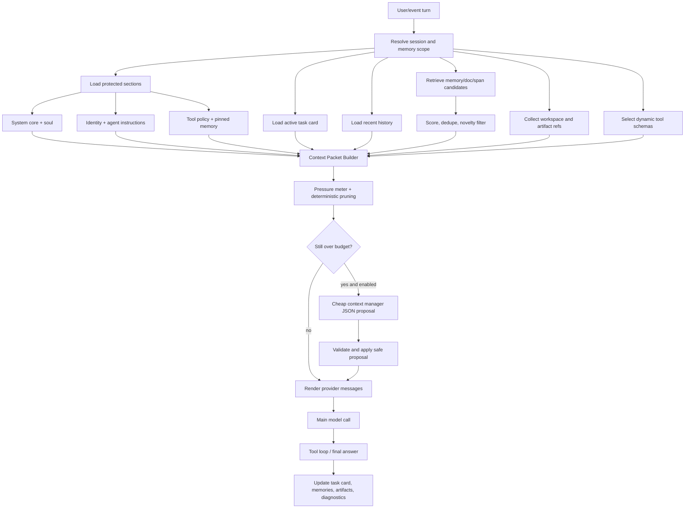

# Design: Token-Efficient Context Packets

## Overview

or3-intern already has the right primitives for a memory hierarchy: SQLite-backed messages, pinned memory, typed consolidation notes, FTS, sqlite-vec vector search, workspace context, skills, tool guards, and artifact storage. The proposed design keeps those systems and routes every model call through a budgeted Context Packet Builder that decides what to include, summarize, reference, or prune for the next correct move.

The design fits the current architecture because it is a small Go package layered between existing prompt construction and provider calls. It does not add a service, frontend, queue, or external database. It converts the current char-capped system prompt assembly in `internal/agent/prompt.go` into a sectioned packet model with explicit budgets, pressure diagnostics, dynamic retrieval packing, task state, and optional cheap-model maintenance.

Core idea:

> Preserve rich agent identity and capability, but make every optional context source earn its place in the packet.

## Affected areas

- `internal/contextpack/` (new package)
  - Owns `ContextPacket`, section budgets, pressure calculation, snippet packing, references, token estimation, and deterministic pruning.
  - Keeps most new logic outside `internal/agent` so prompt building remains readable.

- `internal/agent/prompt.go`
  - Evolves `Builder.BuildWithOptions` to request a packet from `internal/contextpack` and render it into provider messages.
  - Preserves existing tool-call history reconstruction and vision attachment behavior.

- `internal/agent/runtime.go` and `internal/agent/structured_autonomy.go`
  - Update task state after turns and significant tool results.
  - Record artifact summaries and context-pressure diagnostics where useful.

- `internal/config/config.go`
  - Adds `Context` and optional `ContextManager` config sections.
  - Keeps existing `HistoryMax`, `MemoryRetrieve`, `VectorK`, `FTSK`, `BootstrapMaxChars`, and `BootstrapTotalMaxChars` as compatibility inputs or deprecated aliases until the new settings are fully adopted.

- `internal/db/db.go` and `internal/db/store.go`
  - Adds migrations and store methods for task state, message chunks/spans, artifact summaries, and richer memory metadata.
  - Keeps current `messages`, `memory_pinned`, `memory_notes`, `memory_fts`, `memory_docs`, and `artifacts` tables intact.

- `internal/memory/retrieve.go`
  - Extends retrieval from final top-K injection to candidate retrieval plus score details.
  - Adds task-overlap, novelty, status, expiration, confidence, and source-quality signals.

- `internal/memory/consolidate.go`
  - Reuses the existing structured consolidation approach for memory extraction, and later shares JSON validation helpers with cheap context manager output.
  - Adds new kinds gradually: decision, warning, artifact_summary, file_summary where they map to durable memory.

- `internal/artifacts/store.go`
  - Adds summary/preview metadata methods or companion DB store functions for large tool output artifacts.
  - Existing binary storage stays unchanged.

- `internal/tools/registry.go` and tool registration call sites
  - Adds metadata for tool groups/capabilities and dynamic exposure selection.
  - Keeps `ToolGuardFromContext` as enforcement even when a tool is exposed.

- Tests under `internal/contextpack`, `internal/agent`, `internal/memory`, `internal/db`, `internal/artifacts`, and `internal/tools`.

## Control flow / architecture

### Per-turn context assembly



### Context packet sections

`ContextPacket` should explicitly separate protected, always-present sections from optional or prunable sections.

```go
type ContextPacket struct {
    SystemCore      ContextSection
    SoulIdentity    ContextSection
    ToolPolicy      ContextSection
    ActiveTaskCard  ContextSection
    PinnedMemory    ContextSection
    MemoryDigest    ContextSection
    RecentHistory   []providers.ChatMessage
    Retrieved       []ContextSnippet
    Workspace       []ContextSnippet
    ToolSchemas     []providers.ToolDef
    ArtifactRefs    []ContextRef
    OutputReserve   int
    BudgetReport    BudgetReport
}

type ContextSection struct {
    Name      string
    Text      string
    Protected bool
    Required  bool
    Budget    int
    Used      int
    MinBudget int
}

type ContextSnippet struct {
    ID          string
    Kind        string
    Text        string
    Summary     string
    Score       float64
    SourceRef   ContextRef
    TokenEstimate int
    Reason      string
}

type ContextRef struct {
    Type string // message|memory|artifact|file|doc|tool
    ID   string
    Path string
    Why  string
}
```

Protected sections:

- System core
- Soul / identity / behavior
- Tool policy and safety rules
- Pinned memory
- Active task card minimum viable state

Prunable sections, in this order:

1. Low-score retrieved snippets
2. Redundant retrieved snippets
3. Workspace excerpts not tied to current files
4. Artifact previews beyond summaries
5. Older recent history except unresolved tool-call/result pairs
6. Memory digest lines below importance threshold
7. Tool schemas for unlikely optional tools
8. Task card detail beyond required fields, never the whole card

### How sections fit together

The prompt renderer should keep a clear hierarchy:

1. `System Core`
   - Small immutable identity of the runtime, response style, memory policy, and tool-use policy.
   - Target: 300-800 tokens.

2. `Soul / Identity / Behavior`
   - `SOUL.md`, `IDENTITY.md`, and `AGENTS.md` content, compressed only semantically and with minimum budgets.
   - Must not be deleted for token savings.

3. `Tool Policy`
   - Safety notes, tool constraints, output artifacting rules, channel/autonomy constraints, and current exposed tool group notes.

4. `Active Task Card`
   - Small working state for the current session.
   - Replaces dependence on long raw rolling history for task continuity.

5. `Pinned Memories`
   - Ultra-stable facts/preferences/project rules from `memory_pinned`.
   - Always included, capped and summarized only when above budget.

6. `Memory Digest`
   - Short stable project/session summary derived from pinned memory, high-confidence durable notes, and current scope.

7. `Recent Rolling Chat`
   - Short window of raw messages plus unresolved tool-call/result pairs.
   - User’s latest request is always retained.

8. `Retrieved RAG Snippets`
   - Top relevant snippets after score, dedupe, novelty, lifecycle, and budget packing.
   - Includes IDs and reasons instead of full old messages.

9. `Workspace Context`
   - Existing `memory.BuildWorkspaceContext` and `memory.DocRetriever` outputs, repacked as snippets with budgets.

10. `Tool Schemas`
    - Only schemas for exposed tools for this turn.
    - The registry still enforces permissions at execution time.

11. `Artifact References`
    - Summaries and IDs for large tool outputs or attachments.
    - Full content fetched only on demand.

12. `Output Reserve`
    - Not prompt text; it reserves generation budget and influences input cap.

## Data and persistence

### Config changes

Add a config section while preserving old fields:

```go
type ContextConfig struct {
    Mode string `json:"mode"` // poor|balanced|quality|custom
    TokenEstimator string `json:"tokenEstimator"` // approx|provider
    MaxInputTokens int `json:"maxInputTokens"`
    OutputReserveTokens int `json:"outputReserveTokens"`
    SafetyMarginTokens int `json:"safetyMarginTokens"`
    Sections ContextSectionBudgets `json:"sections"`
    Retrieval ContextRetrievalConfig `json:"retrieval"`
    Pressure ContextPressureConfig `json:"pressure"`
    Tools ContextToolConfig `json:"tools"`
    Artifacts ContextArtifactConfig `json:"artifacts"`
    TaskCard ContextTaskCardConfig `json:"taskCard"`
}

type ContextSectionBudgets struct {
    SystemCore int `json:"systemCore"`
    SoulIdentity int `json:"soulIdentity"`
    ToolPolicy int `json:"toolPolicy"`
    ActiveTaskCard int `json:"activeTaskCard"`
    PinnedMemory int `json:"pinnedMemory"`
    MemoryDigest int `json:"memoryDigest"`
    RecentHistory int `json:"recentHistory"`
    RetrievedMemory int `json:"retrievedMemory"`
    WorkspaceContext int `json:"workspaceContext"`
    ToolSchemas int `json:"toolSchemas"`
    ArtifactRefs int `json:"artifactRefs"`
}
```

Recommended default budgets, all user-adjustable:

| Section | Poor | Balanced | Quality |
|---|---:|---:|---:|
| System core | 500 | 650 | 800 |
| Soul / identity / behavior | 600 | 900 | 1400 |
| Tool policy | 400 | 600 | 900 |
| Active task card | 300 | 450 | 700 |
| Pinned memories | 500 | 800 | 1200 |
| Memory digest | 350 | 600 | 900 |
| Recent rolling chat | 900 | 1800 | 3500 |
| Retrieved RAG snippets | 700 | 1400 | 2800 |
| Workspace context | 500 | 1000 | 2500 |
| Tool schemas | 700 | 1200 | 2500 |
| Artifact references | 200 | 350 | 700 |
| Safety margin | 300 | 500 | 800 |
| Output reserve | 1200 | 2000 | 4000 |
| Approx input target | 5k | 9k | 18k |

Mode behavior:

- Poor mode:
  - Recent history: around 6 messages plus unresolved tool pairs.
  - Retrieved memory: top 3 packed snippets.
  - Tool schemas: read/search/list defaults; write/exec/web only on intent.
  - Cheap context manager: only above 70% pressure or large tool output.

- Balanced mode:
  - Recent history: around 10 messages plus unresolved tool pairs.
  - Retrieved memory: top 5 packed snippets.
  - Tool schemas: task-relevant groups.
  - Recommended default for cost-sensitive users.
  - Cheap context manager: above 80% pressure, task shift, low-confidence retrieval, or 8+ turns.

- Quality mode:
  - Recent history: around 16 messages plus unresolved tool pairs.
  - Retrieved memory: top 8 packed snippets.
  - Workspace and tool budgets are larger, but still reference-first.
  - Cheap context manager: above 85% pressure or maintenance events.

Existing fields:

- `HistoryMax` remains as a compatibility fallback for recent-history message count.
- `MemoryRetrieve`, `VectorK`, and `FTSK` remain retrieval candidate knobs and can seed new defaults.
- `BootstrapMaxChars` and `BootstrapTotalMaxChars` remain as legacy safety caps until prompt rendering fully moves to token budgets.

### SQLite schema changes

Additive migration for task state:

```sql
CREATE TABLE IF NOT EXISTS task_state (
    id INTEGER PRIMARY KEY AUTOINCREMENT,
    session_key TEXT NOT NULL,
    task_key TEXT NOT NULL,
    state_json TEXT NOT NULL,
    source_message_ids TEXT NOT NULL DEFAULT '[]',
    source_memory_ids TEXT NOT NULL DEFAULT '[]',
    source_artifact_ids TEXT NOT NULL DEFAULT '[]',
    status TEXT NOT NULL DEFAULT 'active',
    created_at INTEGER NOT NULL,
    updated_at INTEGER NOT NULL,
    completed_at INTEGER NOT NULL DEFAULT 0,
    UNIQUE(session_key, task_key)
);
CREATE INDEX IF NOT EXISTS task_state_session_status ON task_state(session_key, status, updated_at);
```

Task card JSON shape:

```json
{
  "current_user_goal": "make or3-intern token efficient without quality loss",
  "current_plan": ["add context packet builder", "add task card", "budget RAG snippets"],
  "hard_constraints": ["preserve soul and safety", "SQLite-first", "bounded RAM"],
  "decisions_made": ["use deterministic pruning before cheap model"],
  "open_questions": [],
  "relevant_message_ids": [1842],
  "relevant_memory_ids": [91],
  "relevant_artifact_ids": [],
  "active_files": ["internal/agent/prompt.go", "internal/memory/retrieve.go"],
  "last_known_status": "planning context packet design"
}
```

Additive migration for message spans:

```sql
CREATE TABLE IF NOT EXISTS message_spans (
    id INTEGER PRIMARY KEY AUTOINCREMENT,
    session_key TEXT NOT NULL,
    message_id INTEGER NOT NULL,
    chunk_index INTEGER NOT NULL,
    role TEXT NOT NULL,
    text TEXT NOT NULL,
    summary TEXT NOT NULL DEFAULT '',
    entities_json TEXT NOT NULL DEFAULT '[]',
    tags TEXT NOT NULL DEFAULT '',
    token_estimate INTEGER NOT NULL DEFAULT 0,
    embedding BLOB,
    embed_fingerprint TEXT NOT NULL DEFAULT '',
    created_at INTEGER NOT NULL,
    updated_at INTEGER NOT NULL,
    FOREIGN KEY(message_id) REFERENCES messages(id) ON DELETE CASCADE,
    UNIQUE(message_id, chunk_index)
);
CREATE INDEX IF NOT EXISTS message_spans_session_message ON message_spans(session_key, message_id, chunk_index);
CREATE VIRTUAL TABLE IF NOT EXISTS message_spans_fts USING fts5(text, summary, content='message_spans', content_rowid='id');
```

If sqlite-vec indexing is used for spans, mirror the existing `memory_vec` pattern with `message_span_vec` or a generalized vector table. Keep this optional until the base FTS/span table is stable.

Additive memory metadata migration:

```sql
ALTER TABLE memory_notes ADD COLUMN summary TEXT NOT NULL DEFAULT '';
ALTER TABLE memory_notes ADD COLUMN source_artifact_id TEXT NOT NULL DEFAULT '';
ALTER TABLE memory_notes ADD COLUMN confidence REAL NOT NULL DEFAULT 0;
ALTER TABLE memory_notes ADD COLUMN updated_at INTEGER NOT NULL DEFAULT 0;
ALTER TABLE memory_notes ADD COLUMN expires_at INTEGER NOT NULL DEFAULT 0;
ALTER TABLE memory_notes ADD COLUMN supersedes_id INTEGER;
```

Existing columns already include `kind`, `status`, `importance`, `use_count`, and `last_used_at` in current migrations/store logic. If any user database predates those columns, migrations must continue to add them idempotently as today.

Memory kinds:

- `pinned`: remains in `memory_pinned`; render as part of protected pinned section.
- `fact`, `preference`, `goal`, `procedure`, `episode`: extend current constants.
- `decision`, `warning`, `artifact_summary`, `file_summary`: add to `db` constants for durable notes.
- `task_state`: should primarily live in `task_state`, not `memory_notes`; only durable task lessons should become memory.

Add artifact summaries:

```sql
CREATE TABLE IF NOT EXISTS artifact_summaries (
    artifact_id TEXT PRIMARY KEY,
    session_key TEXT NOT NULL,
    summary TEXT NOT NULL,
    preview TEXT NOT NULL DEFAULT '',
    key_lines TEXT NOT NULL DEFAULT '',
    kind TEXT NOT NULL DEFAULT '',
    source_tool TEXT NOT NULL DEFAULT '',
    token_estimate INTEGER NOT NULL DEFAULT 0,
    created_at INTEGER NOT NULL,
    updated_at INTEGER NOT NULL,
    FOREIGN KEY(artifact_id) REFERENCES artifacts(id) ON DELETE CASCADE
);
CREATE INDEX IF NOT EXISTS artifact_summaries_session_updated ON artifact_summaries(session_key, updated_at);
```

### Session and memory-scope implications

- The packet builder resolves scope with existing `DB.ResolveScopeKey` before loading memory, pinned items, task state, spans, and docs.
- Session-specific task state stays keyed by the channel/session key; durable memory retrieval uses resolved scope rules.
- Channel isolation must honor `Hardening.IsolateChannelPeers` and existing session-link behavior.
- Global memory is merged only through existing `GetPinned`/retriever scope behavior.

## Interfaces and types

### Context package API

```go
package contextpack

type Builder struct {
    DB *db.DB
    Artifacts *artifacts.Store
    Mem *memory.Retriever
    Docs *memory.DocRetriever
    Provider *providers.Client
    Tools *tools.Registry
    Skills skills.Inventory
    Config config.ContextConfig
    WorkspaceDir string
}

type BuildRequest struct {
    SessionKey string
    UserMessage string
    LatestMessageID int64
    Autonomous bool
    EventMeta map[string]any
    AvailableTools []string
    ActiveFiles []string
}

func (b *Builder) Build(ctx context.Context, req BuildRequest) (ContextPacket, error)
func RenderMessages(packet ContextPacket) []providers.ChatMessage
func SelectTools(packet ContextPacket, reg *tools.Registry) []providers.ToolDef
```

### Budget and pressure types

```go
type BudgetReport struct {
    Mode string
    EstimatedInputTokens int
    OutputReserveTokens int
    MaxInputTokens int
    BudgetUsedPercent float64
    Pressure string // normal|warning|high|emergency
    Sections []SectionUsage
    LargestSections []string
    Pruned []PruneEvent
    RetrievalRejected []RetrievalReject
}

type SectionUsage struct {
    Name string
    Budget int
    Used int
    Protected bool
    Truncated bool
}

type PruneEvent struct {
    Section string
    Ref ContextRef
    TokensSaved int
    Reason string
}
```

Pressure states:

- Normal: 0-60% of input budget.
  - Include normal balanced packet.
  - Keep configured history and snippet count.

- Warning: 60-80%.
  - Reduce low-score retrieved snippets.
  - Prefer summaries over raw spans.
  - Drop optional workspace/doc snippets not tied to active files.

- High pressure: 80-95%.
  - Summarize old history/tool outputs.
  - Shrink recent history to unresolved tool pairs plus latest messages.
  - Expose only the most likely tool groups.
  - Consider cheap context manager if enabled and trigger conditions match.

- Emergency compaction: 95%+ or over hard budget.
  - Keep protected sections with minimum budgets.
  - Keep task card minimum, latest user request, unresolved tool pair, top 1-3 snippets, and fetchable refs.
  - Do not remove soul, identity, pinned memory, tool policy, or safety rules.
  - If still over budget, fail closed with a clear internal error rather than silently weakening safety.

### RAG strategy

What to store:

- Durable memory notes: typed facts, preferences, goals, procedures, decisions, warnings, episodes, summaries, artifact summaries, and file summaries.
- Pinned memory: ultra-stable items in `memory_pinned`, protected and separately capped.
- Message spans: bounded chunks of chat/tool messages, with summaries and embeddings where available.
- Artifact summaries: short records for large outputs and attachments.
- File summaries: from doc index or workspace inspections when high-confidence and useful.

Chunking messages:

- Split long messages into spans by paragraphs or line groups with a target of roughly 150-350 tokens per span.
- Preserve `message_id`, `chunk_index`, role, session key, token estimate, source artifact IDs if present, and tool call IDs from payload JSON.
- Summarize tool outputs immediately when above preview threshold.
- Do not embed secrets; skip or redact spans that match secret-like patterns or come from secret-bearing tool/config sources.

Candidate retrieval:

1. Build query from latest user request plus active task card goal/constraints/active files.
2. Retrieve candidates from:
   - `memory_notes` vector and FTS.
   - `message_spans` FTS and vector if indexed.
   - `memory_docs` doc retriever.
   - artifact summaries when artifact refs are relevant.
3. Retrieve more than final injection count, for example 30 candidates in balanced mode.
4. Merge by stable source ID.
5. Score and dedupe.
6. Pack snippets to budget.

Scoring formula:

```text
score =
  semantic_score       * 0.35
+ keyword_score        * 0.20
+ task_overlap_score   * 0.20
+ importance_score     * 0.10
+ recency_score        * 0.05
+ source_quality       * 0.05
+ novelty_score        * 0.05
- redundancy_penalty
- stale_penalty
- expired_penalty
- low_confidence_penalty
```

Novelty/dedupe:

- Reject a candidate if it is too similar to an already selected snippet, using embedding similarity when available and normalized text shingle/Jaccard fallback otherwise.
- Reject or demote snippets that merely repeat pinned memory or the task card.
- Prefer candidates that add a new fact, constraint, decision, procedure, warning, artifact, or source reference.
- Keep a `RetrievalRejected` record with reason: stale, superseded, expired, duplicate, repeats_pinned, low_score, over_budget, wrong_scope, or unsafe.

Avoid stuffing irrelevant RAG:

- Retrieval produces candidates; packing decides what enters the prompt.
- `RetrievedMemory` has a token budget and max snippet count.
- Include concise rendered snippets:

```text
[M91 goal score=.84 src=chat:1842]
Goal: Make or3-intern token-efficient without quality loss. Ref: m1842.
```

- Prefer references when useful context is large:

```text
Refs:
- message:1842 original token-efficiency brainstorm
- artifact:test-output-2026-04-25 failing memory retriever tests
- file:internal/memory/retrieve.go hybrid retriever implementation
```

When to fetch full source messages:

- The main model asks via a safe read/fetch tool.
- A snippet is important but ambiguous.
- The user explicitly asks about prior conversation details.
- A tool result summary indicates details are necessary for debugging.
- Never fetch solely because a message is semantically similar; the packet should start with snippets and refs.

### Cheap context-manager model

Add optional config:

```go
type ContextManagerConfig struct {
    Enabled bool `json:"enabled"`
    APIBase string `json:"apiBase"`
    APIKey string `json:"apiKey"`
    Model string `json:"model"`
    TimeoutSeconds int `json:"timeoutSeconds"`
    MaxInputTokens int `json:"maxInputTokens"`
    MaxOutputTokens int `json:"maxOutputTokens"`
    TriggerPressurePercent int `json:"triggerPressurePercent"`
    TriggerTurnInterval int `json:"triggerTurnInterval"`
    AllowRAGFiltering bool `json:"allowRagFiltering"`
    AllowStaleProposals bool `json:"allowStaleProposals"`
}
```

Use the cheap context manager for:

- Task card updates.
- Memory extraction proposals.
- Stale/superseded memory proposals.
- RAG relevance filtering for borderline candidates.
- Summarizing old history.
- Summarizing tool outputs.
- Producing compaction proposals when deterministic pruning cannot fit budget.

Do not use it for:

- Final high-stakes answers.
- Security-sensitive approvals.
- Permanent deletion of memories.
- Removing identity, soul, pinned memory, tool policy, or safety rules.
- Silent weakening of safety or tool restrictions.

Structured JSON output:

```json
{
  "task_card_update": {
    "current_user_goal": "...",
    "current_plan": ["..."],
    "hard_constraints": ["..."],
    "decisions_made": ["..."],
    "open_questions": [],
    "relevant_message_ids": [1842],
    "relevant_memory_ids": [91],
    "relevant_artifact_ids": [],
    "active_files": ["internal/agent/prompt.go"],
    "last_known_status": "..."
  },
  "keep_message_ids": [1821, 1823],
  "drop_message_ids": [1811],
  "retrieval_ids_to_keep": [44, 71, 82],
  "memory_proposals": [
    {"memory_id": 91, "action": "mark_stale", "reason": "superseded by m104"}
  ],
  "artifact_summaries": [
    {"artifact_id": "abc", "summary": "3 failing memory retrieval tests", "key_lines": ["..."]}
  ],
  "reason": "Kept only items required for current architecture decision."
}
```

Validation:

- Decode with `json.Decoder.DisallowUnknownFields` for stable schema versions.
- Enforce max list lengths and max string lengths.
- Verify referenced message/memory/artifact IDs belong to the session/scope or are allowed global refs.
- Reject protected-section removals and safety-policy changes.
- Treat stale/delete proposals as proposals; apply deterministic thresholds or require user approval for destructive actions.
- On invalid output, ignore the proposal and fall back to deterministic pruning.

### Active task card updates

Update after each assistant turn:

1. Collect latest user message, assistant response summary, tool calls/results, artifact IDs, active files, and key memory refs used.
2. Apply deterministic extraction first:
   - user goal from latest request when clear;
   - constraints from explicit user/system instructions;
   - decisions from final answer or accepted plan;
   - active files from tools/prompt builder;
   - artifact refs from tool output storage.
3. If enabled and useful, ask cheap context manager for a bounded JSON task-card update.
4. Merge update with existing task state:
   - preserve hard constraints unless contradicted by higher-priority instructions;
   - keep only bounded recent refs;
   - mark completed or stale subtasks;
   - update `last_known_status`.
5. Persist to `task_state` with `updated_at`.
6. Optionally write durable memory only for stable facts/preferences/goals/procedures/decisions, not temporary task noise.

### Compression strategy

Use semantic compression, not tokenizer tricks.

Preferred methods:

- Stable labels: `Goal`, `Constraint`, `Decision`, `Open question`, `Ref`, `Warning`, `Procedure`.
- Short structured bullets with source refs.
- Compact JSON for SQLite storage where structure matters.
- Readable natural text for prompts.
- Summaries that preserve constraints, decisions, unresolved questions, source IDs, and status.
- Deduplicated snippets with references instead of repeated raw history.

Avoid by default:

- `CamelCaseWithoutSpaces` prompt text.
- Minified prose.
- Dropping punctuation that improves comprehension.
- Compressing safety policy so far that semantics become ambiguous.

Reasoning:

CamelCase/no-space compression may not save many tokens with modern tokenizers, often hurts readability, impairs debugging, and may degrade retrieval and summarization quality. Use concise structured text instead.

### Tool schema efficiency

Dynamic tool exposure should happen before provider request assembly.

Tool groups:

- `core_read`: read/search/list/status/context refs.
- `memory`: memory_recent, memory_get_pinned, memory lookup/fetch refs.
- `write`: file edit/create operations.
- `exec`: exec/spawn/shell-like tools.
- `web`: web fetch/search/browser/network tools.
- `cron`: scheduling and triggers.
- `skills`: skill execution and skill management.
- `channels`: Telegram/Slack/Discord/WhatsApp delivery/admin.
- `mcp`: external MCP tools.
- `service`: control plane/service operations.

Selection policy:

- Always expose a minimal safe read/ref set where applicable.
- Expose write tools only when the user asks to modify files or implementation is clearly required.
- Expose exec only when running/building/testing is needed and allowed by hardening.
- Expose web only when current information, external docs, or explicit browsing is needed and network policy allows it.
- Expose cron only for scheduling intent.
- Expose channel tools only for channel delivery/admin tasks.
- Expose MCP tools only when selected by user/config or relevant by intent.

Safety:

- Dynamic exposure is a token optimization, not an authorization mechanism.
- `ToolGuardFromContext`, approval broker, sandbox, network policy, path restrictions, quotas, and runtime profile checks remain authoritative.
- If a provider requires full schemas for callable tools, register fewer tools per turn.
- If a hidden tool is requested by model text, it is ignored unless exposed and authorized in a subsequent turn.

### Artifact strategy

Large tool outputs and attachments should be handled as artifact-backed context refs.

Flow:

1. Tool result arrives.
2. If result is under preview threshold, keep full bounded result in history.
3. If result exceeds threshold:
   - Save full output through `artifacts.Store`.
   - Append a tool message with a short preview, artifact ID, summary placeholder or generated summary, MIME/type, size, and key lines.
   - Write or update `artifact_summaries`.
   - Add artifact ref to task card when relevant.
4. Context packets include artifact summaries/refs, not full output.
5. The agent can fetch full artifact content on demand through a safe tool, subject to session/scope and file-size caps.

Tool result prompt shape:

```text
Tool result summary:
- artifact: a1b2c3
- tool: go test ./internal/memory
- size: 421 KB
- summary: 3 failures in retrieval dedupe tests
- key lines: TestRetrieveNoveltyRejectsDuplicate failed; expected 1 snippet got 2
```

Never keep huge logs in rolling history. History should contain previews and refs only.

## Failure modes and safeguards

- Invalid config:
  - Clamp negative budgets to defaults.
  - Reject unknown mode names except `custom` with explicit budgets.
  - Warn if protected-section budgets are below minimums.

- Migration failures:
  - Keep migrations additive and idempotent.
  - Do not block existing prompt assembly unless a required table is partially migrated; fail with actionable error.

- Context over budget:
  - Apply deterministic pruning first.
  - Run cheap context manager only if enabled.
  - If still too large, fail closed instead of dropping protected sections.

- Cheap manager invalid JSON:
  - Ignore proposal, record diagnostic, use deterministic packet.

- Cheap manager unsafe proposal:
  - Reject changes to soul, identity, pinned memory, tool policy, safety rules, or destructive memory actions.

- Retrieval scope mistakes:
  - Verify all refs belong to resolved session/scope or allowed global memory before rendering.

- Stale memory injection:
  - Exclude stale/superseded/expired memories unless explicitly requested or they are needed to explain history.

- Tool misuse:
  - Dynamic exposure reduces schemas but does not replace existing guard checks.
  - Approval and sandbox remain mandatory for privileged execution.

- Oversized outputs:
  - Artifact full content, preview bounded content, summarize key lines, and keep refs.

- Secret leakage:
  - Redact known secret patterns before summarization, task card storage, artifact preview, and diagnostics.
  - Do not include provider API keys or env values in context reports.

- Channel delivery failures:
  - Keep channel-specific session state and artifact refs; do not merge isolated peer context when hardening forbids it.

- Provider/API failures:
  - If embedding fails, use FTS/lexical fallback.
  - If context manager fails, continue deterministic path.
  - If main provider rejects oversized request, re-run emergency compaction once, then report failure.

## Testing strategy

Use Go’s `testing` package, temporary SQLite databases, and fake providers/tools where possible.

Unit tests:

- `internal/contextpack/budget_test.go`
  - `TestBudgetEnforcesSectionCaps`
  - `TestProtectedSectionsRetainedUnderEmergencyPressure`
  - `TestOutputReserveReducesInputBudget`
  - `TestPressureStatesNormalWarningHighEmergency`
  - `TestPruneEventsIncludeReasons`

- `internal/contextpack/pack_test.go`
  - `TestPacketIncludesAllRequiredSections`
  - `TestPinnedMemoryAlwaysRetained`
  - `TestSoulIdentityAndToolPolicyAlwaysRetained`
  - `TestRecentHistoryKeepsLatestUserRequest`
  - `TestUnresolvedToolPairSurvivesHistoryPruning`
  - `TestArtifactRefsRenderedWithoutFullOutput`

- `internal/contextpack/task_state_test.go`
  - `TestTaskCardSurvivesHistoryPruning`
  - `TestTaskCardUpdateMergesConstraintsAndRefs`
  - `TestTaskCardCapsRefsAndPlanItems`
  - `TestTaskCardDoesNotWriteTemporaryNoiseToMemory`

- `internal/contextpack/compress_test.go`
  - `TestSemanticCompressionKeepsSourceRefs`
  - `TestCamelCaseCompressionNotUsedByDefault`

DB/integration tests:

- `internal/db/context_schema_test.go`
  - `TestMigrationsAddTaskStateMessageSpansArtifactSummaries`
  - `TestExistingMemoryRowsRemainReadableAfterMigration`
  - `TestTaskStateScopedBySession`
  - `TestArtifactSummaryCascadeOrLookupBehavior`

- `internal/memory/retrieve_test.go`
  - `TestRelevantMemoryRetrievedWithTaskOverlap`
  - `TestIrrelevantRAGPruned`
  - `TestStaleMemoryNotInjected`
  - `TestSupersededMemoryDemoted`
  - `TestNoveltyRejectsDuplicateMemory`
  - `TestMessageSpanRetrievalReturnsRefsNotFullHistory`
  - `TestFTSFallbackWhenVectorUnavailable`

Agent/runtime tests:

- `internal/agent/prompt_test.go`
  - `TestBuilderUsesContextPacketRenderer`
  - `TestSafetyRulesNotRemovedUnderPressure`
  - `TestConfigModesAffectHistoryAndRetrievalBudgets`
  - `TestLegacyHistoryMaxStillWorksWithoutContextConfig`
  - `TestArtifactedToolOutputNotRehydratedIntoHistory`

- `internal/agent/runtime_test.go`
  - `TestLargeToolOutputSavedAsArtifactSummary`
  - `TestTaskCardUpdatedAfterToolRun`
  - `TestContextPressureDiagnosticRecorded`

Tool tests:

- `internal/tools/registry_test.go`
  - `TestDynamicToolExposureSelectsReadToolsByDefault`
  - `TestWriteToolsExposedOnlyForWriteIntent`
  - `TestExecToolStillRequiresGuardWhenExposed`
  - `TestHiddenToolSchemaNotSent`

Cheap manager tests:

- `internal/contextpack/manager_test.go`
  - `TestCheapManagerJSONValidation`
  - `TestCheapManagerRejectsUnknownFields`
  - `TestCheapManagerCannotRemoveProtectedSections`
  - `TestCheapManagerCannotDeleteMemoryPermanently`
  - `TestCheapManagerFallbackOnInvalidJSON`
  - `TestCheapManagerAppliesSafeTaskCardUpdate`

Configuration tests:

- `internal/config/config_test.go`
  - `TestDefaultContextModeBalanced`
  - `TestPoorBalancedQualityBudgetsLoad`
  - `TestCustomBudgetsOverrideDefaults`
  - `TestLegacyConfigGetsContextDefaults`
  - `TestInvalidContextBudgetsAreClampedOrRejected`

Regression/evaluation tests:

- Build fixtures that simulate coding, planning, long-running tasks, large logs, repeated memories, stale memory, and channel sessions.
- Compare packet sizes and required-section presence across modes.
- Confirm balanced mode preserves expected useful context while reducing default raw history from current `HistoryMax` behavior.
- Add a small benchmark for packet construction with thousands of memory notes and message spans to enforce bounded query/packing behavior.
