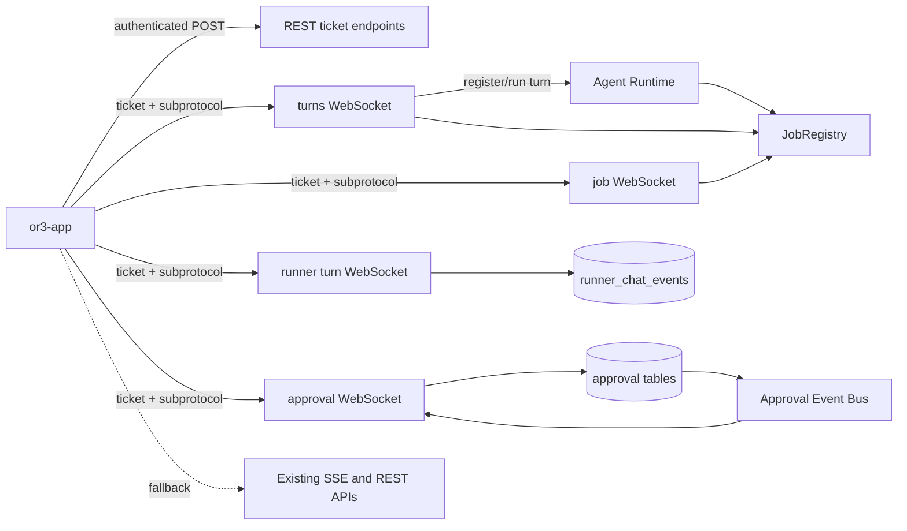

# Design

## Overview

The cleanest implementation is to add a small WebSocket transport layer beside the current REST and SSE API, not to replace the API wholesale and not to introduce a large generic realtime multiplexer. OR3 already has a good WebSocket precedent in the terminal implementation: authenticated ticket issuance over REST, a route-specific WebSocket subprotocol, origin validation, JSON frames, write deadlines, read limits, and ping control frames.

This plan extends that pattern to four realtime surfaces:

- direct OR3 chat turns: start and stream a turn over WebSocket
- job following: reconnect to any service job and replay missed events
- runner chat turns: lower-latency alternative to the polling SSE stream
- approvals: push pending approval snapshots and state changes instead of polling

The current REST and SSE routes stay intact. WebSocket becomes the preferred app transport when supported; SSE and snapshot recovery remain the compatibility and rescue path.

## Architecture



## Route Strategy

### New Ticket Route

Use one generic, route-scoped ticket endpoint instead of duplicating terminal ticket logic for every new route.

| Route                     | Method | Purpose                                                                      |
| ------------------------- | ------ | ---------------------------------------------------------------------------- |
| `/internal/v1/ws-tickets` | `POST` | Issue a one-time short-lived WebSocket ticket for a specific realtime route. |

Request:

```json
{
    "route": "/internal/v1/turns/ws",
    "scope": {
        "session_key": "or3-app:host:session_abc",
        "job_id": "svc-123",
        "runner_session_id": "rchat-1",
        "runner_turn_id": "turn-1"
    }
}
```

Response:

```json
{
    "ticket": "random-opaque-ticket",
    "expires_at": "2026-05-27T06:30:00Z",
    "protocols": ["or3.turn.v1", "or3.ticket.random-opaque-ticket"]
}
```

The ticket store should be route scoped and one-time use. It can initially be in memory, matching terminal tickets. The existing terminal ticket implementation can either remain separate for compatibility or later move to the shared ticket store.

### New WebSocket Routes

| Route                                                          | Subprotocol          | Purpose                                       | Existing fallback                    |
| -------------------------------------------------------------- | -------------------- | --------------------------------------------- | ------------------------------------ |
| `GET /internal/v1/turns/ws`                                    | `or3.turn.v1`        | Start and stream a direct OR3 turn.           | `POST /internal/v1/turns` with SSE.  |
| `GET /internal/v1/jobs/{id}/ws`                                | `or3.job.v1`         | Follow/reconnect to a job.                    | `GET /internal/v1/jobs/{id}/stream`. |
| `GET /internal/v1/runner-chat/sessions/{id}/turns/{turnId}/ws` | `or3.runner-turn.v1` | Follow runner turn events.                    | Existing runner turn SSE stream.     |
| `GET /internal/v1/approvals/ws`                                | `or3.approvals.v1`   | Receive approval snapshots and state changes. | Approval REST polling.               |

Keep route-specific handlers. Share only the mechanical helpers: ticket validation, upgrader construction, ping loop, safe JSON writes, close helpers, and bounded client message decoding.

## WebSocket Frame Contracts

### Shared Server Frame

```ts
export interface Or3WebSocketFrame<T = unknown> {
    type: string;
    sequence?: number;
    job_id?: string;
    trace_id?: string;
    request_id?: number | string;
    approval_id?: number | string;
    payload?: T;
    error?: {
        code?: string;
        message: string;
        retryable?: boolean;
    };
}
```

For job-like streams, `payload` should usually be the existing `JobEvent.Data` map plus `type` and `sequence`, matching `serviceStreamEventPayload`.

### Direct Turn Client Frames

```ts
export type TurnClientFrame =
    | { type: 'turn.start'; request_id: string; payload: TurnRequestPayload }
    | { type: 'turn.follow'; job_id: string; after_sequence?: number }
    | { type: 'turn.abort'; job_id: string; reason?: string }
    | { type: 'client.ping'; sent_at: number };
```

The first shipped version can require one `turn.start` per connection. Supporting `turn.follow` on the same route is useful but can also be delegated to `/internal/v1/jobs/{id}/ws`.

### Direct Turn Server Frames

```ts
export type TurnServerFrame =
    | { type: 'turn.accepted'; job_id: string; trace_id?: string }
    | { type: 'job.event'; job_id: string; sequence: number; payload: JobEvent }
    | {
          type: 'turn.done';
          job_id: string;
          status: string;
          final_text?: string;
          error?: WebSocketError;
      }
    | { type: 'server.pong'; sent_at?: number };
```

The frontend should adapt `job.event` payloads into the existing `createAssistantEventApplier` path. That keeps the UI behavior identical across SSE and WebSocket.

### Approval Server Frames

```ts
export type ApprovalServerFrame =
    | {
          type: 'approval.snapshot';
          payload: { items: ApprovalRequest[]; pending_count: number };
      }
    | {
          type: 'approval.created';
          payload: { item: ApprovalRequest; pending_count: number };
      }
    | {
          type: 'approval.updated';
          payload: { item: ApprovalRequest; pending_count: number };
      }
    | {
          type: 'approval.removed';
          payload: {
              request_id: number;
              status: string;
              pending_count: number;
          };
      }
    | { type: 'approval.count'; payload: { pending_count: number } }
    | { type: 'allowlist.updated'; payload: { domain?: string } };
```

Approval actions should stay REST. WebSocket is a notification channel, not the authority for approve, deny, cancel, expire, or allowlist changes.

## Backend Components

### WebSocket Ticket Store

Create a shared ticket store near the service layer, likely in a new file such as `cmd/or3-intern/service_websocket.go`.

```go
type serviceWebSocketTicket struct {
    Route     string
    Scope     map[string]string
    Role      string
    ExpiresAt time.Time
}

type serviceWebSocketTicketStore struct {
    mu      sync.Mutex
    tickets map[string]serviceWebSocketTicket
}
```

Responsibilities:

- issue random one-time tickets
- store only ticket hashes
- enforce route and scope on consume
- clean expired tickets opportunistically
- support the existing `or3.ticket.<ticket>` subprotocol pattern

### WebSocket Helper

Add a helper that mirrors terminal behavior without coupling to terminal sessions.

```go
type serviceWebSocketOptions struct {
    Route       string
    Protocol    string
    Scope       map[string]string
    ReadLimit   int64
    AllowOrigin func(*http.Request) bool
}

func (s *serviceServer) upgradeServiceWebSocket(
    w http.ResponseWriter,
    r *http.Request,
    opts serviceWebSocketOptions,
) (*websocket.Conn, bool) {
    // validate subprotocol, consume ticket, check origin, upgrade
}
```

Keep terminal WebSocket code as-is initially. Once the new helper is stable, terminal can optionally adopt it.

### Chat Turn WebSocket Handler

Implement `handleTurnsWebSocket` beside `handleTurns`, reusing `runTurnJob` and `streamJob` logic rather than creating a new agent execution path.

Server flow:

1. Upgrade with `or3.turn.v1`.
2. Read a bounded `turn.start` frame.
3. Decode the same `serviceTurnRequest` used by REST.
4. Register and publish a job exactly as `handleTurns` does.
5. Start `runTurnJob` on a detached context.
6. Subscribe to the job registry.
7. Send `turn.accepted`, replay snapshot events, stream live job events, ping periodically, and close normally after terminal status.

Do not bind job cancellation to socket close. Only `turn.abort` or the existing abort endpoint should cancel work.

### Job WebSocket Handler

Implement `handleJobWebSocket` beside `streamJob`.

Server flow:

1. Upgrade with `or3.job.v1`.
2. Parse `after_sequence` from query or first client frame.
3. Fetch live snapshot through `s.app().SubscribeJob(jobID)`.
4. If live registry misses, use persisted service/subagent/agent CLI snapshot when available.
5. Replay events above `after_sequence`.
6. Stream live events until terminal status or disconnect.

This route becomes the common recovery path for direct turns and approval resume jobs.

### Runner Turn WebSocket Handler

Implement `handleRunnerChatTurnWebSocket` beside `handleRunnerChatTurnStream`.

Phase 1 can keep the same DB polling loop but write WebSocket frames instead of SSE. Phase 2 can remove polling by subscribing to `JobRegistry` or introducing a runner chat event bus.

This staged approach keeps correctness first and still improves client liveness and transport behavior.

### Approval Event Bus

Approvals need push notifications, and the current broker does not expose subscriptions. Add a small in-memory bus in `internal/approval` or the service layer.

```go
type Event struct {
    Type         string
    RequestID    int64
    Status       string
    PendingCount int64
    Item         *ApprovalRequestListItem
    Domain       string
    CreatedAtMS  int64
}

type EventBus struct {
    mu          sync.Mutex
    subscribers map[int]chan Event
}

func (b *EventBus) Subscribe(buffer int) (<-chan Event, func())
func (b *EventBus) Publish(event Event)
```

Publish after:

- `createApprovalRequest` creates or reuses a pending request
- approve, deny, cancel, expire, exchange state changes
- allowlist add/remove changes

Fanout must be non-blocking. On subscribe, `/internal/v1/approvals/ws` sends a fresh snapshot from the database, so the bus does not need durable history for v1.

## Frontend Components

### `useOr3Api` WebSocket Support

Add a small WebSocket helper rather than hiding domain protocol in `useOr3Api`.

```ts
export interface Or3WebSocketTicketResponse {
    ticket: string;
    expires_at?: string;
    protocols?: string[];
}

export async function openWebSocket(
    path: string,
    options: {
        ticketRoute?: string;
        protocol: string;
        scope?: Record<string, string>;
        signal?: AbortSignal;
    },
): Promise<WebSocket>;
```

Implementation should mirror `useTerminalSession.ts`:

1. request a ticket over authenticated REST
2. build `ws:` or `wss:` URL from `api.buildUrl`
3. pass `[protocol, 'or3.ticket.' + ticket]` as subprotocols
4. resolve on `open`, reject on pre-open error/close

### Chat Transport Adapter

Add a `streamDirectTurnWebSocket` implementation in `app/utils/assistant-stream/execution.ts` or a nearby module. Keep the return shape as `AssistantExecutionResult`.

Responsibilities:

- send `turn.start`
- set `activeJobId` from `turn.accepted`
- convert `job.event` frames to `JobEvent` and call `context.applyEvent`
- track last sequence for reconnect
- handle `turn.done`
- on unexpected close, attempt `/internal/v1/jobs/{id}/ws` reconnect before falling back to snapshot/SSE recovery

`useExecutionRouter` should prefer WebSocket for `or3-intern` direct turns when capability detection succeeds.

### Approval Realtime Adapter

Add `useApprovalRealtime` or fold into `useApprovals` carefully.

Responsibilities:

- open `/internal/v1/approvals/ws` after host auth is ready
- apply `approval.snapshot` to `approvals` and `pendingCount`
- apply created/updated/removed/count events incrementally
- fall back to existing 15 second polling if WebSocket fails or the route is unsupported
- refresh snapshot on visibility resume

### Capability and Fallback

Add a local feature flag or capability bit, for example:

```ts
const realtimePreferences = {
    directTurnWebSocket: true,
    approvalsWebSocket: true,
    runnerTurnWebSocket: true,
};
```

If a WebSocket route returns 404, 405, 400 subprotocol errors, or closes before opening, mark that route unsupported for the active host and use the existing path.

## Error Handling

### Backend

- Reject missing subprotocols with `400` before upgrade.
- Reject invalid or expired tickets with `401` or `403` before upgrade when possible.
- After upgrade, use WebSocket close codes:
    - `1000` normal terminal completion
    - `1008` policy violation for invalid ticket scope or unauthorized action
    - `1003` unsupported data for malformed frame shape
    - `1011` internal error for unexpected server failures
- Never log raw tickets, approval tokens, provider keys, or request bodies that may contain secrets.

### Frontend

- Distinguish pre-open failure from post-open interruption.
- For pre-open unsupported routes, silently fall back and remember route unsupported per host.
- For post-open interruption with a job ID, reconnect to `/internal/v1/jobs/{id}/ws` before showing failure.
- If reconnect fails, use existing `fetchAndApplyJobSnapshot` recovery.
- Preserve detailed runtime errors from WebSocket frames just like SSE runtime errors.

## Testing Strategy

### Backend Unit and Integration Tests

- Ticket issuance, scope enforcement, expiry, one-time consumption, and redaction.
- WebSocket origin rejection and accepted origin behavior.
- Direct turn WebSocket start with fake runtime/provider, including queued, started, text, tool, completion, approval required, and error events.
- Job WebSocket replay using `JobRegistry` snapshots and persisted service job snapshots.
- Runner turn WebSocket replay from `runner_chat_events` using `after_seq`.
- Approval WebSocket initial snapshot and push updates from create, approve, deny, cancel, expire, and allowlist changes.
- Slow subscriber does not block approval creation.

### Frontend Unit Tests

- Ticketed WebSocket URL and subprotocol construction.
- Direct turn WebSocket frame application through existing assistant event applier.
- Reconnect with last sequence dedupes text and tool events.
- Approval snapshot/update/count events mutate `useApprovals` state correctly.
- Route unsupported fallbacks preserve current SSE/polling behavior.

### End-to-End Checks

- Start a long direct OR3 turn and verify no `stream_idle_timeout` appears while the model/tool is quiet.
- Create an approval from a tool call and verify the app header count and approval panel update without polling.
- Approve a request and verify the approval resume job streams through WebSocket or reconnects through job WebSocket.
- Put the app in background, resume, and verify snapshots repair missed chat and approval state.

## Rollout Plan

1. Build shared WebSocket ticket/helper infrastructure and job follow WebSocket.
2. Add approval WebSocket and switch `useApprovals` to prefer it with polling fallback.
3. Add direct turn WebSocket and switch `useExecutionRouter` for `or3-intern` turns with SSE fallback.
4. Add runner turn WebSocket and switch external runner streams with SSE fallback.
5. Document all routes and remove no existing REST/SSE routes.

This order gives immediate reliability value with low risk: job follow and approvals are mostly transport wrappers, while direct turn WebSocket changes the send path and should come after the shared mechanics are proven.
